# 1.一个C程序的生命周期

程序的生命周期从一个源程序(源文件)开始，即程序员利用编辑器创建并保存的文本文件，如文件名为hello.c的c语言程序。源程序是有0和1组成的位序列，8个位被组织成一组，称为字节，每个字节表示程序中的某个文本字符。

系统中的所有信息都是由一串比特（bit：位）表示的，区分不同数据对象的**唯一方法**就是根据上下文。

```c
#include<stdio.h>
int main(){
    printf("Hello,Word!\n");
    return 0;
}
```


​	为了在系统上运行hello.c程序，每条c语句都必须被其他程序转化为一系列的低级机器语言指令（如汇编语言）。然后，这些指令按照可执行目标程序的格式打好包，以二进制磁盘文件的形式存放起来，其称为可执行目标程序。 

 从hello.c到hello.exe的翻译过程可分为四个阶段完成。执行这四个阶段的程序（预处理器、编译器、汇编器和链接器）一起构成了编译系统。

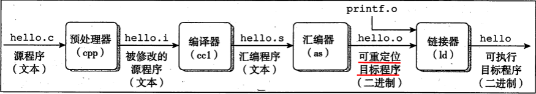 

```shell
gcc -o hello hello.c
```

​	在Unix操作系统中，使用GCC编译器驱动程序读取源程序文件hello.c，并把它翻译成一个可执行的目标文件：hello，这个编译过程可以分为四段，如上图所示，是使用的命令分别是:

```shell
gcc -E Hello.c -o hello.i
```

## 1.1预编译(Preprocessing)

​	对各种预处理指令（#include #define #ifdef 等#开始的代码行）进行处理，删除注释和多余的空白字符，生成一份新的代码,得到hello.i文件

```shell
gcc -S hello.i -o hello.s
```

## 1.2 编译(Compilation)

对代码进行语法、语义分析和错误判断，生成汇编代码文件,得到hello.s文件

```shell
gcc -c hello.s -o hello.o
```

## 1.3 汇编(Assembly)

把汇编代码转换与计算机可认识的二进制文件，得到hello.o文件

```shell
gcc -o hello.o hello
```

## 1.4 链接(Linking/Build)

通俗的讲就是把多个*.o文件合并成一个可执行文件

在 `hello` 这个程序中，我们调用了`printf` 函数，这个函数是标准C库中的一个函数，每一个C语言的编译器都会提供。

这个`printf` 函数在是在名为 `printf.o` 的文件中，这个文件呢是一个提前编译好的目标文件，链接器负责把 `hello.o` 和 `printf.o` 进行合并，当然这个合并是要遵循一定规则的。正是因为链接器要对 `hello.o` 和 `printf.o` 的进行调整，所以 `hello.o` 才会被称之为可重定位目标文件。最终经过链接阶段可以得到可执行目标文件 `hello`。

## 1.5 执行(exec)

此刻hello.c源程序已经被编译系统翻译成了可执行的目标文件hello，并存放在磁盘上，想要在Unix系统上原型该可执行文件，我们将它的文件名输入到称为外壳（shell）的应用程序中

```shell
./hello
```

# 2.为什么需要理解编译系统是如何工作的

## 2.1优化程序性能

​	一个Switch语句是否比一连串的if-else要高效得多

​	一个函数调用的开销有多大

​	while循环比for循环更高效么

## 2.2理解链接时出现的错误

静态变量和全局变量的区别是什么

静态库和动态库的区别是什么

一些链接错误知道程序运行的时候才会出现

## 2.3避免安全漏洞

缓冲区溢出

### 2.3.1如何避免写出的代码存在安全漏洞

理解数据和控制信息在程序栈上是如何存储的

了解不严谨不规范的书写方式会引起什么样的后果

# 3.处理器读并解释存储在存储器中的指令
## 3.1shell

shell是一个命令行解释器，它输出一个提示符，等待你输入一个命令行，然后执行这个命令，如果该命令的第一个单词不是一个内置的命令的话，那么shell就会假设这是一个可执行文件的名字，它将加载并运行这个文件。

## 3.2计算机系统的硬件组成

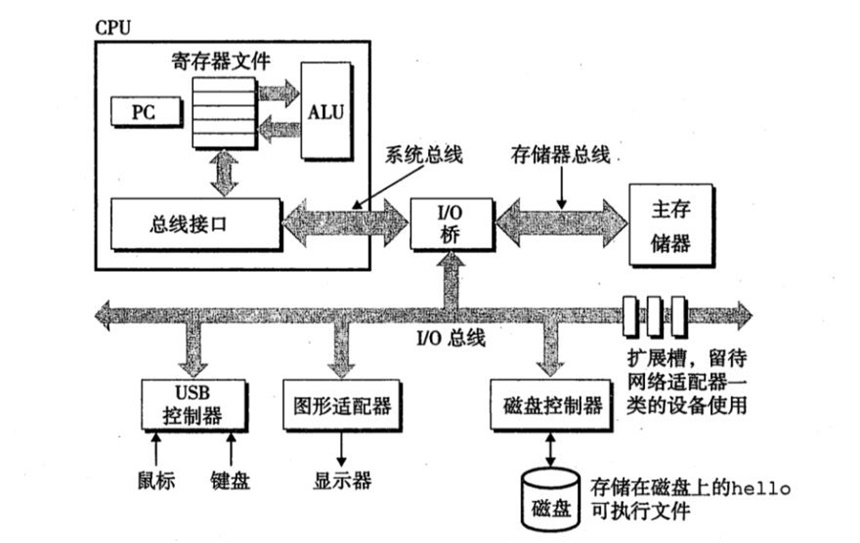 

### 3.2.1中央处理单元(Central Processing Unit，CPU)

CPU的结构

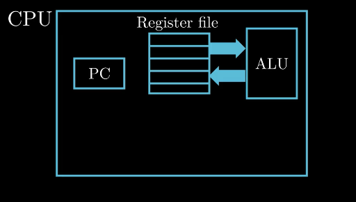 

#### 3.2.1.1PC(Program Count):程序计数器

​	实质上是**一个大小为一个字的存储区域，也就是一个4字节或是8字节的存储空间，字面存放的是某一条指令的地址**

​	从系统上电的那一瞬间，直到系统断电，处理器就不断地在执行PC指向的指令，然后更新PC，s使其指向下一条要执行的指令。

​	注：这个下一条指令与刚刚执行的指令不一定是相邻的

​		一个字：32位的机器---->4个字节

​					   64位的机器---->8个字节

#### 3.2.1.2寄存器文件

CPU内部的一个存储设备

 寄存器文件是有一些单子长的寄存器构成，每个寄存器都有自己唯一的名字

通俗的讲，寄存器可以理解为一个临时存放数据的空间

例：计算两个变量a+b的和

​	处理器从内存中读取a的值暂存在寄存器X中，读取b的值暂存在寄存器Y中，这个操作会覆盖寄存器中原来的数值，处理器完成加载的操作后，ALU(Arithmetic and Logic Unit)会从复制寄存器X和Y中保存的数值，然后进行算术运算，得到的结构会保存到寄存器X或者寄存器Y中，此时寄存器中原来的数值会被心得数值覆盖。

#### 3.2.1.3ALU(Arithmetic and Logic Unit)

计算新的数据和地址值

几个简单指令的操作

-   加载：
    把一个字节或一个字从主存复制到存储器，以覆盖这个位置上原来的内容。
-   存储：
    把一个字节从存储器复制到主存中的某个位置，已覆盖这个位置上原来的内容。
-   操作：
    把两个寄存器中的内容复制到ALU（算术逻辑单元），ALU对这两个字做算术运算，并将结果放到一个存储器中，以覆盖存储器中原来的内容。
-   跳转：
    从指令本身中抽取一个字，并将这个字复制到程序计数器（PC）中，以覆盖PC中原来的值。

### 3.2.2主存(内存)

处理器在执行程序时，内存主要存放程序指令以及数据

从物理上讲，内存是由随机动态存储器芯片组成

从逻辑上讲，内存可以看成一个从零开始的大数组，每个字节都有相应地址

### 3.2.3总线

内存和处理器之间通过总线来进行数据传递

总线贯穿了整个计算机系统，它负责将信息从一个部件传递到另外一个部件，通常总线被设计成传送固定长度的字节快，也就是字(word)，

### 3.2.4I/O设备

键盘、鼠标、显示器以及磁盘等等

每一个输入输出设备都通过一个控制器或者适配器与I/O总线相连，控制器与适配器的主要区别是在于它们的封装方式，无论是控制器与适配器，它们的功能都是在I/O设备与I/O总线之间传递数据。

## 3.3hello程序执行过程

通过键盘输入"./hello"的字符串，shell程序会将输入的字符逐一读入寄存器，处理器会把hello这个字符串放入内存中

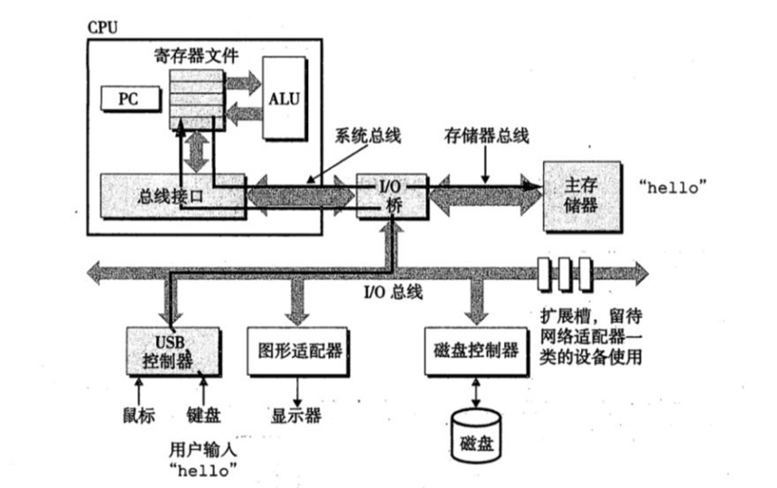 

按下回车键后，shell程序就知道我们已经完成了命令的输入，然后执行一系列的指令来加载可执行文件hello

这些指令将hello中的数据和代码从磁盘复制到内存，数据就是我们要显示输出的"hello，world\n"

这个复制过程将利用DMA(Direct Memory Access)技术，数据可以不经过处理器，从磁盘直接到达内存

当可执行文件hello中的代码和数据被加载到内存中，处理器就开始执行main函数中的代码

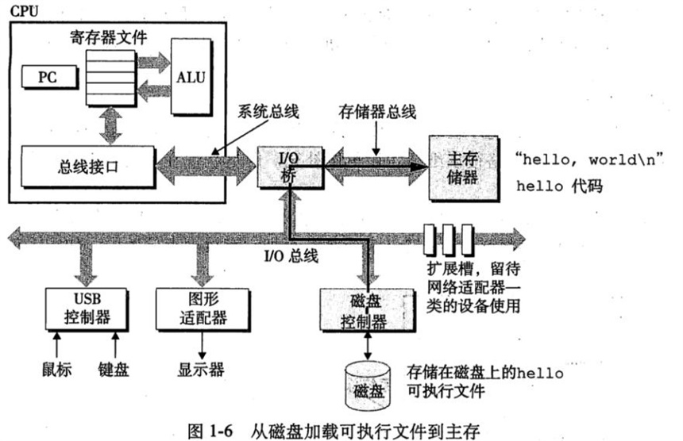 

CPU会将"hello，world\n"这个字符串从内存复制到寄存器文件，然后再从寄存器文件复制到显示设备，最终hello，world显示在屏幕上。

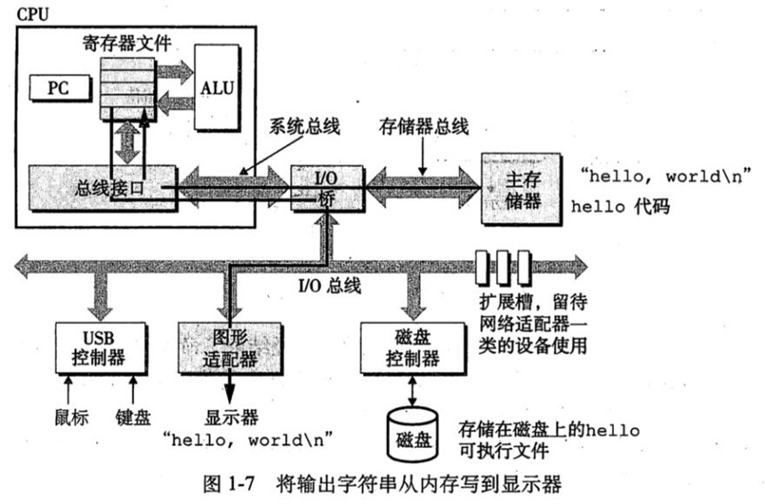 

### 3.3.1流程总结

读取文件字符到寄存器 → 存储到主存  → 执行指令  →  加载 hello，world 到寄存器 → 复制到显示器 → 显示

# 4.高速缓存

通常情况下，大容量的存储设备的存取速度要比小容量的慢

运行速度更快的设备的价格相对于低俗设备要更贵

从主存读取一个字比磁盘快 **1000 万**倍。

从寄存器文件读取比主存块 **100 倍**，并且差距还在加大。

高速缓存（cache）用来解决处理器与主存间的差异。

**L1 高速缓存**位于 **CPU** 上，容量为数万字节（**KB 级别**），L1跟寄存器文件几乎一样块。

L1 比 L2 快 **5** 倍。

**L2 高速缓存**通过**一条特殊的总线**与 CPU 连接，容量为数十万到数百万字节（**0.1 MB 到 10 MB**）。L2 比 主存快 **5~10** 倍

新的系统还有 L3。

## 4.1存储设备的层次结构

主要思想：上一层存储设备是下一层存储设备的高速缓存

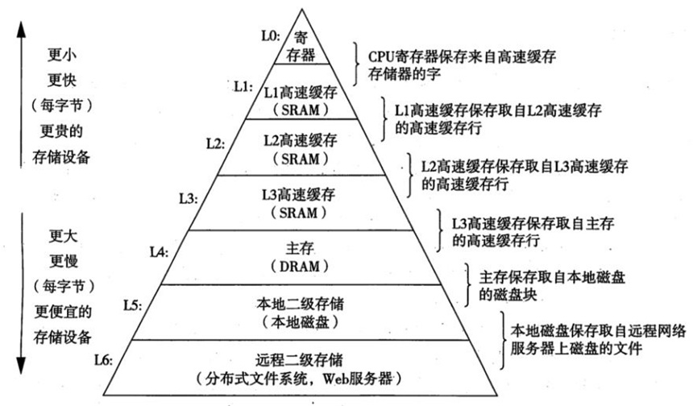

# 5操作系统管理硬件

## 5.1操作系统的作用

无论是 `shell` 程序还是 `hello` 程序都没有直接访问键盘、显示器、磁盘这些硬件设备，真正操挫硬件的是操作系统，我们可以把操作系统看成是应用程序和硬件之间的中间层，所有的应用程序对硬件的操作必须通过操作系统来完成。

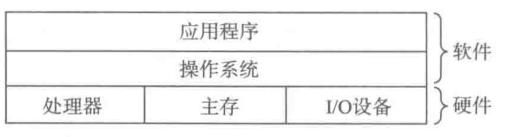 

这样设计的目的：

1.  防止硬件被失控的应用程序滥用
2.  操作系统提供简单一致的机制来控制这些复杂而又通常大不相同的低级硬件设备

 为了实现上述的功能，操作系统引入了几个抽象的概念。

1.   文件是对I/O设备的抽象

2.   虚拟内存是对内存和磁盘I/O的抽象

3.   进程是对处理器、内存以及I/O设备的抽象

     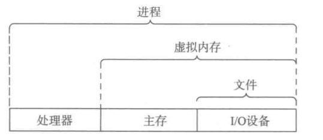 

     

     ## 5.2进程

     假设场景中只有两个并发的进程:shell进程和hello进程

     最开始的时候，只有shell进程在运行，即shell在等待命令行的输入

     当我们通过shell进程加载hello进程时，shell进程通过系统调研来执行我们的请求，系统调用会将控制权从shell进程传递给操作系统，操作系统保存shell进程的上下文，然后创建一个新的hello进程及其上下文，然后将控制权转交给新的hello进程hello进程执行完之后，操作系统就会恢复shell进程的上下文，并将控制权交给shell进程，之后shell进程继续等待下一个命令的输入

     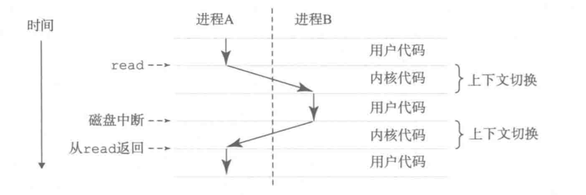 

​		**上下文(Context)**  操作系统会跟踪进程运行中所需要的所有状态信息，这种状态，称为上下文

​			例：当前PC和寄存器的值，以及内存中的内容

## 5.3线程

现代操作系统中，一个进程实际上由多个线程组成，每个线程都运行在进程的上下文中，共享代码和数据。由于网络服务器对并行处理的需求，线程成为越来越重要的编程模型

## 5.4虚拟内存

操作系统为每个进程提供了一个假象，就是每个进程都在独自占用整个内存空间，每个进程看到的内存都是一样的，我们称之为虚拟地址空间。

下图为 Linux 的虚拟地址空间，从下往上看，地址是增大的。最下面是 0 地址。

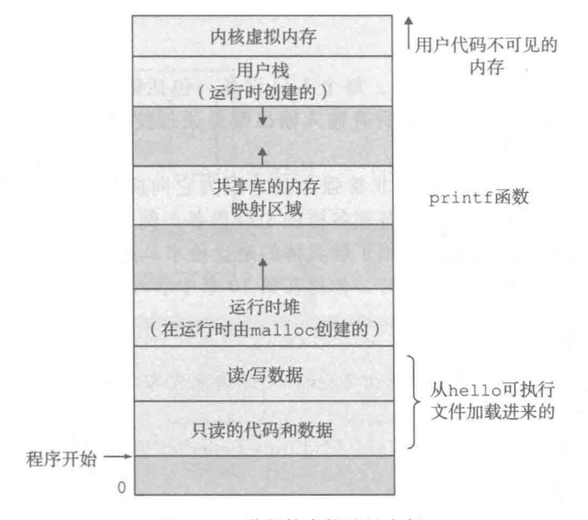 

-   程序代码和数据

    这个区域的内容是从可执行目标文件中加载而来的。对于所有的进程来讲，代码都是从固定的地址开始。

    读/数据：在C语言中，全局变量存放在这个区域

-   堆

    在C语言中，malloc所申请的内存空间就在这个堆中，程序的代码和数据区在程序一开始的时候就被指定了大小，但是堆可以再运行时动态的扩展和收缩

-   共享库

    这个区域主要存放像C语言的标准库和数学库这种共享库的代码和数据，例如hello程序中的`printf`函数就是存放在这里

-   用户栈

    **函数调用** 本质就是压栈

    每一次当程序进行函数调用的时候，栈就会增长，函数执行完毕返回时，栈就会收缩

    栈的增长方向是从高地址到低地址

-   内核虚拟内存

    应用程序代码不能读写这个区域的数据，也不能直接调用内核中定义的函数，也就是说，这个区域对应用程序是不可见的

## 5.5文件

所有的 IO 设备，包括键盘，磁盘，显示器，甚至网络，这些都可以看成文件，系统中所有的输人和输出都可以通过读写文件来完成。

虽然文件的概念非常简单，但却非常强大。例如︰当程序员需要处理读写磁盘上的文件时，他们不需要了解具体的磁盘技术，同一个程序，可以在不同磁盘技术上的不同系统上运行

# 6系统之间利用网络通信

随着互联网的发展，从一台计算机发送消息到另外一台计算机已经成为非常普遍的应用。《深入理解计算机系统》中讲述了如何使用本地计算机上的 `telnet` 客户端连接远程主机上的 telnet 服务器。

由于 `telnet` 的安全性问题，目前 `ssh `的连接方式的更加普遍。

当我们在 `ssh` 的客户端中输人 `hello` 字符串并敲下回车之后，客户端的软件就会通过网络将字符串发送到 `ssh` 服务端，`ssh` 服务端从网络端接收到这个字符串以后，会将这个字符串传递给远程主机上的 shell 程序，然后 `shell` 负责 `hello` 程序的加载，运行结果返回给 `ssh` 的服务端，最后 `ssh` 的服务端通过网络将程序的运行结果发送给 ssh 的客户端，`ssh`客户端在屏幕上显示运行结果。

 

# 7系统加速

## 7.1加速比

**Amdahl's Law(阿姆达尔定律)**：当我们对系统的某一部分进行加速时，被加速部分的重要性和加速程度是影响整体系统性能的关键因素。

在加速前，假设一个应用程序的执行所需要的全部时间用 Told 来表示，为了方便描述，我们可以笼统的将这个程序分为两部分，部分是不可加速的，另外一部分是可加速的。其中可以加速的部分执行花费的时间为 αTold ，不可加速部分的执行时间为 Told - αTold 。

 

程序经过优化后，可加速部分性能提升比例为 k ，那么经过加速后，这个可加速部分所花费的时间就是αTold/k，因此我们可以计算出，程序经过加速后所花费的时间，这里用 Tnew 来表示。

 
$$
Tnew=(1-α)Told+(αTold)/k=Told[(1-α)+α/k]
$$
此时，我们可以得到加速比S
$$
S=Told/Tnew=1/[(1-α)+α/k]
$$
当α=0.6时，加速因子k=3，加速比为1.67倍

极限情况，若k趋向于无穷大，即把这60%的部分加速到几乎不花时间的程度，此时的加速比S可以简化成1/(1-α)，那么整个系统获得的净加速比也只有2.5

因此，在计算机的世界里，如果我们需要把系统的性能提高2倍或者更多，只有通过优化大部分的组件才能获得。

## 7.2并发和并行

获得更高的计算能力：

1.  线程级并发
2.  指令级并行
3.  单指令，多数据并行

### 7.2.1线程级并发

首先我们看一个多核处理器的组织结构，图中的处理器芯片具有四个 CPU 核心，由于篇幅限制，另外两个用省略号代替了。每个CPU核心都有自己的 Ll cache 和 L2 cache ，四个 CPU 核心共享 L3 cache，这 4 个 CPU 核心集成在一颗芯片上

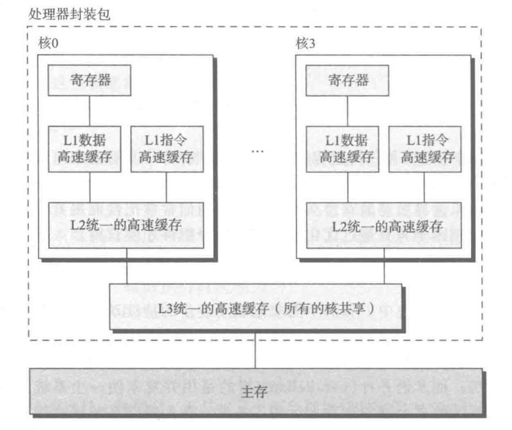 

对于许多高性能的服务器芯片，单颗芯片集成的 CPU 数量高达几十个，甚至上百个。通过增加 CPU 的核心数，可以提高系统的性能。

**超线程**，优势称为同时多线程，是一项允许一个CPU执行多个控制流的技术。如果每个 CPU 核心可以执行两个线程，那么四个核心就可以并行的执行 8 个线程

在 CPU 内部，像程序计数器和寄存器文件这样的硬件部件有多个备份，而像浮点运算部件这个样的硬件还是只有一份，常规单线程处理器在做线程切换时，大概需要20000个时钟周期，而超线程处理器可以在单周期的基础上决定执行哪一个线程，这样一来，CPU可以更好地利用它的处理资源。当一个线程因为读取数据而进人等待状态时，CPU可以去执行另外一个线程，其中线程之间的切换只需要极少的时间代价。

### 7.2.2指令级并行

现代处理器可以同时执行多条指令的属性称为指佘级并行。

每条指令从开始到结束大概需要20个时钟周期或者更多，但是处理器采用了非常多的技巧可以同时处理多达100条指命，因此，近几年的处理器可以保持每个周期2~4条指令的执行速率。

### 7.2.3单指令多数据并行

现代处理器拥有特殊的硬件部件，允许一条指令产生多个并行的操作，这种方式称为单指令多数据（Single Instruction Multiple Data）。

SIMD的指令多是为了提高处理视频、以及声音这类数据的执行速度，比较新的Intel以及AMD的处理器都是支持SIMD指令加速。

# 8虚拟机

虚拟机是对整个计算机系统的抽象，包括操作系统、处理器以及程序。虽然虚拟机的思想在20世纪60年代就提出来了，但是最近才突显出优势来。

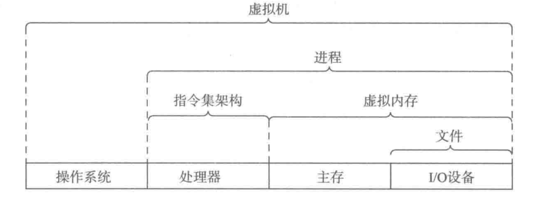 


 
