# 1历史发展

1978年Intel发布了第一款微处理器8086，在接下来的四十多年里，Intel不断地推出新的处理器，从最早的16位扩展到32位，近些年又扩展到64位。

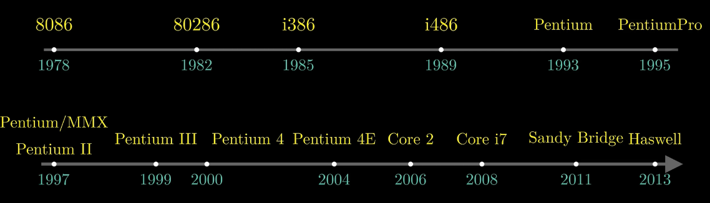 

# 2程序编码

下面看一个C代码的例子：

main.c

```C
#include<stdio.h>

void mulstore(long,long,long *);

int main() {
	long d;
	multstore(2，3，&d) ;
	printf("2* 3 -->%1d \n"，d) ;
    return 0;
}
long mult2(long a,long b){
    long s = a * b;
    return s;
}
```

mstore.c

```C
long mult2(long，long);

void mulstore(long x,long y,long *dest){
    long t = mult2(x,y);
    *dest = t;
}
```

通过以下命令进行编译：

```shell
linux> gcc -Og -o prog main.c mstore.c
```

其中`gcc`指的就是GCC编译器，它是Linux系统上默认的编译器，其中编译选项`-Og`是用来告诉编译器生成符合原始C代码整体结构的机器代码。在实际项目中，为了获得更高的性能，会使用`-O1`或者`-O2`，甚至更高的编译优化选项。但是使用高级别的优化产生的代码会严重变形，导致产生的机器代码与最初的源代码之间的关系难以理解，这里为了理解方便，因此选择`-Og`这个优化选项。

`-o`后面跟的参数`prog`表示生成可执行文件的文件名。

## 2.1生成汇编文件

首先以源文件`mstore.c`为例，看一下C代码与汇编代码之间的关系，使用以下命令可以生成对应的汇编文件`mstore.s`：

```shell
linux> gcc -Og -S mstore.c
```

其中`-S`这个编译选项就是告诉编译器`GCC`产生的文件为汇编文件，我们可以用编辑器(vim)打开这个汇编文件。

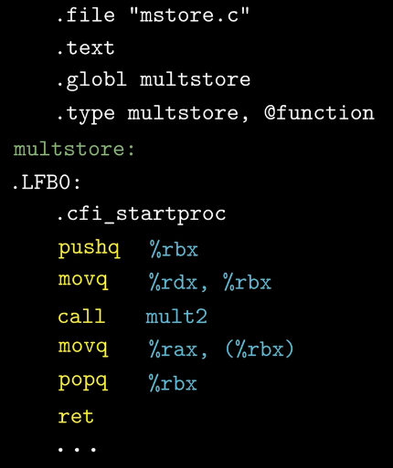 

其中以`.`开头的行都是指导汇编器和链接器工作的伪指令，也就是说我们完全可以忽略这些以`.`开头的行，删除了无关的信息之后，剩余这些汇编代码与源文件中C代码是相关的。

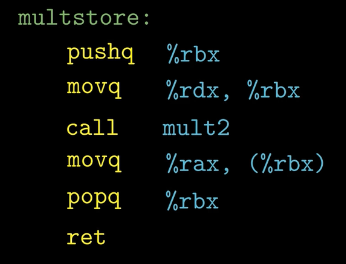 

接下来我们看一下这段C程序所对应的第一条汇编代码，`pushq`这条指令的意思是将寄存器`rbx`的值压入程序栈进行保存。

为什么程序一开始要保存寄存器`rbx`的内容？

在Intel x86-64的处理器中包含了16个通用目的的寄存器，这些寄存器用来存放整数数据和指针。

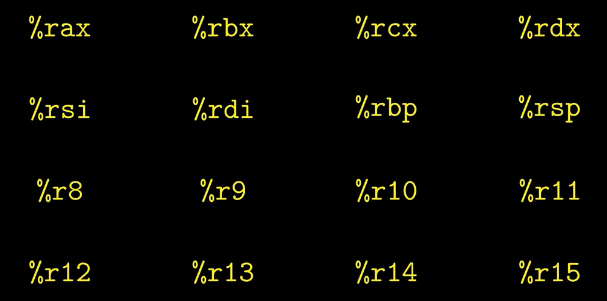 

图中显示的这16个寄存器，它们的名字都是以`%r`开头的，在详细介绍寄存器的功能之前，我们首先需要搞清楚两个概念：**调用者保存寄存器**和**被调用者保存寄存器**。

如图中的这个例子，函数A中调用了函数B，因此，函数A称为调用者，函数B称为被调用者。

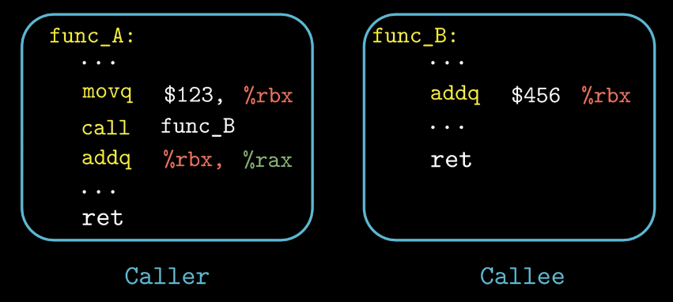 

由于调用了函数B，寄存器`rbx`在函数B中被修改了，逻辑上寄存器`rbx`的内容在调用函数B的前后应该保持一致，解决这个问题有两个策略：

1、函数A在调用函数B之前，提前保存寄存器`rbx`的内容，执行完函数B之后，再恢复寄存器`rbx`原来存储的内容，这种策略就称之为调用者保存；

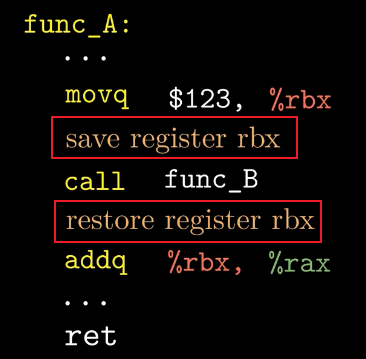 

2、函数B在使用寄存器`rbx`之前，先保存寄存器`rbx`的值，在函数B返回之前，先恢复寄存器`rbx`原来存储的内容，这种策略被称之为被调用者保存。

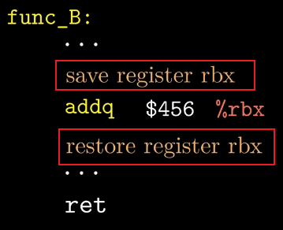 

对于具体使用哪一种策略，不同的寄存器被定义成不同的策略，具体如图所示

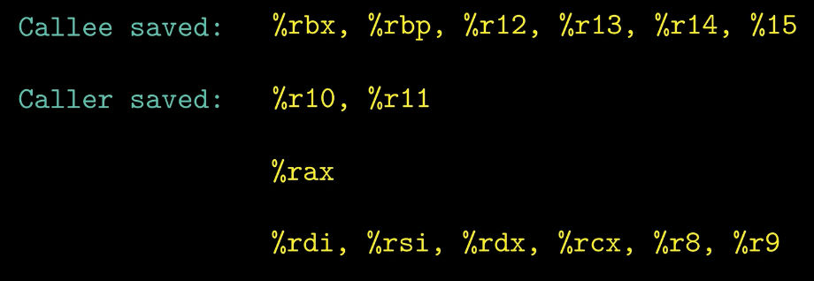 

寄存器`rbx`被定义为被调用者保存寄存器(callee-saved register)，因此，`pushq`就是用来保存寄存器`rbx`的内容。

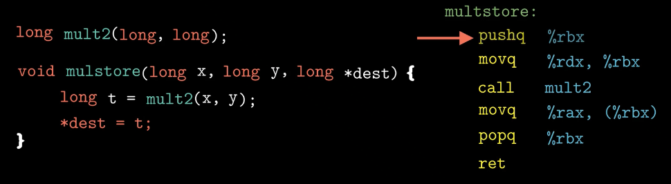 

在函数返回之前,使用了`pop`指令，恢复寄存器`rbx`的内容。

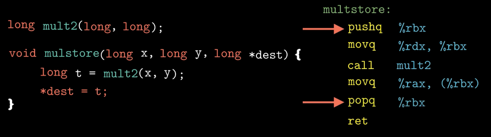 

第二行汇编代码的含义是将寄存器`rdx`的内容复制到寄存器`rbx`。

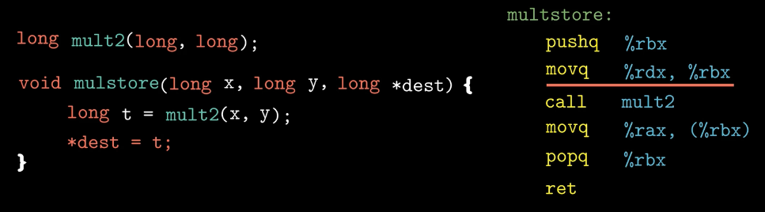 

根据寄存器用法的定义，函数`multstore`的三个参数分别保存在寄存器`rdi`、`rsi`和`rdx`中，这条指令执行结束后，寄存器`rbx`与寄存器`rdx`的内容一致，都是`dest`指针所指向的内存地址。`movq`指令的后缀“q”表示数据的大小。

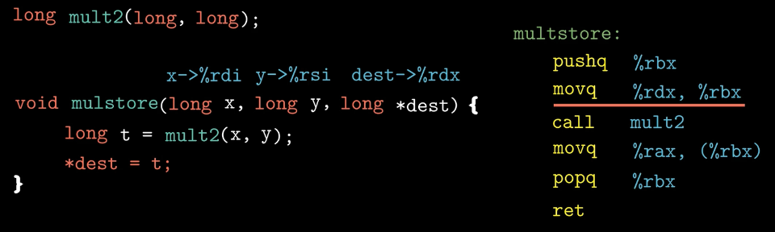 

由于早期的机器是16位的，后来才扩展到32位，因此，Intel用字(word)来表示16位的数据类型，所以，32位的数据类型称为双字，64位的数据类型就称为四字。下图中的表格给出了**C语言的基本类型对应的汇编后缀表示**，因此，`movq`的“q”表示四字。

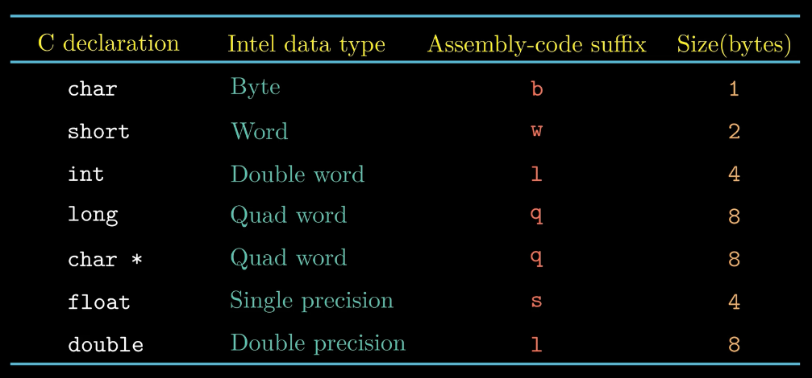 

大多数GCC生成的汇编指令都有一个字符后缀来表示操作数的大小，例如数据传送指令就有四个变种，分别为：`movb`、`movw`、`movl`以及`movq`。

`movb`是move byte的缩写，表示传送字节；`movw`是move word的缩写，表示传送字；`movl`是move long word的缩写，表示传送双字；`movq`是move quadword，表示传送四字。

call指令对应于C代码中的函数调用，这一行代码比较容易理解，该函数的返回值会保存到寄存器`rax`中，因此，寄存器`rax`中保存了x和y的乘积结果。

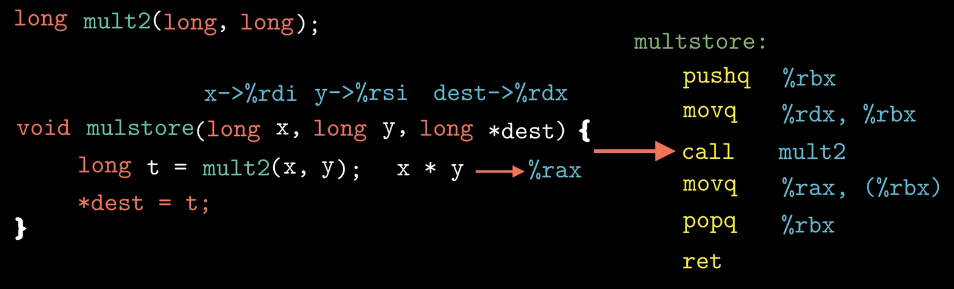 

下一条指令将寄存器`rax`的值送到内存中，内存的地址就存放在寄存器`rbx`中。

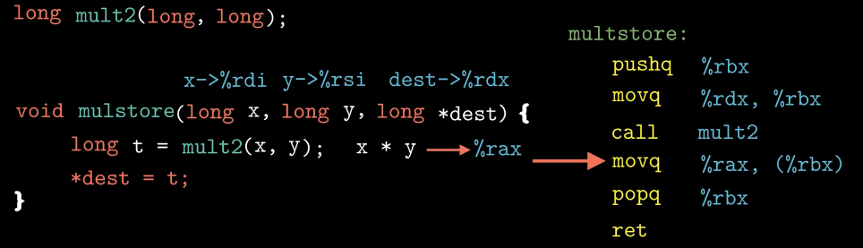 

最后一条指令`ret`就是函数返回。 

## 2.2生成机器代码文件

我们只需要将编译选项`-S`替换成`-c`。

```shell
linux> gcc -Og -c mstore.c
```

执行这条命合，即可生产`mstore.c`对应的机器代码文件`mstore.o`。由于该文件是二进制格式的，所以无法直接查看。这里我们需要借助一个反汇编工具一`objdump`。汇编器将汇编代码翻译成二进制的机器代码，那么反汇编器就是机器代码翻译成汇编代码。

通过以下命令，我们可以查看`mstore.o`中的相关信息。

```shell
linux> objdump -d mstore.o
```

具体内容如图所示

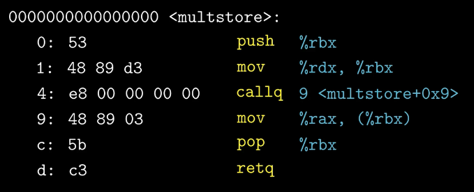 

通过对比反汇编得到的汇编代码与编译器直接产生的汇编代码，可以发现二者存在细微的差异。

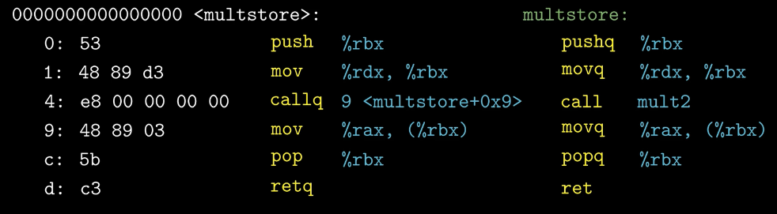 

反汇编代码省略了很多指令的后缀的“q”，但在`call`和`ret`指令添加后缀‘q’，由于q只是表示大小指示符，大多数情况下是可以省略的。

# 3访问信息

## 3.1寄存器

最早8086的处理器中，包含8个16位的通用寄存器，具体如图所示

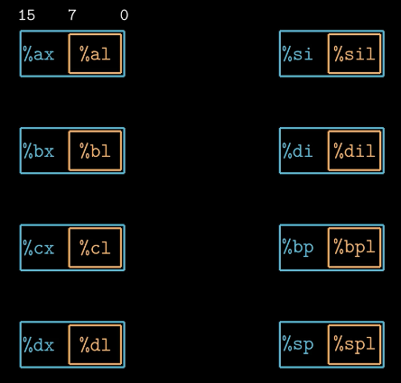 

每个寄存器都有特殊的功能，它们的名字就反映了不同的用途，当处理器从16位扩展到32位时，寄存器的位数也随之扩展到了32位

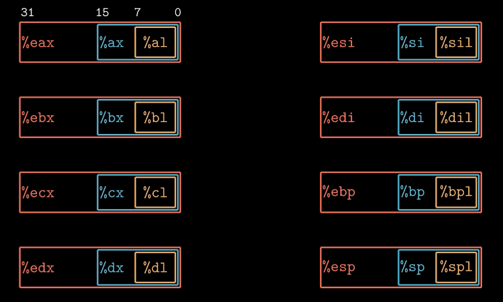 

直到今天64位的处理器中，原来8个16位寄存器已经扩展成了64位。除此之外，还增加了8个新的寄存器

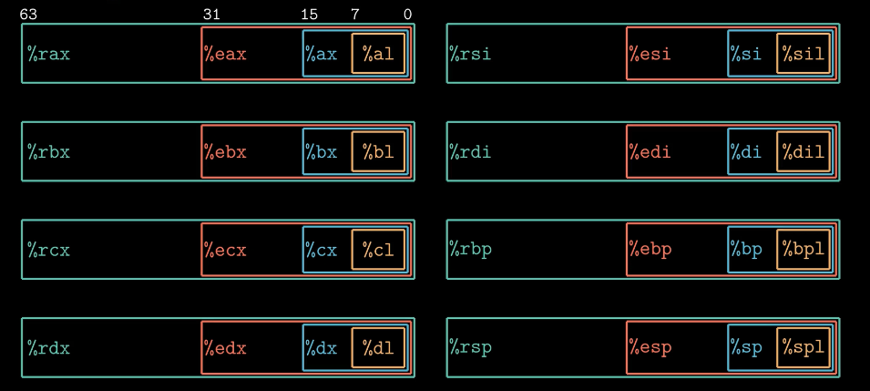 

在一般的程序中，不同的寄存器扮演着不同的角色，相应的编程规范规定了如何使用这些寄存器。例如寄存器`rax`目来保存函数的返回值，寄存器`rsp`用来保存程序栈的结束位置，除此之外，还有6个寄存器可以用来传递函数参数。

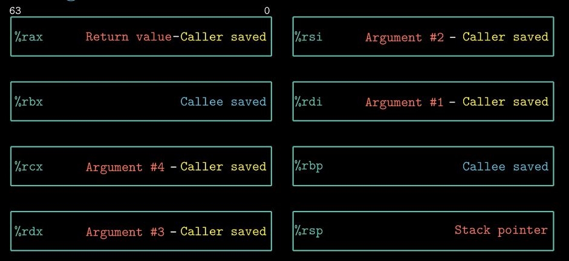 

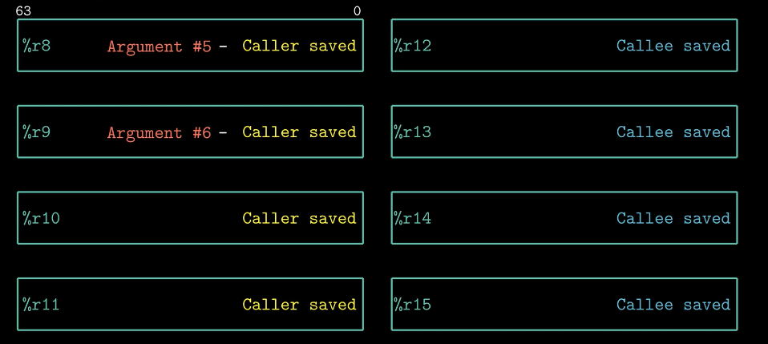 

在了解了这些寄存器的用法之后，再去理解汇编代码就会容易多了。

接下来我们看一下指令的相关知识，大多数指令包含两部分：操作码和操作数。例如图中的这几条指令`movq`、`addq`、`subq`这部分被定义为操作码，它决定了CPU执行操作的类型；操作码之后的这部分是操作数，大多数指令具有一个或者多个操作数。不过像`ret`返回指令，是没有操作数的。

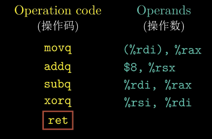 

## 3.2操作数指示符

不同指令的操作数大致可以分为三类，分别为**立即数**、**寄存器**以及**内存引用**。

  1、在AT&T格式的汇编中，立即数是以`$`符号开头的，后面跟一个整数，不过这个整数需要满足标准C语言的定义。

  2、操作数是寄存器的情况也比较容易理解，即使在64位的处理器上，不仅64位的寄存器可以作为操作数，32位、16位甚至8位的寄存器都可以作为操作数。

  3、需要注意的是图中这种寄存器带了小括号的情况，它所表示的是内存引用。我们通常将内存抽象成一个字节数组，当需要从内存中存取数据时，需要获得目的数据的起始地址addr，以及数据长度b。用图中的这个符号来表示内存引用，为了简便，通常会省略下标b。

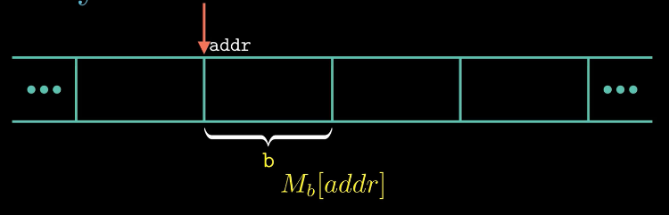 

最常用的内存引用包含四个部分，分别是一个立即数、一个基址寄存器、一个变址寄存器和一个比例因子。引用数组元素时，会使用到这种通用的形式。

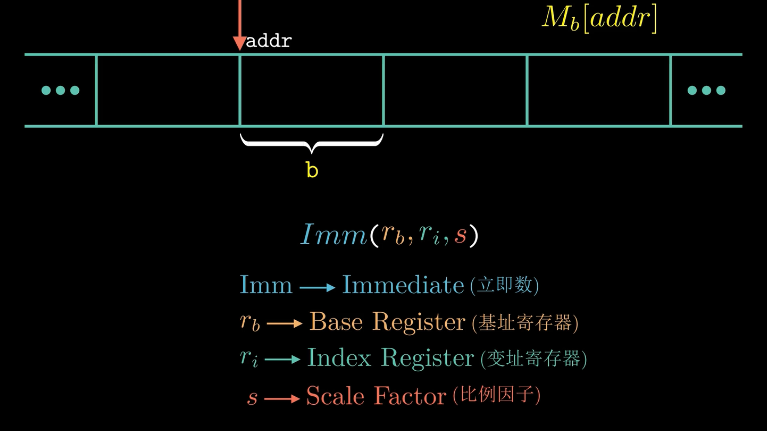 

有效地址是通过立即数与基址寄存器的值相加，再加上变址寄存器与比例因子的乘积，具体的计算方法如图所示。

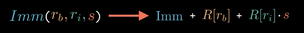 

关于比例因子s的取值必须是1、2、4或者8。实际上比例因子的取值是与源代码中定义的数组类型的是相关的，编译器会根据数组的类型来确定比例因子的数值，例如定义char类型的数组，比例因子就是1，int类型，比例因子就是4，至于double类型比例因子就是8。

其他的形式的内存引用都是这种普通形式的变种，省略了其中的某些部分，图中列出了内存引用的其他形式，需要特别注意的两种写法是：不带`$`符号的立即数和带了括号的寄存器。

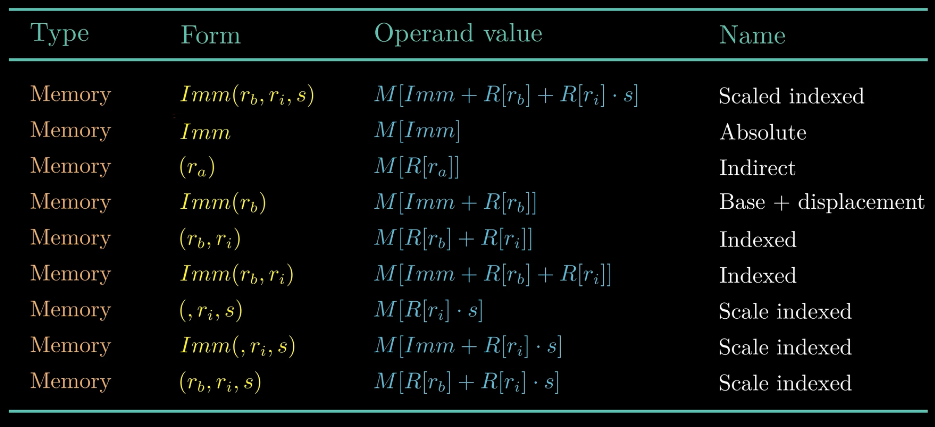 

mov指令包括：movb、movw、movl以及movq这四条指令。这些指令执行相同的操作，都是把数据从源位置复制到目的位置，主要区别在于它们操作的数据大小不同，具体如图所示。

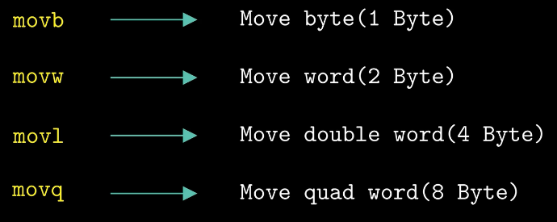 

对于`mov`类指令，含有两个操作数，个称为源操作数，另外一个称为目的操作数。

 

对于源操作数，可以是一个立即数、一个寄存器，或者是内存引用。由于目的操作数是用来存放源操作数的内容，所以目的操作数要么是一个寄存器，要么是一个内存引用，注意目的操作数不能是一个立即数。

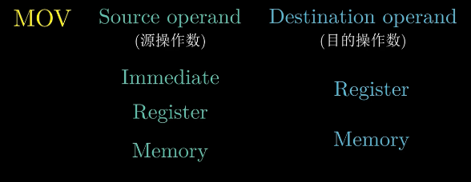 

除此之外，x86-64处理器有一条限制，就是`mov`指令的源操作数和目的操作数不能都是内存的地址，那么当需要将一个数从内存的一个位置复制到另一个位置时，需要两条`mov`指令来完成：第一条指令将内存源位置的数值加载到寄存器；第二条指令再将该寄存器的值写入内存的目的位置。

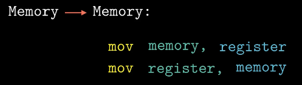 

下图中的指令给出了不同类型的源操作数和目的操作数的组合，第一个是源操作数，第二个是目的操作数。

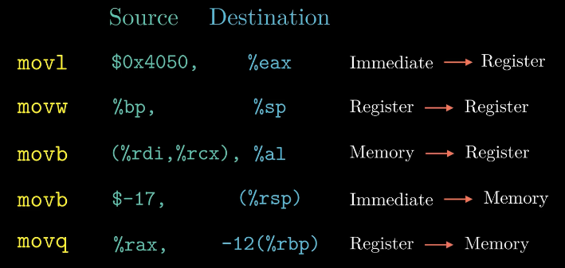 

mov指令的后缀与寄存器的大小一定得是匹配的，例如寄存器`eax`是32位，与双字“l”对应。

除此之外，`mov`指令还有几个特殊的情况需要了解一下，当`movq`指令的源操作数是立即数时，该立即数只能是32位的补码表示，然后对该数值进行符号位扩展之后，将得到的64位数传送到目的位置。

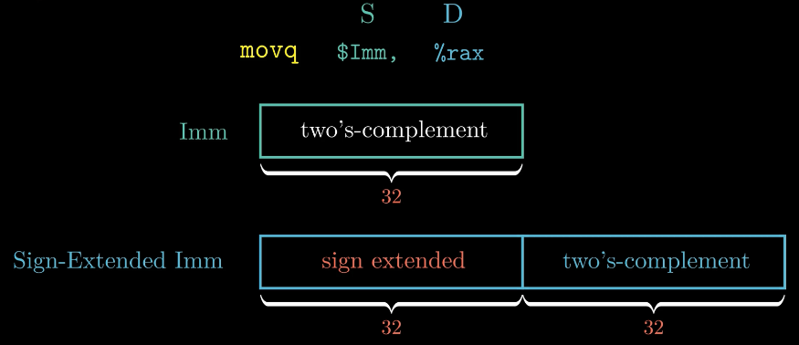 

这个限制会带来一个问题，当立即数是64位时应该如何处理?

这里引入一个新的指令`movabsq`，该指令的源操作数可以是任意的64位立即数，需要注意的是目的操作数只能是寄存器。

 

接下来，我们通过一个例子来看一下使用`mov`指令进行数据传送时，对目的寄存器的修改结果是怎样的。首先使用`movabsq`指令将一个64位的立即数复制到寄存器`rax`。

  

此时，寄存器`rax`内保存的数值如图所示。

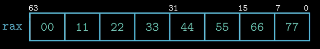 

接下来，使用`movb`指令将立即数-1复制到寄存器`al`，寄存器`al`的长度为8，与`movb`指令所操作的数据大小一致。

 

此时寄存器`rax`的低8位发生了改变。

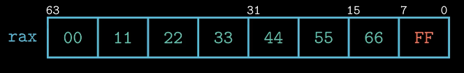 

第三条指令`movw`是将立即数-1复制到寄存器`ax`。

 

此时寄存器`rax`的低16位发生了改变。

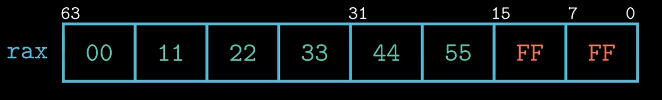 

当指令`movl`将立即数-1复制到寄存器`eax`时，此时寄存器`rax`不仅仅是低32位发生了变化，而且高32位也发了变化。

 

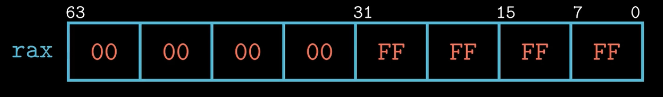 

当`movl`的目的操作数是寄存器时，它会把该寄存器的高4字节设置为0，这是x86-64处理器的一个规定，即任何位寄存器生成32位值的指令都会把该寄存器的高位部分置为0。

以上介绍的都是源操作数与目的操作数的大小一致的情况。

当源操作数的数位小于目的操作数时，需要对目的操作数剩余的字节进行零扩展或者符号位扩展。

零扩展数据传送指令有5条，其中字符z是zero的缩写。指令最后两个字符都是大小指示符，第一个字母表示源操作数的大小，第二个字母表示目的操作数的大小。

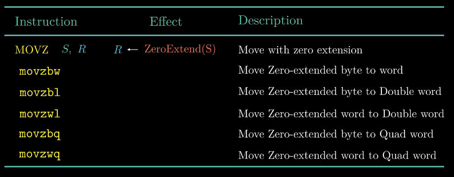 

符号位扩展传送指令有6条，其中字符s是sign的缩写，同样指令最后的两个字符也是大小指示符。

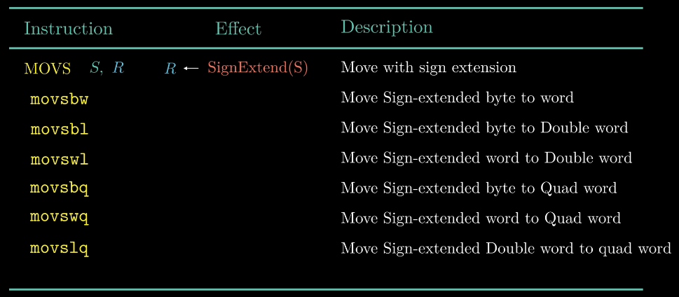 

对比零扩展和符号扩展，我们可以发现符号扩展比零扩展多一条4字节到8字节的扩展指令，为什么零扩展没有movzlq的指令呢？是因为这种情况的数据传送可以使用`movl`指令来实现。

最后，符号位扩展还有一条没有操作数的特殊指令`cltq`，该指令的源操作数总是寄存器`eax`，目的操作数总是寄存器是`rax`。

`cltq`指令效果与图中这条指令的效果一致，只不过编码更紧凑一些。

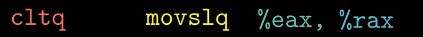 

## 3.3数据传送指令

实际上，在一些程序的执行过程中，需要在CPU和内存之间进行频繁的数据存取。例如CPU执行一个简单的加法操作c=a +b。那么首先通过CPU执行数据传送指令将a和b的值从内存读到寄存器内，寄存器就是CPU内的一种数据存储部件，只不过是容量比较小。

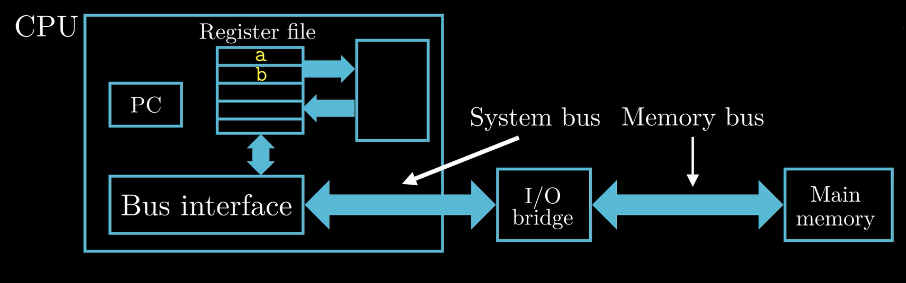 

以x86-64处理器为例，寄存器`rax`的大小是64个比特位，也就是8个字节，如果变量a是long类型，需要占用8个字节，因此，寄存器rax全部的数据位都用来保存变量a；如果变量a是int类型，那么只需要用4个字节来存储该变量，那么只需要用到寄存器的低32位就够了；如果变量a是short类型，则只需要用到寄存器的低16位；

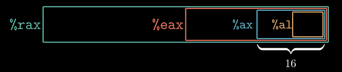 

于寄存器`rax`，如果使用全部的64位，用符号`%rax`来表示；如果是只用到低32位，可以用符号`%eax`来表示；对于低16位和低8位的，分别用`%ax`和`%al`来表示。

虽然用了不同的表示符号，但实际上只是针对同一寄存器的不同数位进行操作，处理器完成加法运算之后，再通过一条数据传送指令将计算结果保存到内存。

正是因为数据传送在计算机系统中是一个非常频繁的操作，所以了解一下数据传输指令对理解计算机系统会有很大的帮助。

## 3.4数据传送示例

接下来，我们看一个数据传送的代码示例。

```c
int main(){
	long a = 4;
	long b = exchange(&a, 3);
	printf("a = %1d, b = %1d\n", a, b);
	return 0;
}

long exchange(long *xp, long y){
	long x = *xp;
	*xp = y;
	return x;
}
```

变量a的值会替换成3，变量b将保存变量a原来的值4。重点看函数`exchange`所对应的汇编指令：

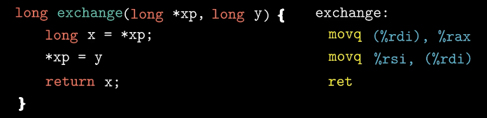 

函数`exchange`由三条指令实现，包括两条数据传送指令和一条返回指令。根据寄存器的使用惯例，寄存器`rdi`和`rsi`分别用来保存函数传递的第一个参数和第二个参数，因此，寄存器`rdi`中保存了xp的值，寄存器`rsi`保存了变量y的值。这段汇编代码中并没有显式的将这部分表示出来，需要注意一下。

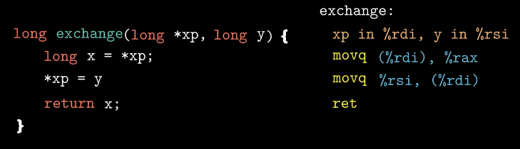 

第一条`mov`指令从内存中读取数值到寄存器，内存地址保存在寄存器`rdi`中，目的操作数是寄存器`rax`，这条指令对应于代码的`long x = *xp;`。

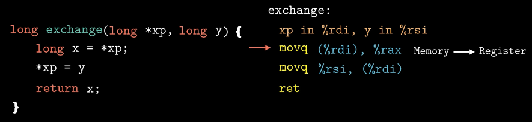 

由于最后函数`exchange`需要返回变量x的值，所以这里直接将变量x放到寄存器`rax`中。

第二条`mov`指令将变量y的值写到内存里，变量y存储在寄存器`rsi`中，内存地址保存在寄存器`rdi`中，也就是xp指向的内存位置。这条指令对应函数`exchange`中的`*xp = y;`

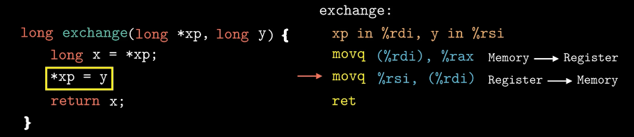 

通过这个例子，我们可以看到C语言中所谓的指针其实就是地址。

## 3.5压入和弹出栈数据

此外，还有两个数据传送指令需要借助程序栈，程序栈本质上是内存中的一个区域。栈的增长方向是从高地址向低地址，因此，栈顶的元素是所有栈中元素地址中最低的。根据惯例，栈是倒过来画的，栈顶在图的底部，栈底在顶部。

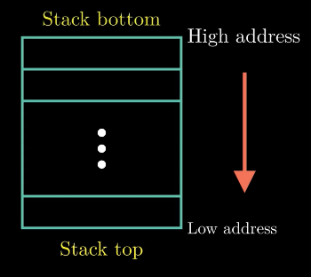 

例如我们们需要保存寄存器`rax`内存储的数据0x123，可以使用`pushq`指令把数据压入栈内。该指令执行的过程可以分解为两步：

1、首先指向栈顶的寄存器的`rsp`进行一个减法操作，例如压栈之前，栈顶指针`rsp`指向栈顶的位置，此处的内存地址0x108；

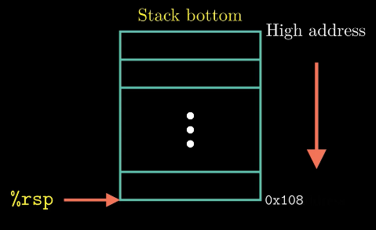 

压栈的第一步就是寄存器`rsp`的值减8，此时指向的内存地址是0x100。

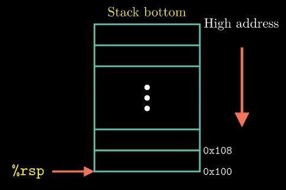 

2、然后将需要保存的数据复制到新的栈顶地址，此时，内存地址0x100处将保存寄存器`rax`内存储的数据0x123。

实际上`pushq`的指令等效于图中`subq`和`movq`这两条指令。

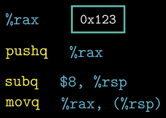 

它们之间的区别是在于`pushq`这一条指令只需要一个字节，而`subq`和`movq`这两条指令需要8个字节。

说到底，`push`指令的本质还是将数据写入到内存中，那么与之对应的`pop`指令就是从内存中读取数据，并且修改栈顶指针。例如图中这条`popq`指令就是将栈顶保存的数据复制到寄存器`rbx`中。

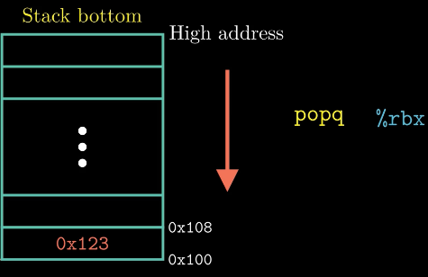 

`pop`指令的操作也可以分解为两步：

1、首先从栈顶的位置读出数据，复制到寄存器`rbx`。此时，栈顶指针`rsp`指向的内存地址是0x100。

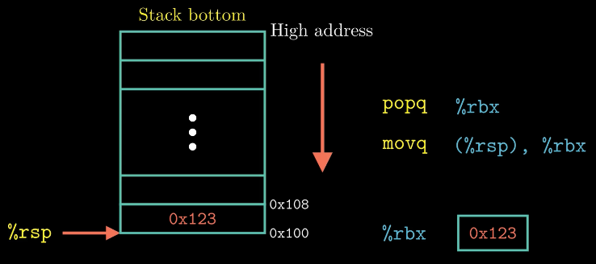 

2、然后将栈顶指针加8，`pop`后栈顶指针`rsp`指向的内存地址是0x108。

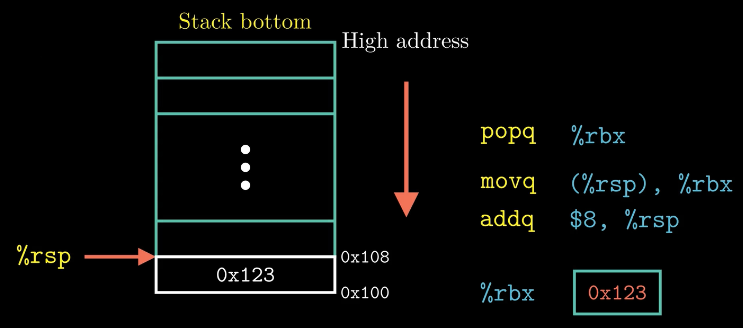 

因此`pop`操作也可以等效`movq`和`addq`这两条指令。

实际上`pop`指令是通过修改栈顶指针所指向的内存地址来实现数据删除的，此时，内存地址0x100内所保存的数据0x123仍然存在，直到下次`push`操作，此处保存的数值才会被覆盖

# 4算术和逻辑操作

## 4.1加载有效地址

首先我们看一下指令`leaq`，它实现的功能是加载有效地址，q表示地址的长度是四个字，由于x86-64位处理器上，地址长度都是64位，因此不存在`leab`、`leaw`这类有关大小的变种。

 

例如下图中的这条指令，它表示的含义是把有效地址复制到寄存器`rax`中。

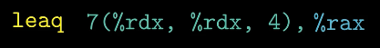 

这个源操作数看上去与内存引用的格式类似，有效地址的计算方式与之前讲到的内存地址的计算方式一致，可以通过下图中的公式计算得到。

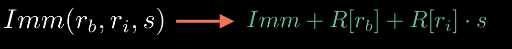 

假设寄存器`rdx`内保存的数值为x，那么有效地址的值为 7 + %rdx + %rdx * 4 = 7 + 5x。注意，对于`leaq`指令所执行的操作并不是去内存地址(5x+7)处读取数据，而是将有效地址(5x+7)这个值直接写入到目的寄存器`rax`。

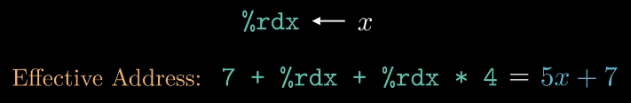 

除了加载有效地址的功能，`leaq`指令还可以用来表示加法和有限的乘法运算。例如下列代码：

```c
long scale(long x, long y, long z){
	long t = x + 4 * y + 12 * z;
	return t;
}
```

经过编译后，这段代码是通过三条`leaq`指令来实现。

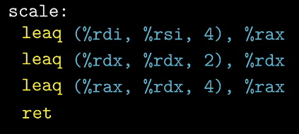 

接下来我们看一下，如何通过`leaq`指令实现算术运算。

根据寄存器的使用惯例，参数x，y，z分别保存在寄存器`rdi`、`rsi`以及`rdx`中，还是根据内存引用的计算公式，第一条指令的源操作数就对应于x+4*y，具体过程如图所示。

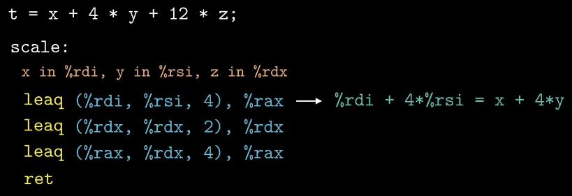 

指令`leaq`将该数值保存到目的寄存`rax`中。

接下来关于z*12的乘法运算会有一些复杂，需要分成两步：

1、首先计算3*z的数值,具体过程如图所示。

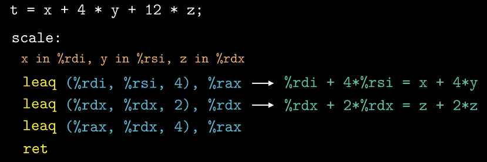 

第二条的`leaq`指令执行完毕，此时寄存器`rdx`中保存的值是3z。

2、把3z作为一个整体乘以4。

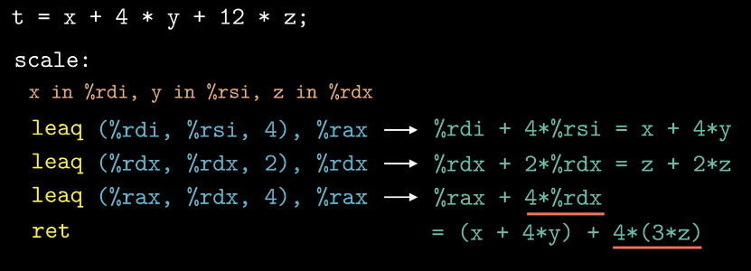 

通过这两步运算最终得到12z。

为什么不能使用下图中的这条指令，直接一步得到我们期望的结果？

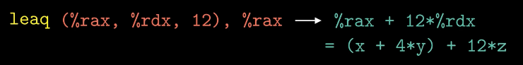 

这里主要是由于比例因子取值只能是1,2,4,8这四个数中的一个，因此要把12进行分解。

## 4.2 一元和二元操作

一元操作指令只有一个操作数，因此该操作数既是源操作数也是目的操作数，操作数可以是寄存器，也可以是内存地址。

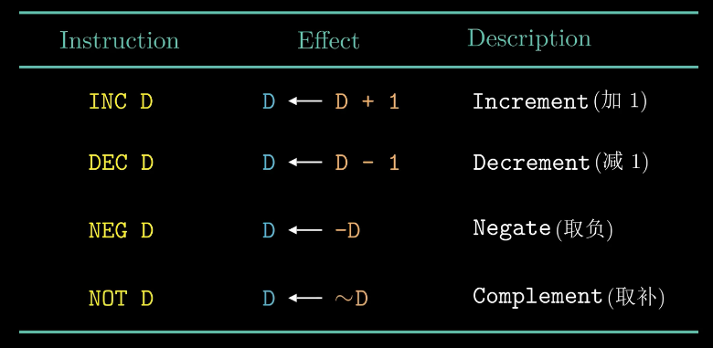 

二元操作指令包含两个操作数，第一个操作数是源操作数，这个操作数可以是立即数、寄存器或者内存地址；第二个操作数既是源操作数也是目的操作数，这个操作数可以是寄存器或者内存地址，但不能是立即数。 

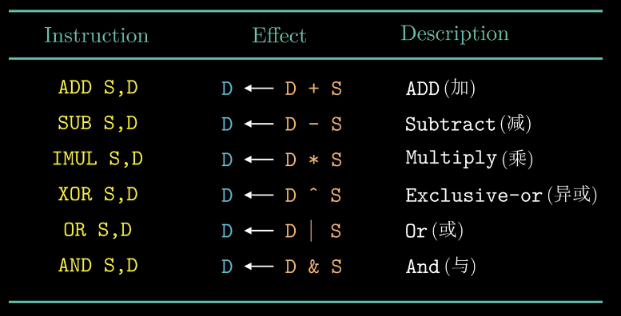 

下面看一个例子，一开始，内存以及寄存器中所保存的数据如图所示。

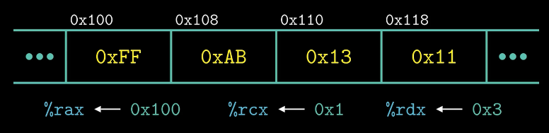 

1、加法指令`addq`是将内存地址0x100内的数据与寄存器`rcx`相加，二者之和再存储到内存地址0x100处，该指令执行完毕后，内存地址0x100处所存储的数据由0xFF变成0x100。

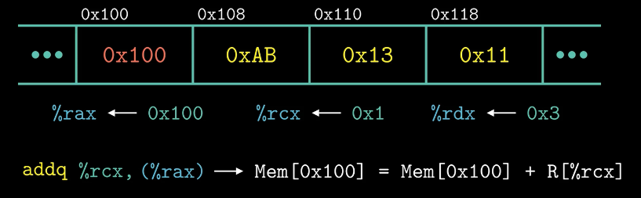 

2、减法指令`subq`是将内存地址0x108内的数据减去寄存器`rdx`内的数据，二者之差在存储到内存地址0x108处，该指令执行完毕后，内存地址0x108处所存储的数据由0xAB变成0xA8。

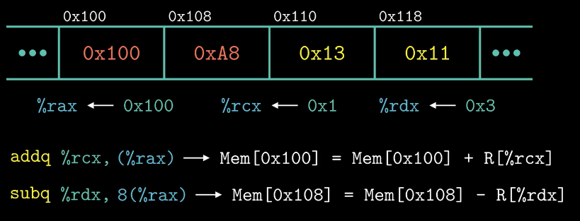 

3、对于加一指令`incq`，就是将内存地址0x110内存储的数据加1，结果是内存地址0x110处所存储的数据由0x13变成0x14。

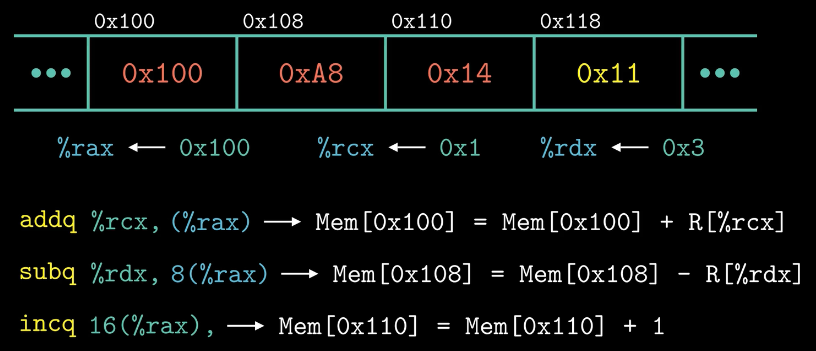 

4、最后一条加法指令是将寄存器`rax`内的值减去寄存器`rdx`内的值，最终寄存器`rax`的值由0x100变成0xFD。

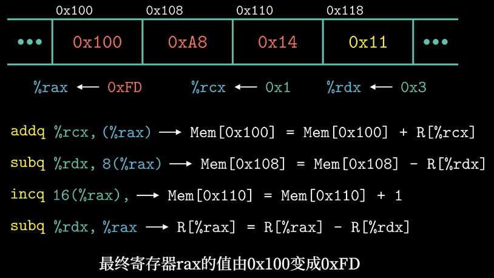 

## 4.3移位操作

下图中的这一组指令是用来进行移位运算的。

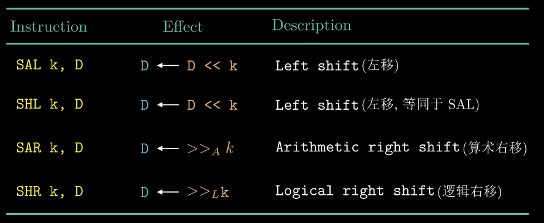 

左移指令有两个，分别是`SAL`和`SHL`，二者的效果是一样的，都是在右边填零；右移指令不同，分为算术右移和逻辑右移，算术右移需要填符号位，逻辑右移需要填零，这与C语言中所讲述的移位操作是一致的。

对于移位量k，可以是一个立即数，或者是放在寄存器`cl`中的数，对于移位指令只允许以特定的寄存器`cl`作为操作数，其他寄存器不行，这里需要特别注意一下。

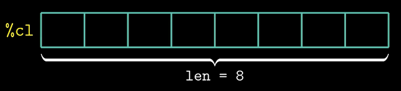 

由于寄存器`cl`的长度为8，原则上移位量的编码范围可达28 - 1 (255)，实际上，对于w位的操作数进行移位操作，移位量是由寄存器`cl`的低m位来决定，也就是说，对于指令`salb`，当目的操作数是8位，移位量由寄存器`cl`的低3位来决定。

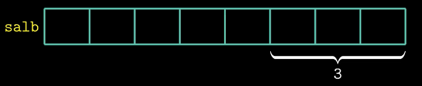 

对于指令`salw`，移位量则是由寄存器`cl`的低4位来决定。

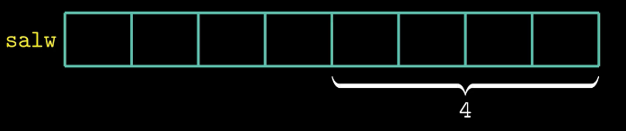 

以此类推，双字对应的是低5位，四字对应的是低6位。

接下来，我们通过一个例子来讲述一下移位指令的用途，下面的代码涉及了多种操作。

```c
long arith(long x, long y, long z){
	long t1 = x ^ y;
	long t2 = z * 48;
	long t3 = t1 & 0xF0F0F0F;
	long t4 = t2 - t3;
	return t4;
}
```

生成汇编指令如下所示。

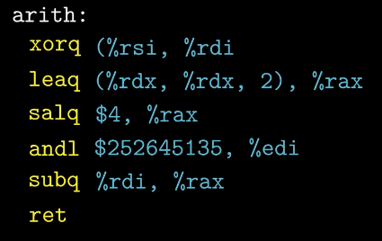 

我们重点看一下z*48这行代码所对应的汇编指令。

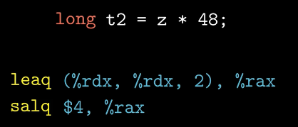 

这个计算过程被分解成了两步：

1、第一步，首先计算3*z，指今`leaq`来实现，计算结果保存到寄存器`rax`。

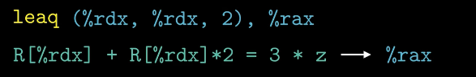 

2、第二步，将寄存器`rax`进行左移4位，左移4位的操作是等效于乘以2的四次方，也就是乘以16。

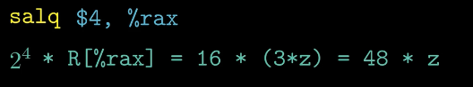 

通过一条`leaq`指令和一条左移指令，来实现乘法操作。

为什么编译器不直接使用乘法指令来实现这个运算呢？主要是因为乘法指令的执行需要更长的时间，因此编译器在生成汇编指令时，会优先考虑更高效的方式。

此外，还有一些特殊的算术指令，对于汇编指令学习，最关键的是了解指令相关的基本概念，并不需要去记指令的细枝末节，学会查阅指令手册，能够找到需要的信息即可。

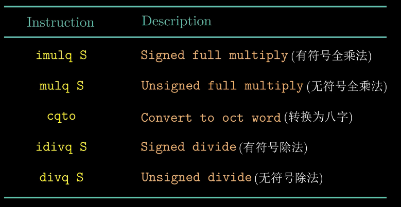 

# 5控制码

## 5.1条件码

算术逻辑单元ALU除了执行算术和逻辑运算指令外，还会根据该运算的结果去设置条件码寄存器。

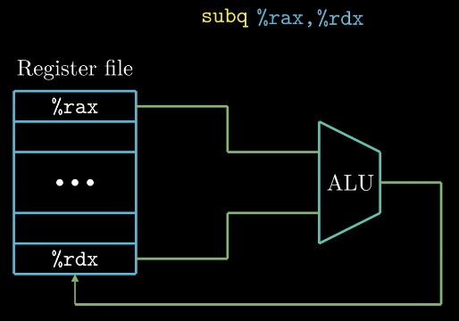 

接下来，我们详细介绍一下条件码寄存器的相关知识。

条件码寄存器它是由CPU来维护的，长度是单个比特位，它描述了最近执行操作的属性。

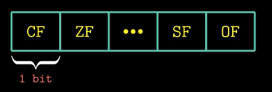 

假如ALU执行两条连续的算术指令。

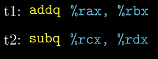 

t1和t2表示时刻，t1时刻条件码寄存器中保存的是指令1的执行结果的属性，t2时刻，条件码寄存器的内容被下一条指令所覆盖。

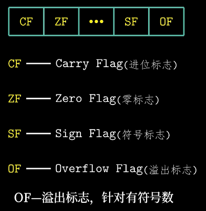 

CF：进位标志，当CPU最近执行的一条指令最高位产生了进位时，进位标志(CF）会被置为1，它可以用来检查无符号数操作的溢出。

ZF：零标志，当最近操作的结果等于零时，零标志(ZF)会被置1。

SF：符号标志，当最近的操作结果小于零时，符号标志(SF)会被置1

OF：溢出标志，针对有符号数，最近的操作导致正溢出或者负溢出时溢出标志(OF)会被置1。

条件码寄存器的值是由ALU在执行算术和逻辑运算指令时写入的，下图中的这些算术和逻辑运算指令都会改变条件码寄存器的内容。

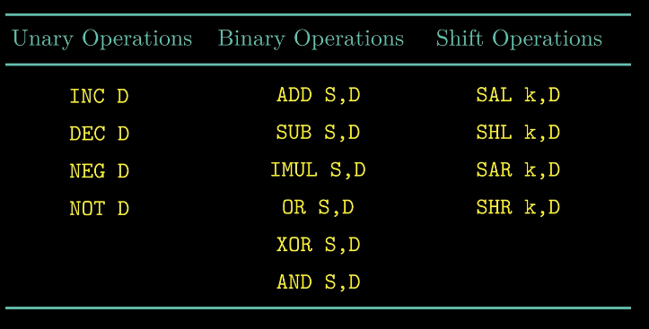 

## 5.2访问条件码

对于不同的指令也定义了相应的规则来设置条件码寄存器。

例如逻辑操作指令`xor`，进位标志(CF)和溢出标志(OF)会置0；对于加一指令和减一指令会设置溢出标志(OF)和零标志(ZF)，但不会改变进位标志(CF)。

除此之外，还有两类指令可以设置条件码寄存器：`cmp`指令和`test`指令。

`cmp`指令是根据两个操作数的差来设置条件码寄存器。`cmp`指令和减法指令(`sub`）类似，也是根据两个操作是的差来设置条件码，二者不同的是`cmp`指令只是设置条件码寄存器，并不会更新目的寄存器的值。

`test`指令和`and`指令类似，同样`test`指令只是设置条件码寄存器，而不改变目的寄存器的值。

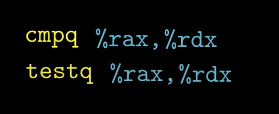 

下面用一个例子来说明条件码的使用：

```c
int comp(long a, long b){
	return (a == b);
}
```

这段代码对应的汇编指令所图所示。

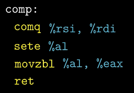 

根据寄存器使用的惯例，参数a存放在寄存器`rdi`中，参数b存放在寄存器`rsi`中。

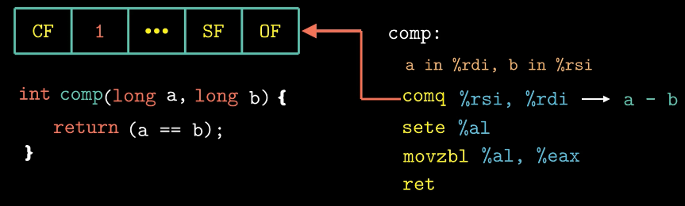 

根据 a - b 结果设置条件码寄存器，当a和b的值相等时，指令`cmp`会将零标志位设置为1。

接下来的这条指令`sete`看起来就有点费解了，这是因为通常情况下，并不会直接去读条件码寄存器。其中一种方式是根据条件码的某种组合，通过`set`类指令，将一个字节设置为0或者1。 在这个例子中，指令`sete`根据零标志(ZF)的值对寄存器`al`进行赋值，后缀e是equal的缩写。如果零标志等于1，指令`sete`将寄存器`al`置为1；如果零标志等于0，指令`sete`将寄存器`al`置为0。

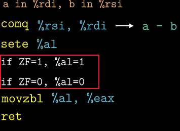 

然后`mov`指令对寄存器`al`进行零扩展，最后返回判断结果。

下面看一个复杂的例子：

```c
int comp(char a, char b){
	return (a < b);
}
```

转成汇编指令如下：

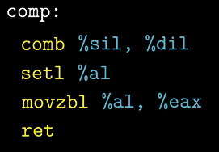 

对比前面相等的情况，可以发现指令有些不同。`sete`变成了指令`setl`，指令`setl`的含义是如果a小于b，将寄存器`al`设置为1，其中后缀l是less的缩写，表示"在小于时设置"，而不是表示大小long word，这里特别注意一下。

相对于相等的情况，判断小于的情况要稍微复杂一点。需要根据符号标志(SF)和溢出标志(OF)的异或结果来判定。

两个有符号数相减，当没有发生溢出时，如果a小于b，结果为负数，那么符号标志(SF)被置为1；如果a>b，结果为正数，那么符号标志(SF)就不会被置1。

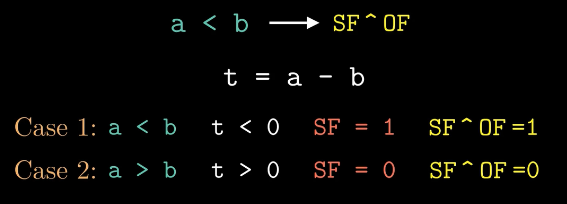 

那么是不是根据符号标志(SF)就能够给出判断结论了呢?我们来看一个例子。

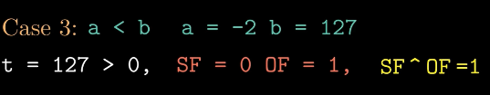 

溢出后，符号标志SF不会置1，但溢出标志OF会置1。因此仅仅通过符号标志无法判断a是否小于b。

  当a=1，b=-128，由于发生了正溢出，结果t=-127，虽然a>b，但是由于溢出导致了结果t小于0，此时符号标志(SF)和溢出标志(OF)都会被置为1。

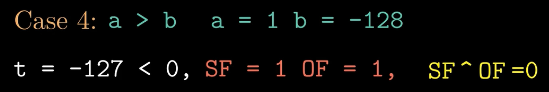 

综合上述所有的情况，根据符号标志(SF)和溢出标志(OF)的异或结果，可以对a小于b是否为真做出判断。

对于其他判断情况，都可以通过条件码的组合来实现。

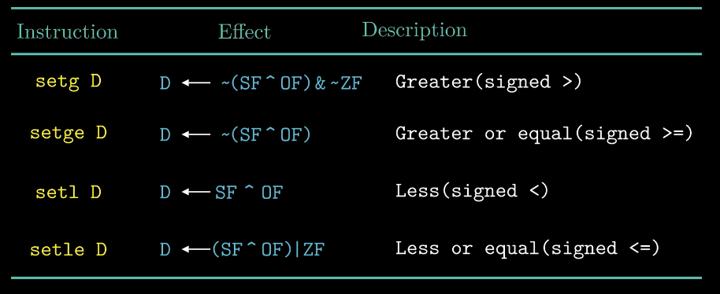 

虽然看上去相对复杂一点，不过原理都是一致的。

对于无符号数的比较情况，需要注意一下，指令cmp会设置进位标志，因而针对无符号数的比较，采用的是进位标志和零标志的组合，具体的条件码组合如图所示。

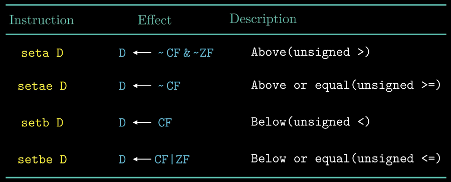 

关于这些条件码的组合并不需要去记住，了解条件语句的底层实现，这对我们深入理解整个计算机系统会有一定的帮助。

## 5.3跳转指令

首先我们看一段C代码：

```c
long absdiff_se(long x, long y){
	long result;
	if(x < y){
		result = y - x;
	}else{
		result = x - y;
	}
	return result;
}
```

这段C代码对应的汇编指令如图所示：

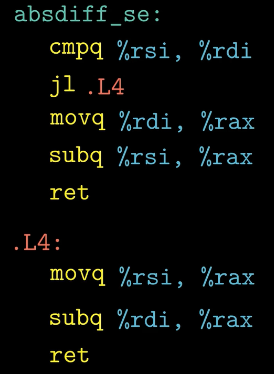 

条件语句x小于y由指令`cmp`来实现，指令`cmp`会根据(x-y)的结果来设置符号标志(SF)和溢出标志(OF)。

图中的跳转指令`jl`，根据符号标志(SF）和溢出标志(OF)的异或结果来判断究竟是顺序执行，还是跳转到L4处执行。

当x大于y时，指令顺序执行，然后返回执行结果，L4处的指令不会被执行；       当x小于y时，程序跳转到L4处执行，然后返回执行结果。

跳转指令会根据条件寄存器的某种组合来决定是否进行跳转。

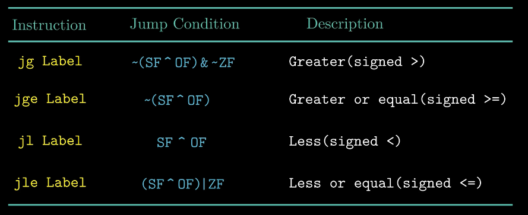 

## 5.4跳转指令的编码

对于5.3代码中的if-else语句，当满足条件时，程序洽着一条执行路径执行，当不满足条件时，就走另外一条路径。这种机制比较简单和通用，但是在现代处理器上，它的执行效率可能会比较低。

针对这种情况，有一种替代的策略，就是使用数据的条件转移来代替控制的条件转移。

还是针对两个数差的绝对值问题，给出了另外一种实现方式，具体如下所示。

```c
long comvdiff_se(long x, long y){
	long rval = y - x;
	long eval = x - y;
	long ntest = x >= y;
	if(ntest){
		rval = eval;
	}
	return rval;
}
```

我们既要计算y-x的值，也要计算x-y的值，分别用两个变量来记录结果，然后再判断x与y的大小，根据测试情况来判断是否更新返回值。这两种写法看上去差别不大，但第二种效率更高。第二种代码的汇编指令如下所示。

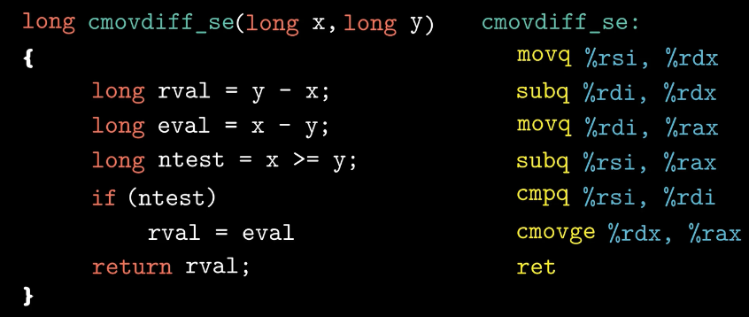 

前面这几条指令都是普通的数据传送和减法操作。`cmovge`是根据条件码的某种组合来进行有条件的传送数据，当满足规定的条件时，将寄存器`rdx`内的数据复制到寄存器`rax`内。在这个例子中，只有当x大于等于y时，才会执行这一条指令。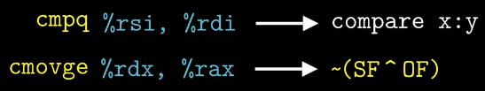 

更多条件传送指令如图所示。

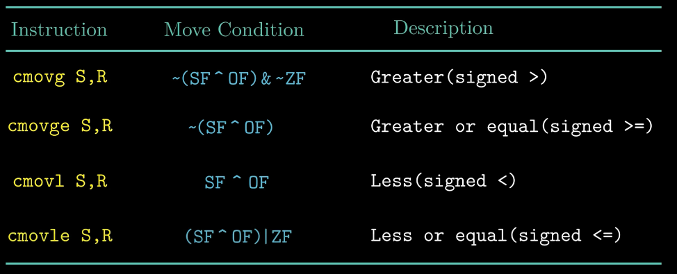 

为什么基于条件传送的代码会比基于跳转指令的代码效率高呢？这里涉及到现代处理器通过流水线来获得高性能。当遇到条件跳转时，处理器会根据分支预测器来猜测每条跳转指令是否执行，当发生错误预测时，会浪费大量的时间，导致程序性能严重下降。

## 5.5循环

C语言中提供了三种循环结构，即do-while、while 以及for语句，汇编语言中没有定义专内的指令来实现循环结构，循环语句是通过条件测试导跳转的结合来实现的。

接下来，我们分别用这三种循环结构来实现N的阶乘。

### 5.5.1do…while

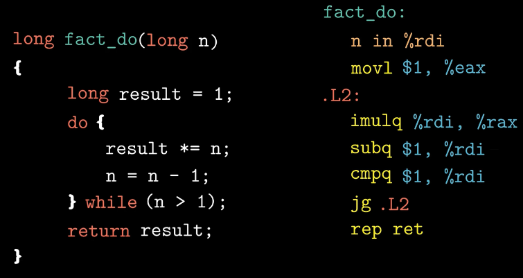 

我们可以发现指令`cmp`与跳转指令的组合实现了循环操作。

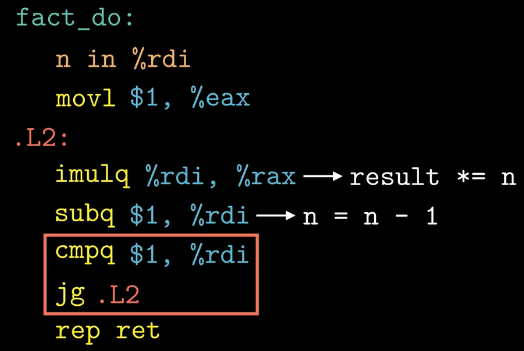 

当n大于1时，跳转到L2处执行循环，直到n的值减小到1，循环结束。

### 5.5.2while

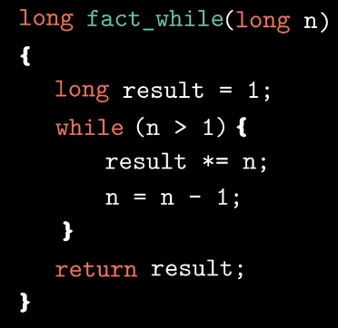 

对比do-while循环和while循环的实现方式，我们可以发现这两种循环的差别在于，N大于1这个循环测试的位置不同。

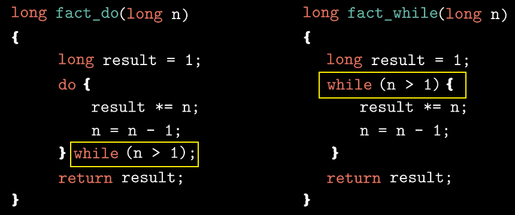 

do-while循环是先执行循环体的内容，然后再进行循环测试，while循环则是先进行循环测试，根据测试结果是否执行循环体内容。

### 5.5.3for

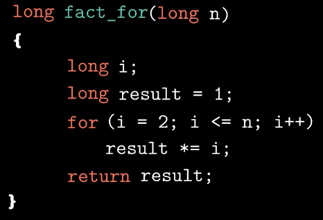 

图中的C代码采用了最自然的方式，从2一直乘到n，这与之前do-while循环以及wh
不的实现代码有较大的差别。

我们将这个for循环转换成while循环：

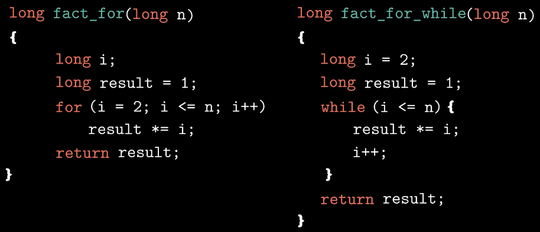 

对比for循环和while循环产生的汇编代码。

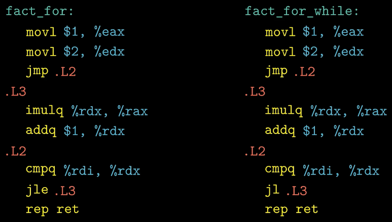 

可以发现除了这一句跳转指令不同，其他部分都是一致的

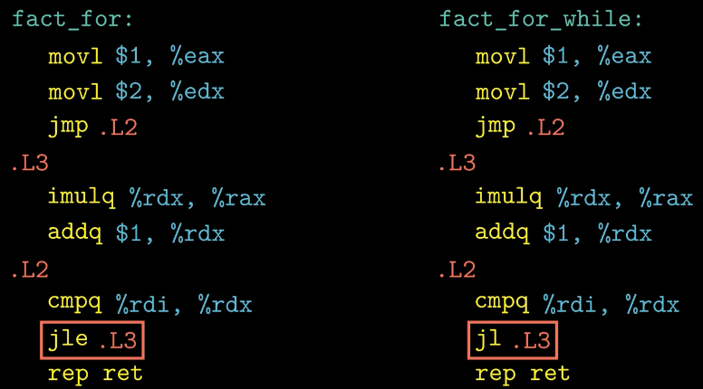 

需要注意一下这两个汇编代码是采用`-Og`选项产生的。

综上所述，三种形式的循环语句都是通过条件测试和跳转指令来实现。

## 5.6switch语句

C语言还提供了switch语句，它可以根据一个整数索引值进行多重的分支

```c
void switch_eg(long x, long n, long *dest){
	long val = x;
	switch(n){
		case 0:
			val *= 13;
			break;
		case 2:
			val += 10;
			break;
		case 3:
			val += 11;
			break;
		case 4:
		case 6
			val += 11;
			break;
		default:
			val = 0;
	}
	*dest = val;
}
```

在针对一个测试有多种可能的结果时，switch语言特别有用，switch语句通过跳转表这种数据结构，使得实现更加的高效。接下来我们看看所对应的汇编指令。

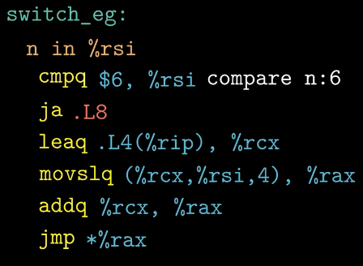 

指令`cmp`判断参数n与立即数6的大小，如果n大于6，程序跳转到default对应的L8程序段。case0~case6的情况，可以通过跳转表来访问不同分支。C代码将跳转表声明为一个长度为7的数组，每个元素都是一个指向代码位置的指针，具体对应关系如图所示.：

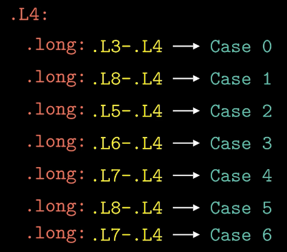 

数组的长度为7，是因为需要覆盖Case0~Case6的情况，对重复的情况case4和case6，使用相同的标号。

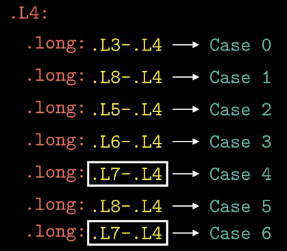 

对于缺失的case1和case5的情况，使用默认情况的标号。

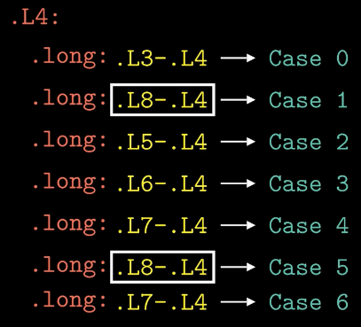 

在这个例子中，程序使用跳转表来处理多重分支，甚至当switch有上百种情况时，虽然跳转表的长度会增加，但是程序的执行只需要一次跳转也能处理复杂分支的情况，与使用一组很长的if-else相比，**使用跳转表的优点是执行switch语句的时间与case的数量是无关的**。因此在处理多重分支的时，与一组很长的if-else相比，switch的执行效率要高。

# 6过程

在大型软件的构建过程中，需要对复杂功能进行切分，过程提供了一种封装代码的方式，它可以隐藏某个行为的具体实现，同时提供清晰简洁的接口定义，在不同的编程语言中，过程的具体实现又是多种多样的。例如C语言中的函数，Java语言中的方法等。

接下来，我们以C语言中的函数调用为例，介绍一下过程的机制，为了方便讨论，假设函数P调用函数Q，函数O执行完返回函数P，这一系列操作包括图中的一个或者多个机制。

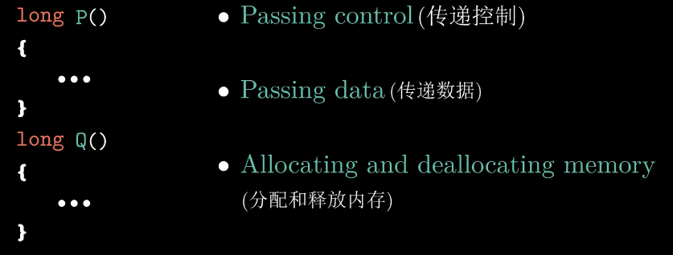 

## 6.1运行时栈

程序的运行时内存分布中，栈为函数调用提供了后进先出的内存管理机制。

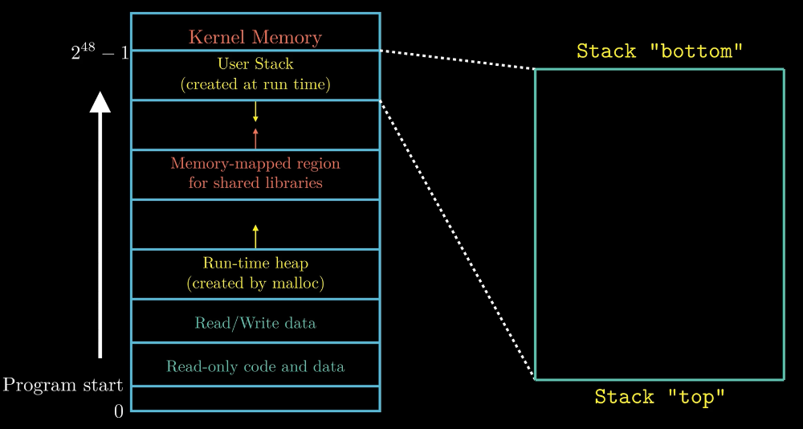 

在函数`P`调用函数`Q`的例子中，当函数`Q`正在执行时，函数P以及相关调用链上的函数都会被暂时挂起。

我们先来介绍一下栈帧的概念，当函数执行所需要的存储空间超出寄存器能够存放的大小时，就会借助栈上的存储空间，我们把这部分存储空间称为函数的栈帧。对于函数`P`调用函数`Q`的例子，包括**较早的帧**、**调用函数P的帧**，还有**正在执行函数`Q`的帧**，具体如图所示：

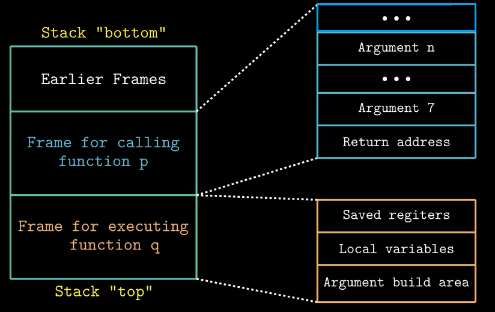 

## 6.2转移控制

函数`P`调用函数`Q`时，会把返回地址压入栈中，该地址指明了当函数`Q`执行结束返回时要从函数`P`的哪个位置继续执行。这个返回地址的压栈操作并不是由指令`push`来执行的，而是由函数调用`call`来实现的。

以`main`函数调用`multstore`函数为例来解释一下指令`call`和指令`ret`的执行情况

main.c

```c
#include<stdio.h>

void multstore(long, long, long *);

int main(){
	long d;
	mulstore(2, 3, &d);
	printf("2 * 3 --> %d\n", d);
	return 0;
}

long mult2(long a, long b){
	long s = a * b;
	return s;
}
```

mstore.c

```c
long mult2(long, long);

void multstore(long x, long y, long *dest){
	long t = mult2(x, y);
	*dest = t;
}
```

由于涉及地址的操作，我们需要查看这两个函数的反汇编代码。

```shell
linux> gcc -Og -o prog main.c mstore.c
linux> objdump -d proc
```

节选了相关的部分的反汇编代码，具体如图所示：

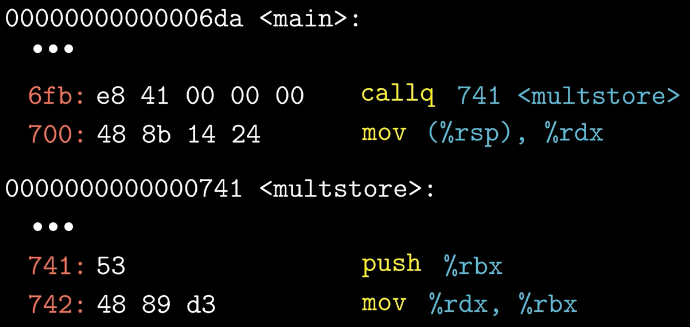 

这一条`call`指令对应`multstore`函数的调用。

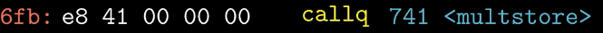 

指令`call`不仅要将函数`multstore`的第一条指令的地址写入到程序指令寄存器`rip`中，以此实现函数调用。

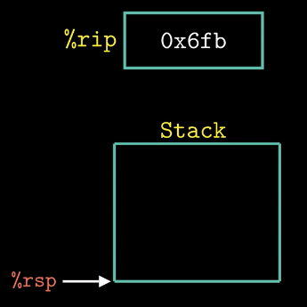 

同时还要将返回地址压入栈中。

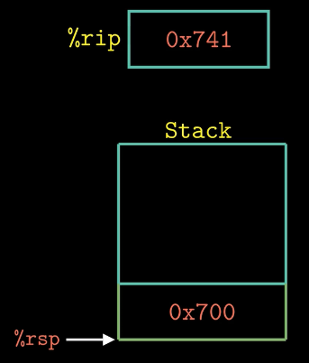 

这个返回地址就是函数`multstore`调用执行完毕后，下一条指令的地址。

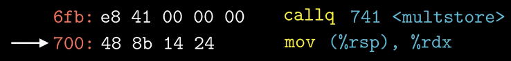 

当函数`multstore`执行完毕，指令`ret`从栈中将返回地址弹出，写入到程序指令寄存器`rip`中。

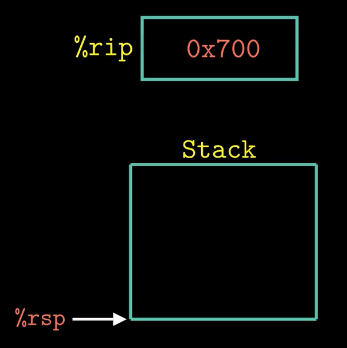 

函数返回，继续执行`main`函数中相关的操作。以上整个过程就是函数调用与返回所涉及的操作。

## 6.3数据传送

说完了返回地址，再来看一下参数传递，如果一个函数的参数数量大于6，超出的部分就要通过栈来传递。假设函数`P`有n个整型参数，当n的值大于6时，参数7参数n需要用到栈来传递。

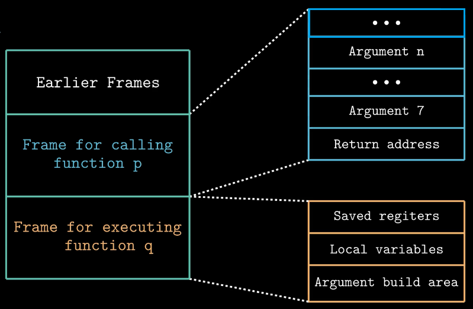 

参数1参数6的传递可以使用对应的寄存器。

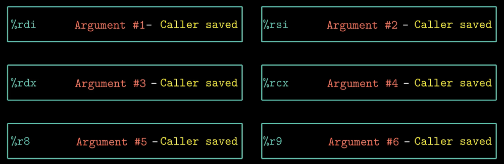 

例如一段代码如下：

```c
void proc(long a1, long *a1p,
		int a2, long *a2p,
		short a3, long *a3p,
		char a4, long *a4p){
	a1p += a1;
	a2p += a2;
	a3p += a3;
	a4p += a4;
}
```

代码中函数有8个参数，包括字节数不同的整数以及不同类型的指针，参数1到参数6是通过寄存器来传递，参数7和参数8是通过栈来传递。

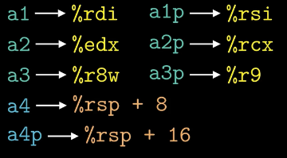 

这里有两点需要注意一下：

1、通过栈来传递参数时，所有数据的大小都是向8的倍数对齐，虽然变量a4只占一个字节，但是仍然为其分配了8个字节的存储空间。由于返回地址占用了栈顶的位置，所以这两个参数距离栈顶指针的距离分别为8和16。

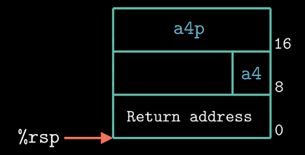 

2、使用寄存器进行参数传递时，寄存器的使用是有特殊顺序规定的，此外，寄存器名字的使用取决于传递参数的大小。如果第一个参数大小是4字节，需要用寄存器`edi`来保存。

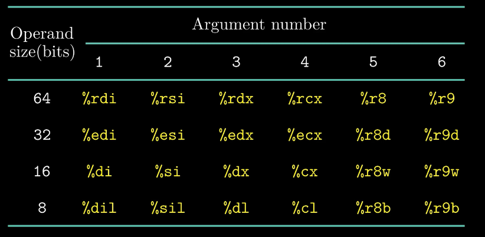 

## 6.4栈上的局部存储

当代码中对一个局部变量使用地址运算符时，我们需要在栈上为这个局部变量开辟相应的存储空间，接下来我们看一个与地址运算符相关的例子。

```c
long caller(){
	long arg1 = 534;
	long arg2 = 1057;
	long sum = swap(&arg1, &arg2);
	long diff = arg1 - arg2;
	return sum * diff;
}
```

函数`caller`定义了两个局部变量arg1和arg2，函数`swap`的功能是交换这两个变量的值，最后返回二者之和。

```c
long swap(long *xp, long * yp){
	long x = *xp;
	long y = *yp;
	*xp = y;
	*yp = x;
	return x + y;
}
```

我们通过分析函数`caller`的汇编代码来看一下地址运算符的处理方式。

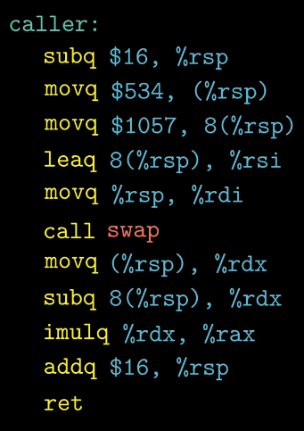 

8(%rsp)表示表示"获取堆栈上距离堆栈指针 %rsp 8 个字节的位置，然后获取该地址处的值。而lea是地址赋值，mov是地址值赋值。

第一条减法指令将栈顶指针减去16，它表示的含义是在栈上分配16个字节的空间，具体如图所示。

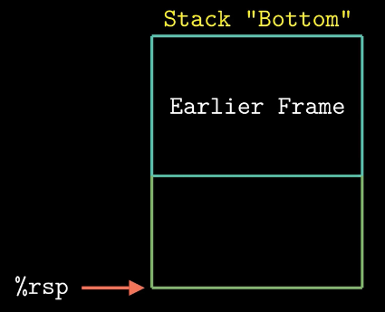 

根据接着的两条`mov`指令，可以推断出变量arg1和arg2存储在函数`caller`的栈帧上，接下来，分别计算变量arg1和arg2存储的地址，参数准备完毕，执行`call`指令调用`swap`函数。最后函数`caller`返回之前，通过栈顶指针加上16的操作来释放栈帧。

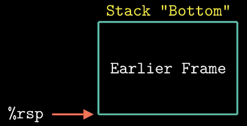 

我们再看一个稍微复杂的例子：

```c
long call_proc(){
	long x1 = 1;
	int x2 = 2;
	short x3 = 3;
	char x4 = 4;
	proc(x1, &x1, x2, &x2, x3, &x3, x4, &x4);
	return (x1 + x2) * (x3 - x4);
}
```

根据上面的C代码，我们来画一下这个函数的栈帧。

根据变量的类型可知x1占8个字节，x2占4个字节，x3占两个字节，x4占一个字节，因此，这四个变量在栈帧中的空间分配如图所示。

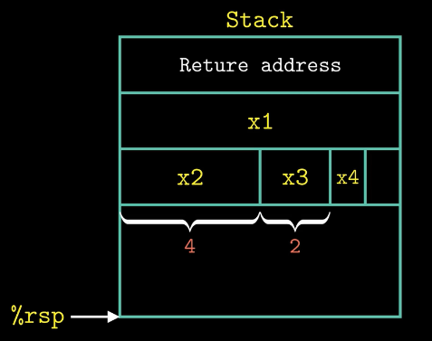 

由于函数`proc`需要8个参数，因此参数7和参数8需要通过栈帧来传递。注意，传递的参数需要8个字节对齐，而局部变量是不需要对齐的。

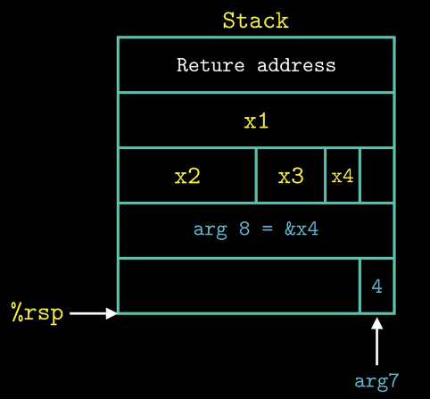 

从上面的例子我们可以看到，当函数运行需要局部存储空间时，栈提供了内存分配与回收的机制。在程序执行的过程中，寄存器是被所有函数共享的一种资源，为了避免寄存器的使用过程中出现数据覆盖的问题，处理器规定了寄存器的使用的惯例，所有的函数调用都必须遵守这个惯例。

## 6.5寄存器中的局部存储空间

对于16个通用寄存器，除了寄存器`rsp`之外，其他15个寄存器分别被定义为调用者保存和被调用者保存，具体如图所示。

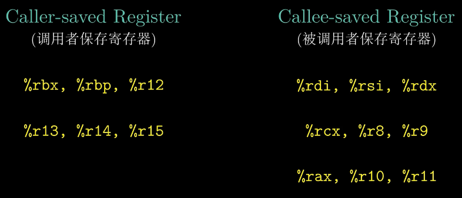 

接下来，我们看一个栈保存寄存器数值的例子。

```c
void P(long x,long y)
{
    long u = Q(y);
    long v = Q(x);
    return u + x ;
}
```

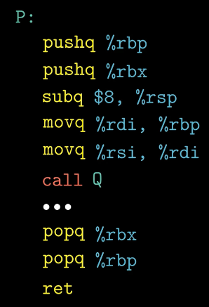 

由于函数`Q`需要使用寄存器`rdi`来传递参数，因此，函数`P`需要保存寄存器`rdi`中的参数x；保存参数x使用了寄存器`rbp`，根据寄存器使用规则，寄存器`rbp`被定义为被调用者保存寄存器，所以便有了开头的这条指令`pushq %rbp`，至于`pushq %rbx`也是类似的道理。

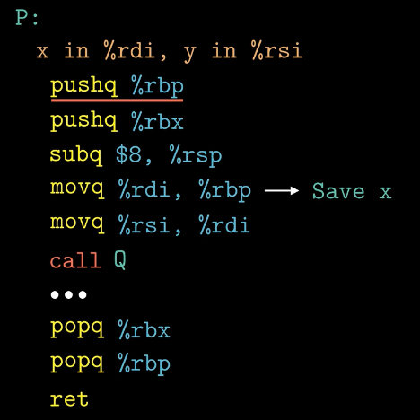 

在函数`P`返回之前，使用`pop`指令恢复寄存器`rbp`和`rbx`的值。由于栈的规则是后进先出，所以弹出的顺序与压入的顺序相反。

## 6.6递归过程

最后，我们再来看一个递归调用的例子。

```c
long rfact(long n)
{
    long result;
    if(n <= 1){
        result = 1
    }
    else{
        result = n * rfact(n-1);
    }
    return result;
} 
```

这段代码是关于N的阶乘的递归实现，我们假设n=3时，看一些汇编代码的执行情况。

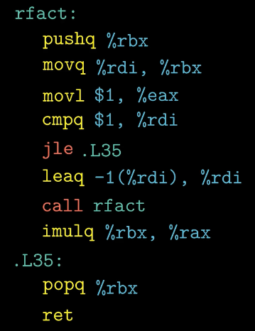 

由于使用寄存器`rbx`来保存n的值，根据寄存器使用惯例，首先保存寄存器`rbx`的值。

 

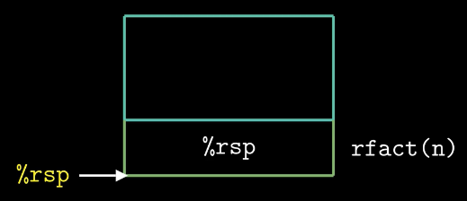 

由于n=3，所以跳转指令`jle`不会跳转到`L35`处执行。

指令`leaq`是用来计算n-1，然后再次调用该函数。

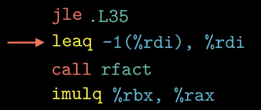 

注意，此时寄存器`rbx`内保存的值是3，指令`pushq`执行完毕后，栈的状态如图所示。

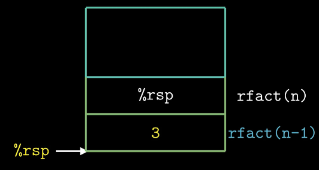 

继续执行，直到n=1时，程序跳转到L35处，执行`pop`操作。

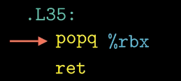 

可以看出，递归调用一个函数本身与调用其他函数是一样的，每次函数调用都有它自己私有的状态信息，栈分配与释放的规则与函数调用返回的顺序也是匹配的，不过当N的值非常大时，并不建议使用递归调用，至于原因应该是一目了然了。

# 7数组分配和访问

## 7.1基本形式

首先看几个数组的例子，数组A是由8个char类型的元素组成，每个元素的大小是一个字节。假设数组A的起始地址是Xa，那么数组元素A[i]的地址就是Xa+i。

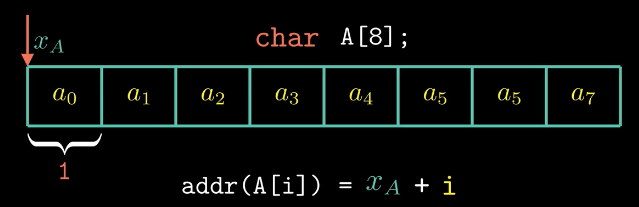 

我们再来看一个int类型的数组，数组B是由4个整数组成，每个元素占4个字节，因此数组B总的大小为16个字节。假设数组B的起始地址是Xb，那么数组元素B[i]的地址就是Xb+4i。

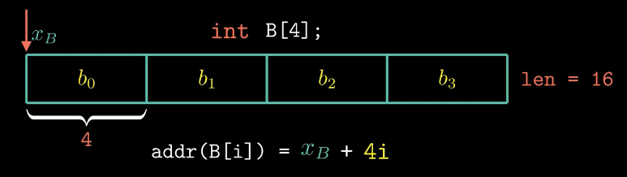 

## 7.2指针运算

在C语言中，允许对指针进行运算，例如，我们声明了一个指向char类型的指针p，和一个指向int类型的指针q。为了方便理解，我们还是把内存抽象成一个大的数组。假设指针p和指针q都指向0x100（内存地址）处。

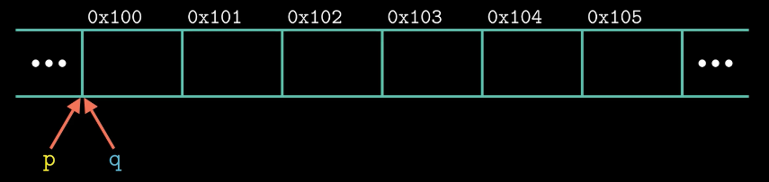 

现在分别对指针p和指针q进行加一的操作，指针p加1指向0x101处，而指针q加1后指向0x104处。

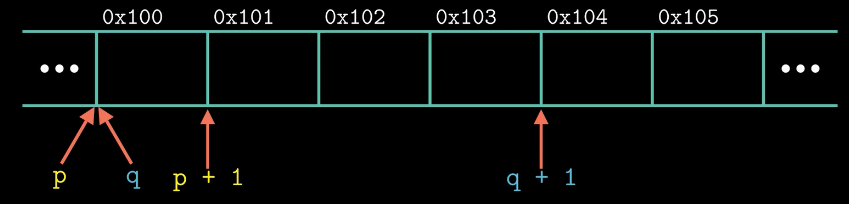 

虽然都是对指针进行加一的运算，但是得到的结果却不同。这是因为对指针进行运算时，计算结果会根据该指针引用的数据类型进行相应的伸缩。

接下来，我们看一个例子，我们定义了一个数组E，假设这个数组存放在内存中，对于数组的每一个元素都有两个属性，一个属性是它存储的内容，另外一个属性是它的存储地址，说白了就是它是啥，放在哪儿。对于元素的存储地址，可以通过取地址运算符来获得，具体如图所示。

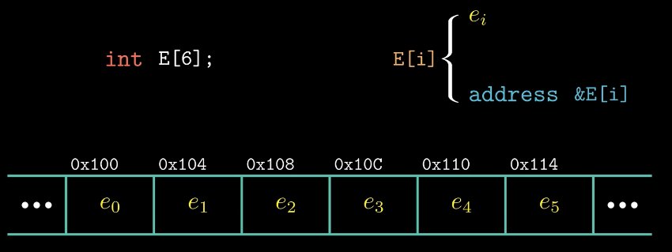 

通常我们习惯使用数组引用的方式来访问数组中的元素，例如可以使用图中的表达式来访问数组中的元素。

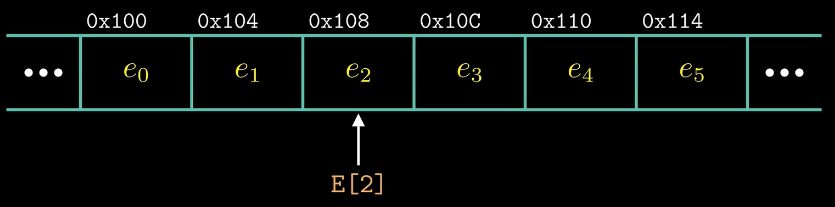 

除此之外，还有另外一种方式，具体如图所示，其中表达式E+2表示数组第二个元素的存储地址，大写字母E表示数组的起始地址(第0个元素)，此处加2的操作与指针加2的运算类似，也是与数据类型相关。

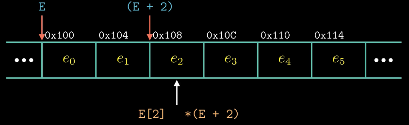 

指针运算符`*`可以理解成从该地址处取数据，指针是C语言中最难理解的部分，我们理解了内存地址的概念之后，可以发现指针其实就是地址的抽象表述。

## 7.3嵌套的数组

嵌套数组也被称为二维数组，图中我们声明了一个数组A，数组A可以被看成5行3列的二维数组，这种理解方式与矩阵的排列类似，具体如图所示。

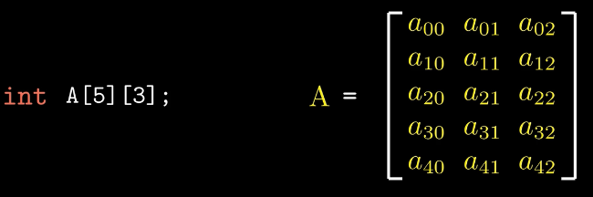 

在计算机系统中，我们通常把内存抽象为一个巨大的数组，对于二维数组在内存中是按照“行优先”的顺序进行存储的，基于这个规则，我们可以画出数组A在内存中的存储情况。

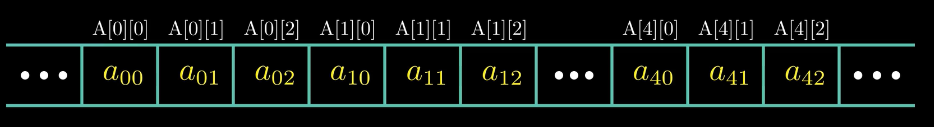 

关于数组的理解，还有一种方式，就是可以把数组A看成一个有5个元素的数组，其中每个元素都是一个长度为3的数组，这便是嵌套数组的理解方式。

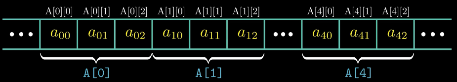 

无论用何种方式来理解，数组元素在内存中的存储位置都是一样的。

下面我们来看一下数组元素的地址是如何计算的，对于数组D任意一个元素可以通过图中的计算公式来计算地址。

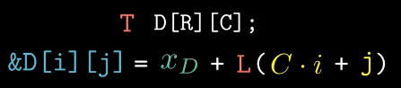 

其中，XD表示数组的起始地址；L表示数据类型T的大小，如果T是int类型，L就等于4，T是char类型，L就等于1；在具体的示例中，C、i、j都是常数。

根据图中的计算公式，对于5×3的数组A，其任意元素的地址可以Xa+ 4*(3i+j)）来计算。

假设数组起始地址Xa在寄存器`rdi`中，索引值i和j分别在寄存器`rsi`和`rdx`中，我们可以用图中的汇编代码将A\[i][j]的值复制到寄存器`eax`中，具体如图所示。

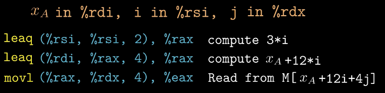 

## 7.4定长数组

编译器对定长多维数组的优化。

首先使用图中的方式将数据类型`fix_matrix`声明为16*16的整型数组。

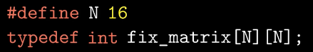 

通过`define`声明将N与常数16关联到一起，之后的代码中就可以使用N来代替常数16，当需要修改数组的长度时，只需要简单的修改`define`声明即可。

```c
#define N 16
typedef int fix_matrix[N][N]

int matrix(fix_matrix A, fix_matrix B, long i, long k){
	long j;
	int result = 0;
	for(j = 0; j < N; j++){
		result += A[i][j] * B[j][k];
	}
	return result;
}
```

这段代码是用来计算矩阵A的第i行与矩阵B的第k列的内积，为了方便描述，矩阵下标与代码下标并不匹配，仅为辅助理解的示意图。

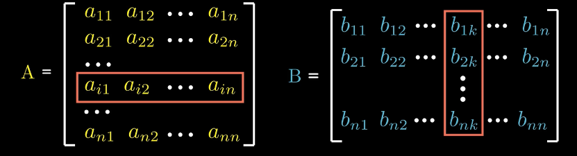 

接下来，我们看一下如何使用汇编代码访问数组元素。由于编译器对相关的操作进行了优化，因此，这段汇编代码有些晦涩难懂。

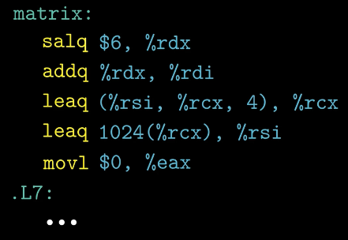 

在进行循环操作之前，前四行代码是用来计算三个数组元素的地址，一个是数组A第i行首个元素的地址，另外两个分别是数组B第k列的第一个元素和最后一个元素的地址，然后将这三个地址分别存放到不同的寄存器中，具体如图所示。

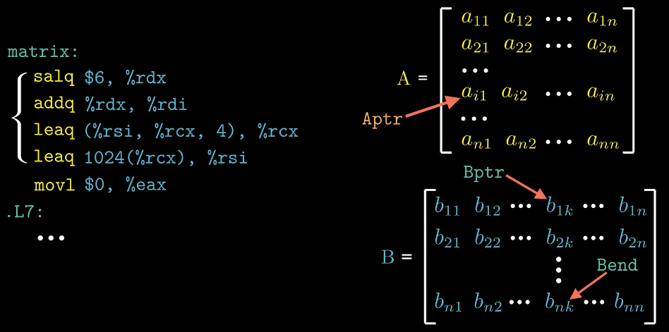 

为了方便表述，这里我们引入三个指针来记录这三个地址，接下来，我们介绍一下循环的实现。

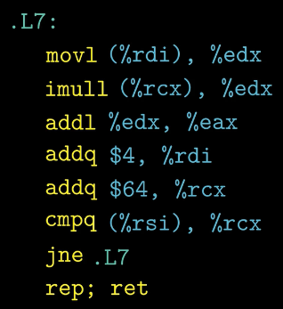 

首先读取指针Aptr指向元素的数据，然后将指针Aptr指向的元素与指针Bptr指向的元素相乘，最后将乘积结果进行累加，结果保存到寄存器`eax`中。

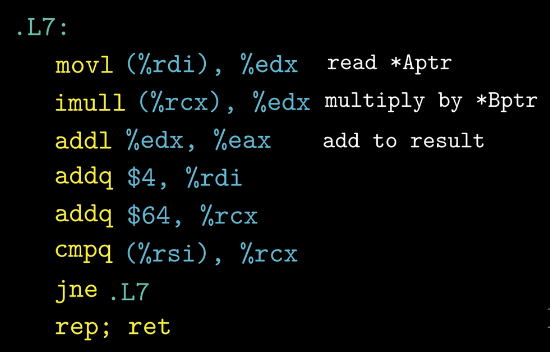 

计算完成之后，分别移动指针Aptr和Bptr指向下一个元素，由于int类型占4个字节，对寄存器`rdi`加4的这个操作，对应于移动指针Aptr指向数组A的下一个元素。由于数组B一行元素的数量为16个，每个元素占4个字节，因此相邻列元素的地址相差为64个字节，对寄存器`rcx`进行加64的操作对应移动指针Bptr指向数组B的下一个元素。

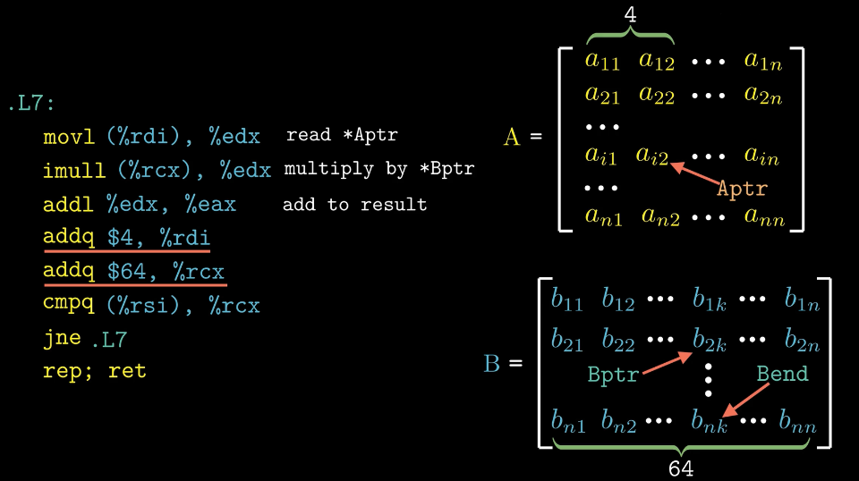 

判断循环结束的条件是：指针Bptr指针与指针Bend是否指向同一个内存地址，如果二者不相等，继续跳转到L7处执行，如果二者相等，循环结束。

 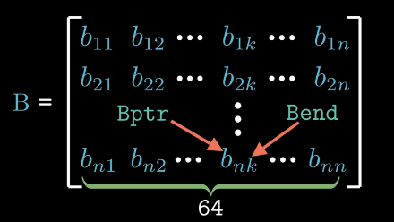 

通过这段汇编代码，我们可以发现，编译器使用了很巧妙的方式来计算数组元素的地址，这些优化方法显著的提升了程序的执行效率。

## 7.5变长数组

在C89的标准中，程序员在使用变长数组时需要使用`malloc`这类函数，为数组动态分配存储空间。在ISO C99的标准中，引入了变长数组的概念，因此，我们可以通过下列代码的方式来声明一个变长数组。

```c
int A[expr1][expr2];

long var_ele(long n, int A[n][n], long i, long k){
	return A[i][j];
}
```

它可以作为一个局部变量，也可以作为函数的参数，当变长数组作为函数参数时，参数n必须在数组A之前。通过比数组更早的传入参数n，以此来控制数组的长度。

变长数组元素的地址计算与定长数组类似，不同点在于新增了参数n，需要使用乘法指令来计算n乘以i。

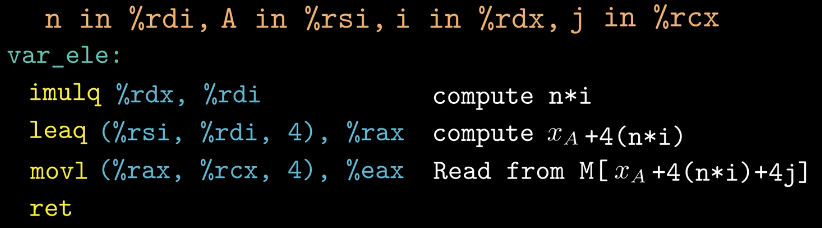 

还是矩阵A和矩阵B内积的例子，如果采用变长数组来存储矩阵A和矩阵B，与定长数组相比C代码的实现几乎没有差别。

```c
int var_mat(long n, int A[n][n], int B[n][n], long i, long k){
	long j;
	int result = 0;
	for (j=0; j <N; j++){
		result += A[i][j] * B[j][k];
	}
	return result;
}
```

不过对比二者的汇编代码，可以发现编译器采用了不同的优化方法。

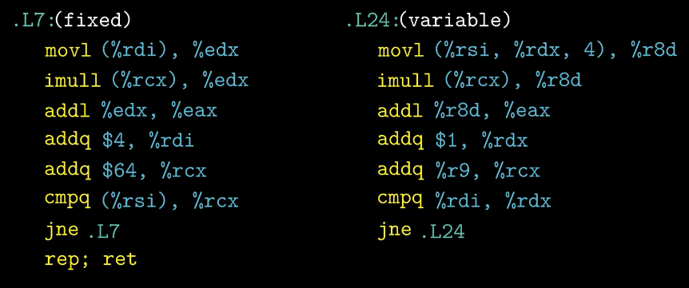 

无论是采用何种优化方法，都显著的提高了程序的性能。

# 8异质的数据结构

## 8.1结构体

首先我们来看结构体的声明。

```c
struct rec{
	int i;
	int j;
	int a[2];
	int *p;
}
```

这个结构体包含四个字段：两个int类型的变量，个int类型的数组和一个int类型的指针。

我们可以画出各个字段相对于结构体起始地址处的字节偏移。

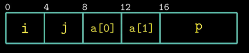 

从这个图上可以看出数组a的元素是嵌入到结构体中的。接下来，我们看一下如何访问结构体中的字段。

例如，我们声明一个结构体类型指针变量r，它指向结构体的起始地址。

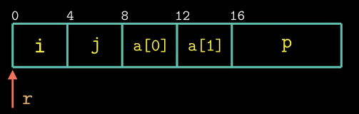 

假设r存放在寄存器`rdi`中，可以使用下图的汇编指令将字段`i`的值复制到字段`j`中。

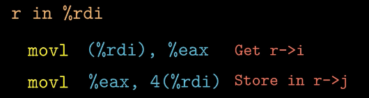 

首先读取字段i的值，由于字段`i`相对于结构体起始地址的偏移量为0，所以字段`i`的地址就是r的值，而字段j的偏移量为4，因此需要将r加上偏移量4。

对于结构体中的数组a，可以通过下图的指令来计算任意一个数组元素的地址。

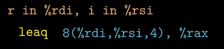 

其中结构体指针r存放在寄存器`rdi`中，数组元素的索引值i存放在寄存器`rsi`中，最后地址的计算结果，存放在寄存器`rax`中。

综上所述，无论是单个变量还是数组元素，都是通过起始地址加偏移量的方式来访问。

## 8.2数据对齐

对于下面的结构体，它包含两个int类型的变量和一个char类型的变量。

```c
struct S1{
    int i;
    char c;
    int j;
};
```

根据前面的知识，我们会直观的认为该结构体占用9个字节的存储空间，但是当使用`sizeof`函数对该结构体的大小进行求值时，得到的结果却是12个字节。原因是为了提高内存系统的性能，系统对于数据存储的合法地址做出了一些限制。

例如变量`j`是int类型，占4个字节，它的起始地址必须是4的倍数，因此，编译器会在变量c和变量j之间插入一个3字节的间隙，这样变量j相对于起始地址的偏移量就为8，整个结构体的大小就变成了12个字节。

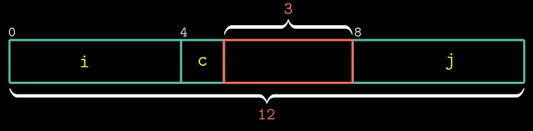 

对于不同的数据类型，地址对齐的原则是任何K字节的基本对象的地址必须是K的倍数。也就是说对于short类型，起始地址必须是2的倍数；对于占8个字节的数据类型，起始地址必须是8的倍数。

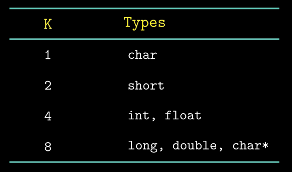 

基于图中的规则，编译器可能需要在字段的地址空间分配时插入间隙，以此保证每个结构体的元素都满足对齐的要求。

除此之外，结构体的末尾可能需要填充间隙，还是刚才的这个结构体，可以通过调整字段j和字段c的排列顺序，使得所有的字段都满足了数据对齐的要求。

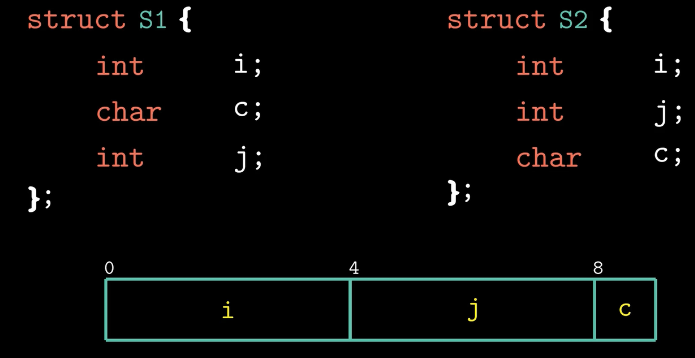 

但是当我们声明一个**结构体数组**时，分配9个字节的存储空间，是无法满足所有数组元素的对齐要求，因此，编译器会在结构体的末端增加3个字节的填充，这样一来，所有的对齐限制都满足了。

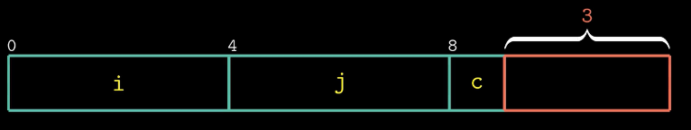 

根据上述对齐原则，我们看一个复杂的示例。

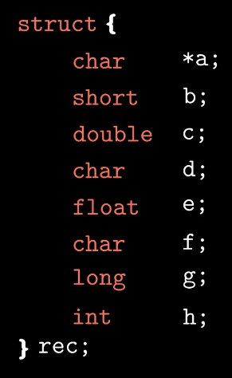 

对于图中的这个结构体，可以画出所有字段起始地址的偏移量。

  1、变量a是一个指针变量，占8个字节。

  2、变量b是short类型，占两个字节，它起始地址的字节偏移量是8，满足对齐规则的2的倍数。

  3、由于变量c是double类型，占8个字节，因此，该变量起始地址的偏移量需要是8的倍数，所以需要在变量b之后插入6个字节的间隙。

  4、对于变量d只占一个字节，顺序排列即可。

  5、由于变量e占4个字节，它的偏移量需要是4的倍数，因此，需要在变量d之后插入3个字节的间隙。

  6、同样变量f是char类型，顺序排列即可。

  7、由于变量g占8个字节，因此需要在变量f之后插入7个字节的间隙。

  8、最后一个变量h占4个字节，此时结构体的大小为52个字节，为了保证每个元素都满足对齐要求，还需要在结构体的尾端填充4个字节的间隙。

最终结构体的大小为56个字节，具体排列如图所示。

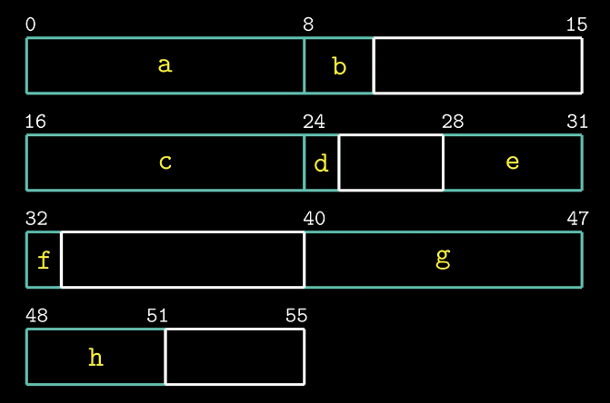 

此外，关于更多情况的数据对齐情况，还需要针对不同型号的处理器以及编译系统进行具体分析。

##  8.3联合体

与结构体不同，联合体中的所有字段共享同一存储区域，因此联合体的大小取决于它最大字段的大小。

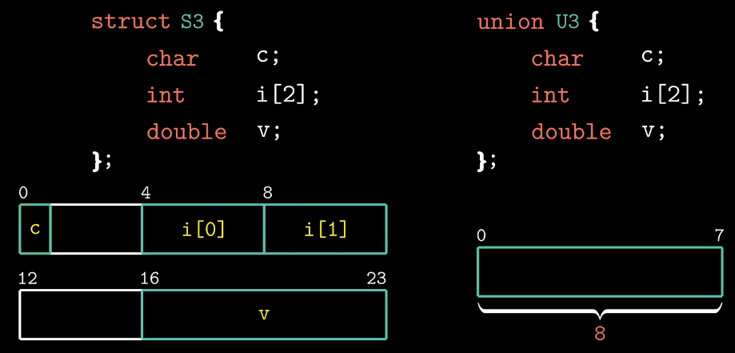 

变量`v`和数组`i`的大小都是8个字节，因此，这个联合体的占8个字节的存储空间。

联合体的一种应用情况是：我们事先知道**两个不同字段的使用是互斥**的，那么我们可以将这两个字段声明为一个联合体。原理就是不会让不可能有数据的字段白白浪费内存。

例如，我们定义一个二叉树的数据结构，这个二叉树分为内部节点和叶子节点，其中每个内部节点不含数据，都有指向两个孩子节点的指针， 每个叶子节点都有两个double类型的数据值。

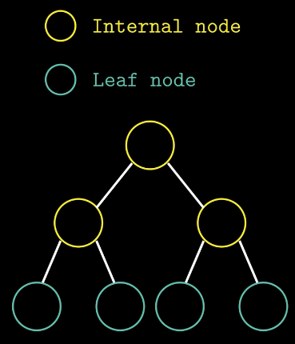 

我们可以用结构体来定义该二叉树的节点。

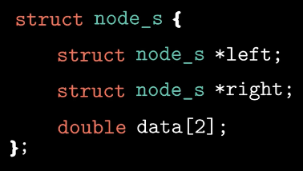 

那么每个节点需要32个字节，由于该二叉树的特殊性，我们事先知道该二叉树的任意一个节点不是内部节点就是叶子节点，因此，我们可以用联合体来定义节点，具体如图所示。

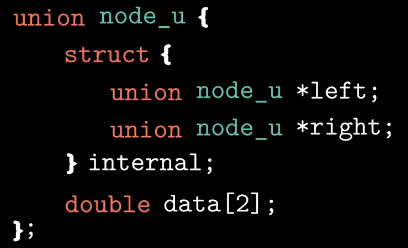 

这样，每个节点只需要16个字节的存储空间，相对于结构体的定义方式，可以节省一半的空间。不过，这种编码方式存在一个问题，就是没有办法来确定一个节点到底是叶子节点还是内部节点，通常的解决方法是引入一个枚举类型，然后创建一个结构体，它包含一个标签和一个联合体，具体如图所示。

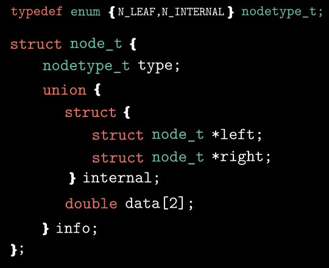 

其中type占4个字节，联合体占16个字节，type和联合体之间需要加入4个字节的间隙，因此，整个结构体的大小为24个字节。

在这种例子中，虽然使用联合体可以节省存储空间，但是相对于给代码编写造成的麻烦，这样的节省意义不大。因此，对于有较多字段的情况，使用联合体带来的**空间节省**才会更吸引人。

除此之外，联合体还可以用来访问不同数据类型的位模式，当我们使用简单的强制类型转换，将double类型的数据转换成unsigned long类型时，除了d等于0的情况，二者的二进制位表示差别很大，这时我们可以将这两种类型的变量声明为一个联合体，这样就是可以以一种类型来存储，以另外一种类型来访问，变量u和d就具有相同的位表示。

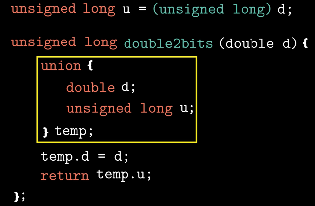 

虽然我们平时编程很少用到联合体，但是在一些特殊的场景中仍旧可以看到它的身影。

# 9缓冲区溢出

我们通过一个代码示例看一下什么是缓冲区溢出。

```c
void echo(){
	char buf[8];
	gets(buf);
	puts(buf);
}
```

`echo`函数声明了一个长度为8的字符数组。`gets`函数是C语言标准库中定义的函数，它的功能是从标准输入读入一行字符串，在遇到回车或者某个错误的情况时停止，`gets`函数将这个字符串复制到参数buf指明的位置，并在字符串结束的位置加上null字符。注意`gets`函数会有一个问题，就是它无法确定是否有足够大的空间来保存整个字符串，长一些字符串可能会导致栈上的其他信息被覆盖，通过汇编代码，我们可以发现实际栈上分配了24个字节的存储空间。

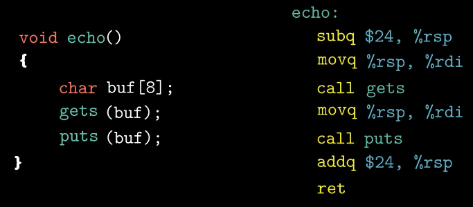 

为了方便表述，我们将栈的数据分布画了出来，其中字符数组位于栈顶的位置。

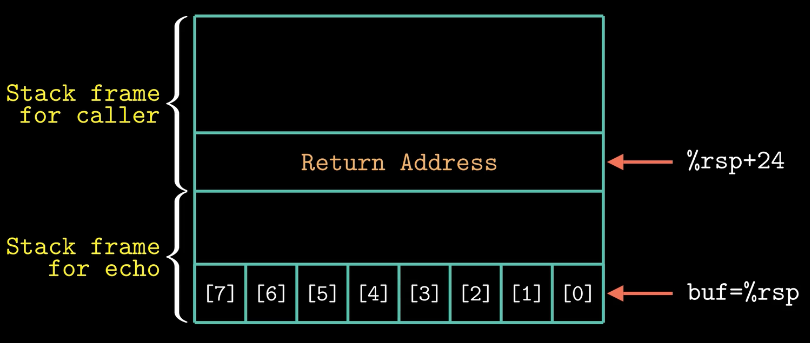 

实际上当输入字符串的长度不超过23时，不会发生严重的后果，超过以后，返回地址以及更多的状态信息会被破坏，那么返回指令会导致程序跳转到一个完全意想不到的地方。

历史上许多计算机病毒就是利用缓冲区溢出的方式对计算机系统进行攻击的，针对缓冲区溢出的攻击，现在编译器和操作系统实现了很多机制，来限制入侵者通过这种攻击方式来获得系统控制权。

例如**栈随机化**、**栈破坏检测**以及**限制可执行代码区域**等。

## 9.1栈随机化

```c
int main(){
	long local;
	printf("local at %p\n", &local);
	return 0;
}
```

在过去，程序的栈地址非常容易预测，如果一个攻击者可以确定一个web服务器所使用的栈空间，那就可以设计一个病毒程序来攻击多台机器，栈随机化的思想是栈的位置在程序每次运行时都有变化，上面这段代码只是简单的打印main函数中局部变量local的地址，每次运行打印结果都可能不同。

在64位Linux系统上，地址的范围： 0x7fff0001b698~0x7ffffffaa4a8。因此，采用了栈随机化的机制，即使许多机器都运行相同的代码，它们的栈地址也是不同的。

在Linux系统中，栈随机化已经成为标准行为，它属于地址空间布局随机化的一种，简称ASLR，采用ASLR，每次运行时程序的不同部分都会被加载到内存的不同区域，这类技术的应用增加了系统的安全性，降低了病毒的传播速度。

## 9.2栈破坏检测

编译器会在产生的汇编代码中加入一种栈保护者的机制来检测缓冲区越界，就是在缓冲区与栈保存的状态值之间存储一个特殊值，这个特殊值被称作金丝雀值，之所以叫这个名字，是因为从前煤矿工人会根据金丝雀的叫声来判断煤矿中有毒气体的含量。

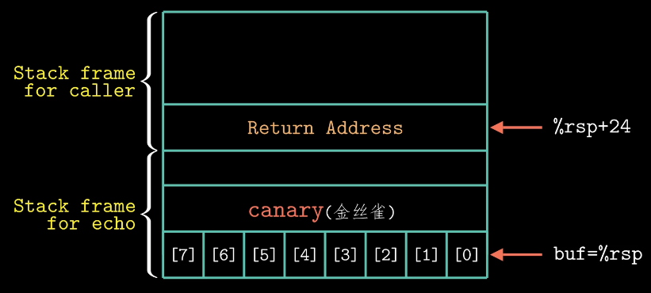 

金丝雀值是每次程序运行时随机产生的，因此攻击者想要知道这个金丝雀值具体是什么并不容易，在函数返回之前，检测金丝雀值是否被修改来判断是否遭受攻击。

接下来，我们通过汇编代码看一下编译器是如何避免栈溢出攻击的。

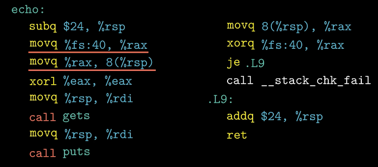 

图中这两行代码是从内存中读取一个数值，然后将该数值放到栈上，其中这个数值就是刚才提到的金丝雀值，存放的位置与程序中定义的缓冲区是相邻的。其中指令源操作数`%fs:40`可以简单的理解为一个内存地址，这个内存地址属于特殊的段，被操作系统标记为“只读”，因此，攻击者是无法修改金丝雀值的。

函数返回之前，我们通过指令`xor`来检查金丝雀值是否被更改。

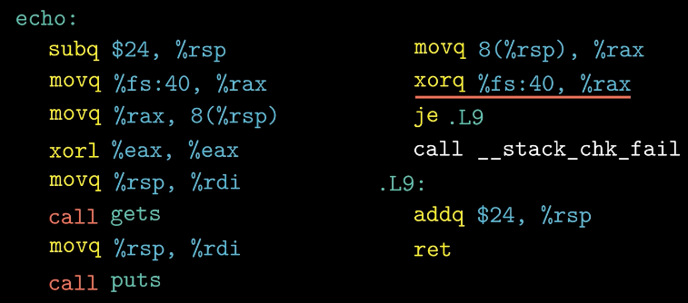 

如果金丝雀值被更改，那么程序就会调用一个错误处理例程，如果没有被更改，程序就正常执行。

## 9.3限制可执行代码区域

最后一种机制是消除攻击者向系统中插入可执行代码的能力，其中一种方法是限制哪些内存区域能够存放可执行代码。

以前，x86的处理器将可读和可执行的访问控制合并成一位标志，所以可读的内存页也都是可执行的，由于栈上的数据需要被读写，因此栈上的数据也是可执行的。

虽然实现了一些机制能够限制一些页可读且不可执行，但是这些机制通常会带来严重的性能损失，后来，处理器的内存保护引入了不可执行位，将读和可执行访问模式分开了。有了这个特性，栈可以被标记为可读和可写，但是不可执行。检查页是否可执行由硬件来完成，效率上没有损失。

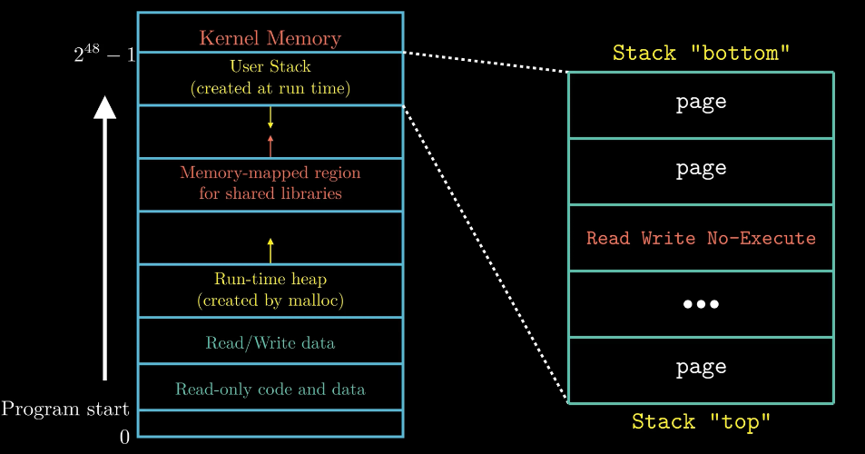 

以上这三种机制，都不需要程序员做任何额外的工作，都是通过编译器和操作系统来实现的，单独每一种机制都能降低漏洞的等级，组合起来使用会更加有效。

  不幸的是，仍然有方法能够对计算机进行攻击。
