# 1信息的存储

通常情况下，程序将内存视为一个非常大的数组，数组的元素是由一个个的字节组成，每个字节都由一个唯一的数字来表示，我们称为地址（address），这些所有的地址的集合就称为虚拟地址空间（virtual address space）。

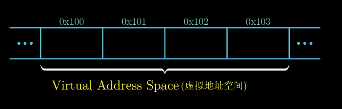 

**字节(byte)** 信息存储的基本单元

一个字节是有8个**位(bit)**组成，在二进制表示法中，每一个位的值可能有两种状态：0或者1。

当这8个位全为0时，表示一个字节的最小值；当这8个位全为1时，表示最大值。

如果用十进制来表示，那么一个字节的取值范围就在0~255(包含0和255）之间。

这种按照一位一位表示数据的方式称为位模式

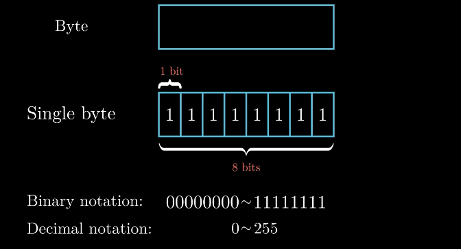 

## 1.1十六进制表示法

使用二进制表示法比较冗长，而十进制表示法与位模式之间的转换又比较麻烦。因此，我们引入十六进制数来表示位模式。

我们熟悉的十进制数，是由数字0到9组成的。对于十六进制数，则是由数字0到9和字母A到F来表示16个可能的数值。

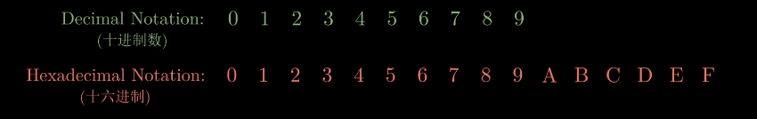 

在C语言中，十六进制数是以0x开头，这个x可以是小写，也可以是大写，其中字母部分，既可以全部是大写，也可以全部是小写，甚至是大小写混合也是正确的。

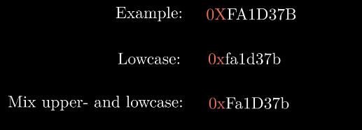 

有些时候，我们需要对数据进行不同进制的转换，二进制与十六进制的转换比较简单直接，数字之间的转换可以参照这张表。

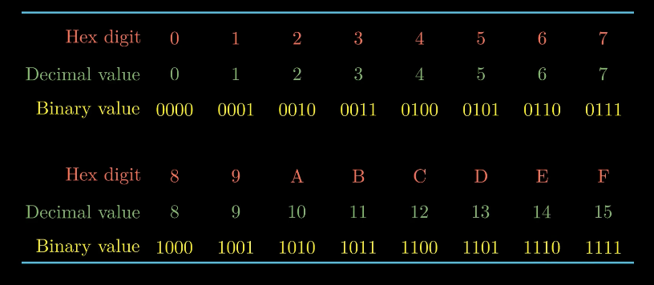 

小技巧：记住十六进制数ACF所对应的十进制数，那么B和D的数值可以由A和C的加一得到，E的数值可以由F减一得到

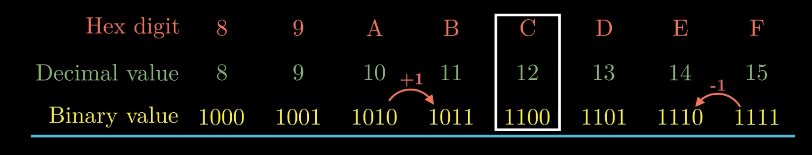 

十六进制转换为二进制

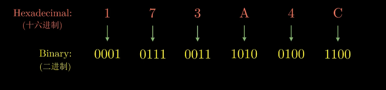 

二进制转换为十六进制

从右向左，每四位为一组来转换成相应的十六进制数。如果总位数不是4的倍数，那么最左边的一组会出现小于4位的情况，这时将前面进行补零，然后将每4位为一组的二进制数进行一一转换，即可得到对应的十六进制数。

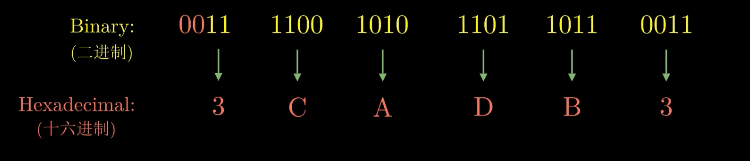 

如何将形如2的N次方的数可以快速的转成二进制数。如图所示，2次方就是1后面跟俩个0，5次方就是1后面跟5个0，因此，n次方就是1后面跟n个0。

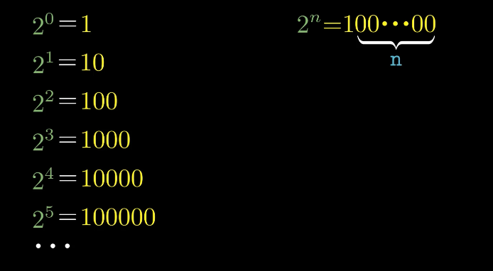 

十六进制的1个0可以代表4个二进制0

将 0 的个数 n 分解成 `i` 加 `4j`，这个式子也可以这么理解，将 `n` 除以 `4` ， `j` 是商，而 `i` 就是余数。因此余数 `i` 可能的取值为 `0,1,2,3` ，那么与之对应的十六进制数就是：`2`的`0`次方等于`1`，`2`的一次方等于`2`，`2`的二次方等于`4`，`2`的三次方等于`8`。

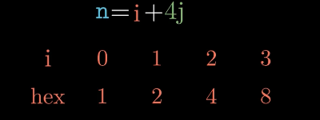 

例如：`2048 = 2^11`，因此 n 就等于 `3 + 4 × 2` 。即有 `11` 个 `0` ，其中 `8` 个二进制 `0` 变成 `2` 个十六进制的 `0` ，剩余的三个二进制 `0` 构成 `1000b = 0x8` 。从而可以快速得到十六进制表示为 `0x800` 。

十进制与十六进制之间的转换需要采用除法或者乘法来处理

通过辗转相除的方法，将一个十进制数转成成十六进制数。

十进制数 314156 转十六进制：

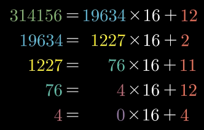 

我们将得到的余数用16进制数来表示，然后自下而上，就可以到最终314156的十六进制表示0x4CB2C。

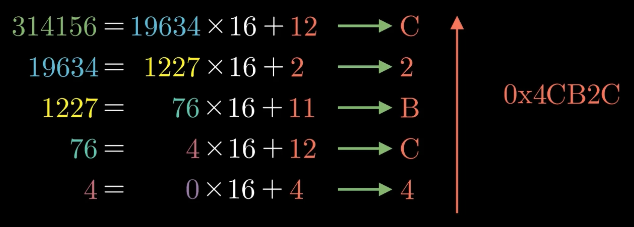 

反过来，将一个十六进制数转换成十进制数，可以用16的幂乘以相应位的十六进制数

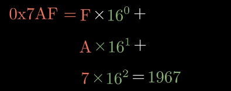 

## 1.2字数据大小

字长决定了虚拟地址空间的最大的可以到多少，也就是说，对于一个字长为 w 位的机器，虚拟地址的范围是0 到 2<sup>w</sup> - 1。

|  字长  |           地址空间           |
| :----: | :--------------------------: |
| w bit  |    0 ~ 2<sup>w</sup> - 1     |
| 32 bit | 0 ~ 2<sup>32</sup>> - 1，4GB |
| 64 bit | 0 ~ 2<sup>64</sup> - 1，16EB |

近些年，高性能服务器、个人电脑以及智能手机已经完成了从32位字长到64位字长迁移。不过在一些嵌人式的应用场景中，32位的机器仍旧占有一席之地。对于32位的机器，虚拟地址空间最大为4GB，而64位的机器，虚拟地址空间最大为16EB。

在迁移的过程中，大多数64位的机器做了向后兼容，因此为32位机器编译的程序也可以运行在64位机器上。

在64位的机器上，可以通过这条命令编译生成可以在32位机器上运行的程序。

```shell
linux> gcc -m32 -o hello32 hello.c
```

通过修改编译选项，就可以编译生成在64位机器上运行的程序。

```shell
linux> gcc -m64 -o hello64 hello.c
```

注意：hello32既可以运行在32位机器上，也可以运行在64位机器上，但是hello64只能运行在64位的机器上。

对于32位程序和64位程序，主要的区别还是在于程序是如何编译的，而不是运行机器的类型。

C语言中，支持整数和浮点数多种数据格式，下表列式了不同数据类型在32位机器与64位机器上所占字节数的大小。

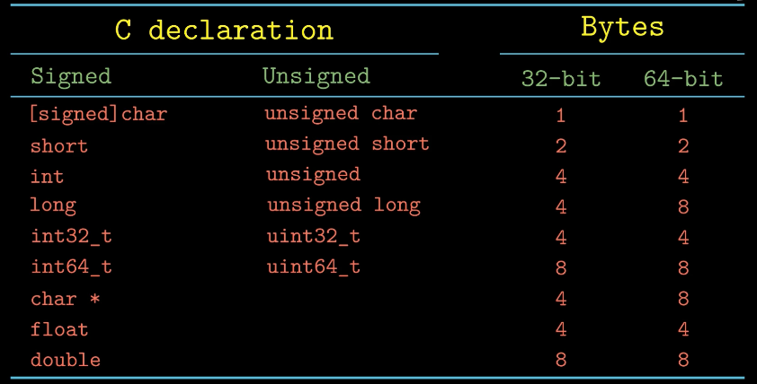 

## 1.3寻址和字节顺序

对于我们需要存储的数据，我们需要搞清楚该数据的地址是什么，以及数据在内存中是如何排布的。

例如：一个``int``类型的变量 x（0x01234567），假设地址位于0x100处，由于``int``类型占4个字节，因此变量x被存储在地址为 0x100,0x101,0x102,0x103 的内存处。

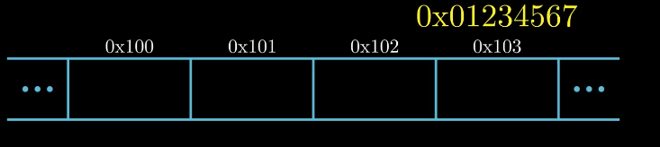 

大端法：最高有效字节存储在最前面，也就是低地址处

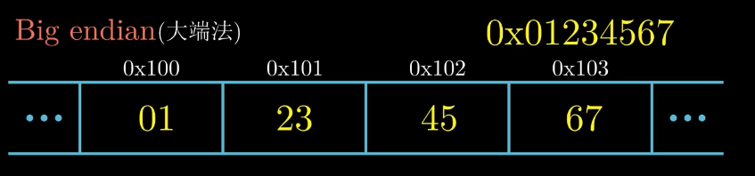 

小端法：最低有效字节存储在在最前面

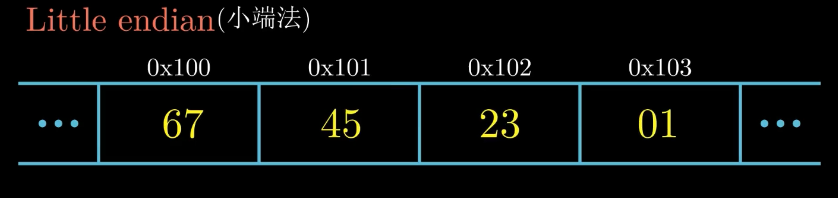 

大多数 `int`el 兼容机采用小端模式，IBM和Sun公司的机器大多数机器采用大端法。

对于很多新的处理器，支持双端法，可以配置成大端或者小端运行。

例如基于ARM架构的处理器，支持双端法，但是Android系统和iOS系统却只能运行在小端模式

测试：

1.  运行Linux系统，字长为32位的机器；
2.  运行windows系统，字长为32为的机器；
3.  SUM，大端法的机器；
4.  运行Linux系统，字长为64位的机器。

通过在这4种不同的机器上运行字节打印程序，可以打印输出程序对象的字节表示。

```c
#include<stdio.h>

typedef unsigned char * byte_pointer;

void show_bytes(byte_pointer start, int len){
	int i;
	for(i = 0; i < len; i++){
		printf(" %.2x", start[i]);
	}
	printf("\n");
}

void show_int(int x){
	show_bytes((byte pointer) &x,sizeof(×));
}
```

其中`show_int`函数中的强制类型转换告诉编译器程序应该把这个指针看成指向一个字节的序列，而不是这个对象原始的数据类型。

具体的运行结果如图所示，12345的十六进制表示为0x00003039。

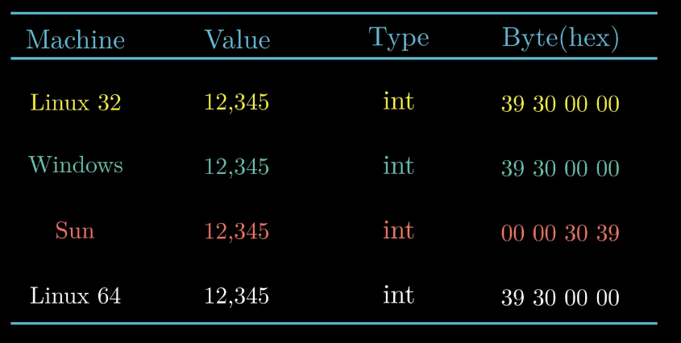 

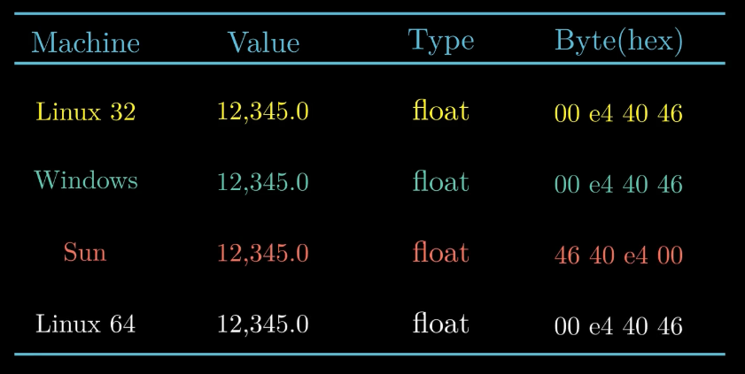 

除了字节顺序之外，在所有机器上都得到了相同的结果。

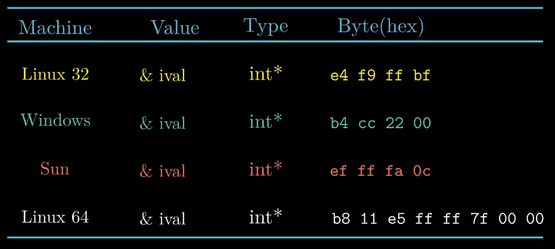 

由于不同操作系统使用不同的存储分配规则，指针的值是完全不同的。

虽然整型和浮点数都是对数值12345进行编码，但是它们却有着完全不同的字节模式。

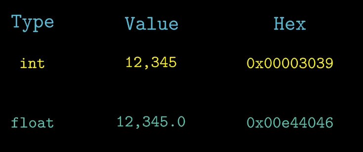 

如果我们用二进制的形式表示，然后进行适当的移位，我们会发现有一个13位的匹配序列

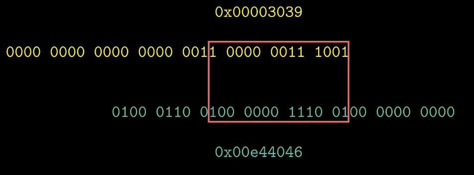 

## 1.4表示字符串

C语言中的字符串被编码为以NULL字符结尾的字符数组，例如字符串 “abcde" ，这个字符串虽然只有5个字符，但是长度却为6，就是因为结尾字符的存在。

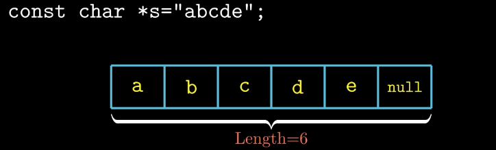 

通过show_bytes程序可以得到每个字符在内存中对应的存储信息

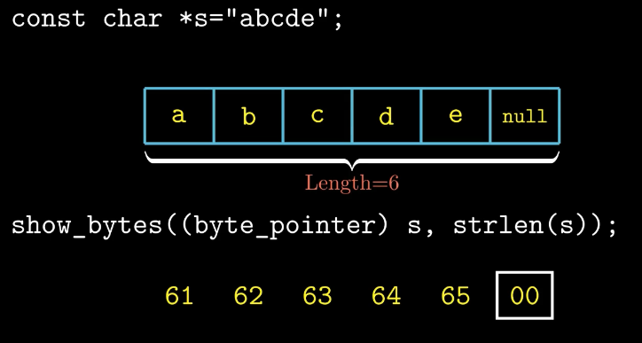 

其中结尾字符的十六进制表示为0x00，使用ASCII码来表示字符，在任何系统上都会得到相同的结果。因此，文本数据比二进制数据具有更强的平台独立性。

## 1.5布尔代数简介

二进制是计算机编码、存储和操作信息的核心，围绕着0和1的研究已经演化出了丰富的数学知识体系，数学家乔治布尔通过将逻辑值 true 和 false 编码成二进制的 1 和 0 。设计出了布尔代数，作为逻辑推理的基本原则。

布尔运算中的波浪线对应于逻辑运算的非（NOT），计算机通常将非运算称为取反，当对0进行取反时，运算结果是1，对1进行取反得到0。

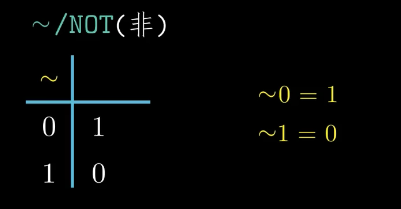 

逻辑运算与（AND），两个参数如果有一个数为0，那么与运算的结果就为0，与运算只有当两个参数都为1时，运算结果才为1。

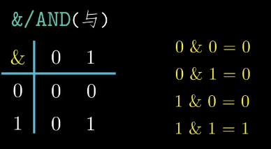 

逻辑运算或（OR）只有当两个参数都为0时，或运算结果才为0，如果两个参数都为1，或者有一个参数为1，或运算的结果就为1。

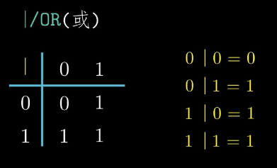 

异或（EOR）当两个参数同为0，或者同为1时，异或运算的结果为0，当两个参数不同时，异或运算的结果才为1。

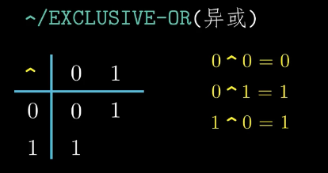 

## 1.6C语言中的位级运算

C语言中的一个特性就是支持按位进行布尔运算，确定一个位级表达式结果的最好方法，就是将十六进制扩展成二进制表示，然后按位进行相应的运算，最后再转换回十六进制。

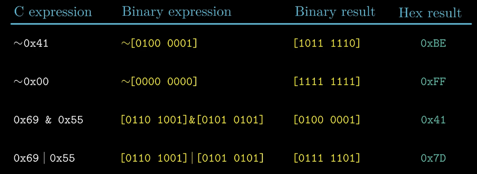 

位运算一个常见的用法就是实现掩码运算，通俗点讲，通过位运算可以得到特定的位序列。例如对于操作数0x89ABCDEF，我们想要得到该操作数的最低有效字节的值，可以通过& 0xFF，这样我们就得到了最低有效字节 0x0000 00EF。

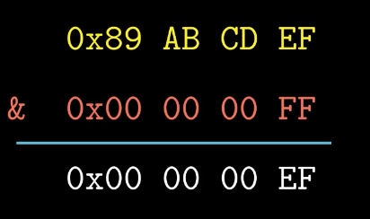 

## 1.7C语言中的逻辑运算

除了位级运算之外，C语言还提供了一组逻辑运算，注意逻辑运算的运算符与位级运算容易混淆。逻辑运算认为所有非零的参数都表示true，只有参数0表示false。

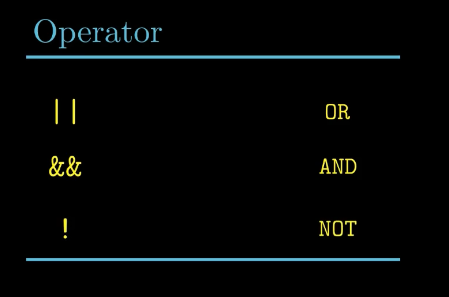 

事实上逻辑运算的结果只有两种，true或者false。而位运算只有在特殊的数值条件下才会得到0或者1。

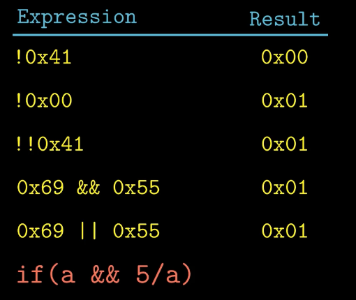 

对于图中的这个表达式 a && 5/a，如果a等于0，该逻辑运算的结果即为false，不用再去计算5除以a，这样就可以避免了出现5除以0的情况。

## 1.8C语言中的移位运算

对于8位二进制数0110 0011，左移一位就是**丢弃最高的1位，并在右端补一个0**，具体结果如图所示。

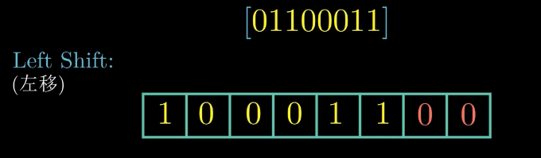 

在这个例子中，移位量应该是0~8之间的值。

左移的情况比较简单

对于右移，分为**逻辑右移**和**算术右移**。

逻辑右移和左移只是在方向上存在差异，逻辑右移一位就是**丢弃最低的1位，并在左端补一个0**。

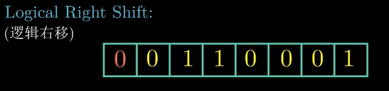 

至于算术右移，这里需要特别注意，**当算术右移的操作对象的最高位等于0时，算术右移与逻辑右移是一样的**，没有任何差别。

但是**当操作数的最高位为1时，算术右移之后，左端需要补1，而不是补0**。

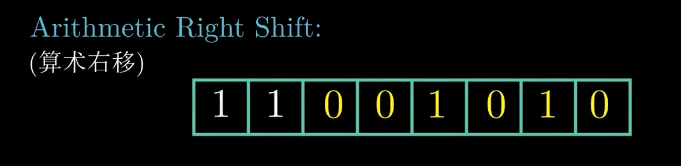 

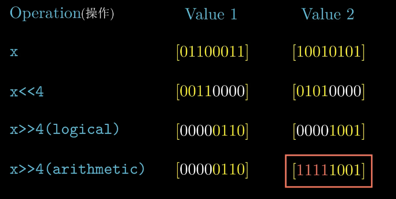 

虽然C语言中并没有明确的规定有符号数应该使用哪一种类型的右移方式，但是实际上，几乎所有的编译器以及机器的组合都是对有符号数使用算术右移。

对于无符号数，右移一定是逻辑右移。即当value2麦示的是无符号数时，即使没有指明右移的类型，那也一定是逻辑右移，即补0而不是1。当value2表示的是有符号数时，那么对于右移一定是算术右移。

# 2整数表示

## 2.1整型数据类型

C语言支持多种整型数据类型，例如 `char` `short` ``int``等，这些关键字可以用来指定不同类型数据的大小，我们首先看一下64位机器上，不同的数据类型所表示数值的范围。

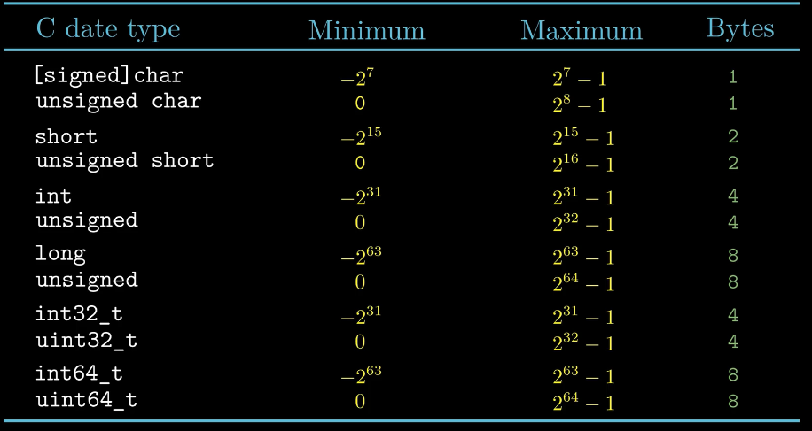 

不同的数据类型，所占的字节数是不同的，这也是导致数值取围不同的直接原因。

关于long类型的大小需要注意一下，这个类型的取值范围是与机器字长相关的，在64位机器上，long类型占8个字节，而在32位机器上，long类型只占4个字节。

当变量声明带有unsigned关键字时，限制了表示的数字只能为非负数，在计算机领域，非负数通常称为无符号数，C语言中支持无符号数和有符号数，有符号数既可以是正数，也可以是负数。

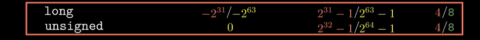 

## 2.2无符号数的编码

假设有一个整数的数据类型有w位，用向量x来表示，如果把向量x看成一个二进制表示的数，向量x中的每一个元素表示一个二进制位，其中每个位的取值为0或者1。用一个函数B2U来表示一个长度为w的0、1串是如何映射到无符号数的，B2U的意思是binary to unsigned，具体映射过程如图所示。

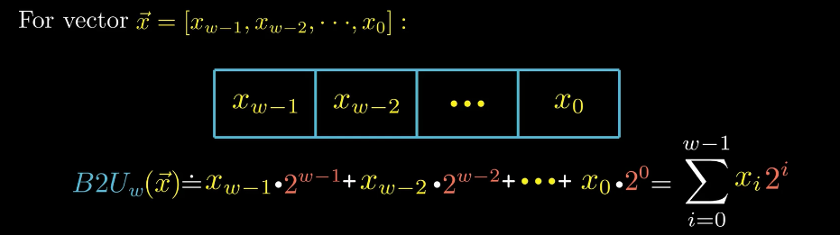 

根据上述函数映射关系，可以得到0101对应的整数是5，1011对应的整数是11。

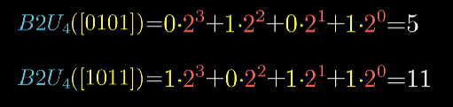 

为了更加清楚的解释无符号数的表示方法，CSAPP的原书中还介绍了一种图形化的表示方法来帮助读者理解无符号数的编码规则。对于向量的第 i 位，我们用一个长度为 2i 的蓝色条状图来表示。每个位向量对应的值就等于所有值为1的位，所对应的条状图的长度之和。

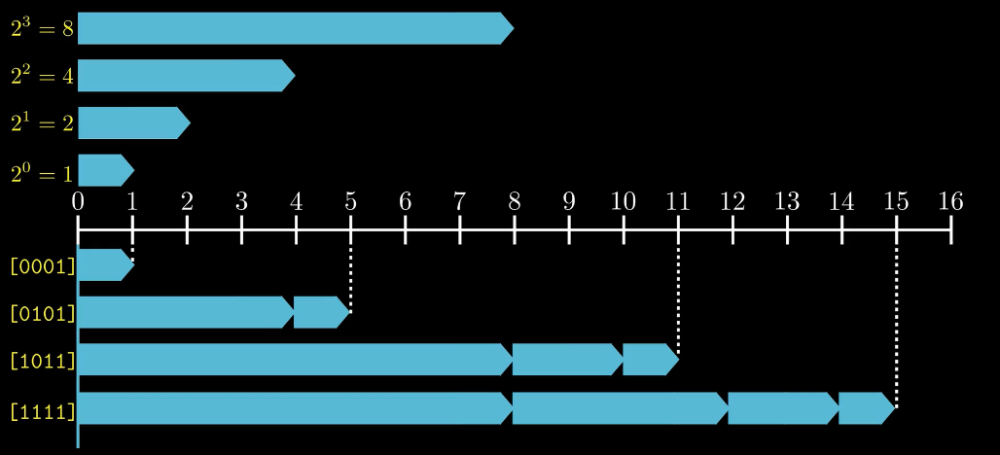 

例如：编码0101，就是长度为4(2的2次方)的条状图加上长度为1(2的0次方)的条状图。对于编码1011，则是长度为8，长度为2，以及长度为1的三者相加。

对于长度为4的编码，所表示的最小值就是所有位都等于0时；最大值就是所有位都等于1时，因此4位编码所能表示的无符号数的取值范围是0~15。

我们可以发现这种编码方式，只能表示非负数，具有相当大的局限性。

## 2.3补码编码

**计算机中对于有符号数的编码采用补码（two’s-complement）的形式。**

同样我们还是用向量x来表示二进制数，对于采用补码方式进行编码的二进制数与有符号数之间的转换过程如图所示。

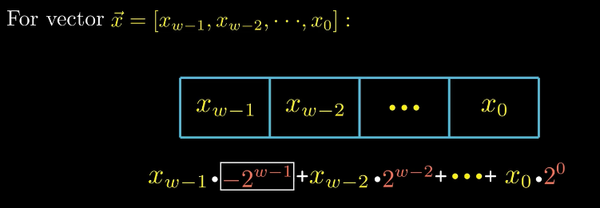 

这里需要注意的是最高位的权重是 -2w-1 ，当最高位等于1时，表示负数；当最高位等于0时，表示非负数。因此最高位也称为符号位。

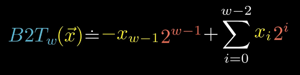 

关于符号位，需要理解**负权重**的概念，而不能简单的当成一个负号。否则在已知补码求数字的时候就得进行一次“补码转原码”的过程，计算复杂。

我们看一下补码0101和1011对应的有符号数，具体的计算过程如图所示。

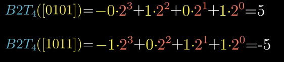 

如果仅仅把最高位当成符号位，对于补码1011，先减一得到1010，然后除符号外取反得到1101，即1101就是原码，可知为 -5。如果把最高位理解成**负权重**，可直接进行计算。

同样，我们来看一下补码的图形化表示方法，需要注意的是最高位的情况，其中灰色的条状图来表示最高符号位等于1时的情况。

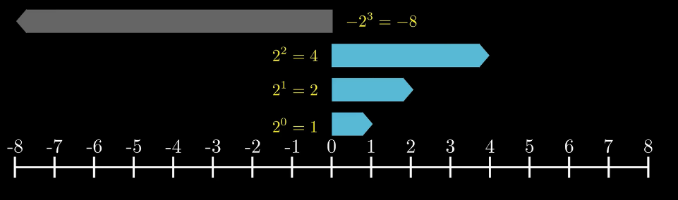 

对于编码0001和0101，当最高符号位等于0，灰色条状图对映射结果没有任何影响。

但是对于1011和1111，由于最高符号位是1，灰色条状图所代表的负权重使得映射结果一定为负数。对于4位补码，可以表示的最小值是-8，可以表示的最大值是7。

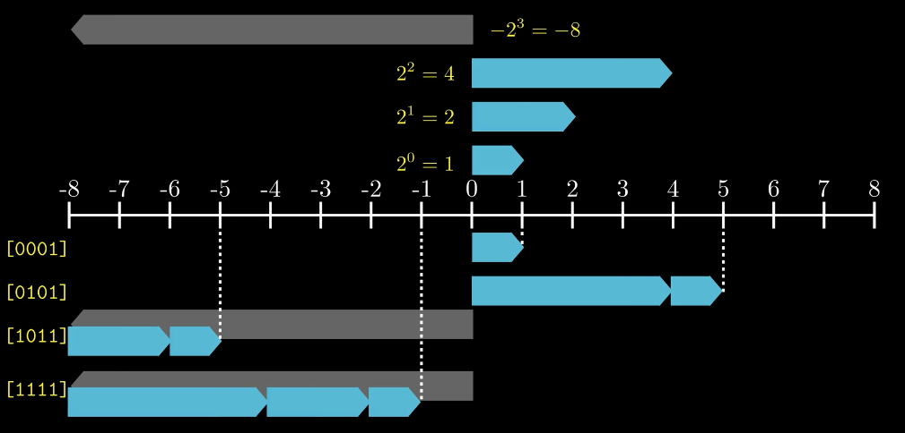 

在了解了无符号数和有符号数的编码规则之后，我们分别看一下不同字长可以表示整数的范围。

**无符号数**的不同字长的最大值：

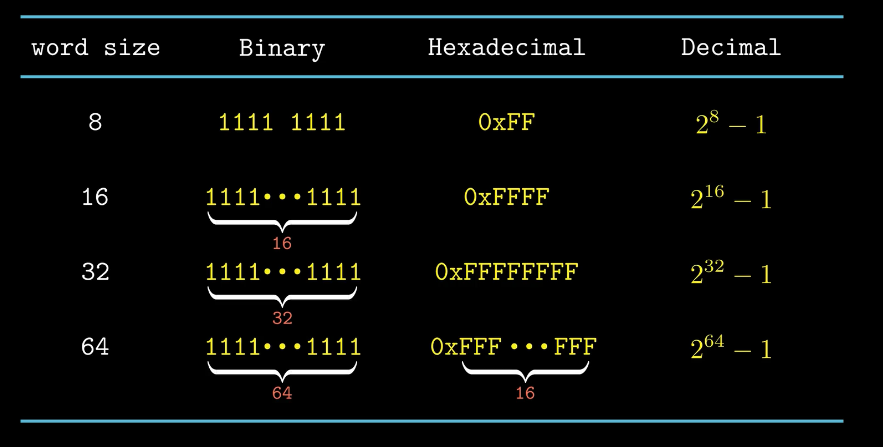 

**有符号数**的不同字长的最大值：

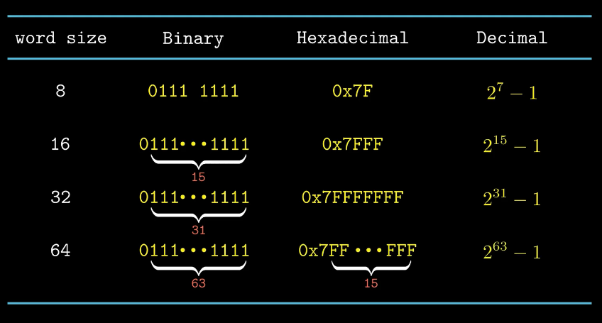 

**有符号数**的最小值：

符号位为1，其他位等于0

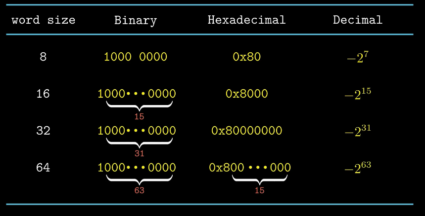 

对于-1，这个需要特别注意一下，无论是字长是8位，还是64位，有符号数-1的补码是一个全为1的串。-1的补码与无符号数的最大值有着相同的二进制位表示

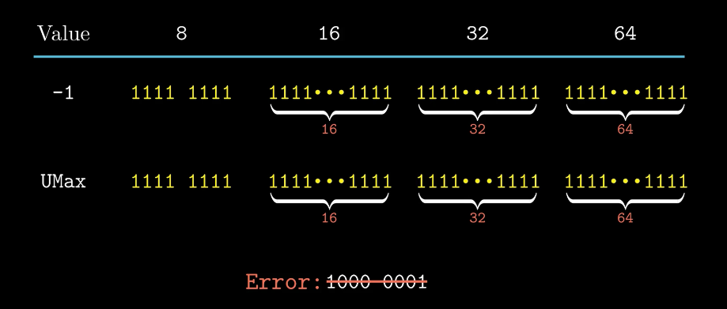 

理解了补码编码的含义后，就不会把 -1 看成 1001（四位编码），因为这个是 -1 的原码，计算机表示有符号数用的是补码而不是原码。

虽然C语言的标准中并没有要求用补码来表示有符号数，但是几乎所有的机器都是用补码来表示有符号数。为什么用补码而不是原码和计算机的数学计算机制有关。

例：已知一个有符号数12345的补码表示 0011 0000 0011 1001，求 -12345 的补码。

  解：已知正数的原码和补码相同，即 12345 的原码也是 0011 0000 0011 1001。补码和原码相加会刚好溢出，使得结果等于 0，因此，- 12345 的补码就是 12345 原码对应 0 的位置改为 1，1 的位置改为 0，然后再加 1。

  即：0011 0000 0011 1001 -> 1100 1111 1100 0110 -> 1100 1111 1100 0111。

  因此，-12345 的补码就是 1100 1111 1100 0111。

与-12345相同位模式的无符号数又是多少呢？对于无符号数，最高位的1表示的不是负权重，根据无符号数的编码定义可以得到53191。

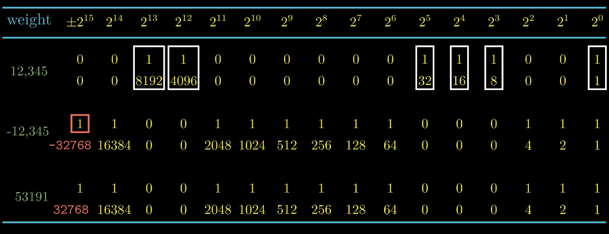 

对于相同的位模式，映射函数不同，得到的数值也不同。

## 2.4有符号数和无符号数之间的转换

C语言允许数据类型之间做强制类型转换，例如代码示例，变量a是short类型，通过强制类型转换成无符号数，那么变量b的数值是多少呢？

```c
short int a =-12345;
unsigned short b = (unsigned short)a;
printf("a= %d, b = %u" , a， b);
```

结果：-12345经过强制类型转换后得到的无符号数是53191

从十进制的表示来看，很难看出二者的关系，将十进制表示转换成二进制表示，我们可以发现，二者的位模式是一样的。

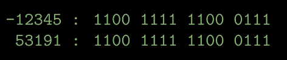 

对于大多数C语言的实现，有符号数和无符号数之间的转换的规则是：位模式不变，但是解释这些位的方式改变了。

对于相同的位模式，不同的函数映射所导致的数值差异，无符号数和有符号数的函数映射关系如图所示。

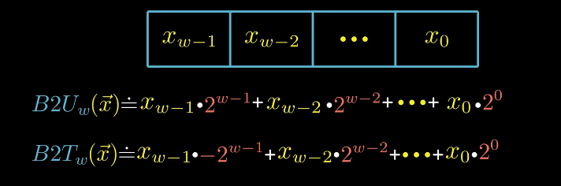 

将B2U与B2T做差，得到的结果就是二者数值的差异。

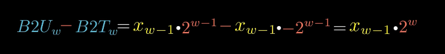 

### 2.4.1有符号转无符号

我们对这个式子进行一个移项处理，B2T从等式的左边移到等式的右边，对于相同的位模式，无符号数与有符号数的数值关系如图所示。

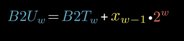 

用T2U来表示有符号数到无符号数的函数映射，当最高位X<sub>w-1</sub>等于1时，此时有符号数 x 表示一个负数，经过转换后，得到的无符号数等于该有符号数加上 2<sup>w</sup>；当最高位 X<sub>w-1</sub> 等于0时，此时有符号数 x 表示一个非负数，得到的无符号数与有符号数是相等的。

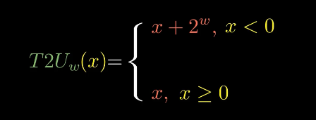 

### 2.4.2无符号转有符号

同样，还是对等式进行移项。

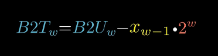 

用U2T来表示无符号数到有符号数的函数映射。当最高位等于0时，无符号数可以表示的数值小于有符号数的最大值，此时转换后的数值不变。当最高位等于1时，无符号数可以表示的数值大于有符号数的最大值，在这种情况下，转换后得到有符号数等于该无符号数减去 2w 。

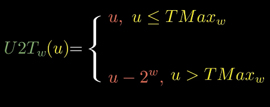 

## 2.5C语言中的有符号数与无符号数

在C语言中，在执行一个运算时，如果一个运算数是有符号数，另外一个运算数是无符号数，那么C语言会隐式的将有符号数强制转换成无符号数来执行运算。

例如下面代码的例子，我们希望得到-1小于0的输出。

```c
int i = -1;
unsigned int b = 0;
if(a < b) 
	printf("-1 < 0")
else 
	printf("-1 > 0")
```

但是在执行时，却得到了-1比0大的结果。

由于第二个操作数 b 是无符号数，第一个操作数 a 就隐式的转换成无符号数，这个表达式实际上比较的是 4294967295(2的32次方减1) < 0。

实际运行中的转换函数：T2U<sub>32</sub>(-1)=UMax<sub>32</sub>=2<sup>32</sup>-1

C语言中还有一个常见的运算是在不同字长的整数之间进行转换，将一个较大的数据类型转换成较小的类型，由于目标数据类型太小，想要保持数值不变是不可能的。然而将一个较小数据类型转换成较大的类型时，保持数值不变是可以的。

## 2.6扩展一个数字的位表示

把无符号数转换成一个更大的数据类型

例如，我们将一个unsigned char类型变量，转换成unsigned short类型。变量a占8个bit位，而变量b占16个bit位，对于无符号数的转换比较简单，只需要在扩展的数位进行补0即可，我们将这种运算称为零扩展，具体表示如图所示。

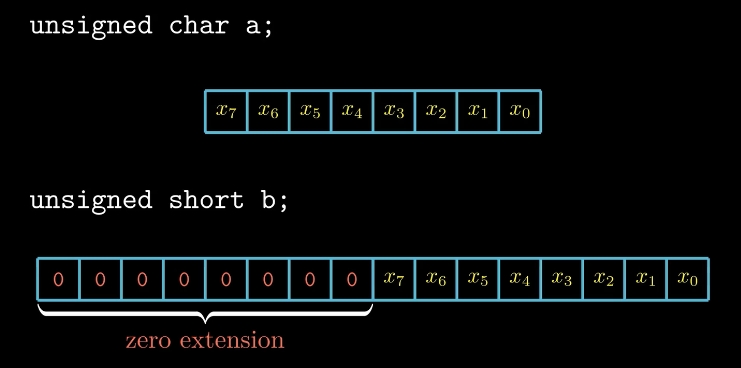 

根据无符号数的编码定义，零扩展之后的数值不变。与无符号数相比，将有符号数转换成一个更大的数据类型，需要执行符号位扩展，这个符号位就是最高位，对于符号位扩展该如何理解呢?

当有符号数表示非负数时，最高位是0，此时扩展的数位进行补零即可；当有符号数表示负数时，最高位是1，此时扩展的数位需要进行补1。

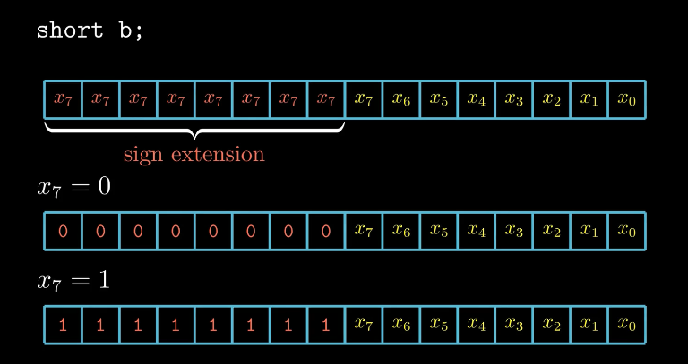 

为什么全补1？数学证明

对于一个w位的有符号数我们用B2T<sub>w</sub>来表示，对这个有符号数进行k位的符号位扩展，具体过程如图所示，经过扩展之后的有符号数用B2T<sub>w+k</sub>来表示。

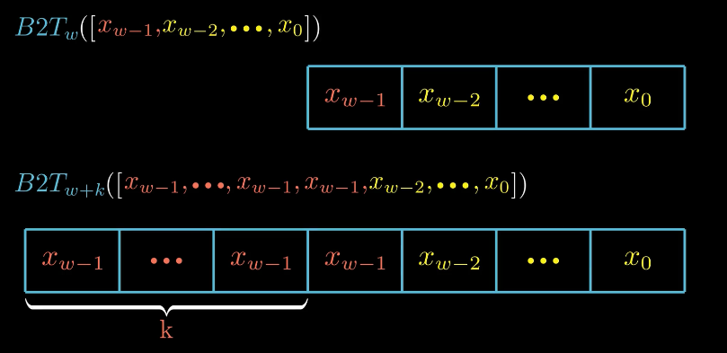 

为了方面描述，我们讲两个函数映射分别记为(1)和(2)。

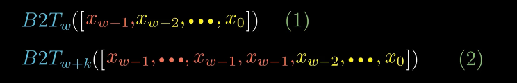 

假如(1) ==(2)成立，则符号扩展可以保持数值不变。

  证明过程如下：

假如能够证明符号位扩展一位，可以保持数值不变，那么扩展任意位，就都能保持这种属性。如果这个地方不好理解，可以看一下归纳的整个过程：

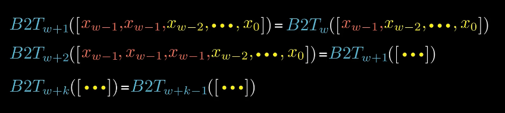 

因此，我们只要能够证明B2T<sub>w+1</sub>等于B2T<sub>w</sub>，就可以确定B2T<sub>w+k</sub>等于B2T<sub>w</sub>。

根据补码的编码规则，B2T<sub>w</sub>展开式如图所示。

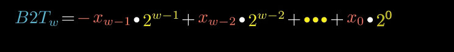 

经过扩展之后，B2T<sub>w+1</sub>展开式如图所示。

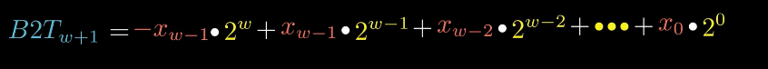 

然后将二者做差，由于自X<sub>0</sub>到X<sub>w-2</sub>位的表示相同，做差之后，得到的结果如图所示，经过简单的合并之后，得到图中的表达式。

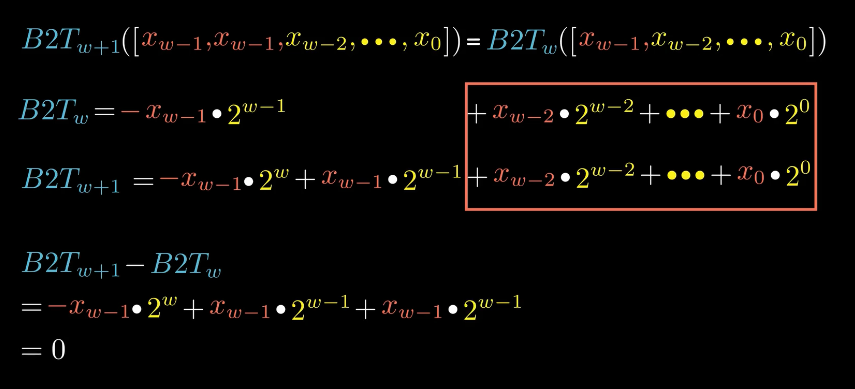 

由于X<sub>w</sub>是由X<sub>w-1</sub>扩展得到的，因此做差的结果等于0。

综上所述，我们通过数学的方法证明了：**当有符号数从一个较小的数据类型转换成较大类型时，进行符号位扩展，可以保持数值不变。**

## 2.7截断

将 `int` 类型强制类型转换成 `short` 类型时，``int``类型高16位数据被丢弃，留下低16位的数据，因此截断一个数字，可能会改变它原来的数值。

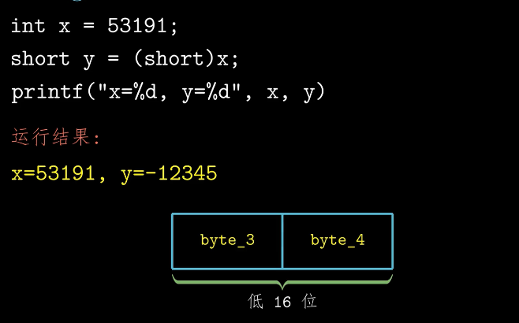 

将一个 w 位的无符号数，截断成 k 位时，丢弃最高的 w-k 位，截断操作可以对应于取模运算，于二进制取模运算，通俗的说法就是除以2的k次方之后得到的余数。

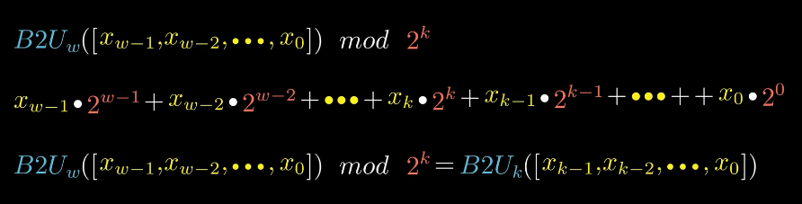 

截断有符号数：

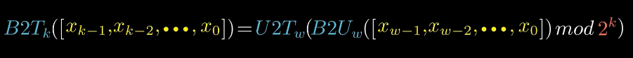 

分两部看

第一步，我们用无符号数的函数映射来解释底层的二进制位，这样一来我们就可以使用与无符号数相同的截断方式，得到最低K位

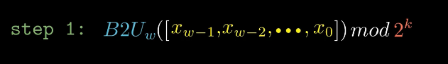 

第二步，我们将第一步得到的无符号数转换成有符号数

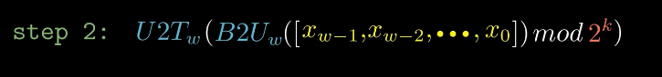 

经过两步，我们就得到了有符号数截断之后的值。

经过上述的讲解，我们发现有符号数与无符号数之间的转换会导致一些非直观结果，这些非直观的结果会导致一些难以被发现的错误，只有对这些知识有一个全面的了解，才能避免这类错误的出现。

# 3整数运算

## 3.1无符号加法

两个无符号数相加

```c
unsigned char a = 255;
unsigned char b = 1;

unsigned char c = a + b;

pr`int`f("c=%d", c);
```

我们期望的结果是 256，但实际结果为 0。

产生这个结果是因为a加b的和超过了unsigned char类型所能表示的最大值255。

我们将这种情况称为溢出。

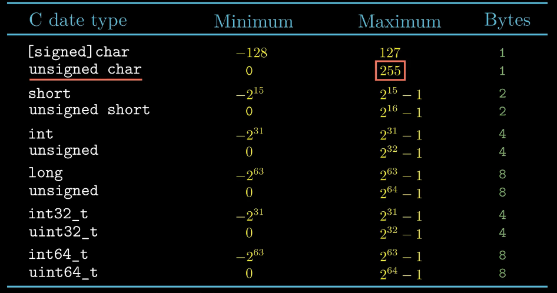 

无符号数加法的原理：

引人一个符号来表示w位的无符号数加法

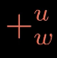 

其中u是unsigned的缩写，表示无符号数

对于操作数x和y，二者的取值范围都是大于等于0，小于2的w次方。对于二者相加的和，如果小于2的w次方，那么程序执行得到的结果与实际情况一致；如果二者相加的和大于等于2的w次方，此时就会发生溢出。

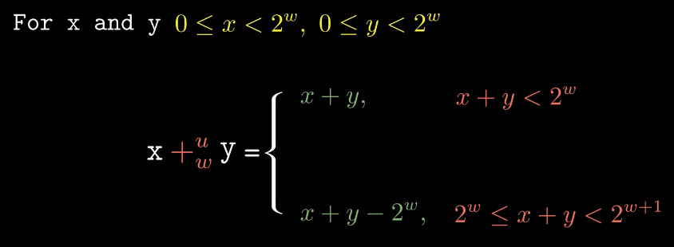 

溢出的结果为什么是这个呢？首先我们看一下变量a和变量b的二进制表示，具体如图所示。

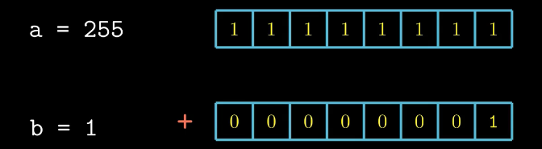 

当执行加法运算后，得到结果的二进制表示如图所示。

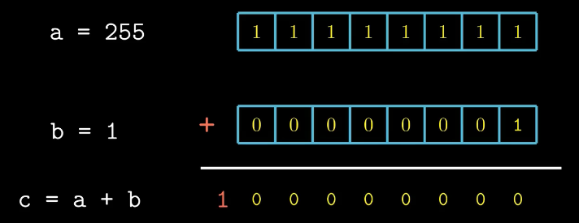 

为了使得运算结果的数据位数保持w位不变，最高位的1会被丢弃，因此得到的结果相当于减去2的w次方。

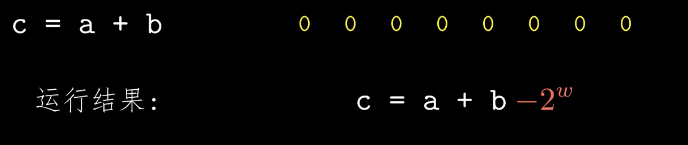 

在C语言执行的过程中，对于溢出的情况并不会报错，但是我们希望判定运算结果是否发生了溢出。

C语言中是如何判断溢出的。

因为 x 和 y 都是大于 0 的，因此，两者之和大于其中任何一个。

```c
int uadd_ok(unsigned x, unsigned y){
	unsigned sum = x + y;
	return sum >= x;	// 溢出返回 0，没溢出返回 1
}
```

## 3.2补码加法

计算机的有符号数用补码表示，因此补码加法就是有符号数加法。

有符号数x和y,它们的取值范围如图所示。

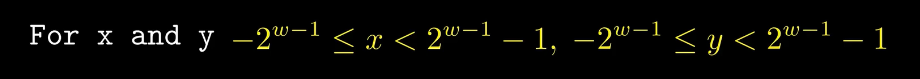 

对于补码的加法运算，我们同样引人一个符号来表示

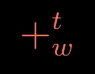 

其中 t 就是补码（two’s complement）的首字母缩写。

想要准确表示有符号数相加的结果需要w+1位，为了避免数据大小的扩张，最终结果将截断为w位来表示。

与无符号数相加不同的是，有符号数的温出分为正溢出和负溢出。

当x加y的和大于等于2的w-1次方时，发生正溢出，此时，得到的结果会减去2的w次方。

当x加y的和小于负的2的w-1次方时，发生负溢出，此时，得到的结果会加上2的w次方。

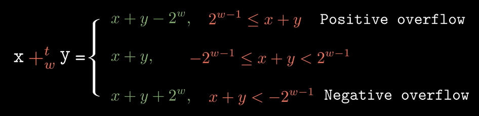 

举一个正溢出的例子，例如下面的代码，x加上y，我们期望得到的结果是128。

```c
char x = 127;
char y = 1;

char z = x + y;
printf("z=%d", z);
```

然而，运行结果是 -128。

我们可以通过二进制的表示，来看一下结果为什么是 -128。

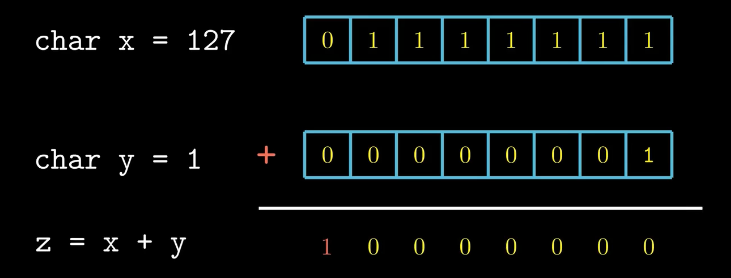 

根据之前学过有符号数的表示方式，最高位的1解释为负权重，因此，运行结果就等于 -128。这个运行结果与通过公式计算的结果也是一致的。

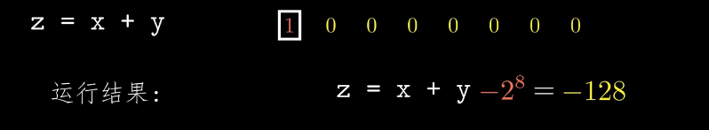 

对于负溢出的情况，也是类似的

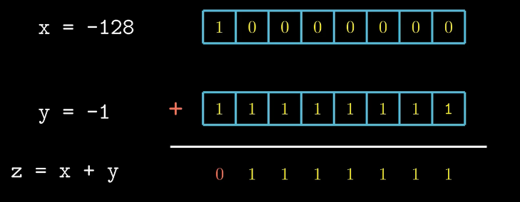 

-128 + (-1) 的期望结果是 -129，但是程序的结果是 127。根据有符号数的定义，原本x和y的最高位等于1，两个数都有负权重2的w-1次方，在发生负溢出的时候，最高位变成了0，因此，结果要加上2的w次方。

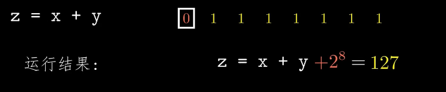 

对于如何检测有符号数相加是否发生溢出比较简单，当两个正数相加，得到的结果为负，则说明发生了正溢出；当两个负数相加，得到的结果为正，则说明发生了负溢出。

 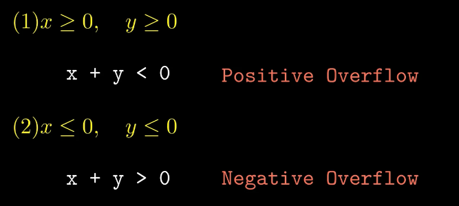 

## 3.3减法运算

**加法逆元(additive inverse)**：对于一个给定的x，存在x'，使得x加上x'等于x'加上x，并且等于0，我们称x'为x的加法逆元

实际上x与x'互为相反数，加法逆元也可以称为相反数，对于减法运算y-x，我们可以转换成y加上x的相反数。

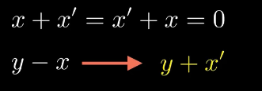 

那么我们看一下对于无符号数x，它的相反数x' 应该如何表示

根据相反数的定义需要满足 x＋x' = 0，但是 x' 和 x 都是非负数，那么 x' 应该如何来表示呢?

在[3.1两个无符号相加的例子](#3.1无符号加法)，当x'加x等于2的w次方时，导致溢出，同样结果也等于0。因此，对于任意x大于等于0，小于2的w次方，其w位的无符号逆元 x' 的表示如图所示。

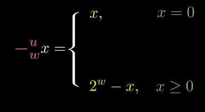 

我们再来看一下有符号数的逆元，对于补码表示的有符号数的逆元比较简单，当x大于最小值的情况，x的逆元就是负的x。

唯一需要注意的地方就是当x取最小值的时，由于补码表示最大值与最小值是非对称的，最大值的绝对值比最小值的绝对值要小，因此，关于最小值的逆元需要通过负溢出的方式来实现。

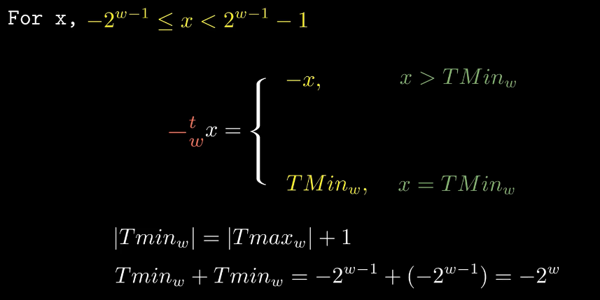 

负的2的w减1次方，加上负的2的w减1次方的结果是0。

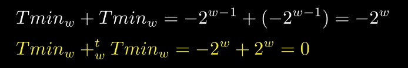 

因此，补码最小值的逆元就是本身。

看不懂上面的数学公式，举个例子，四位有符号数二进制的最小值是 1000，我们知道 1000 + 1000 = 1 0000，溢出了，导致有效数字为 0。符合逆元的定义，所以说**补码最小值的逆元就是本身**。

## 3.4无符号乘法

w位的无符号数x和y，具体表示如图所示

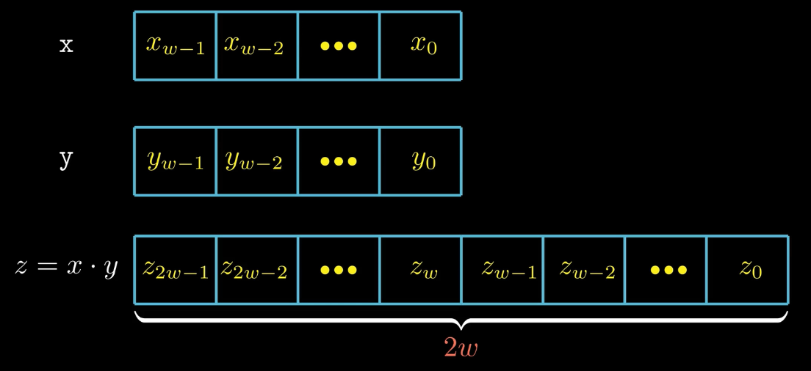 

二者的乘积可能需要2w位来表示

在C语言中，定义了无符号数乘法所产生的结果是w位，因此，运行结果会截取2w位中的低w位

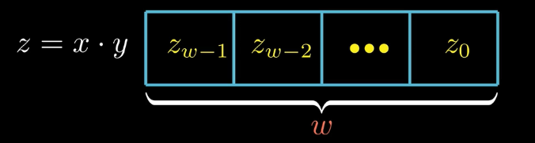 

[截断](# 2.7截断)采用取模的方式，因此，运行结果等于x与y乘积并对2的w次方取模

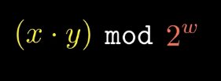 

## 3.5补码乘法

计算机的有符号数用补码表示，因此补码乘法就是有符号数乘法

无论是无符号数乘法，还是补码乘法，运算结果的位级表示都是一样的，只不过补码乘法比无符号数乘法多一步，需要将无符号数转换成补码（有符号数）

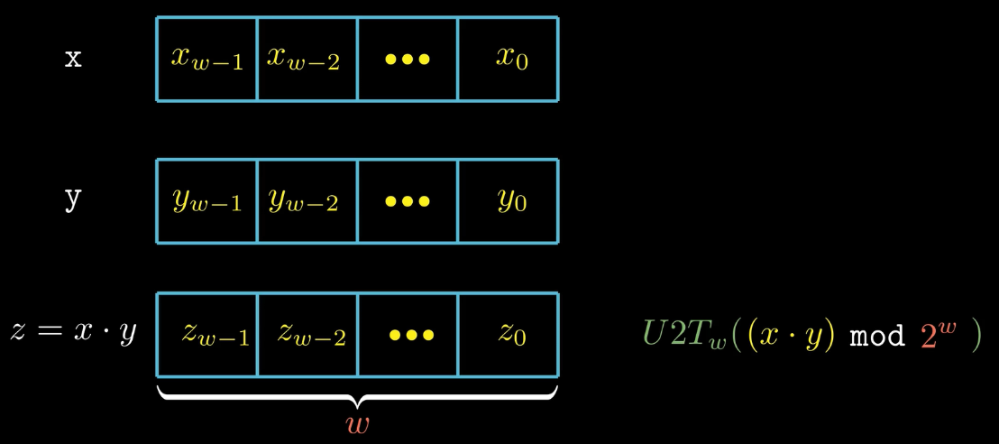 

图中展示了3位无符号数和补码的乘法示例

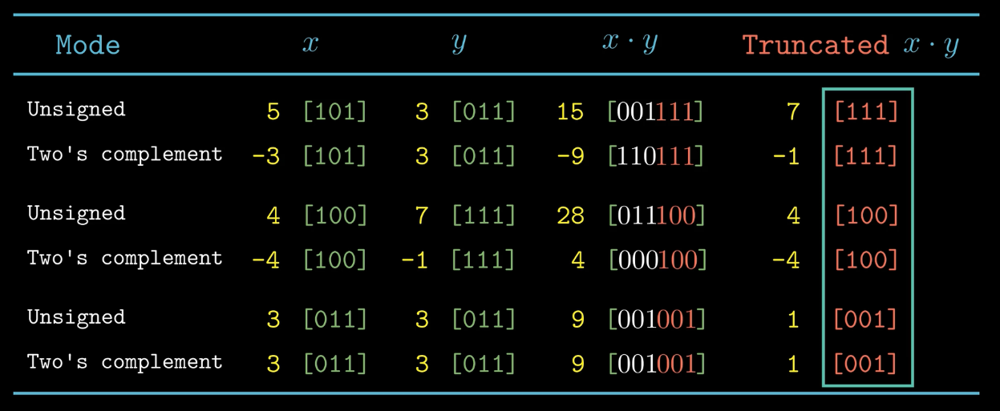 

通过表格中所列举的三组示例，我们可以看到，虽然完整的乘积结果的位级表示可能会不同，但是截断后的位级表示都是相同的（红色字体部分相同）

通过数学的方法来说明为什么有符号和无符号乘法的截取部分是相同的

假设x和y表示有符号数，x' 和 y' 表示无符号数。x与 x' 的二进制表示相同，y与 y' 的二进制位表示相同，根据之前我们讲过无符号数与有符号数的定义，对于相同的二进制表示，无符号数x’与有符号数x之间的关系如图所示。

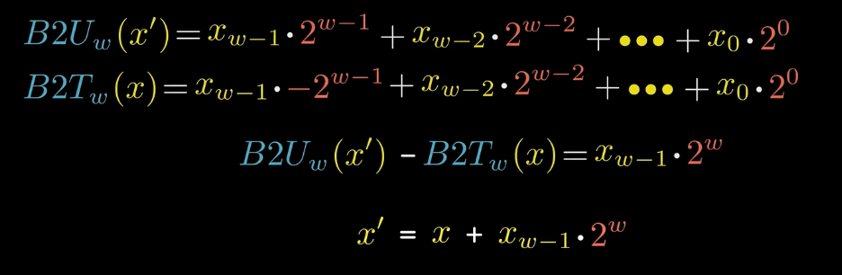 

同样，无符号数y’与有符号数y之间的关系如图所示

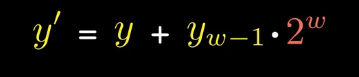 

对于x’乘以y’，然后对2的w次方取模运算的具体推导过程如图所示

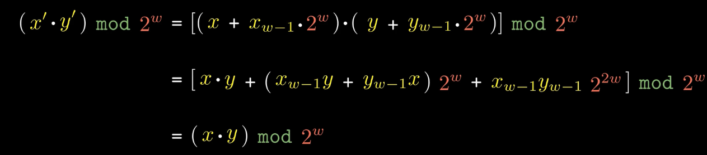 

由于取模运算的原因，所有带有权重2的w次方和2的2w次方的项都丢掉了

证明完毕：虽然无符号数和补码两种乘法乘积的完整位表示不同，但是截断之后结果的位级表示却相同

## 3.6乘以常数

由于乘法指令的执行需要多个时钟周期，很多C语言的编译器试图用移位、加法以及减法来代替整数乘法的操作

首先我们看一下乘以2的幂的情况。x乘以2，对应于左移一位；x乘以4，对应于左移两位；x乘以2的k次方，就对应左移k位

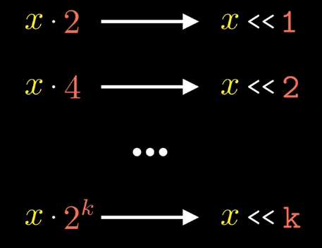 

证明过程如下图所示

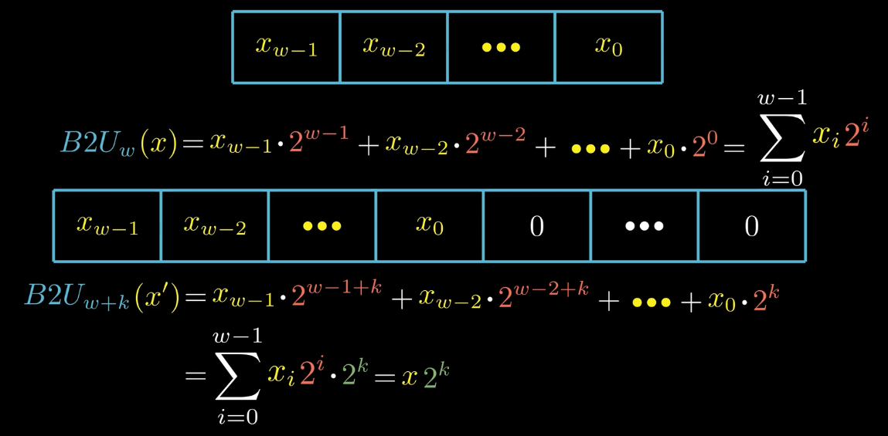 

接下来我们通过一个例子看一下乘以任意常数的情况

例如：x乘以14，14的二进制表示如图所示

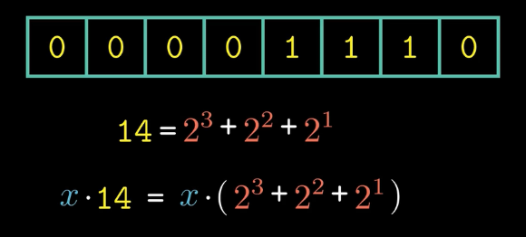 

x乘以14等于x乘以2的三次方加上x乘以2的2次方，加上x乘以2的一次方

根据刚才讲的，乘以2的幂可以等效为左移操作，这样一来，一个乘法操作可以使用三个移位操作和两个加法操作来替换

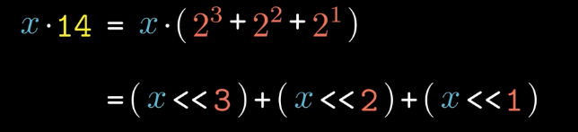 

更好的情况，编译器甚至可以把14分解成16-2

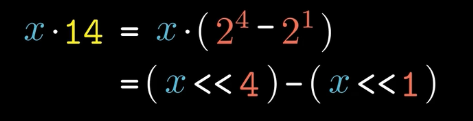 

## 3.7除以2的幂

对于除以2的幂也可以用移位来实现，不过除法的移位采用的是右移，而不是左移

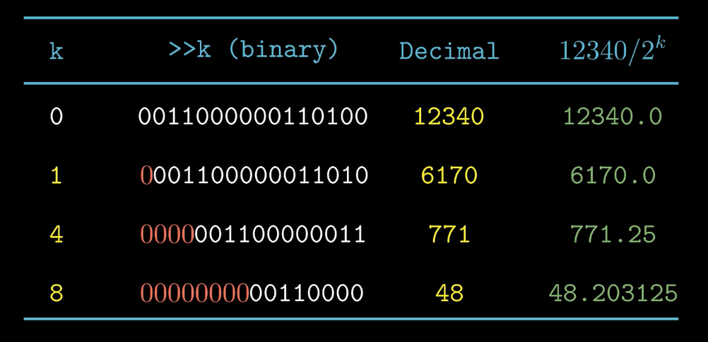 

关于右移的情况，这里需要注意一下，对于无符号数采用的是逻辑右移，而有符号数采用的是算术右移

整数的除法，还会遇到除不尽的情况，总是朝向0的方向进行舍入

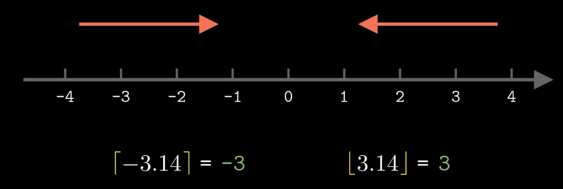 

例如，3.14向零舍入的结果是3，-3.14向零舍入的结果是-3

对于x大于等于0，y大于0，结果会是向下舍入

当x小于0，y大于0时，结果将向上舍人

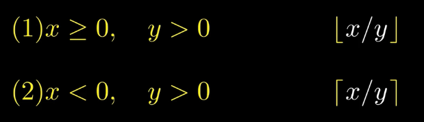 

### 3.7.1无符号数的除法

首先我们看一下无符号数除以2的幂的情况，x表示w位的无符号数，对x进行右移操作k位的结果如图所示

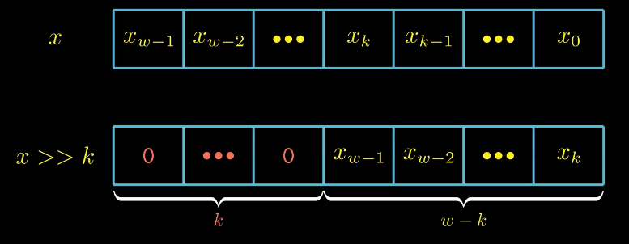 

为了方便描述，这里我们引人两个变量，x1和x2，其中x1是w-k位的无符号数，x2是k位的无符号数，我们将x1左移k位，根据前面讲到的，左移k位等于x1乘以2的k次方，x1左移k位与x2相加之和与x相等。

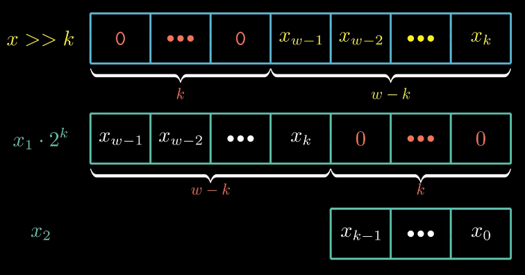 

由于x2的长度为k位，因此x2的取值范围大于等于0，小于2的k次方。因此x除以2的k次方，取整的结果就等于x1。这与x逻辑右移k位得到结果是一样的。

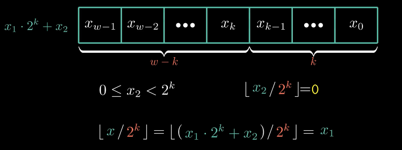 

例如，计算 21 ÷ 4 的结果，除数用 2 的幂次表示是 22，因此要把 21 拆成 x1·22 + x2，可知 x1 = 5，x2 = 1。结果为 (5·22 + 1) / 22 = 5

### 3.7.2补码的除法

当补码的最高位等于0时，对于非负数的来讲，算术右移与除以2的k次方是一样的。

对于负数来讲，需要特别注意一下，例如对-12340的16位表示进行算术右移不同数位的结果如图所示

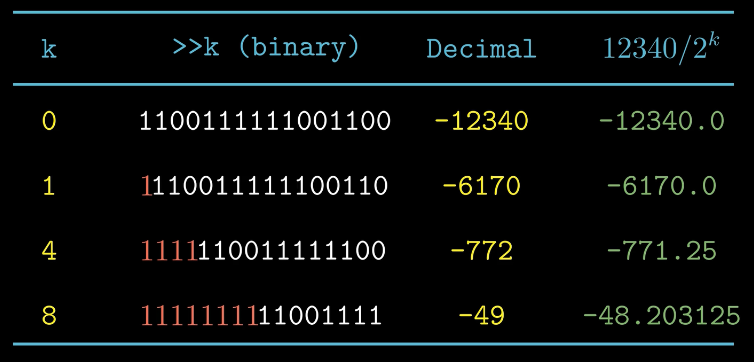 

当需要舍入时，移位导致 -771.25 向下舍入为 -772 ，根据整数除法向零舍入的原则，我们期望的得到的结果是 -771

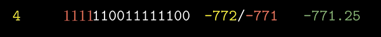 

因此，需要在移位之前加人一个偏置，来修正这种不合适的舍入。其中偏置的值等于1左移k位减去1

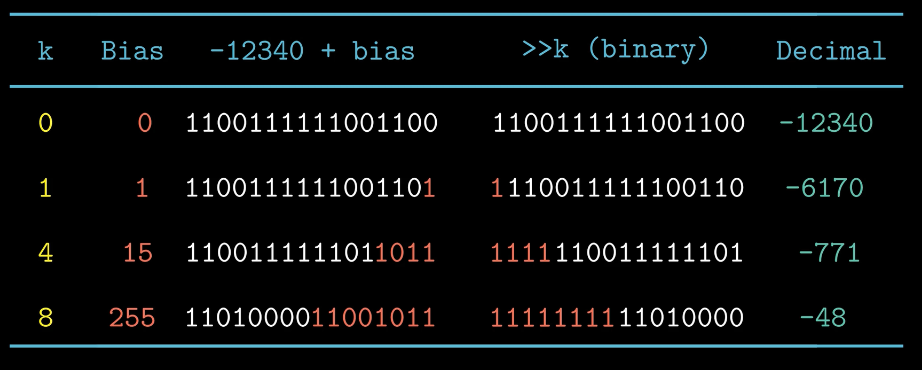 

通过加入偏置之后，再进行算术右移，即可得到向零舍入的结果

总结：对于补码除以2的k次幂的情况，当x小于0时，需要先加上偏置，再进行算术右移；对于x大于0的情况，可以直接进行算术右移

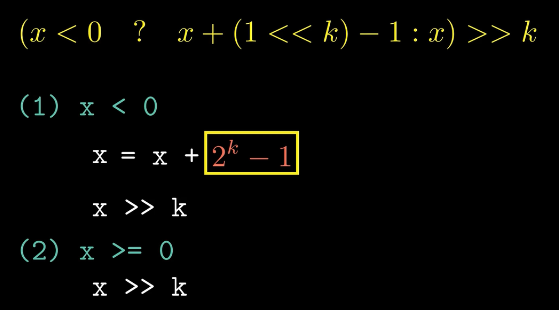 

这种方法并不能推广到除以任意常数

与乘法不同，我们不能用除以2的幂的方法来表示除以任意常数k的除法

# 4浮点数 

## 4.1二进制小数

理解浮点数的第一步是考虑含有小数值的二进制数。具体关于二进制权重的理解可以看一下这张图

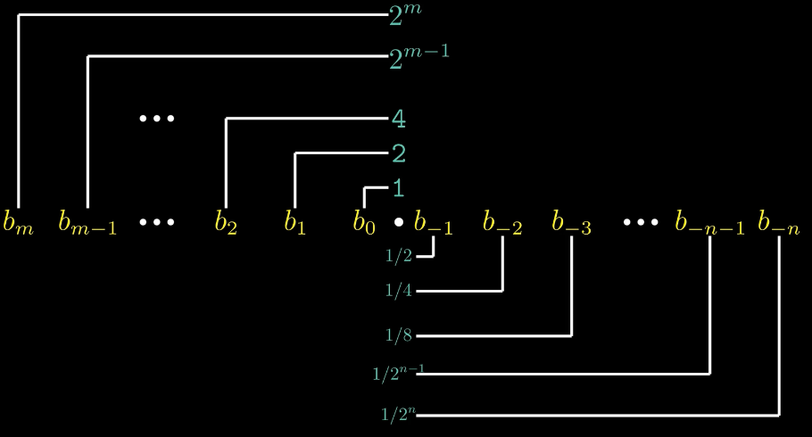 

对于这种定点表示方法，并不能很有效的表示非常大的数。

## 4.2IEE浮点表示

IEEE的关于浮点数的表示

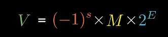 

关于图中的这个表达式，涉及三个变量：符号s、阶码E和尾数M

下面我们通过以单精度浮点数为例，看一下二进制位与浮点数之间的关系

例如C语言中`float`类型的变量占4个字节，32个比特位，这32个比特位被划分成3个字段来解释，具体表示如图所示

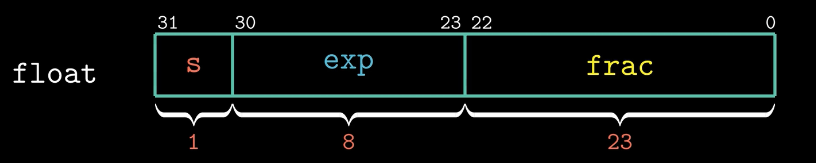 

其中最高位31位表示符号位s。当s=0时，表示正数；s=1时则表示负数。从第23位到30位，这8个二进制位与阶码的值E是相关的。剩余的23位与尾数M是相关的

对于64位双精度浮点数，其二进制位与浮点数的关系如图所示

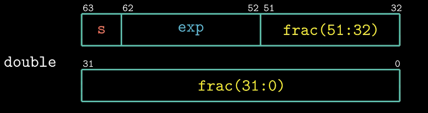 

与单精度浮点数相比，双精度浮点数的符号位也是1位。但是阶码字段的长度为11位，小数字段的长度为52位

浮点数的数值可以分为三类：第一类是**规格化的值**，第二类是**非规格化的值**，第三类是**特殊值**

其中**阶码**的值决定了这个数是属于其中哪一类

1、当阶码字段的二进制位不全为0，且不全为1时，此时表示的是规格化的值。

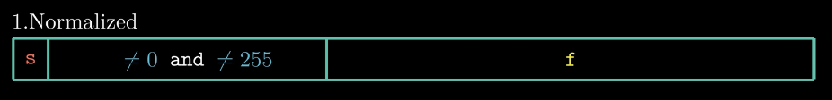 

2、当阶码字段的二进制位全为0时，此时表示的数值是非规格化的值。

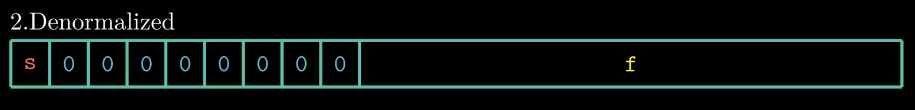 

3、当阶码字段的二进制位全为1时，表示的数值为特殊值。

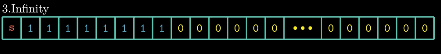 

特殊值分类为两类，一类表示无穷大或者无穷小，另外一类表示“不是一个数”。

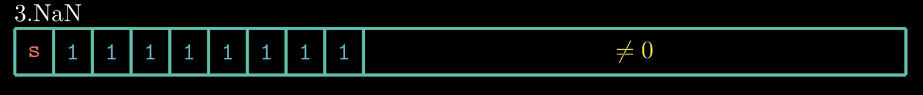 

### 4.2.1规格化的值

当表示规格化的值时，其中阶码字段的取值范围如图所示。

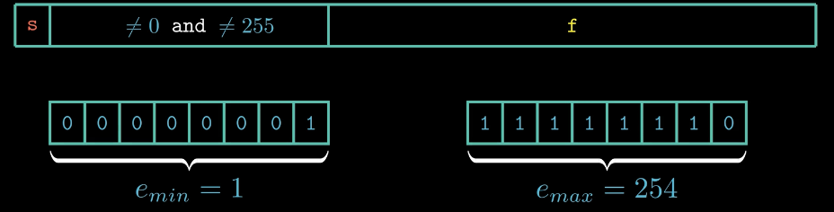 

最小值是1，最大值是254。为了方便表述，我们用小写字母e来表示这个8位二进制数，需要注意的是阶码E的值并不等于e (8个二进制位)所表示的值，而是e的值减去一个偏置量，偏置量的值与阶码字段的位数是相关的。

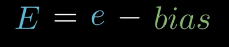 

当表示单精度的值时，阶码字段的长度为8，偏置量等于127

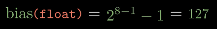 

当表示双精度的数时，阶码字段的长度为11，偏置量等于1023

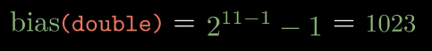 

因此，结合 e 的范围[1,254]对于单精度浮点数，阶码 E 的取值范围是[-126,127]

尾数 M 被定义为 1+f ，尾数 M 的二进制表示如图所示

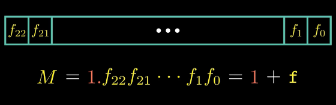 

因为我们可以调整 E 的取值，使得尾数 M 的取值范围大于等于1，小于2。既然第一位总是1，那么就没有必要显示的表示出来，这就是为什么尾数M的值需要加1，这个加1的地方需要特别记住。

在了解了符号位、阶码字段以及小数字段所表示的数值之后，就可以根据浮点数的计算公式来计算出对应的数值。

### 4.2.2非规格化的值

当阶码字段的二进制位全为0时，所表示的是非规格化的值，关于非规格化的数有两个用途：

一是提供了表示数值0的方法，当符号位s等于0，阶码字段全为0，小数字段也全为0时，此时表示正零。当符号位s等于1，阶码字段全为0，小数字段也全为0时，此时表示负零。根据IEEE的浮点规则，正零和负零在某些方面被认为不同，而其他方面是相同的

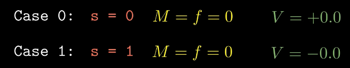 

非规格化的数另外一个用途就是可以表示非常接近0的数。当阶码字段全为0的时，阶码E的值等于1-bias，而尾数的值M等于f，不包含隐藏的1。这与规格化的值的解释方法不同，需要特别注意。（下图左侧是非规格化的解释方法，右侧是规格化的解释方法）

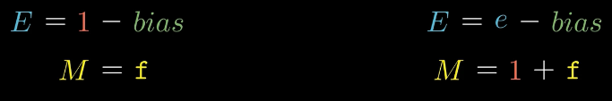 

### 4.2.3特殊值

当阶码字段全为1，且小数字段全为0时，表示无穷大的数。无穷大也分为两种，正无穷大和负无穷大。如果符号位s等于0时，表示正无穷大；符号位s等于1，表示负无穷大。

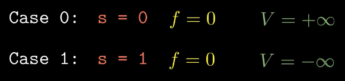 

此外，还会遇到一些运算结果不为实数或者用无穷也无法表示的情况。

这里引人一个新的概念：“不是一个数”(Not a Number)。

例如我们对-1进行开方运算或者无穷减无穷的运算，此时得到的结果就会返回NaN。

当阶码字段全为1，且小数字段不为0时,可以表示NaN (Not a Number)。

### 4.2.4数字示例

以上就是浮点数三类数值的表示规则，为了更加直观的理解，看一个8位浮点数的表示的例子，这个示例假定符号位长度为1，阶码字段的长度为4，小数字段长度为3。

#### 非规格化的数

对于非规格化数0的表示，我们可以看到阶码字段和小数字段全都为0，对于其他非常接近0的非规格化数，我们可以看到其中阶码字段全部为0。

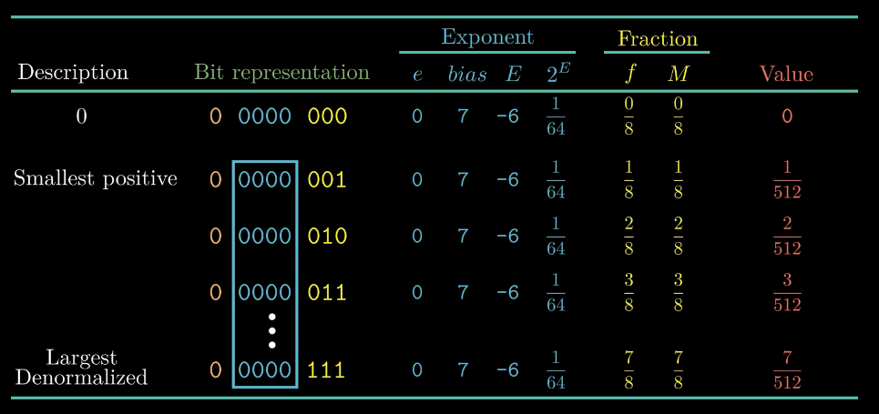 

小数字段的取值范围从001~111，这个小数字段所对应的尾数的值如图所示。

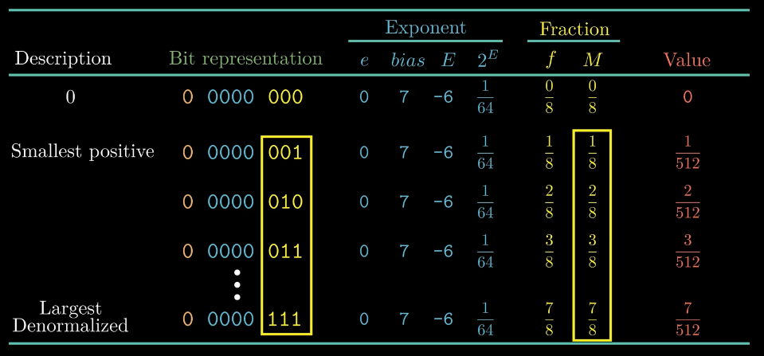 

最终，这个8位浮点数的数值是由阶码的幂与尾数相乘之后得到。

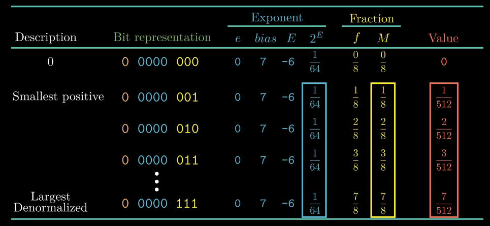 

#### 规格化的数

首先看一下规格化数的最小值是如何表示的。阶码字段的二进制数值为0001，长度为4的阶码所对应的偏置量是7，根据计算公式可以得到阶码E的值为-6，由于小数字段为0，因此尾数M等于1，最终得到的最小值V等于1乘以2的-6次方。

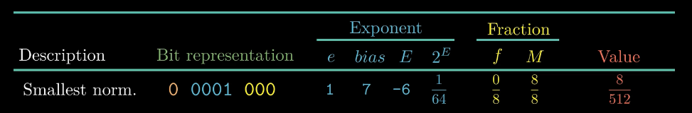 

不断的增大阶码，会获得更大的规格化的值

当阶码字段为1110，小数字段为111时，此时可以得到最大的规格化的值240。当阶码字段全为1且小数字段全为0时，可以表示无穷大

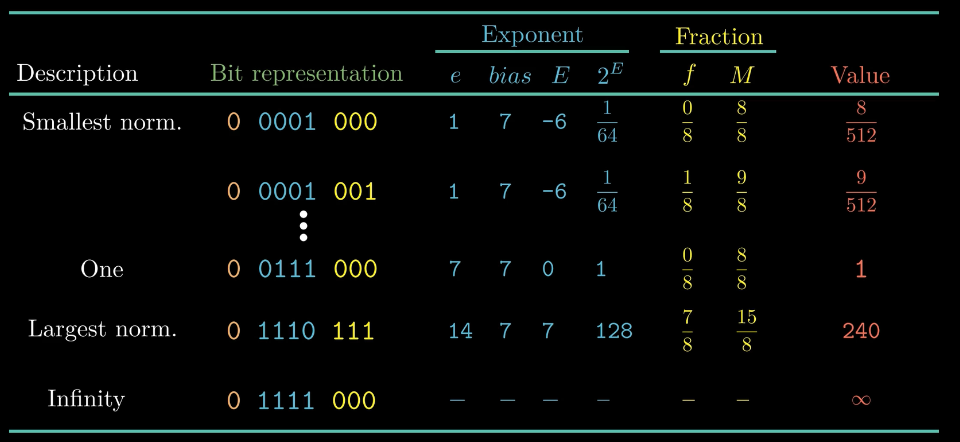 

## 4.3舍入

对比整型数12345与单精度浮点数12345.0的二进制表示：

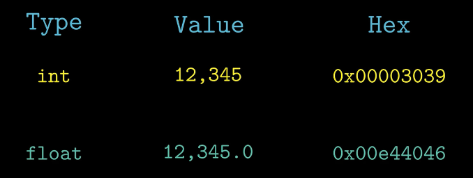 

通过移位，我们发现二者的有一段数位是相同的

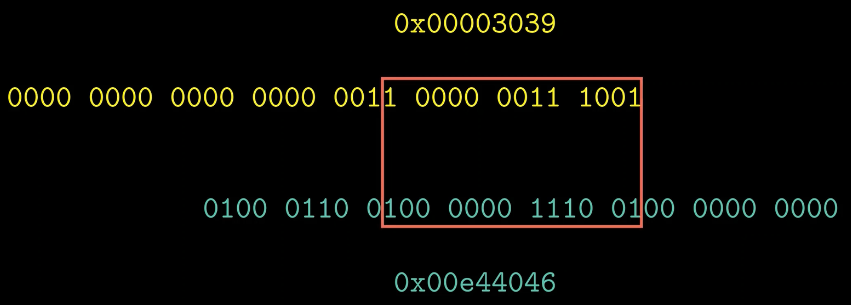 

### 4.3.1整型转单精度浮点型

接下来我们将整型数12345转换成浮点数12345.0，通过转换过程，我们将会了解这段匹配数位是如何产生的。

整型数12345，其二进制数的表示如图所示。

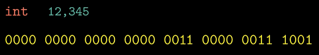 

虽然``int``类型的变量占32个比特位，由于该数的高18位都等于0，以将高18位忽略，只看低14位。

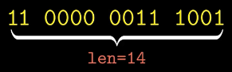 

根据规格化数的表示规则，我们可以将12345用图中的方式来表示：

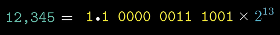 

根据我们IEEE浮点数的编码规则，我们将小数点左边的1丢弃，由于单精度的小数字段长度为23，我们还需要在末端增加10个零：

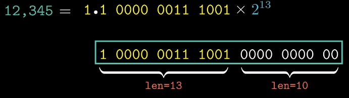 

这样我们就得到了浮点数的小数字段，从12345的规格化表示可以发现阶码E的值等于13，由于单精度浮点数的bias等于127，因此根据公式E=e-bias，可以计算出e的值等于140，其二进制表示如图所示：

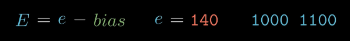 

这样一来，浮点数的阶码字段也得到了，最后，再加上符号位的0。整个单精度浮点数的二进制表示就构造完了。

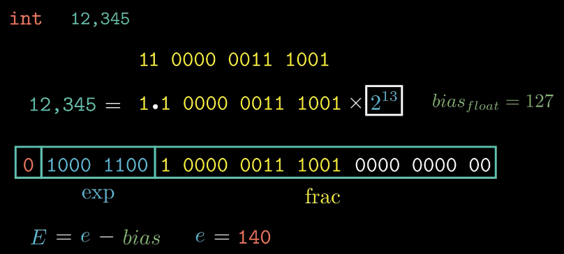 

通过这个构造过程，我们可以发现之前提到的匹配的字段是如何产生的，由于表示方法的原因，限制了浮点数的范围和精度，所以浮点运算只能近似的表示实数运算。

### 4.3.2舍入的概念

对于值x，可能无法用浮点形式来精确的表示，因此我们希望可以找到“最接近的值 x' 来代替x，这就是舍入操作的任务。

一个关键的问题就是在两个可能的值中间确定舍入方向，例如一个数值1.5，想把该数舍人到最接近的整数，舍入结果应该是1还是2呢?

IEEE浮点格式定义了四种不同的舍人方式，分别是：

-   向偶数舍入
-   向零舍入
-   向下舍入
-   向上舍入。

向下舍入和向上舍入的情况比较简单，向下舍入总是朝向小的方向进行舍入，而向上舍入总是朝向大的方向进行舍入。

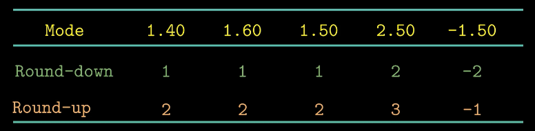 

向零舍入就是把正数进行向下舍入，把负数进行向上舍入。将这种舍入规则映射到数轴上，可以发现舍入是朝向零的方向。

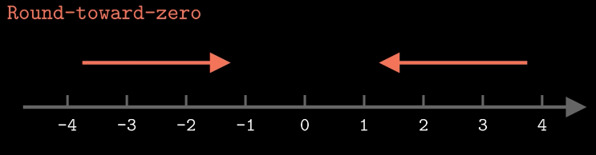 

第四种舍入方式就是向偶数舍入，也被称为向最接近的值进行舍入。

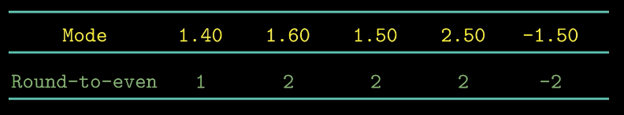 

需要注意的是当遇到两个可能结果的中间数值时，舍入结果应该如何计算，向偶数舍入的结果要遵循最低有效数字是偶数的规则，因此1.5的舍入结果究竟是1还是2，取决于1和2哪个数是偶数

乍一看，向偶数舍入这种方式有点随意，为什么要偏向取偶数呢?

如果总是采用向上舍入，会导致结果的平均值相对于真实值略高；如果总是采用向下舍入，会导致结果的平均值相对于真实值略低。向偶数舍入就避免了这种统计偏差。使得有一半的情况需要向上舍入，有一半的情况需要向下舍入。

对于不想舍入到整数的情况，向偶数舍入的方法同样适用。我们只需要考虑最低有效位是偶数还是奇数即可。

例如，我们将图中的两个十进制小数精确到百分位。

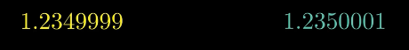 

由于这两个数并不在1.23和1.24正中间，所以两个数的舍人结果分别为1.23和1.24，并不需要考虑百分位是否是偶数。

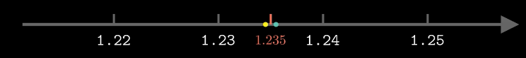 

由于**1.235**在1.23与1.24中间，这时我们需要考虑百分位是否是偶数的情况，因此舍入结果是1.24。

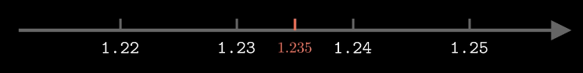 

类似的情况，向偶数舍入也可以用在二进制小数上，将最低有效位的值0认为是偶数，1认为是奇数。例如二进制小数10.11100，当舍入需要精确到小数点右边2位时，由于这个数是两个可能值（11.00和10.11）的中间值，根据向偶数舍入的规则，舍入结果为11.00。

## 4.4浮点运算

列如图中的两个表达式，其中表达式1的计算结果等于0.0，而表达式二的计算结果等于3.14。

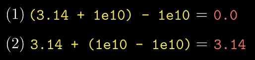 

这是由于表达式1在计算3.14与1e10相加时，对结果进行了舍入，值3.14会丢失，因此，对于浮点数的加法是不具有结合性的。

同样由于计算结果可能发生溢出，或者由于舍人而失去精度，导致浮点数的乘法也不具有结合性。

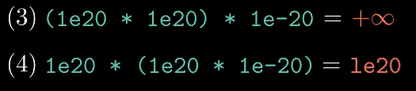 

此外，浮点乘法在加法上不具备分配性。

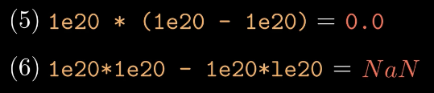 

对于从事科学计算的程序员以及编译器的开发人员来说，缺乏结合性和分配性是一个比较严重的问题。

C语言提供了两种不同的浮点数据类型：单精度`float`类型和双精度`double`类型。当`int`，`float`、`double`不同数据类型之间进行强制类型转换时，得到的结果可能会超出我们的预期。

当`int`类型转换成`float`类型时，数字不会发生溢出，但是可能会被舍入。这是由于单精度浮点数的小数字段是23位，可能会出现无法保留精度的情况。

当`int`类型或者`float`类型转换成`double`类型时，由于`double`类型具有更大的范围，所以可以保留精确的数值。

从`double`类型转换成`float`类型，由于`float`类型所表示数值的范围更小，所以可能会发生溢出。

此外，`float`类型的精度相对于`double`较小，转换后还可能被舍入。

将`float`类型或者`double`类型的浮点数转换成`int`类型，一种可能的情况是值会向零舍入，例如1.9将被转换成1，-1.9将被转换成-1；另外一种可能的情况是发生溢出。                                                                             
