这一章的主要内容是优化程序的性能，使程序运行的更快。

编写高效的程序需要做到以下几点

首先是选择适当的算法和数据结构；

第二点是要理解编辑器的能力和局限性，有时候稍微改动一下源代码，可以导致编译器在优化方式上产生很大的改变；

第三是处理运算量特别大的问题时，可以将一个任务划分成多个部分，不同的部分可以在不同的处理器核上并行的计算

# 1优化编译器的能力和局限性

## 1.1编译器优化程序的局限性

接下来看一下编辑器优化程序的局限性。

例如图中这两个函数

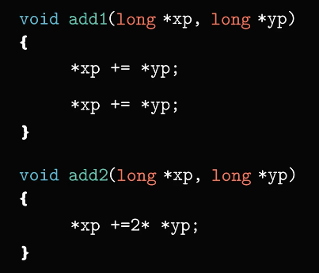 

乍一看，二者的功能似乎是一样的，他们都是将指针`yp`所指向的数两次加到指针` xp `指向的数。不过函数add2的执行效率更高一些。

这是因为函数add1需要执行6次内存引用，其中包含两次读`xp`指向的内存位置，两次读`yp`指向的内存位置
以及两次写`xp`指向的内存位置

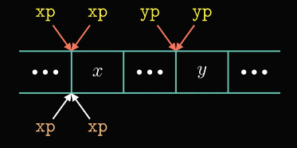 

然而函数add2只需要执行3次内存引用，包含一次读`xp`指向的内存位置
一次读`yp`指向的内存位置，以及一次写`xp`指向的内存位置

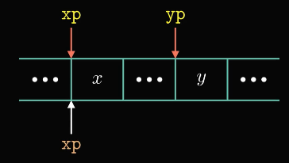 

既然函数add2的执行效率比函数add1高，那么能不能用函数add2的计算方式作为函数add1的优化版本呢？

这里我们考虑一个特殊情况，当`xp`和`yp`指向的内存位置相同时，函数add1的执行结果是`xp`的值增加4倍，而函数add2的执行结果是`xp`的值增加了3倍。当编译器在优化代码时，会假设`xp`和`yp`有可能指向同一个内存位置，因此，不能用函数add2的代码作为函数add1的优化版本

## 1.2内存别名

我们将两个指针可能指向同一个内存位置的情况称为内存别名引用

我们再来看一个类似的例子

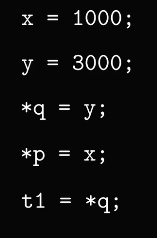 

由于图中这段代码并没有给出指针`p`和指针`q`的初始化代码

假设指针`p`和指针`q`指向不同的内存位置时，第三行代码用y的值对指针`q`所指向的内存位置进行了赋值，可以推断出t1的值就等于3000

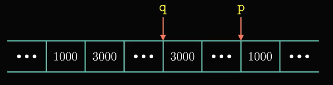 

当指针`p`和指针`q`指向同一个内存位置时，我们再来看一下这段代码的执行结果
在执行完第三行代码后，此时指针`q`所指向的内存位置的数值为3000

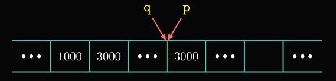 

虽然第四行代码是用 x 的值对指针`p`所指向的内存位置进行赋值，但是由于指针`p`和指针`q`指向了相同的位置，在这种情况下，t1的值等于1000

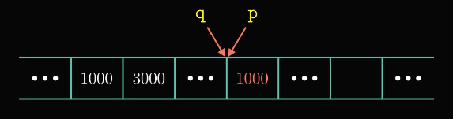 

通过这个例子可以看出，如果编译器器无法确定两个指针是否指向同一个位置，那么编译器就会假设所有的情况都有可能发生，这就限制了可能的优化策略 

## 1.3函数调用

另外一个妨碍优化的因素是函数调用，我们还是通过一个例子来看一下

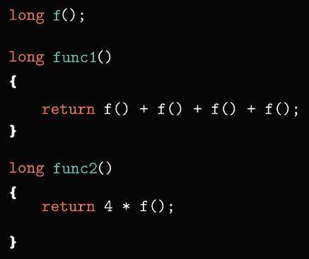 

如果忽略函数 f 的具体内容，乍一看这两个函数的执行结果是相同的，但是func2只调用了 f() 1次，而func1却调用了 f() 4次，显然func2的执行效率是高于func1的，那么能不能把func2的代码作为func1的优化方式呢？

我们假设函数 f 的内容是这样的，具体如图所示

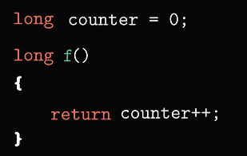 

其中 counter 是一个全局变量，每次调用函数 f 都会改变 counter 的值
假设程序开始运行时，变量 counter 的初始值为0，当函数func1被调用时，实际执行中对函数 f 发生了4次调用，每次都要用函数 f 得到的返回值都是不同的。第一次函数 f 的返回值为0，第二次是1，第三次是2，第四次是3，所以函数func1执行完毕后的返回结果是6；

由于函数func2只调用了一次函数 f ，所以函数func2执行的返回结果是4乘以0

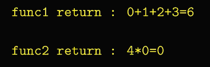 

因此，大多数编译器不会把func1优化成func2的形式

由于编辑的优化并不是特别的激进，所以需要程序员花费更多的精力来编写高质量的代码

# 2表示程序的性能

接下来我们通过一个例子来看一下如何表示程序的性能

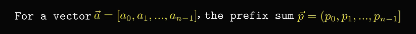 

对于一个向量 a包含 n 个元素，其中 n 是一个变量，现在我们需要计算出向量 a 的前置和，并且保存到向量 p 中

关于前置和的计算过程是： P0等于 a0，P1等于 a0加 a1，Pn -1等于 a0加 a1，一直加到 an-1，具体如图所示

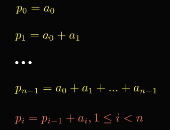 

现在我们用一个程序来计算向量 a 的前置和

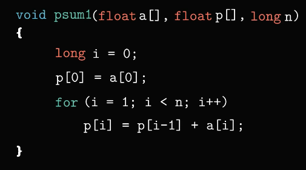 

向量 a 的元素存储在数组 a 中，计算结果将保存在数组 p 中，n 表示向量的个数
函数 psum1 通过一个for循环实现了上述功能，每一次迭代计算一个元素的值，具体如图所示。

这种实现方法是比较常用的，也非常容易理解，不过还有更加高效的实现方法，具体如图所示

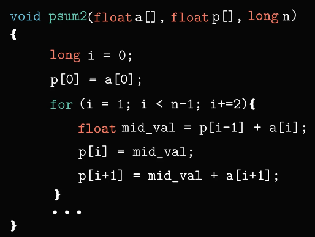 

虽然函数 psum2 也是采用了for循环来实现，与 psum1 不同的是，psum2依次迭代可以计算出两个元素的值，我们将这种技术称为循环展开

接下来，我们对比一下函数 psum1 和 psum2 的性能

当 n 的数量不断增大时，程序执行所需要的时间也在增大，具体如图所示

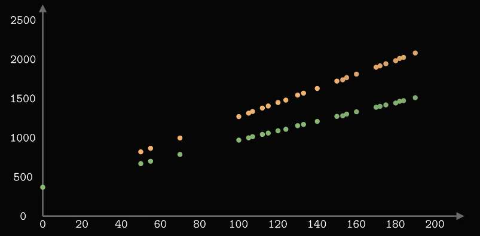 

其中横坐标表示元素的个数，纵作标表示时钟周期数，我们可以使用最小二乘法拟合出两条近似的直线，这两条直线近似的表示出随着数组元素 n 的增加，两个函数执行所需要的时钟周期数的变化情况

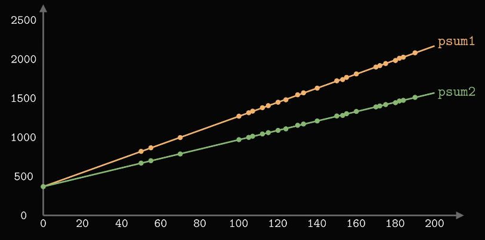 

函数 psum1 的运行时间可以近似的用 368+9\*n 来表示，函数 psum2 的运行时间
可以近似的用 368+6\*n 来表示，其中6和9被称为线性因子

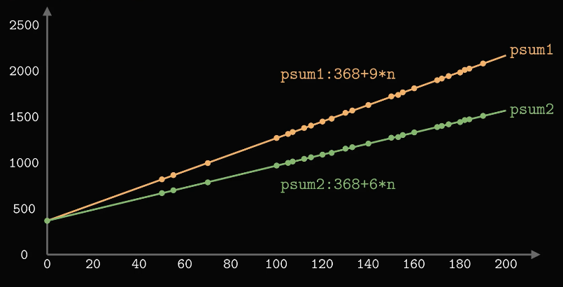 

从图中可以看出，当 n 的值较大时，运行时间主要由线性因子来决定。为了评估程序的性能，这里我们引入一个新的度量标准——CPE，CPE 表示每个元素执行所需要的周期数，而不是每次循环所需要的周期数。

针对执行重复计算的程序来讲，CPE 这种度量标准可以帮助我们更好的理解迭代程序的性能

根据上述度量标准，psum2的 CPE 为6.0，psum1的 CPE 为9.0，所以我们在优化程序的性能时，应该集中精力减小计算的 CPE

# 3程序示例

首先我们给出一个向量的抽象数据类型，它有两个内存块来表示，分别是向量的头部和指定长度的数组，我们可以将向量的头部声明为一个结构体，具体如图所示

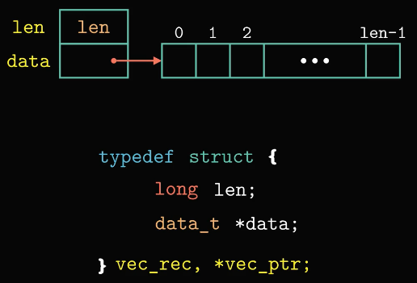 

其中`len`表示向量的长度，`data_t`表示向量元素的数据类型，这样的声明方式，方便我们测试相同的程序在处理不同类型的数据时的性能

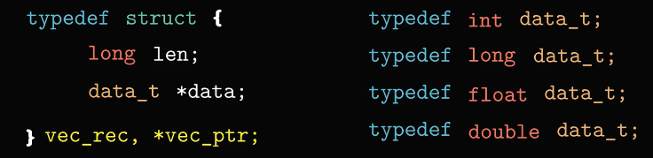 

除此之外，我们还会分配一个长度为`len`，数据类型为`data_t`的数组来存放向量的元素

首先我们看一个代码示例

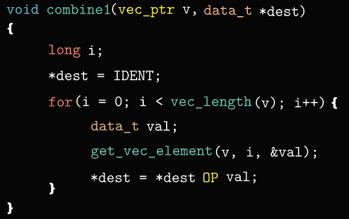 

图中这段代码可以实现对向量的所有元素进行求和或者求积的运算。我们可以通过`define`来确定程序执行哪一种运算

当 IDENT 为0，OP 为加法符号时，函数执行向量元素的求和运算；当 IDENT 为1，OP 为乘法符号时，函数执行向量元素的乘积运算

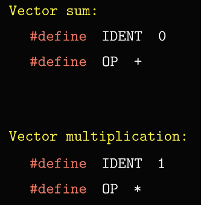 

其中函数 vec_length 是用来获取向量的长度，函数 get_vec_element是用来获取向量的第 i 个元素的值，结果保存在变量 val 中

接下来，我们会对这段代码进行一系列的优化。为了评估不同版本的程序性能我们会在一台 intel Core i7 Haswell 的机器上测试这些函数的性能

首先我们看一下函数 combine1 的执行效率

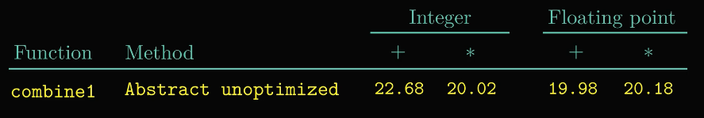 

实验过程中，我们分别用整型数据和浮点数据进行了加法和乘法的运算，在没有进行任何优化的情况下，我们记录了函数 combine1 的运行时间。这里用 CPE 来度量，CPE 表示每个元素执行所需要的时钟周期数，因此，CPE 越小，表示程序执行的越快。

当我们对函数 combine1 在编译时，采用`-O1`的优化选项时

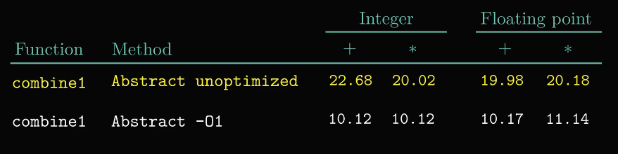 

通过测试数据可以发现，在没有修改程序源代码的情况下，单纯靠编译器的优化就能够显著提升程序的性能

# 4消除循环的低效率

接下来，我们看一下如何通过优化代码来提升程序的性能

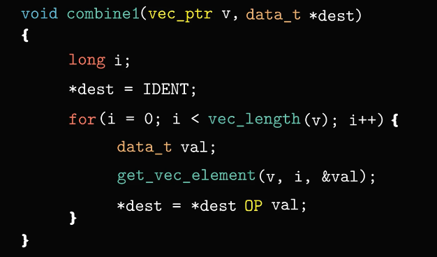 

在函数 combine1 中，for循环的测试条件是通过调用函数 vec_length 来获取向量的长度，这样一来，每次循环迭代时都要调用这个函数进行求值，实际上，向量的长度并不会随着循环的进行而改变，所以我们可以在循环开始之前就调用函数 vec_length，然后将结果复制给局部变量 length，这样一来，就不用每次迭代时都执行一次函数调用。我们将这种优化方式称为代码移动

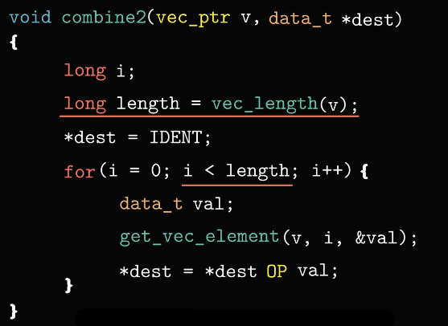 

接下来，我们看一下经过优化后的程序的执行效率

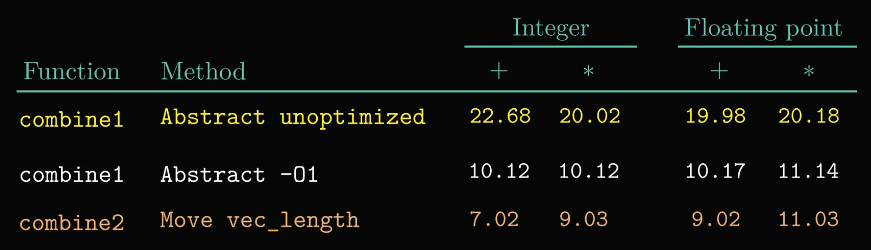 

通过测试数据可以看出，虽然代码改动非常简单，不过运算效率的提升还是比较明显的。

可能很多同学会有这样的疑问，为什么编译器无法自动完成代码移动来提升程序的性能呢？
这是因为编译器无法判断进行代码移动后会不会产生副作用编译器首先要保证程序可以得到正确的结果，其次才是优化出高性能的代码，所以为了提升程序的性能，这类优化需要程序员来完成。

我们再来看一个例子，这个程序是将字符串中的所有大写字母转换成小写字母。

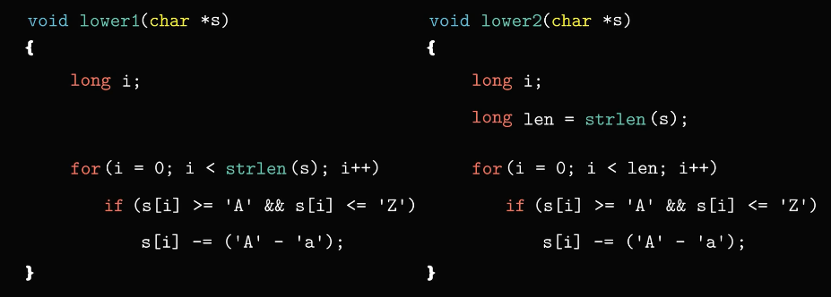 

除了把对函数 strlen 的调用移到了循环以外，图中这两个函数是一样的。接下来我们看一下这两个函数运行所需要的时间

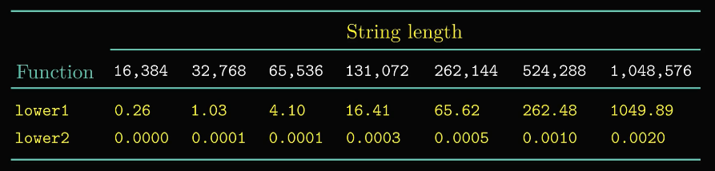 

图中展示了7个不同长度的字符串的运行时间，对于函数 lower1来说，字符串长度每增加一倍，运行时间都会变为原来的4倍。对于一个长度为100万的字符串，函数 lower 1竟然需要运行17分钟。

这个例子说明了程序开发中一个常见的问题，一个看上去并不重要的代码片段却能够导致严重的性能问题。所以一个有经验的程序员应该避免这类问题的出现

# 5减少过程调用

既然减少函数调用的次数可以提升程序的性能，我们可以看到函数 combine2 中还有一个函数调用

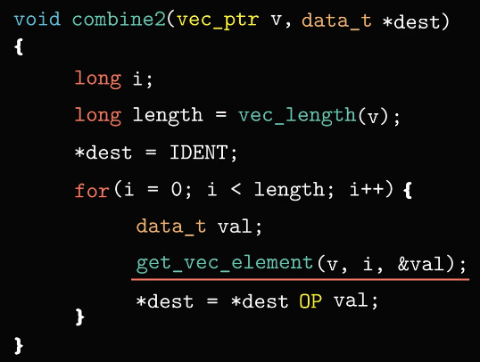 

如果把这个函数调用也优化了，也许性能还会有一定的提升
为了消除这个函数调用，我们引入了一个新的函数，他可以返回数组的起始地址

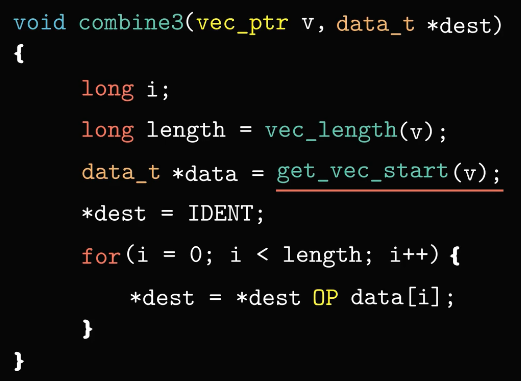 

经过优化后，函数 combine3 中的循环没有了函数调用，取而代之的是
采用直接访问数组的方式来获取向量的元素

我们再来对比一下函数调用与直接数据访问的性能差异

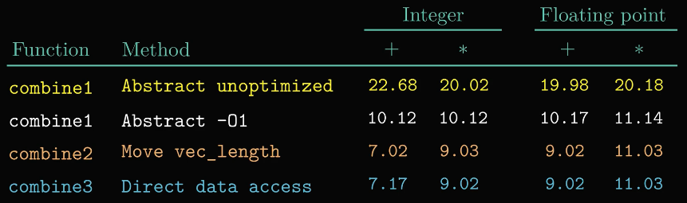 

令人遗憾的是，虽然消除了循环中的函数调用，但是程序的性能并没有显著的提升，甚至整数求和的性能还下降了。因此我们可以推断，循环中可能存在其他的限制因素，他对性能的限制超过了函数调用，从而导致虽然我们消除了函数调用也于事无补。

# 6消除不必要的内存引用

为了找出这个限制因素，我们来看一下函数 combine3 的汇编代码

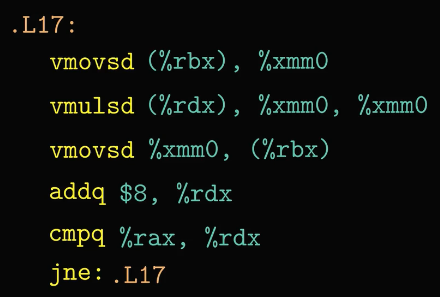 

从这段汇编代码可以发现，每次迭代时，累积变量的数值都要从内存中读出，然后再写入内存，其中涉及两次读内存和一次写内存的操作

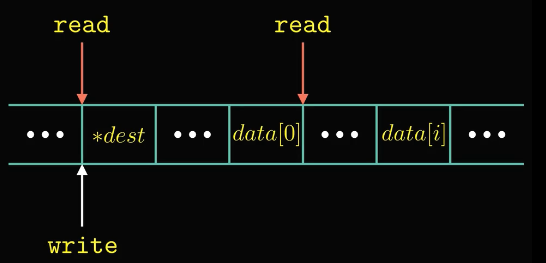 

实际上，这样的读写操作很浪费时间

为了消除不必要的内存引用，我们可以引入一个临时变量 acc，他用来记录累积的结果，直到循环结束后再把结果写回到目的地址，这样一来，每一次迭代只需要一次读内存的操作。

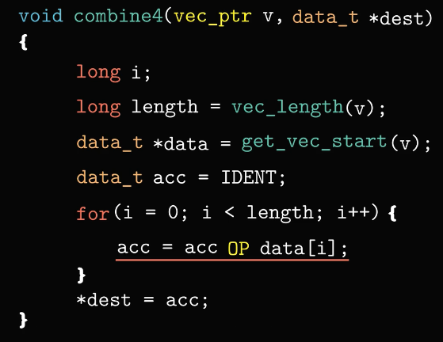 

接下来，我们看一下消除了内存引用之后，程序的性能是否有所提升

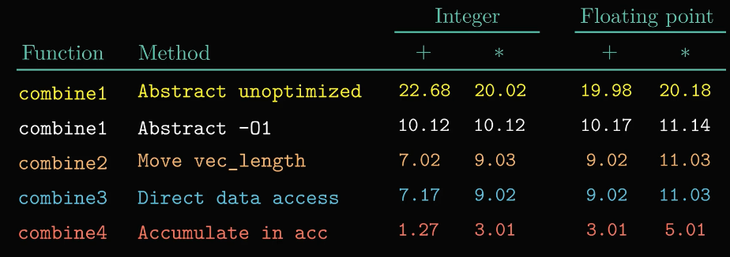 

通过测试数据可以发现程序的性能有了显著的提高，整数加法运算从每个元素需要7.17个时钟周期下降到了1.27个，浮点数的乘法也下降到了5.01个时钟周期。

csapp 原书中有一个习题，对函数 combine3采用了`-O2`的编译选项来优化，可以得到性能与 combine4 相当的效果，不过对于整数求和的情况除外

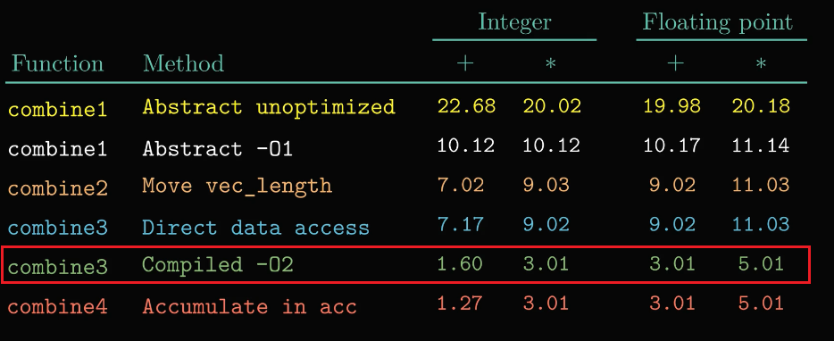 

综上所述，经过优化后的程序在计算每个元素时，大概需要1.25-5个时钟周期，与最开始需要9-11个时钟周期相比，执行效率有了相当大的提升

# 7理解现代处理器

想进一步提升程序的性能，我们必须考虑利用处理器的微体系结构来进行优化，说白了就是搞清楚现代处理器是如何执行指令的。在第四章中，我们讲述了处理器五级流水的实现，实际上现代处理器的内部结构要复杂的多，它能同时执行多条指令，我们将这种技术称为指令级并行。接下来我们看一下现代处理器是如何实现多条指令并行的

## 7.1整体操作

他的整体设计主要分为两部分：指令控制单元（ICU）和执行单元（EU）

指令控制单元负责从内存中读取指令序列，然后对指令进行译码，从而产生一系列的操作，相对于第四章讲述的译码操作，这里的指令译码要复杂一些，接下来，我们通过一个例子来说明一下

例如图中这条加法指令

 

他的源操作数和目的操作数都是寄存器，因此这条指令会被转化成一个加法操作，当一条指令包含内存引用和算数运算时，例如图中这条加法指令会被译码成三个操作

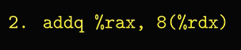 

分别为一个读操作，一个写操作以及一个加法操作

其中读操作是从内存中读取数据到处理器中

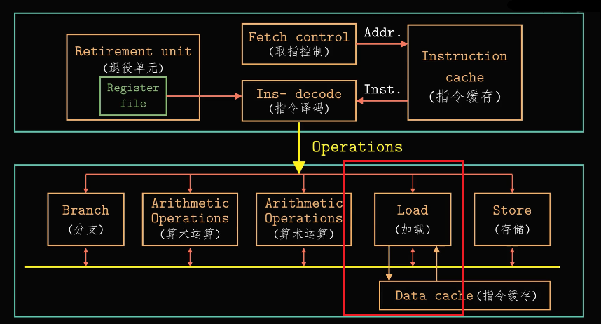 

加法操作是将从内存中读到的数值与寄存器中的数值进行相加

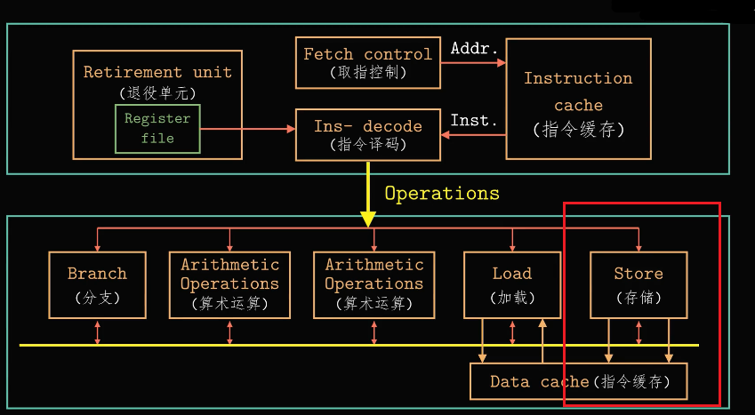 

写操作是将加法运算得到的结果写回到内存里

以上的译码操作对指令进行分解，允许任务在一组专门的硬件单元之间进行分割。其中读操作由加载单元来执行，而写操作由存储单元来执行，然后处理器的执行单元 就可以并行的执行多条指令的不同部分。

与第四章所介绍的顺序流水线相比，现在处理器的每个时钟周期可以执行多个操作，而且是乱续执行的。乱序执行的意思是允许指令的执行顺序与原始程序中的顺序不一致。

当执行遇到分支时，程序有两个可能的执行方向，其中一种可能是选择分支，另外一种可能是不选择分支。现代处理器采用分支预测技术来猜测是否选择分支，同时还会预测分支的目标地址，甚至在不确定分支预测是否正确之前就开始执行这些指令，如果之后发现分支预测错误，会将状态重新设置到分支点之前的状态，开始执行另外一个方向上的指令，我们将这种技术称为投机执行。

当采用这种技术执行指令时，执行结果暂时不会存放到寄存器文件或者内存中，直到可以确认应该执行这些指令时，再把结果写回到寄存器或者内存

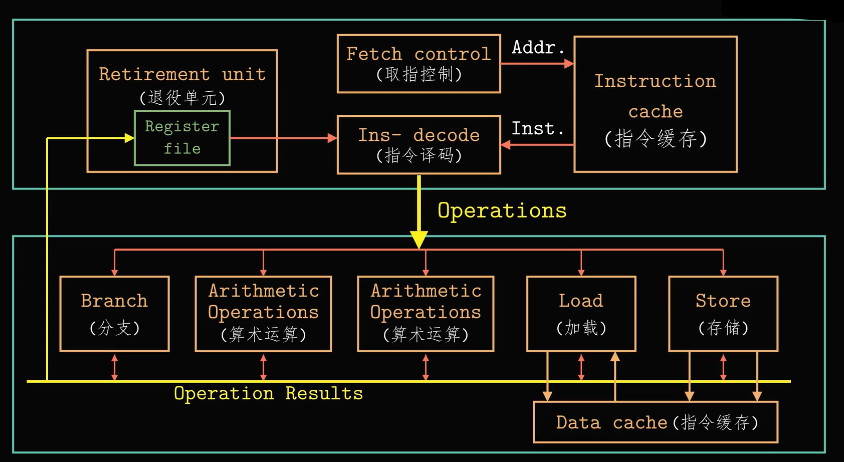 

分支操作被指令控制单元送到执行单元，注意这里的分支逻辑单元是用来确定分支预测是否正确，而不是确定分支该往哪里执行。如果预测错误，执行单元会丢弃分支点之后计算出来的结果，执行单元还会发信号告诉分支单元，预测是错误的，并指出正确的分支，此时，分支逻辑单元开始在新的位置取指。

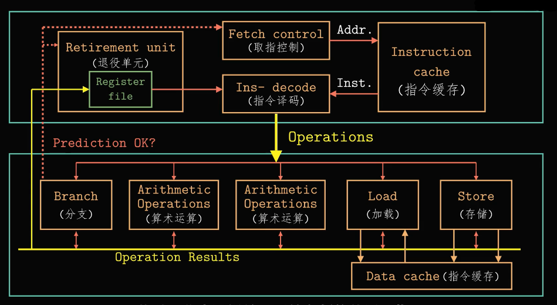 

在英特尔酷睿 i7 的处理器上，一共包含8个功能单元，我们用编号0-7来表示

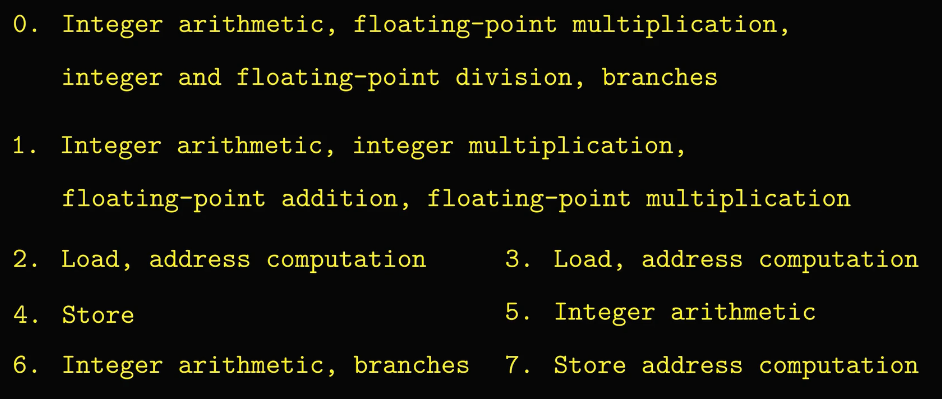 

例如编号为1的逻辑单元，可以执行整数运算、整数乘法，以及浮点数的加法和乘法，这里我们提到的整数运算包含加法、位级操作以及移位操作。

根据图中所列举的功能单元，我们可以统计出该处理器有4个功能单元可以执行整数运算，分别是单元0、单元1、单元5以及单元6

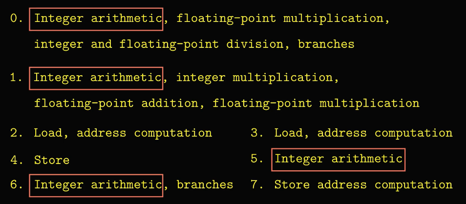 

之后我们可以看到这些计算资源对程序获得最大的性能所带来的影响

在指令执行单元中，还有一个退役单元，它包含寄存器文件，同时控制着寄存器的更新。指令在译码时，指令的相关信息被放置在一个先进先出的队列中，这些信息会一直保持在队列中，直到发生下列两种情况中的一个。当一条指令的操作完成了，而且所有引起这条指令的分支点也都被确认为预测正确，那么这条指令就可以退役了，所有对程序寄存器的更新也可以执行了。另外一个方面，如果引起该指令的某个分支点预测错误，也就是说这条指令不应该被执行，那么这条指令会被清空，丢弃所有计算出来的结果。通过这种方法，即使发生预测错误也不会改变程序的状态

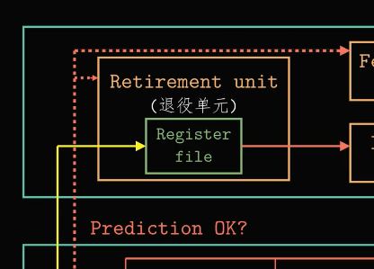 

## 7.2功能单元的性能

我们再来看一下这款处理器的算数运算性能，具体如图所示

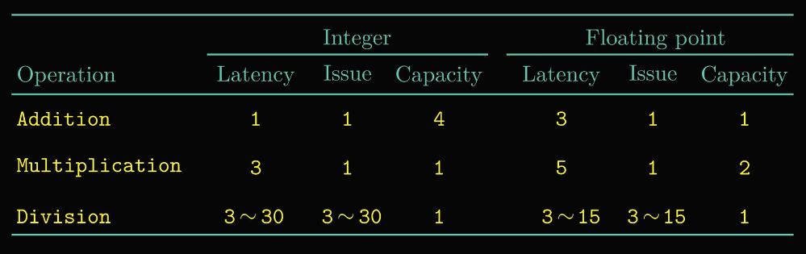 

表格中的数据有些是通过测试得到的，有些是从Intel的数据手册中得到的。
这个表格中涉及了三个名词：延迟、发射以及容量。

-   延时表示完成运算所需要的总时间，例如整数加法需要一个时钟周期，而整数乘法需要三个时钟周期
-   发射时间表示两次运算之间间隔的最小时钟周期数，例如两次整数加法之间需要间隔一个时钟周期，而除法需要间隔3-30个时钟周期
-   容量则表示执行该运算的功能单元的数量，例如当前这款处理器可以同时执行4个加法运算，所以整数加法的容量就是4

搞清楚了这三个名词的含义之后，我们可以发现浮点数的运算相对于整数运算
，需要更多的时钟周期数，对于除法运算，无论是整数除法还是浮点数除法，他的发射时间都等于延迟，这意味着在开始一条新的运算之前，除法器必须完成整个除法运算。

需要注意的是，除法运算的延迟和发射时间都是一个范围，而不是精确的时钟周期数，这是因为除法运算需要的时间还依赖于被除数和除数

虽然现代处理器的详细设计超出了本书的讲述范围，但是为了理解如何实现指令级并行又不得不去了解处理器的内部设计。

延迟、发射以及容量这些参数会影响到函数执行的性能，接下来，我们分别用延迟界限和吞吐量界限的 CPE 值来描述这种影响，具体如图所示：

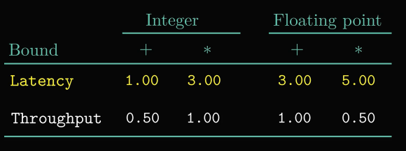 

对于任何必须严格按照顺序执行的合并运算，延迟界限给出了所需要的最小的 CPE 的值。延迟界限比较容易理解，对于吞吐量界限，理解起来可能稍微有点麻烦。

由于处理器只包含一个整数乘法器，它的发射时间为1个时钟周期，因此处理器不可能支持每个时钟周期大于 1 条乘法的速度

之前的课程中，我们提到过处理器中包含四个整数加法单元，理论上每个周期有可能执行 4 个整数加法的操作，然而不幸的是，由于需要从内存中读取数据，这就造成了另外一个吞吐量界限

两个加载单元限制了处理器每个时钟周期最多能够读取两个数据值，从而使得吞吐量的界限为0.5，接下来，我们会展示延迟界限和吞吐量界限对不同版本的合并函数的影响。

## 7.3处理器操作的抽象模型

在上文中，我们讲述了如何优化函数combine，到目前位置，函数combine4是运行速度最快的代码，通过图中表格可以看出，除了整数加法的情况，其他的测量值与处理器的延迟界限是一样的

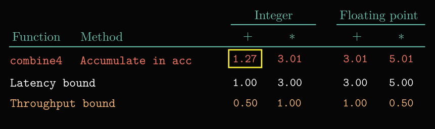 

这并不是巧合，他表明了该函数的性能是有所执行的求和或者乘积计算来决定的。

### 7.3.1从机器级代码到数据流图

通常在分析程序的性能时，我们会用到程序的数据流表示，这是一种图形化的表示方法。

数据流能够展示不同操作之间的数据相关是如何限制他们的执行顺序的，这些限制形成了性能的关键路径。

在函数combine4中，对于长度较大的向量来说，循环的执行是决定程序性能的主要因素，因此，我们重点看一下这段循环的执行

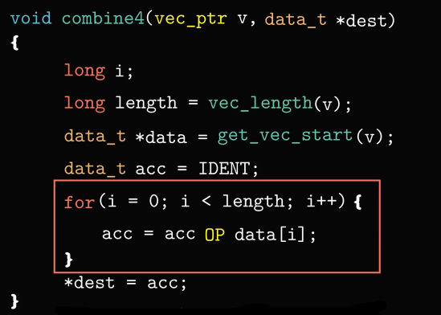 

图中这个循环编译出的代码由4条指令组成

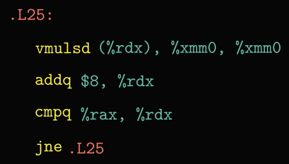 

其中寄存器`rdx`中存放着指向数组 data 第 i 个元素的指针，寄存器`rax`中存放着指向数组末尾的指针，寄存器`xmm0`中存放着累计值`acc`。每次执行乘法累积之后，运算结果都会存放到寄存器`xmm0`中

接下来我们看一下这段循环代码的图形化表示

顶部的矩形框表示循环开始时寄存器的值，而底部的矩形框表示最后的寄存器值。

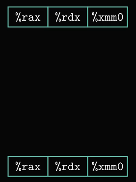 

例如，循环开始的第一条乘法指令被扩展成一个加载操作和一个乘法操作，具体如图所示

 

其中加载操作表示从内存中读取源操作数，乘法操作表示执行乘法运算，运算结果保存到寄存器`xmm0`中；第二条加法指令对寄存器`rdx`执行加 8 的操作，加法操作的结果写回到寄存器`rdx`

 

指令 cmp 用来比较寄存器`rdx`和寄存器`rax`是否相等，比较的结果会更新条件码寄存器

 

最后指令 jne 根据条件码寄存器的状态决定循环是否继续

 

以上就是我们根据汇编代码所画出的数据流图。

在这个过程中，有些操作产生的值不对应于任何寄存器，因此，基于这段循环代码，我们可以将访问到的寄存器分为四类

-   第一类是只读寄存器，它可以作为数据，也可以用来计算内存地址，这些寄存器在循环中是不会被修改的，例如寄存器`rax`就属于只读寄存器，它始终指向数组的结束位置。
-   第二类是只写寄存器，这类寄存器作为数据传送的目的寄存器，不过在我们的例子中，并没有用到这一类寄存器。
-   第三类是局部寄存器，这些寄存器在循环内部被修改和使用，两次不同的迭代之间是不相关的。在这个例子中，条件码寄存器就属于局部寄存器，cmp 操作会修改条件码寄存器的值，然后 jne 操作会使用条件码寄存器的值，需要特别注意的是局部寄存器的相关是存在于单次迭代之内的。
-   第四类是循环寄存器，这一类寄存器既要作为源操作数，又要作为目的值，也就是说一次迭代中产生的值会在另一次迭代中用到，例如寄存器`rdx`和寄存器`xmm0`就属于循环寄存器，因此，循环寄存器之间的操作链成为了限制程序性能的关键因素

接下来，我们对这个数据流图做出进一步的改进，调整的目标是只保留影响程序执行时间的操作以及数据相关的部分，我们对操作符进行了重新排列，调整后的数据流更清晰的表明了数据从顶部寄存器流向底部寄存器的过程。

 

由于比较操作和分支操作不直接影响程序的数据流，所以我们将这两个操作以及寄存器`rax`去掉，这样数据流图中只保留了循环寄存器以及关键操作，这样一来，剩下的部分可以看成一个抽象的模板

 

我们将图中的这个模板重复 n 次，就可以得到函数 combine4 内 n 次迭代的数据流表示，通过这张图我们可以看到，程序有两条数据相关链，分别对应于 mul 操作对程序值`acc`的修改以及 add 操作对 data+i 的操作的修改

 

假设浮点数乘法的延迟为5个时钟周期，而整数加法的延迟为1个时钟周期，那么左边的链会成为关键路径，需要 5n 个时钟周期的执行时间，而右边的链只需要 n 个时钟周期就可以完成，所以左边的这条链是制约性能的关键路径

### 7.3.2其他性能因素

我们对函数combine4 的 CPE 测试结果为1.27，然而根据图中左边和右边形成的相关链来预测的 CPE 为1.0，所以实际上测试值比预测值要慢一些。

这说明了一个问题，那就是用数据流表示的关键路径所提供的只是程序执行周期数的下界。实际上，还有一些其他因素会限制程序的性能，例如可用的功能单元的数量以及功能单元之间能够传递数值的数量。

当合并运算的操作数为整数时，虽然数据操作足够快，但是其他操作提供数据的速度不够快，如果想要精准的确定为什么程序中每个元素需要1.27个时钟周期，还需要获得处理器更详细的硬件设计才行。接下来，我们的优化会重新调整操作的结构，通过提高指令级的并行来降低 CPE。

# 8循环展开

在上文中，我们提到过向量前置和的计算问题，其中函数 psum2 使用了循环展开，就是每次迭代可以算出两个元素的值，这样一来，所需的迭代次数就可以减半。

 

使用循环展开可以从两个方面提升程序的性能，首先，循环展开可以减少与程序结果无关操作的数量，例如当迭代次数减半时，循环索引的计算以及条件分支这类操作都会减少。其次循环展开提供了一些方法，能够减少整个计算中关键路径的操作数量。

接下来，我们看一下对函数 combine 使用 2X1 的循环展开的代码实现

 

其中2表示每一次迭代处理两个数组元素，因此，每次迭代循环的索引值 i 需要加2，而不是加1。当向量的长度不是2的倍数时，想要使图中的代码对任意长度的向量都能得到正确的结果。

需要特别注意一下循环的界限问题，为了确保第一次循环不会超出数组的界限，对于长度为 n 的向量，我们将循环的界限设为 n-1，然后保证，只有当循环索引值 i 小于 n-1 时才会执行这个循环，那么最大的数组索引值 i+1 就等于 n

 

通过这种方法可以解决循环越界的问题

接下来，我们看一下这种变换所带来的性能提升

 

通过测试数据可以看出，对于整数加法，CPE 从1.27降到了1.01，之所以产生这样的结果是因为减少了循环开销操作。然而对于其他的情况，性能并没有提升，这是因为他们已经达到了延迟界限，简单的循环展开无法继续降低 CPE。

如果将每次迭代所能够计算的元素数从两个增加到三个，那么程序的性能会不会进一步提升呢？

 

通过测试3X1循环展开的情况可以看到，程序的性能的提升止步于延迟界限，那么为什么无法超越延迟界限呢？

接下来，我们通过函数 combine5 的汇编代码来研究一下原因

 

2X1的循环展开会产生两条 vmulsd 指令，第一条指令将 data[i] 加到 acc 上，第二条指令将 data[i+1] 加到 acc 上，其中循环的索引值 i 放在寄存器`rdx`中，每次循环执行加2的操作，数组的起始地址 data 放在寄存器`rax`中，循环的界限放在寄存器`rbp`中。

在7.3中，我们介绍了数据流图的相关知识。接下来，我们看一下这段汇编代码的图形化表示

 

每条 vmulsd 指令被翻译成两个操作，一个操作是从内存中加载一个数组元素，另外一个操作是把这个值乘以已有的累积值。

 

第二条 vmulsd 指令所执行的操作与第一条类似，每一条 vmulsd 指令都对寄存器 xmm0 执行了读操作和写操作。因此，每次迭代对寄存器 xmm0 一共执行了两次读操作和两次写操作。

当我们对这张图进行简化以及重排列之后，可以得到如图所示的模板

 

关于简化的原则以及方法，在7.3.1中有过详细的阐述。

对于一个长度为 n 的向量的计算，把这个模板复制（n/2） 次，可以得到如图所示的数据流表示

 

通过这个图可以看出，虽然迭代次数减半，但是关键路径上还有 n 个乘法操作。因此，无论是否执行循环展开，这条关键路径都是性能制约的主要因素

接下来，我们看一下如何通过提高并行性来提升程序的性能

 

图中这段代码不仅使用了两次循环展开，而且采用了两路并行的计算方法，其中索引值为偶数的元素累积在变量`acc0`中，而索引值为奇数的元素累积在变量`acc1`中。

对于向量长度不为2的倍数时，图中这个循环要累积剩下的数组元素，最后将 `acc0`和`acc1`进行合并运算，得到最终结果

 

我们将这种代码的实现方式称为 "2X2循环展开" 。

接下来我们看一下采用两路并行循环展开的执行效率

 

与只做循环展开相比，所有的情况都得到了提升。整数乘法、浮点数加法以及浮点数乘法的性能有了大幅度的提升，最关键的是，这种方法打破了延迟界限设下的限制，处理器不再需要延迟一个加法或乘法操作来等待前一个操作完成。

要想进一步理解程序性能提升的原因，我们还是来看一下函数 combine6 的汇编代码

 

与函数 combine5 相比，函数 combine6 的内循环也包括了两个 vmulsd 运算，但是他不仅用到了寄存器 xmm0，还使用了寄存器 xmm1。

接下来，我们看一下函数 combine6 的数据流图

 

通过2X2的循环展开，整个计算的关键路径变成了两条，一条对应于计算
索引值为偶数的元素的累积`acc0`，另外一条对应于计算索引为奇数的元素的乘积`acc1`，这样一来，每条关键路径只包含（n/2） 个操作，因此， CPE 从5.0下降到2.5。

 

如果将循环展开 k 次，每次并行计算 k 个值，程序的性能会不会继续提升？

 

通过测试数据可以发现，随着 k 值的增大，所有的 CPE 都有所改进，当 k 增大到 10，程序的性能接近吞吐量界限，与最原始的代码相比，性能提升了10-20倍。

除此之外，还有另外一种方法可以使程序的性能提高到延迟界限。之前，我们介绍过函数 combine5 的代码实现，现在我们调整一下括号的位置，具体如图所示：

 

我们把这种改变称为重新结合变换，这种括号顺序的改变实际上改变了向量元素与累积值`acc`的合并顺序，看上去这两个语句好像没有什么差别，但是当我们测量 CPE 的时候，得到的结果却令人吃惊。

 

虽然函数 combine7 的整数加法的性能与函数 combine5 相同，但是其他三种情况则与使用了并行累积变量的 combine6 相同，这说明，仅仅通过括号的改变就突破了延迟界限的限制。

为什么重新排列了元素的计算顺序之后，程序的性能会有显著的提升呢？

接下来，我们看一下函数 combine7 的汇编代码

 

其中指令 vmovsd 表示从内存中加载向量元素 data[i] 到寄存器 xmm0 中

第一条 vmulsd 指令表示从内存中加载向量元素 data[i+1]，然后第一个 mul 操作对二者执行乘法操作。

 

第二个乘法操作则是将刚才的结果乘以累计值`acc`。

 

与函数 combine5 相比，虽然加载和乘法运算的数量是相同的，但是只有一个乘法操作形成了循环寄存器之间的数据相关链，因此，将简化后的模板复制（n/2）次，我们可以看到关键路径上只有（n/2） 个操作，每次迭代内的第一个乘法操作都不需要等待前一次迭代的累计值就可以执行，因此可以大幅度降低 CPE。

 

综上所述，现代处理器具有相当的计算能力，但是我们可能需要按照一定的规
则来编写程序才能将这些能力展现出来。

# 9提高并行性

上文中介绍了如何使用循环展开来提升程序的性能，其中多路并行循环展开的实现方法表现突出。当并行路数达到10路时，程序的 CPE 接近吞吐量界限，此时如果继续增加并行路数，通过测试数据可以看出，程序的性能并没有提升，反而是有所下降。

 

接下来，我们通过二者的汇编代码来探究一下其中的原因。例如在10X10的循环展开中

 

累积变量`acc0`保存在寄存器 xmm0 中，程序只需要从内存中读取 data[i]，然后与这个寄存器相乘。

与之相比，20X20的循环展开有着非常大的差别。

 

通过这段汇编代码可以发现，累积变量并不是保存在寄存器中，而是保存在栈上（内存），因此，程序必须从内存中读取 data[i] 和累积变量这两个数值，然后再将二者相乘的结果保存回内存。

为什么20X20的累积变量要保存在栈上，而不是寄存器中？

这是因为现代处理器（x86-64）有16个寄存器来保存浮点数，一旦循环变量的数量超过了可用的寄存器的数量，编译器就会在战场栈上分配一些空间来保存部分变量。与直接使用寄存器相比，一旦将变量分配到栈上，会带来额外读写内存的开销，因此，多路并行的优势很可能就会消失。这就是为什么 20X20 的循环展开比 10X10 慢的原因。

不过幸运的是，大多数循环在出现寄存器溢出之前就达到了吞吐量界限，当 CPE 达到吞吐量界限时，即使有更多的寄存器，可以实现更多路数的循环展开，也是无法突破吞吐量界限的。

到目前为止，我们所有的代码以及运行的测试案例，只是访问相对比较少量的内存，我们还没有看到加载操作的延迟对程序性能的影响。

接下来，我们通过一个例子来看一个加载操作的延迟。

 

图中这个函数的功能是计算一个链表的长度，在这个循环中，变量`ls`的值依赖于 ls->next 的值，然后通过判断变量 `ls`是否指向链表的尾部来决定是否继续执行。

虽然整个函数的实现相对比较简单，但是通过测试表明，函数 list_len 的 CPE 为4.0，为了探究影响这个函数性能的关键因素，接下来，我们看一下这个 while 循环的汇编代码。

 

变量 len 存放在寄存器`rax`中，每次循环执行加1的操作，变量`ls`存放在寄存器`rdi`中，指令 movq 表示从内存中加载数据到寄存器`rdi`，其中`（%rdi）`表示这个加载操作的内存地址需要从寄存器`rdi`中读取。

 

我们可以发现后面的寄存器`rdi`每个值都要依赖于加载操作的结果，而加载操作又以寄存器`rdi`中的值作为他的地址，因此，直到前一次迭代的加载操作完成，下一次迭代的加载操作才能开始

 

因此，函数 list_len 的 CPE 等于4.0，是由加载操作的延迟决定的，事实上，这台测试机器的文档中给出了 L1 cache 的访问时间是4个时钟周期，这个测试结果与文档的参考数据也是一致的。

迄今为止所有的示例中，我们所分析的大部分内存引用都是加载操作，也就是从内存读取数据到寄存器中。与加载操作对应的是存储操作，他是将一个寄存器的值写到内存，存储操作并不会影响任何寄存器的值。通常情况下，存储操作不会产生数据相关，不过，当加载操作需要从存储操作写的那个内存位置读取数据时，加载操作和存储操作之间可能会相互影响。

接下来，我们通过一个代码示例来看一下其中的影响。

 

当我们对图中这个函数分别传入两组不同的参数时，

 

通过性能测试表明示例A的 CPE 等于1.3，示例B的 CPE 却等于7.3，由于示例B中参数 src 和 dest 指向了同一个内存位置，使得内存读的结果依赖于最近的内存写的操作，我们将这种情况称之为写/读相关。

为了探究二者的性能差异，我们来看一下这个循环的汇编代码。

其中指令movq被翻译成两个独立的操作，一个是计算存储操作的地址s_addr，另外一个是将数据加载到内存的操作s_data。

 

对于下一条 movq 指令所执行的加载操作需要从寄存器`rdi`处读取数据，我们将寄存器`rsi`中保存的地址即为 addr1，寄存器`rdi`中保存的地址即为addr2

 

如果两个地址相同，加载操作必须等待 s_data 操作完成之后才能读取数据，否则就会读到错误的数据，如果两个地址不同，两个操作就可以独立进行了，这就是写/读相关所导致的处理速度下降。

综上所述，关于内存操作的实现包括许多细微之处，对于寄存器的操作，在指令被译码成具体操作的时候，处理器就能确定哪些指令之间存在相关性，而对于内存操作，只有当加载地址和存储地址被计算出来之后，才能确定哪些指令之间会相互影响。

最后，我们总结一下，程序性能优化的基本策略

1.  针对具体的问题选择适当的算法和数据结构
2.  遵循一些基本的编码原则，例如消除连续的循环调用以及消除不必要的内存引用
3.  根据硬件的设计，利用循环展开等技术来提高指令级并行，不过，需要特别注意的是避免在重写程序时引入错误，尤其是引入新的变量以及改变循环边界时，很容易犯错，需要充分测试新版本的代码，确保他们与原来的代码产生一样的结果
