# 1存储技术

这一章我们主要来介绍一下计算机系统内的存储器。作为一个程序员，我们需要理解存储器的层次结构，因为它对应用程序的性能有着巨大的影响。

如果程序需要的数据存储在寄存器中，那么指令在执行时，就可以立即使用这些数据；如果数据存储在cache（高速缓存）中，那么获取这些数据需要4-75个时钟周期；当数据存储在内存中，则需要几百个时钟周期；如果数据存储在磁盘上，就需要大约几千万个时钟周期。

由于不同的存储器采用了不同的存储技术，因此，导致了访问速度以及价格方面的差异。

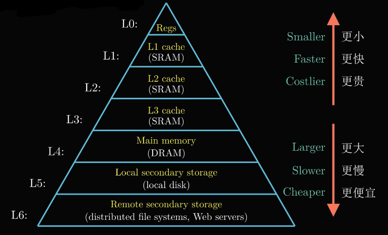 

接下来，我们详细介绍一下这些存储技术。

## 1.1随机访问存储器

首先，我们来看一下随机访问存储器(Random-Access Memory)，简称**RAM**，RAM分为两类，静态RAM和动态RAM，在后续的描述中，我们将采用英文缩写**SRAM**表示静态RAM，**DRAM**表示动态RAM。

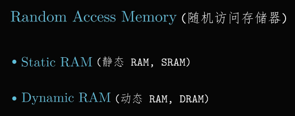 

由于SRAM与DRAM的结构不同，导致了二者存在访问速度上的差异，其中SRAM将每个 bit 位的信息存储在一个双稳态的存储器单元内，每个存储器单元需要6个晶体管来实现。关于双稳态结构，我们可以借助钟摆模型来理解。

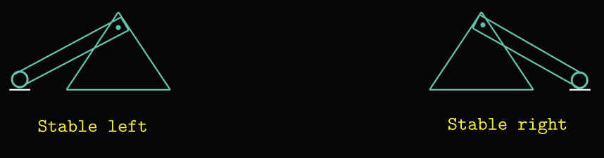 

当钟摆倾斜到最左边或者最右边时，他的状态是最稳定的。理论上，钟摆也能在垂直的位置上保持平衡。

 

不过这个状态是不稳定的，一个细微的扰动就能使他倒下，并且倒下之后无法恢复到从前的垂直状态。

正是由于SRAM的存储单元具有双稳态的特性，所以只要有电，它就能够一直保持所存储的数据。

与 SRAM 相比，DRAM 存储信息的原理是电容充电。对于 DRAM 结构，每个比 bit 位的存储对应一个电容和一个晶体管，当然这个电容是非常非常小的。

与 SRAM 不同， DRAM 的存储单元对干扰十分敏感，当电容的电压被扰乱之后，就再也无法恢复到干扰之前。

虽然 SRAM 的速度比 DRAM 要快，但是在价格方面要更贵。处理器芯片内的 cache（高速缓存）采用的就是 SRAM，而内存采用的是 DRAM，此外，DRAM 还有另外一个缺陷，就是会有很多原因导致漏电，使得 DRAM 会在10-100毫秒内失去电荷，因此内存系统需要不断的读出数据，然后重写来刷新内存的每一位，只有通过不断的刷新才能保持数据。不过幸运的是，处理器运行的时钟周期是以纳秒来衡量的，所以相对而言这个保持时间还是比较长的。

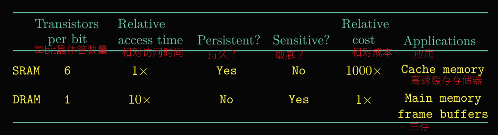 

接下来，我们通过一个简单的例子来看一下 DRAM 的内部结构。

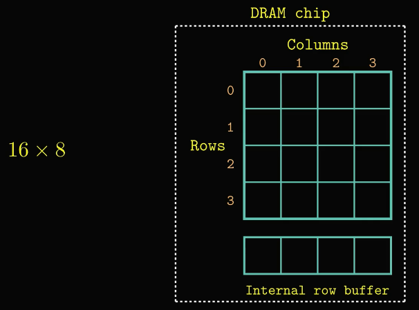 

图中展示了一个16X8 的 DRAM 芯片，其中16表示的是超单元的个数，8表示每个超单元可以存储8bit的数据。由于存储领域从来都没有为 DRAM 的阵列元素确定一个标准的名字，为了避免混淆，原书中采用"超单元"一词来表示 DRAM 的存储单元。

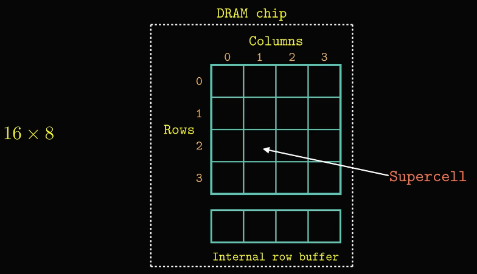 

通过这张图，我们可以看到所有的超单元被组织成了一个4X4的阵列，每个超单元可以通过类似坐标的方式（i,j）进行选址，其中 i 表示行，j 表示列。

整个 DRAM 芯片通过地址引脚和数据引脚与内存控制器相连，简单来讲，内存控制器主要用来管理内存。

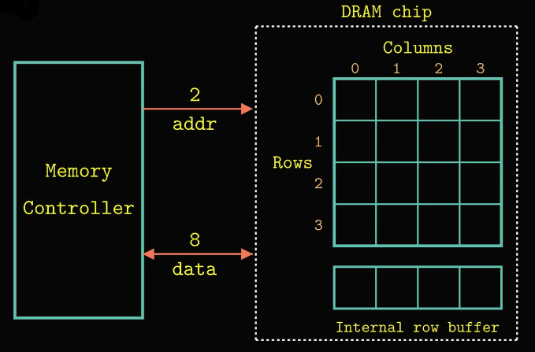 

第一次听到内存控制器的同学可能会感到困惑，可以通过一个通俗的例子来理解。
假如我们将数据比作书，内存就相当于是一个图书馆，而内存控制器可以看成图书管理员。例如我们需要从 DRAM 芯片中读出图中所示的超单元（2,1）。

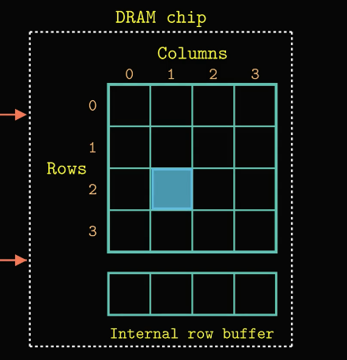 

首先，内存控制器发送行地址2到 DRAM 芯片，DRAM 所做出的响应就是将整个第二行的内容全部复制到内部的行缓冲区域中。

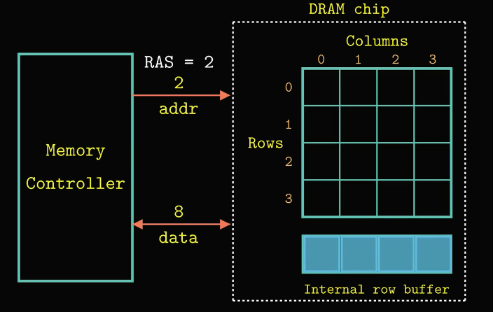 

接下来，内存控制器发送列地址1到 DRAM 芯片，DRAM 对应的操作是从这个行缓冲区中复制出对应的数据位并把它发送到内存控制器

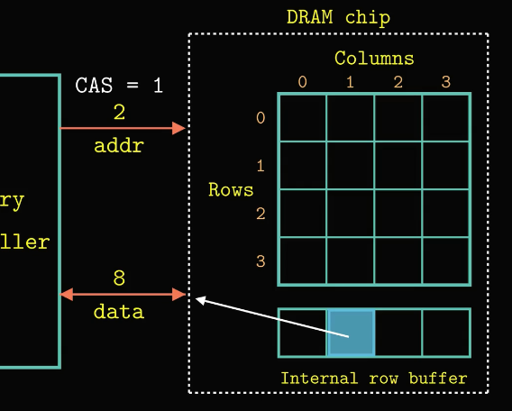 

看到这里，相信有很多同学会有这样的疑问，为什么要分两次发送地址，这样不是增加了访问的时间吗？
这是因为 DRAM 芯片的设计人员将存储单元设计成了二维阵列，而不是线性数组，这样设计的好处是可以降低芯片上地址引脚的数量。

如果将示例中128位（16X8）DRAM 的存储单元用线性数组来表示，那么地址范围就是0-15，因此就需要4个地址引脚，而二维阵列的组织方式只需要2个引脚就可以了，不过二维阵列的组织方式会增加数据访问的时间。

接下来，我们看一下采用 DRAM 芯片封装成的内存模块。

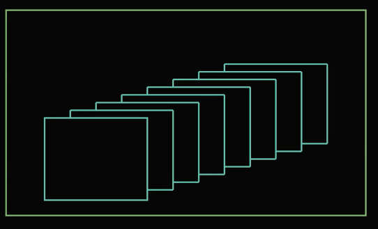 

图中展示了一个内存模块的基本组成，这个模块一共用了8个 DRAM 芯片，分别用编号0-7来表示，每个 DRAM 芯片的大小是8M X 8(8M X 8bit，64Mbit)，也就是8MB字节，因此，整个内存模块的大小为64MB。

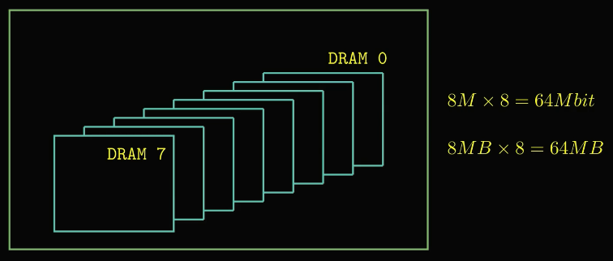 

每个超单元可以存储8bit的数据，那么对于8字节（64bit）的数据就需要8个超单元来存储，不过，这8个超单元并不在同一个 DRAM 芯片上，而是平均分布在8个 DRAM 芯片上，其中 DRAM 0 存储低8位，DRAM 1 存储下一个字节，以此类推，DRAM 7存储最高8位。

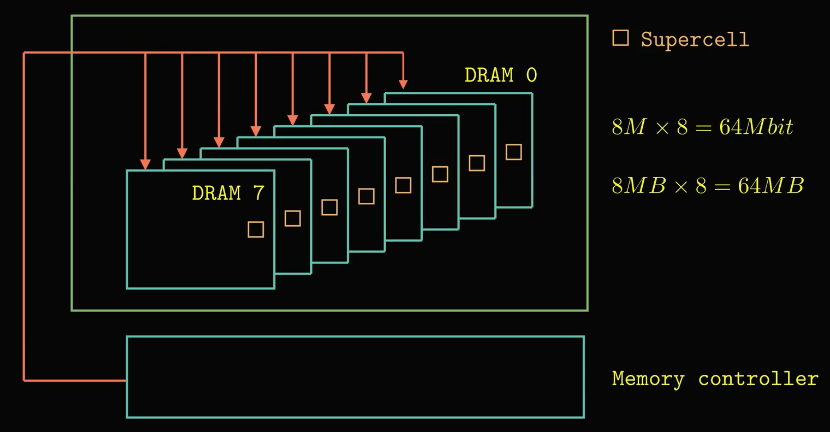 

当处理器向内存控制器发起读数据的请求时，内存控制器将地址转换成超单元地址（i,j），然后把它发送到内存模块，然后内存模块再将行地址 i 和列地址 j 广播到每个 DRAM，每个 DRAM 都会输出它对应的超单元的数据，最终内存模块将所有的超单元合并成一个64bit的数据返回给内存控制器，具体如图所示：

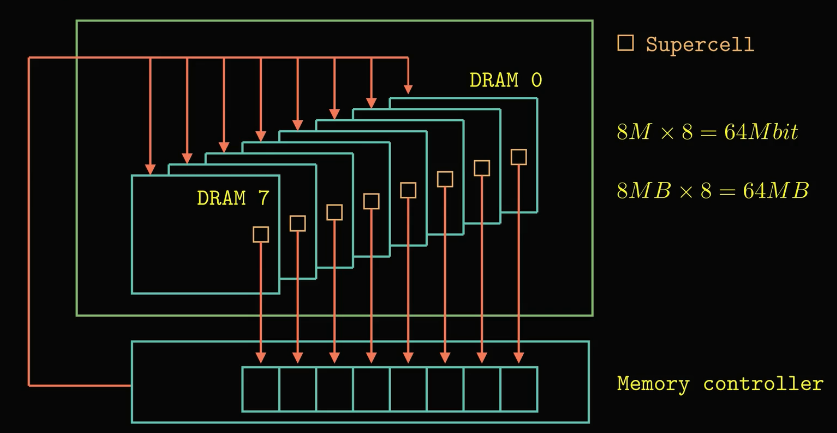 

为了跟上迅速发展的处理器的速度，市场上会定期推出新的 DRAM，这些 DRAM 都是基于传统的 DRAM 单元，然后进行一些优化。

例如，我们经常在电脑配置清单上看到 DDR3，DDR4或者 LPDDP 等字样，其中 DDR 的全称是 DDR SDRAM（Double Data-Rate Synchronous DRAM）（双倍速率同步动态随机存储器），注意 SDRAM 中的 S 表示同步，而不是静态，不要与 SRAM 混淆。这里我们只需要知道同步 DRAM 比 异步 DRAM 速度更快就可以了，更多的技术细节就不展开了。

关于 DDR2，DDR3，以及 DDR4这些缩写中的数字表示不同的代，例如4代的 DDR要比3代的 DDR 读写速度更快。

速度的提升主要依靠扩大预取缓冲区的位数，例如 DDR4 的预取缓冲区是16bit，DDR3 是8bit，此外智能手机中的内存几乎全部采用的都是 LPDDR，其中 LP 是 low Power 的缩写，与 DDR4 相比，LPDDR 的功耗更低，不过 DDR4 的延迟更小。

目前市场上有许多商务笔记本也开始选用LPDDR 作为内存，所以 LPDDR 更适合应用在功耗敏感的设备上。

## 1.2机械磁盘

无论是 SRAM 还是 DRAM ，他们都需要在有电的情况下才能保存数据。
这一期，我们来看一下在断电的情况下也能保存数据的存储介质——磁盘。

目前市面上主流的磁盘产品有两类，分别是机械磁盘和固态硬盘，首先我们来看一下机械磁盘，也称旋转磁盘。

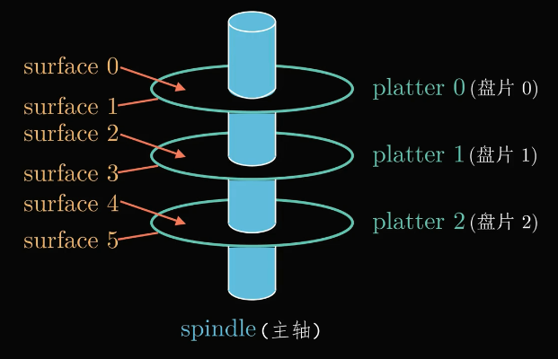 

图中给出了磁盘的内部结构示意图，他主要依靠盘片来存储数据，盘片的表面涂有磁性的记录材料。通常情况，磁盘由一个或者多个盘片组成，这些盘片被固定在一个可以旋转的主轴上，主轴带动盘片以固定的旋转速率进行高速的旋转，例如图中这个磁盘包含三个盘片，一共有六个表面可以用来存储数据。

其中盘片的表面被划分成了一圈一圈的磁道，这里我们用同心圆来表示，具体如图所示

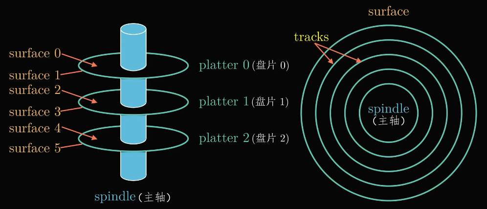 

每个磁道又被划分成了多个扇区，通常情况下，每个扇区可以存储512个字节的数据，其中扇区与扇区之间会有一些间隙，这些间隙是用来存放扇区的标识信息，不能用来存储数据。

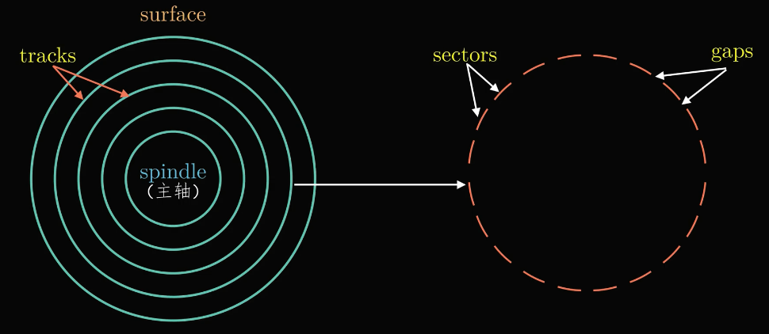 

磁盘通过读/写头来读取存储在盘片表面的数据，盘片的每一个表面都对应着一个独立的读/写头，所有的读/写头连接到一个传动臂上，通过传动臂在半径方向上的移动，这样读/写头可以读取任意磁道上的数据，我们把这种机械运动称为寻道。

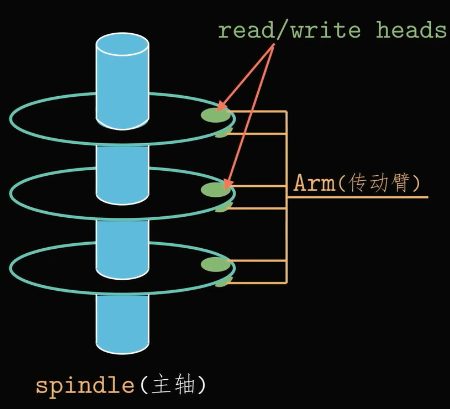 

通过传动臂的移动，可以将读/写头定位在任意磁道上，在完成寻道之后，读/写头就保持不动了。如果想要完成对目标扇区的读写操作，需要通过盘片旋转来配合，读/写头可以读出相应的数据位，也可以修改相应的数据值。注意所有的读/写头都是垂直排列，一致行动的。

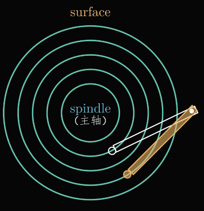 

其中读/写头距离磁盘表面的高度大约是0.1微米，在这样狭小的间隙里，任何微小的灰尘或者剧烈的震动都有可能导致读/写头撞向盘面，从而导致磁盘损坏。

通常我们关注最多的是磁盘的容量，也就是能够存多少数据，这里需要特别注意的是，磁盘制造商会使用 GB 或者 TB 为单位来标识磁盘的容量，但是这里的 1GB 等于10的9次方字节，1TB 等于10的12次方字节。

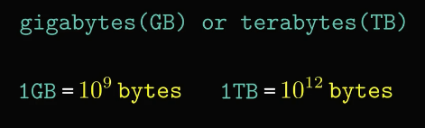 

看到这里，相信有很多同学会感到困惑，1GB 不是等于2的30次方字节吗？
实际上，对于 K，M，G 这样的前缀，它们所表示的含义还要依赖于上下文。

对于 SRAM 和 DRAM 这一类设备，通常情况下，K 等于2的10次方，M 等于2的20次方，但是对于像磁盘和网络这样的 I/O 设备，通常情况下，K 等于10的3次方，M 等于10的6次方等等。

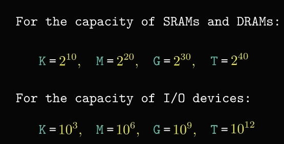 

不过幸运的是，对于2的30次方与10的9次方之间的差别不大，大约相差7%左右

除了容量之外，磁盘的读写速度也是一个非常重要的指标，对扇区的访问时间主要分为三部分，分别是寻道时间、旋转时间以及传送时间。

我们先来解释一下什么是寻道时间，当目标扇区所处的磁道与当前读/写头所在的磁道不同时，那么传动臂需要将读/写头移动到目标扇区所在的磁道，传动臂移动所需的时间就是寻道时间。
寻道时间主要取决于读/写头的当前位置与目标位置的距离。寻道有可能发生在两个相邻的磁道之间，此时寻道时间会比较短；也有可能是从最内侧的磁道移动到最外侧的磁道，遇到这种情况时寻到时间就会比较长。因此，寻到时间并不是一个固定的数值。

 

通过对随机扇区的访问测试，通常平均寻道时间在3-9ms 左右。

一旦读/写头移动到期望的磁道上，接下来，还需要等待目标扇区的第一个数据位旋转到读/写头下才能读取数据，这个过程的性能有两个因素决定：

-   一个是当前读/写头，在的扇区位置与目标扇区的距离，最坏的情况是，读/写头刚刚错过了目标扇区，所以必须等待盘片旋转一整圈才能读取数据；
-   一个是盘片的旋转速度，例如一个盘片的旋转速度是 7200RPM(转每分)，也就是盘片一分钟可以旋转7200圈，那么旋转一圈大约需要8毫秒，所以，在最坏的情况下，最大的旋转延迟大约是8毫秒。

对于一般的情况，平均旋转时间是最大旋转延迟的一半，约为4ms ，最后，当读/写头位于目标扇区时，就可以开始读取（或者写入）数据了。

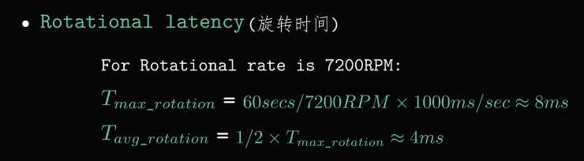 

一个扇区的传送时间依赖于旋转速度以及每条磁道的扇区数目。

假设每条磁道的平均扇区数是400个，转一圈需要8ms ，所以转过一个扇区大约需要0.02ms ，也就是说数据传送需要0.02毫秒就可以完成，以上就是磁盘访问数据所花费的时间。

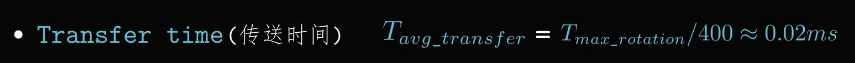 

通过这个例子可以看出，访问一个磁盘扇区所花费的时间主要是寻道时间和旋转时间

综上所述，机械磁盘的内部结构还是比较复杂的，不仅包含多个盘面，而且这个盘面上还有不同的记录区。

但是从操作系统的视角来看，整个磁盘被抽象成了一个个逻辑块序列，每个逻辑块的大小与磁盘扇区的容量是一致的，都是512个字节。

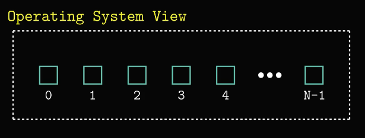 

磁盘内部有一个小的固件设备，称为磁盘控制器，它维护着逻辑块与实际磁盘扇区之间的映射关系，当操作系统执行从硬盘读取数据到内存时，操作系统会发送一个命令
到磁盘控制器，这个命令就是让磁盘控制器读取特定逻辑块号的数据。

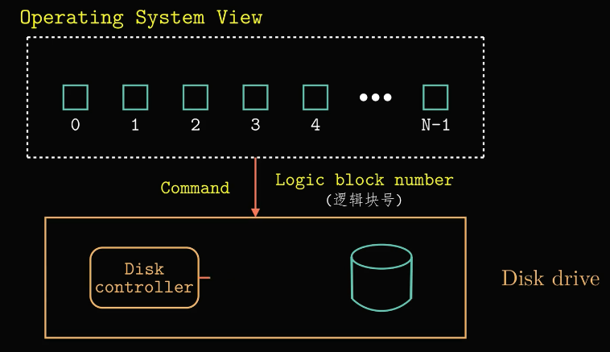 

根据磁盘的结构特性，可以使用（盘面，磁道，扇区）这样的一个三元组来唯一标识每个物理扇区，磁盘控制器上的固件程序的任务就是将逻辑块号翻译成对应的三元组信息，接下来，控制器会根据这个三元组的信息来执行移动读/写头以及旋转盘面的操作，然后读/写头会把读到的数据放到一个缓冲区中，最后将目标数据复制到内存里。

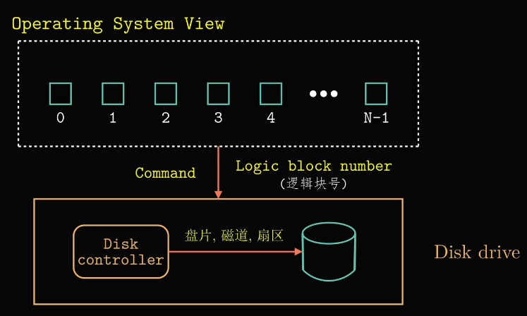 

虽然越来越多的设备都采用固态硬盘来替代机械硬盘，包括笔记本电脑以及服务器等，不过机械磁盘还是会继续存在的，因此关于机械磁盘的原理还是有必要了解一下。

# 2固态硬盘/局部性

固态硬盘是由一个或者多个闪存芯片组成，它使用闪存芯片取代了传动臂加盘片这种机械式的工作方式，除此之外，固态硬盘还包含一个闪存转换层（flash translation layer，FTL），它的功能与磁盘控制器类似，都是将操作系统对逻辑化的请求翻译成对底层物理设备的访问，不同的是，闪存芯片是基于 Nand Flash 实现的。

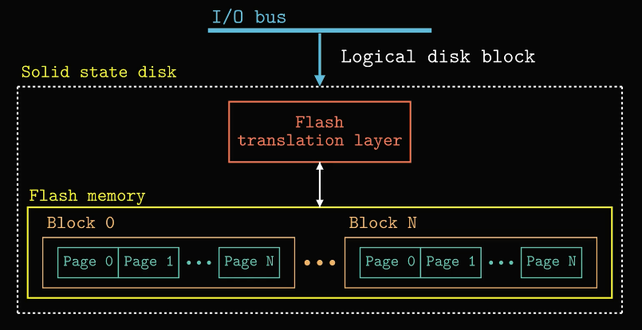 

接下来，我们来看一下闪存芯片的内部结构组成
每一颗闪存芯片是由一个或者多个 Die 组成，每个 Die 可以分为多个 plane，具体如图所示：

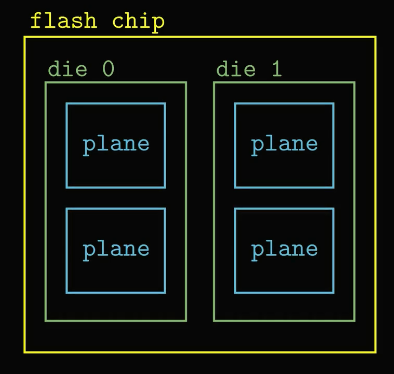 

每个 plane 包含多个 block，需要注意的是，block 与逻辑块是没有关系的。block 的内部又被分成了多个配置，对于固态硬盘，数据是以 page 为单位读写的，与机械磁盘相比，对于不同规格的闪存芯片，其中 page 大小可能并不相同，在有些闪存芯片中，一个 page 的大小是512字节，还有的是1 kb 或者2 kb，甚至更大。

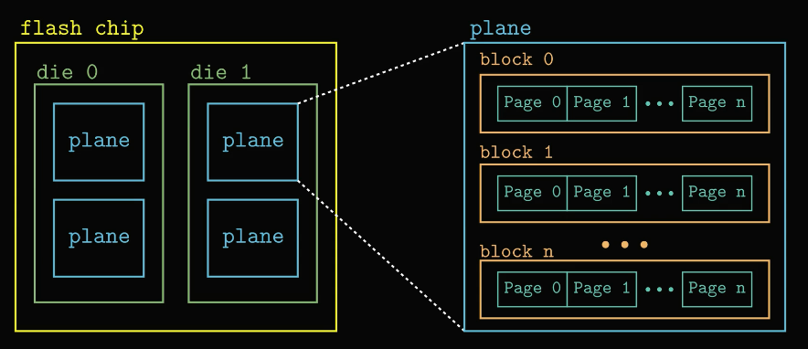 

传统的机械磁盘包含读和写这两个基本操作，对于固态硬盘，除了这两个基本操作之外，还多了一个擦除的操作。

由于闪存编程原理的限制，只能将1改为0，而不能将0改成1，所以一个 page 在写入数据之前，所有的存储位都是1，对于写入操作的本质，就是将某些存储位从1变成0。

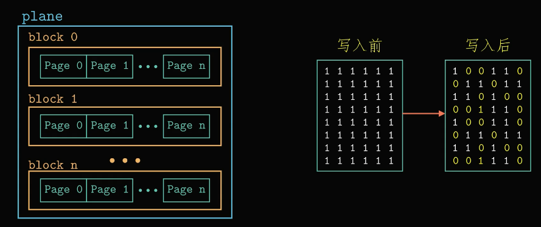 

需要特别注意的是，写入操作是以 page 为单位的，在写入之前页是需要擦除的，不能直接覆盖，对于擦除操作是以 block 为单位的，擦除操作的本质就是将所有的存储位都变成1，当一个 block 完成了擦除操作，那么这个 block 中所包含的所有 page 都被擦除了，此时所有的 page 都能够执行一次写操作。

在经过一定次数的擦除之后，block 就会发生磨损，一旦一个 block 发生损坏之后，就不能再使用了，因此，固态硬盘中的闪存翻译层会使用平均磨损算法，将擦除平均到所有的块上来最大化每个块的寿命，如果平均磨损处理的好，固态硬盘也要好多年才能磨损坏。

比起机械硬盘，固态硬盘有很多优点，由于他是由半导体存储器构成的，没有移动的机械部件，因此随机访问时间比机械硬盘要快，功耗也更低，同时也更抗摔。
缺点就是固态硬盘的价格要贵一些，不过随着技术的发展，它的价格也在不断的降低。

从第六章开始，我们介绍了 SRAM，DRAM 以及磁盘的相关存储技术，通过上述存储技术的介绍，可以得出以下结论：

第一，不同的存储技术有不同价格和性能的折中，从存取速度上来说，SRAM 最快，DRAM 次之，磁盘最慢，不过速度越快，价格也就越贵

第二个结论就是不同存储技术的价格和性能的改变速率不同，首先我们来看一下 SRAM 自1985年至2015年期间所发生的变化

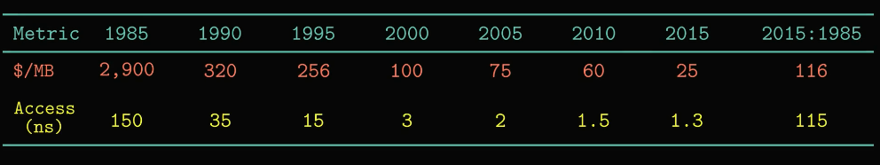 

从图中这个表格可以看出，访问时间以及每兆字节的价格下降了大约100多倍
接下来我们再来看一下 DRAM 的情况

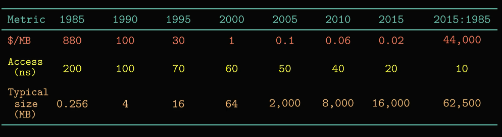 

通过图中的数据我们可以看出，DRAM 的变化趋势更加明显，其中每兆字节的价格下降了44,000倍，不过访问时间只下降了10倍

再来看一下磁盘技术

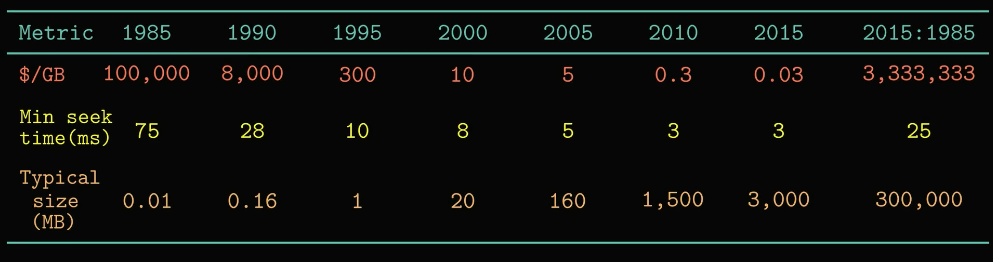  

时间同样是1985年到2015年，在这30年里，机械磁盘每 GB 的价格下降了300万倍，不过访问速度提高的很慢，只有25倍左右。

综上所述，对于 DRAM 和磁盘来说，降低成本要比提高性能容易的多

第三个结论是，DRAM 和磁盘的性能置后于 CPU 的性能

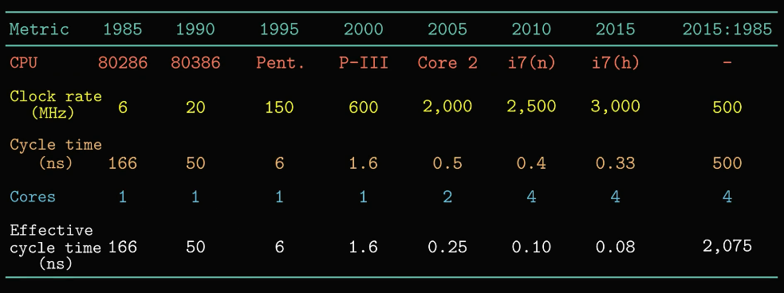 

从1985年到2015年，CPU 的时钟周期提高了500倍，如果考虑多核技术，多个 CPU 还会并发的向 DRAM 和磁盘请求数据，CPU 的性能与 DRAM 和磁盘性能的差距实际上在不断的加大。

为了弥补处理器与内存之间的差距，处理器芯片中使用了大量的基于 SRAM 的高速缓存（cache），高速缓存之所以可以降低 CPU 的访存延迟，是因为应用程序具有局部性的特点。

接下来，我们来看一下什么是程序的局部性
局部性通常有两种不同的形式：分别是时间局部性和空间局部性

如果被引用过的内存位置很可能在不远的将来还会被多次引用，此时，我们可以说程序具有良好的时间局部性；
如果一个内存位置被引用了一次，那么程序还可能在不远的将来引用附近的一个内存位置，此时，我们可以说程序具有良好的空间局部性。

接下来，我们通过几个代码示例来看一下程序数据引用的局部性

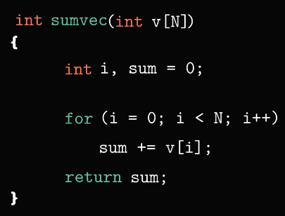  

图中这个函数的功能是对一个向量的元素求和，其中变量 sum 在每次循环迭带中
被引用一次，因此，对于 sum 来说，有好的时间局部性。另一方面，由于 sum 是个标量，不存在空间局务性的特点，由于向量 v 的元素是按照顺序一个接一个来读取的，读取的顺序与存储在内存中的顺序是一致的，因此对于变量 v，函数有很好的空间局部性，不过时间局部性很差，因为每个向量元素只被访问一次。

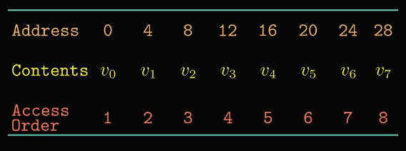 

综上所述，循环体中的变量要么有好的空间局部性，要么有好的时间局部性，所以我们可以断定该函数具有好的局部性。

接下来，我们再来看一个多维数组的例子

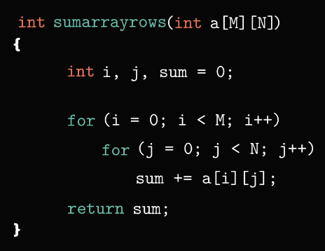 

图中这个函数是对一个二维数组的元素进行求和运算，其中嵌套循环是按照行优先的顺序来读取数组元素的，也就是说内层 for 循环先读第一行元素，读完之后再读第二行，以此类推。由于数组在内存中的顺序也是按照行优先的顺序存储的，所以该函数访问数组元素的顺序与内存中的存储顺序是一致的，此时，我们可以说这个函数也具有良好的空间局部性。

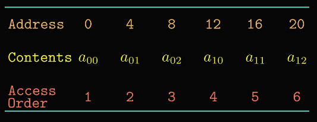 

接下来，我们对这个函数做一点小的改动，具体的改动方案是交换了 i 和 j 的循环，具体如图所示

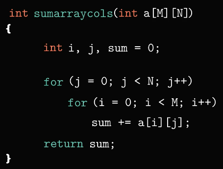 

虽然改动不大，改动之后得到的结果也是正确的，但是改动后的程序空间局部性会很差，这是因为访问顺序与存储顺序不一致了，具体如图所示

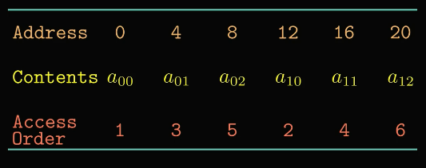 

一般而言，有良好局部性的程序比局部性差的程序运行的更快，现在计算机系统各个层次的设计都用了局部性原理，例如高速缓存就是利用程序的局部性来提高 CPU 的访存速度。

# 3存储器层次结构

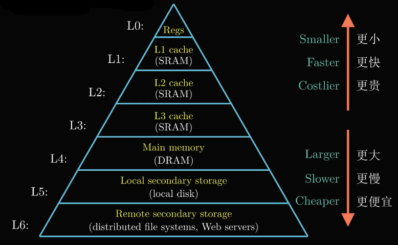 

图中展示了一个典型的存储器层次结构，最高层是寄存器，CPU 可以在一个时钟周期内访问他们，然后是基于 SRAM 的高速缓存，访问他们一般需要几个时钟周期；接下来是基于 DRAM 的内存，访问内存需要几十到几百个时钟周期；再往下是磁盘，虽然速度慢，但是容量大；最后，有些系统还包括远程服务器磁盘，需要通过网络来访问。

## 3.1存储器层次结构中的缓存

存储器层次结构的中心思想是：速度更快、容量更小的存储设备作为速度更慢、容量更大的存储设备的缓存。

缓存在现代计算机系统中无处不在，例如图中第 k+1 层的存储器被划分成了16个大小固定的块，每个块都有唯一的地址，这里我们用编号 0-15 来表示

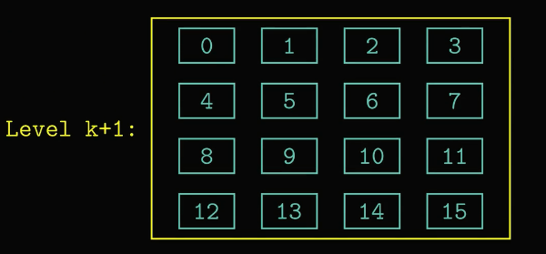 

第 k 层的存储器有4个块的空间，每个块的大小与 k+1 层的块一样。

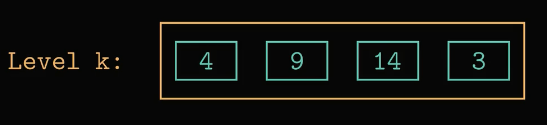 

数据总是以块为单元在第 k 层和第 k+1 层之间来回复制，例如当前第 k 层的存储器包含了四个块的副本，具体如图所示：

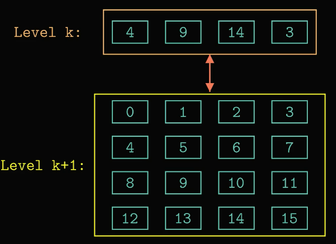 

对于相邻层之间的块大小是固定的，然而不相邻的层次之间，块的大小是不一样。例如，寄存器与 L1 cache 之间传送的块大小通常是一个字，L2 cache与 L1 cache 之间传送的块大小通常是几十个字节，内存与磁盘之间则是几百个或者几千个字节。

一般来说，层次结构中离 CPU 越远的设备访问时间就越长，为了弥补访问过程中浪费的时间，因此倾向于使用较大的块。

### 3.1.1缓存命中

接下来，我们介绍几个缓存相关的概念，首先我们来看一下什么是缓存命中（cache hits）

当程序需要读取第 k+1 层的某个数据对象 d 时，他首先从第 k 层的数据块中检索是否包含目标数据 d 的副本，如果目标数据 d 刚好缓存在第 k 层中，我们将这种情况称为缓存命中；

### 3.1.2缓存不命中

另一方面，如果第 k 层没有缓存目标数据 d，我们将这种情况称为缓存不命中（cache miss）。

当发生不命中时，第 k 层的缓存要从第 k+1 层取出包含目标数据的块，如果 第 k 层的缓存已经满了，这时包含目标数据的块就会覆盖现存的一个块，我们把这个过程称为替换，被替换的块有时也称为牺牲块，决定替换哪个块是由缓存的替换策略来具体决定的，常用的替换策略有随机替换以及 LRU 等。

# 4高速缓存存储器

接下来我们重点来看一下基于 SRAM的高速缓存。

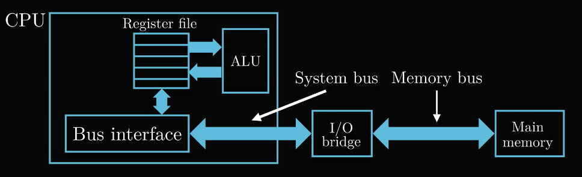 

早期计算机系统的存储层次结构只有三层，分别是寄存器文件、内存以及磁盘。由于 CPU 与内存之间的性能差距逐渐增大，于是系统设计者在寄存器文件和内存之间插入了一个小的基于 SRAM 的高速缓存，称为 L1 cache。

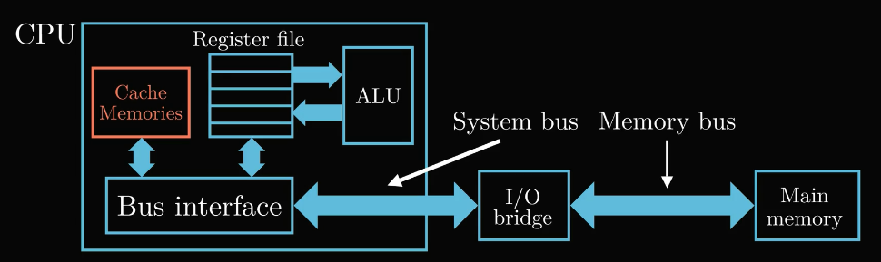 

L1 cache的访问速度和寄存器差不多，大约需要4个时钟周期，随着 CPU 和内存之间的性能差距继续增大，系统设计者又在 L1 cache和内存之间插入了一个更大的高速缓存，称为L2 cache，L2 cache的访问时间大约需要10个时钟周期，还有些计算机系统中包含了一个更大的 L3 cache，它位于 L2 cache 和内存之间。

为了避免歧义，后面的"cache"一词，指的是基于 SRAM 的高速缓存。

## 4.1通用的高速缓存存储器组织结构

接下来我们看一下开始的内部结构，整个 cache 被划分成一个或者多个 set（组），这里我们用变量 S 表示 set 的个数，每个 set 包含一个或者多个 cache line（高速缓存行），这里我们用变量 E 来表示一个 set 中 cache line 的行数，每个cache line 由三部分组成，分别是有效位（valid）、标记（tag）、数据块（cache block）。

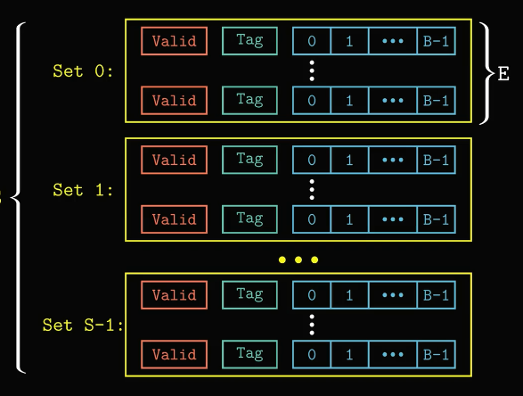 

其中有效位的长度是一个 bit，它表示当前 cache line 存储的信息是否有效，当 valid 的等于1时，表示数据有效，当 valid 的等于0时，表示数据无效。

标记是用来确定目标数据是否存在于当前的 cache line 中。

数据块就是一小部分内存数据的副本，大小用 B 来表示。

通常来说，cache 的结构可以用元组（S，E,B，m）来描述，Cache大小是指所有数据块的和，其中有效位和标记位不包括在内，因此 cache 的容量可以通过 S X E X B计算得到。

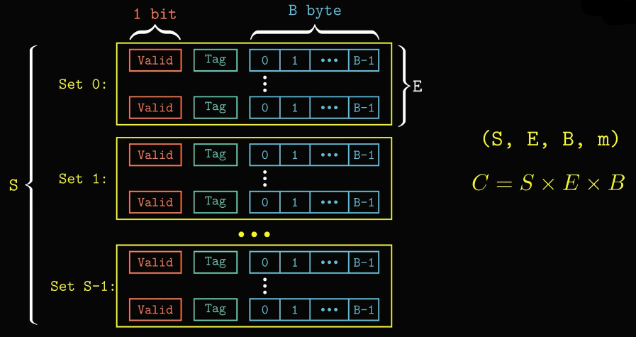 

接下来，看一下 cache 是如何工作的，。当 CPU 执行数据加载指令，从内存地址 A 处读取数据时，根据存储器层次原理，CPU 将地址 A 发送到开始，如果 cache 中保存着目标数据的副本，它就立即将目标数据发回给 CPU。

那么 cache 是如何知道自己是否包含目标数据的副本呢？
假设目标数据（地址A）的地址长度为 m 位，这个地址被参数 S 和 B 分成了三个字段，具体如图所示：

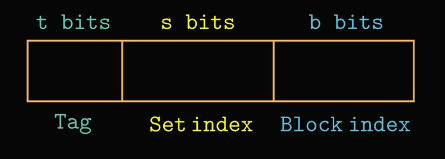 

首先，我们可以通过长度为 s 的组索引位来确定目标数据存储在哪个 set 中，一旦我们知道了目标数据属于哪个 set，接下来我们需要确定目标数据放在哪一行，确定具体的行是通过长度为 t 的标记来实现的，不过还需要注意一点，此时有效位必须等于1，也就是说需要有效位和标记共同来确定目标数据属于哪一行，最后，我们需要根据长度为 b 的块偏移量来确定目标数据在数据块中的确切地址。
通过以上三步，cache 就能确定是否命中。

为什么开始要用中间的位作为组所引，而不是用高位？
假设高位用作组索引位，那么一些连续的内存块就会映射到相同的 set 中，例如图中前4个内存块映射到第一个 set 中，第5至第8个内存块映射到第二个 set 中，以此类推，最后4个内存块映射到最后一个 set 中。

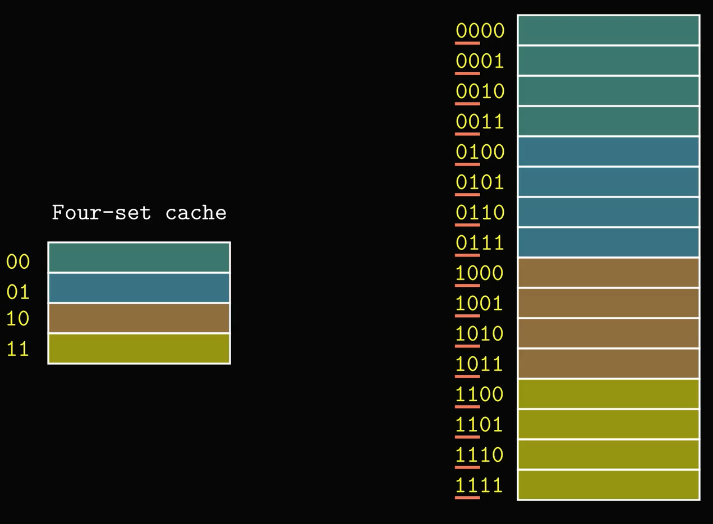 

如果一个程序有良好的空间局部性，当需要顺序读取一个数组的多个元素时，此时，需要不断的进行 cache line 的替换，也就是说在任何时刻，cache 都只保存着一个数据块大小的数组内容，这样会导致 cache 的使用率很低。

如果用中间位作为索引，相邻的内存块总是映射到不同的 set 中，具体如图所示：

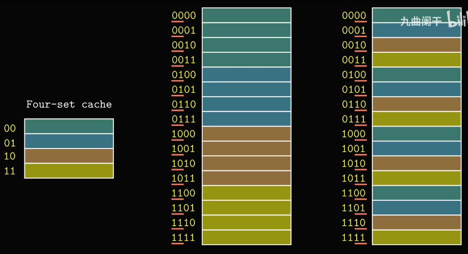 

与高位索引相比，cache 的效率会大大提高。

## 4.2直接映射高速缓存

在上一期的视频中，我们介绍了 cache 的组织结构，根据每个set所包含的cache line的函数不同，cache被分为不同的类。

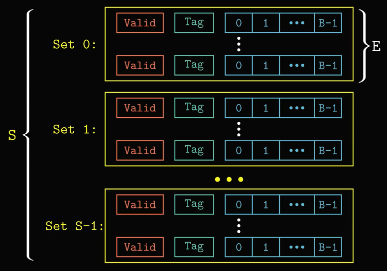 

当每个set只有一 个cache line，也就是E等于1时，我们将这种结构的cache称为直接映射（cache）

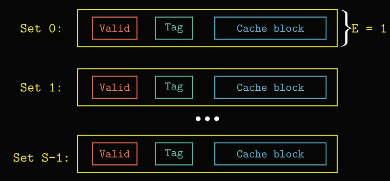 

首先，我们先来看一下直接映射的cache是如何工作的
假设有这样一个系统，它包含一个 CPU，一个寄存器文件，一个 L1 cache和一个内存，当 CPU 执行从内存中读取数据的指令时，首先从 L1 cache中查询是否包含目标数据的副本，如果能够在 L1 cache中找到目标数据，那么cache就把目标数据直接返回给 CPU。这个判断是否命中
获取目标数据的过程一共分为三步，分别是**组选择**，**行匹配**以及**字抽取**。

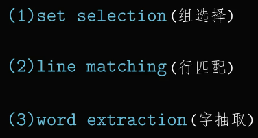 

### 4.2.1直接映射高速缓存中的组选择

首先，我们来看一下组选择是如何实现的
这一步是根据组索引值来确定目标数据属于哪个set
例如图中的阻所引位的长度是5位，这些二进制位被解释成一个无符号数
因此，长度为5的组索引位最大可以检索32个set

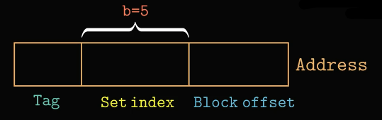 

当 s 等于0时（00000），此时组选择的结果是set0

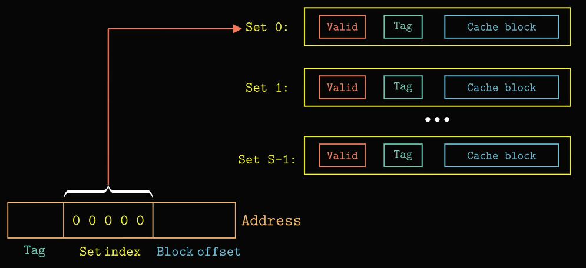 

当 s 等于1时，此时组选择的结果是set1

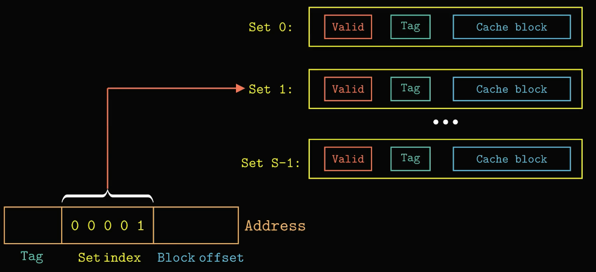 

以此类推，以上就是根据组索引位进行组选择的整个过程。

### 4.2.2直接映射高速缓存中的行匹配

Cache执行完组选择之后，接下来开始执行行匹配
我们通过一个例子来看一下行匹配的过程。

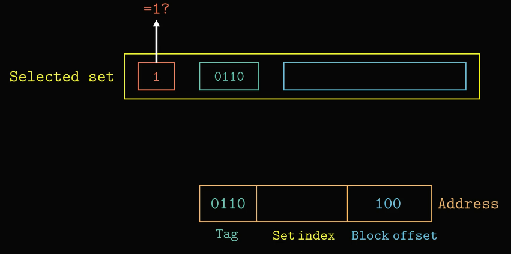 

在这个例子中，每个 set 只有一个cache line，而且当前cache line的有效位等于1，也就是说此时cache line中的数据是有效的，然后我们需要对比cache line中的标记与地址中的标记位是否一致，如果一致，表示目标数据一定在当前的cache line中；

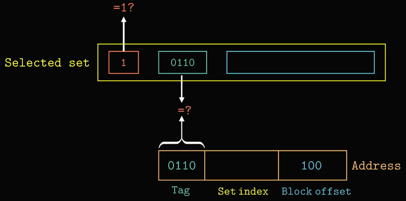 

另一方面，如果不一致，或者有效位等于0，表示目标数据不在当前的cache line中。
因此，行匹配最终的结果无非就是命中或者不命中。一旦命中，就可以继续执行第三步——字抽取。

### 4.2.3直接映射高速缓存中的字选择

这一步需要根据偏移量来确定目标数据的确切位置。通俗来讲，就是从数据块的什么位置开始抽取数据

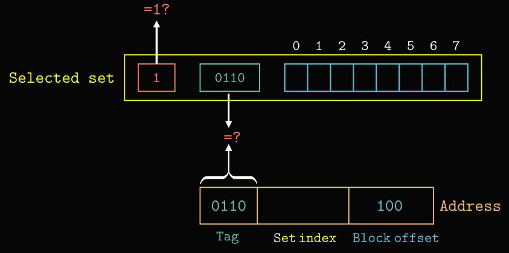 

例如图中数据块的大小为8个字节，我们用编号0-7来表示。当块偏移等于100时，他表明目标数据的起始地址位于字节4处。
这里我们假设目标数据的长度为4个字节，这样一来，我们就可以获得目标数据的副本了。

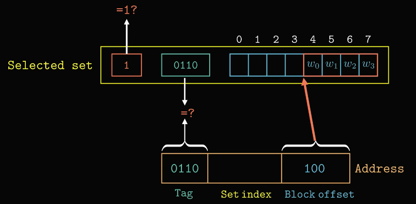 

经过以上三步，cache就可以将目标数据返回给 CPU。

### 4.2.4直接映射高速缓存中不命中时的行替换

上述过程就是cache命中的情况。如果发生了不命中，那么cache需要从存储器层次结构的下一层取出被请求的块，由于直接映射的每个set只包含一行，因此替换策略十分简单，直接用新取出的行来代替当前的行就可以了。

### 4.2.5综合：运行中的直接映射高速缓存

虽然上述过程并不复杂，可能大家还是会对这种处理方式感到困惑，接下来，我们通过一个具体的例子来解释一下整个过程。

假设我们有一个直接映射的cache，他包含4个 set，每个 set 有一行，每个数据块包含2个字节，其中地址 m 是4位

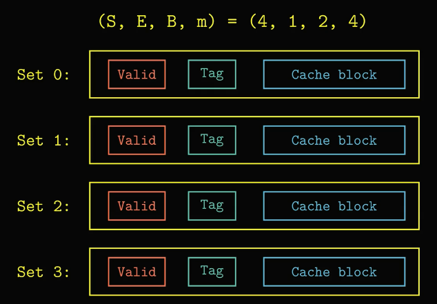 

虽然上述假设是不现实的，但是这种假设方式可以方便我们理解整个过程，由于地址是4位，整个地址空间可以用编号0-15来表示。

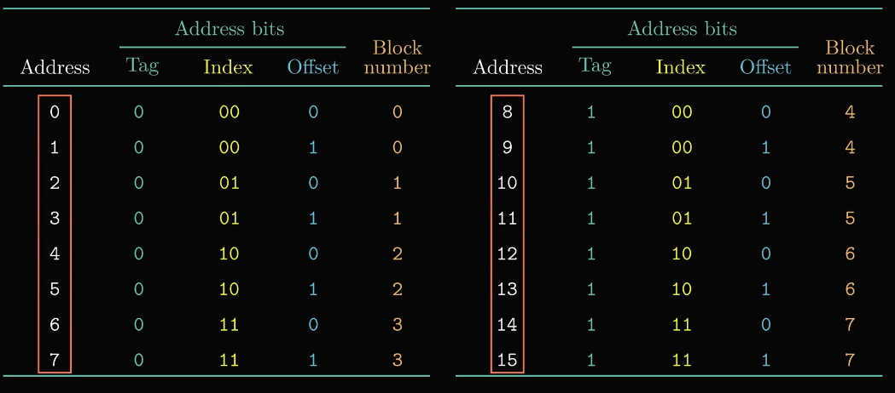  

标记位和索引位连起来可以唯一的标识每个内存块，需要注意的是，每个内存块包含两个字节。例如块0是由地址0和地址1组成的，块1是由地址2和地址3组成，以此类推。

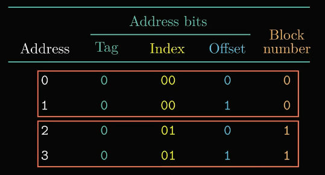 

这样一来，整个地址空间被划分成了8个块（编号为07），但是示例中的cache只有4个set，因此就会出现两个内存块映射到同一个set的情况。
例如块0和块4都映射到了set0，块1和块5都映射到了set1。

介绍完了内存和cache的基本结构，接下来，让我们来模拟一下当 CPU 执行一系列读的时候，cache是如何执行的。
这里我们假设 CPU 每次读取的数据都是一个字节。最开始时，整个cache都是空的，即所有的cache line 的有效位都等于0。

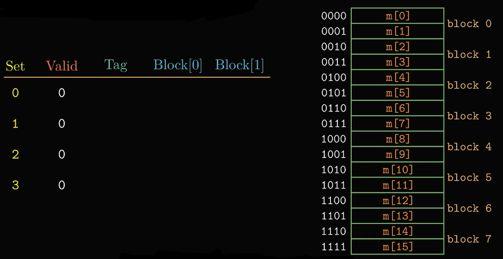

图中表格的每一行代表一个cache line。

第一步，当 CPU 读地址0的数据时，经过组选择之后，发现set 0的有效位等于0，此时不命中。
接下来cache会从内存中取出包含目标数据的块，并把这个数据块放在set 0中，具体如图所示

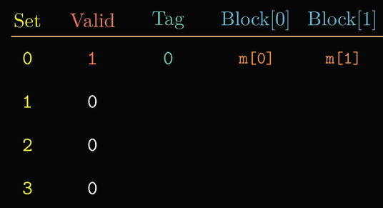 

然后cache返回位于块0处的目标数据 m[0]

第二步，当 CPU 读取地址1（0001）处的字时，由于目标数据 m[1]已经在cache中，这次开始是命中的，cache根据地址 m 进行组选择，行匹配以及字抽取之后，然后将目标数据 m[1]返回给 CPU，此时开始的状态没有发生变化。

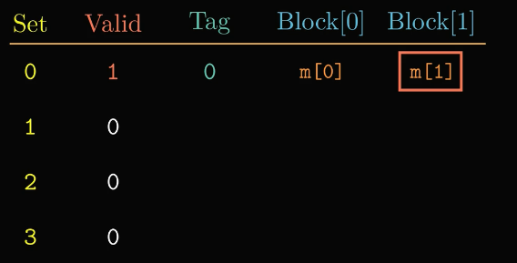 

第三步，当 CPU 读地址13（1101）的字时，根据地址13的组索引位（10）进行组选择之后，发现set 2的有效位等于0，所以发生不命中，这时开始把块6加载到set 2中，然后从cache line中抽取目标数据，返回给 CPU。

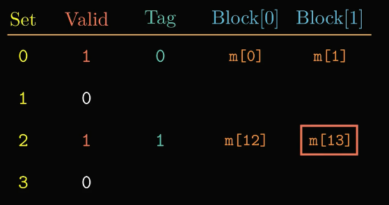 

第四步，当 CPU 读取地址8（1000）的字，根据地址8的组索引位（00）进行组选择之后，发现set 0的有效位是1，但是进行标记对比后发现并不匹配，此时，需要块4来替代块0，替换之后，cache再返回目标数据到 CPU。

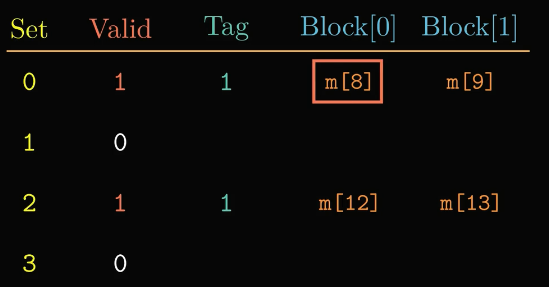 

最后一步，当 CPU 再去读地址0的字，又会发生不命中，这是因为前面引用地址8的数据时，我们替换了块0。由于不同的块刚好映射到同一个set中，虽然整个cache还有空闲的空间，当发生交替引用时，还是会出现不命中的情况，我们把这种现象成为冲突不命中。

### 4.2.6直接映射高速缓存中的冲突不命中

实际上，冲突不命中在真实的程序中是很常见的，它会导致一些令人困惑的性能问题。

接下来，我们通过一个代码示例来看一下冲突不命中

```c
float dotprod(float x[8],float y[8])
{
    float sum = 0.0;
    int i = 0;
    
    for(i =0;i < 8;i++)
        sum += x[i] * y[i];
    return sum;
}
```

对于变量 x 和 y 来说，这个函数具有良好的局部性。因此我们期望cache有较高的命中率，然而实际情况却并非如此。

假设数组 x 的第一个元素位于地址0处，每个元素的长度为4个字节，因此可以得到数组 x 各个元素的起始地址，数组y紧跟其后，y[0]的地址从32开始，具体如图所示

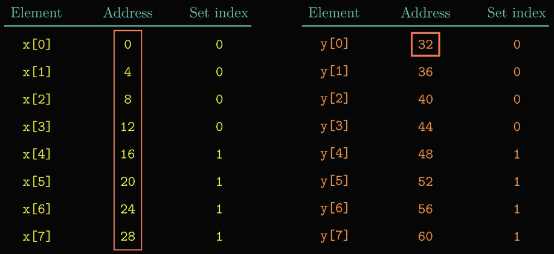 

当程序开始运行时，循环在第一次迭代时引用了元素 x[0]，此时发生不命中。cache把包含 x[0] ~ x[3]的块加载到 set 0

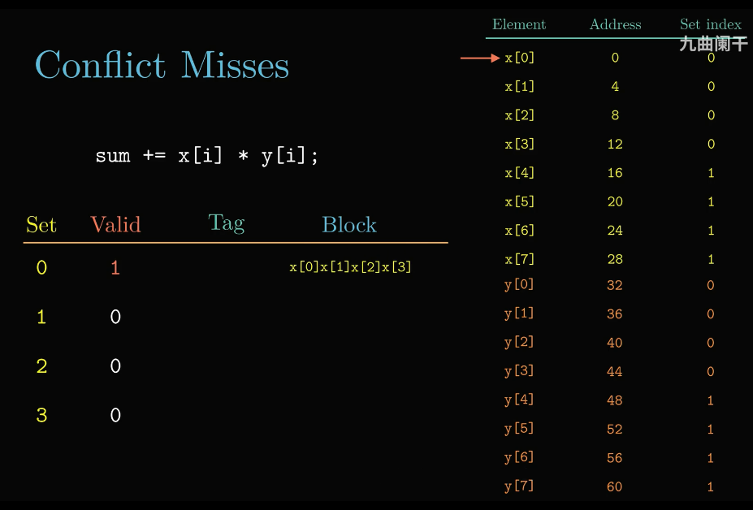 

接下来又立刻引用了数组元素 y[0]，又一次不命中，这时cache把包含 y[0]到 y[3]的块加载到 set 0

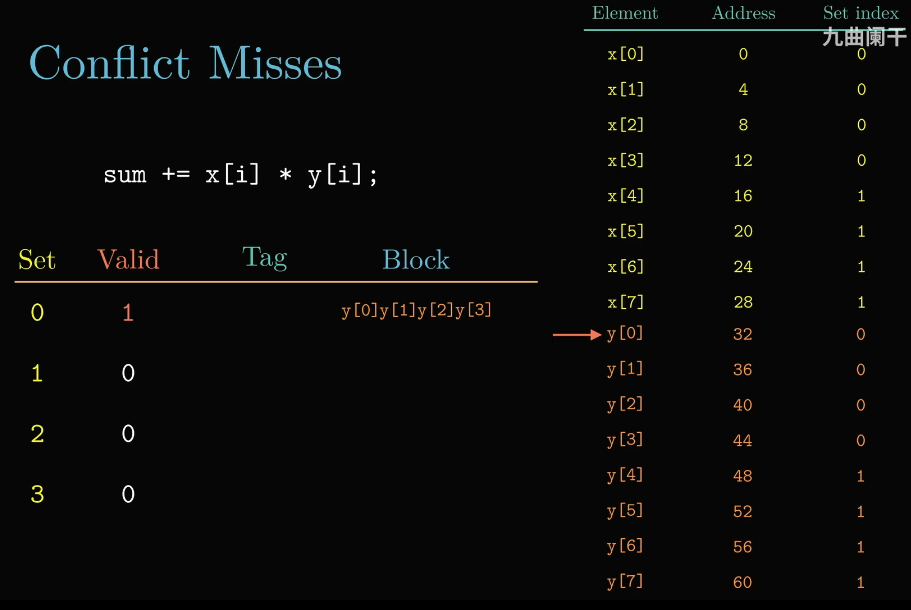 

这里需要注意的是，之前set 0中存储的内容是数据块 x[0]至 x [3]的数据，那么这些数据会被 y[0] ~ y[3]覆盖，具体如上图所示。

接下来，循环继续下一次的迭代。此时对数组元素 x[1]的引用又发生了不命中，导致 x[0] ~ x[3]的块加载到了set 0，覆盖了 y[0] ~ y[3]的块。

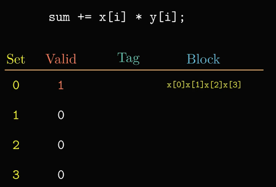 

看到这里，相信大家已经发现了其中的问题。实际上后面每次对 x
和 y 的引用都会导致cache line的替换，我们把这种现象成为抖动。

综上所述，即使程序具有良好的空间局部性，同时我们的cache也有足够的空间来存放数组 x和 y 的数据块，但是每次引用还是会产生冲突不命中，究其原因是这些块被映射到了同一个set中，这种抖动的出现可能会导致运行速度下降2-3倍。虽然我们给出的示例比较简单，实际上对于直接映射的开始来说，这个问题也是存在的。不过一旦程序员意识到了抖动的情况，那么解决这个问题也是比较容易的。

例如，我们把数组 x 的长度由8变为12，数组 y 还是紧跟在 x 的后面，此时数组 y 的起始地址发生了改变，从而就避免了 x 和 y 的元素映射
到同一个set中，这样一来，通过这种数据填充的方式就可以消除抖动，从而解决冲突不命中的问题。

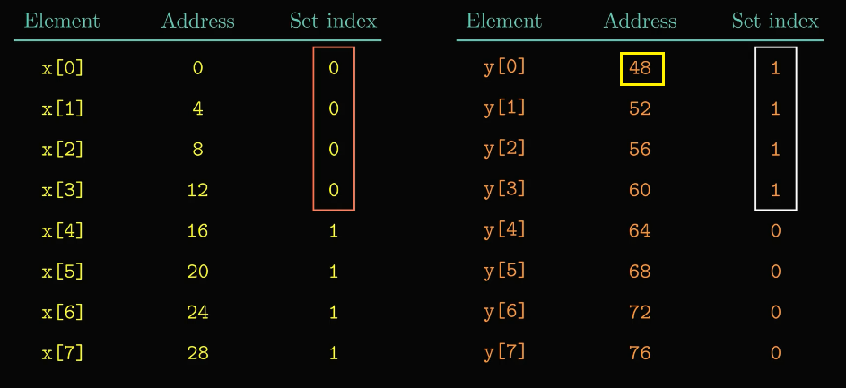 

# 5组相连/全相连高速缓存

