# 1为什么要学处理器设计

对于软件开发人员，深入理解计算机系统有助于程序的开发和优化，理解处理器是如何工作的能够帮助理解整个计算机系统。虽然真正从事处理器设计工作的人数不多，但是许多人从事智能硬件的相关工作，对于嵌入式系统的设计者，需要了解处理器是如何工作的。

随着国家对集成电路的大力支持，芯片设计与制造的相关工作机会也在增加，因此，从事处理器的设计工作会是一个不错选择。此外，处理器的设计包括了很多好的工程实践原理，它需要完成复杂的任务，而结构设计又要尽可能的简单和规则。

综上所述，了解处理器的工作原理是有必要。

# 2、Y86-64指令集体系结构

指令系统是计算机软件和硬件交互的接口，程序员根据指令系统设计软件，处理器设计人员根据指令系统实现硬件。

由于x86-64指令系统过于复杂，为了方便学习和理解，CSAPP的原书中参照x86-64的指令系统，自定义了一个相对简单的指令系统Y86-64，该指令系统包括定义各种状态单元、指令集以及它们的编码，编程规范以及异常事件处理这几部分。

## 2.1程序员可见的状态

首先，我们来看一下什么是程序员的可见状态，这里的程序员既可以是用汇编代码写程序的人，也可以是产生机器级代码的编译器。

可见状态是指每条指令都会去读取或者修改处理器的某些部分，例如**内存**、**寄存器**、**条件码**、**程序计数器**以及**程序状态**等。

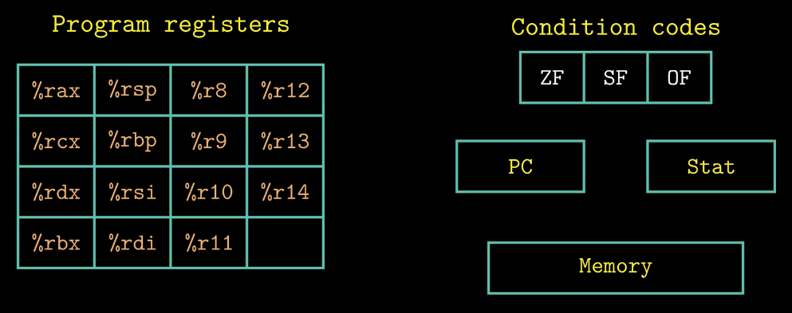 

在Y86-64指令系统中，我们定义了15个64位的程序寄存器，相对于x86-64的指令系统，少了一个寄存器`%r15`，主要是为了降低指令编码的复杂度，稍后在指令的编码部分可以体会到。

在Y86-64指令系统中，寄存器`%rsp`也是被定义为栈指针，至于其他14个寄存器没有固定的含义。

除此之外，Y86-64的指令系统还简化了条件码寄存器，仅保留了3个条件码，分别为零标志(ZF)、符号标志(SF)和溢出标志(OF)。

至于程序计数器PC是用来**存放当前正在执行指令的地址**，注意是指令的地址，不是指令内容。

关于程序的执行状态，我们引入状态码来表示，稍后会有详细的讲述。

## 2.2Y86-64指令

类比x86-64的指令集，Y86-64指令集做了一些相应的简化，我们将x86-64中的`movq`指令分成了四种不同的指令，具体如图所示。

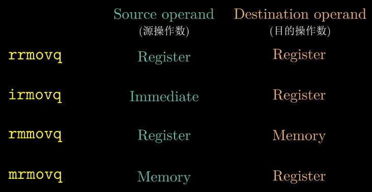 

重定义后的数据传送指令显示的指明了源操作数和目的操作数的格式。指令名字的第一个字母表明了源操作数的类型，源操作数可以是立即数（i）、寄存器（r）或内存（m）。指令名字的第二个字母指明了目的操作数的类型，目的操作数可以是寄存器和内存，这样设计的目的主要是为了降低处理器实现的复杂度。

## 2.3指令编码

接下来，我们对上述数据传送指令进行编码。

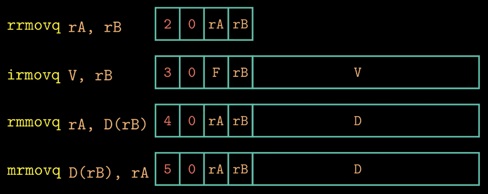 

每条指令的第一个字节表明指令的类型，这个字节分为两部分，每一部分占4个比特位，高4位表示指令代码，低4位表示指令功能。

对于我们定义的数据传送指令，不同的指令代码表示不同的指令，指令的功能部分都为0。

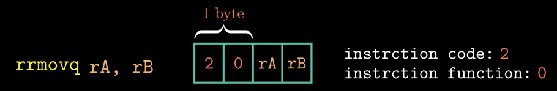 

当指令中有寄存器类型的操作数时，会附加一个字节，这个字节被称为寄存器指示符字节，它用来指定一个或者两个寄存器，因此还需要对寄存器进行编码。

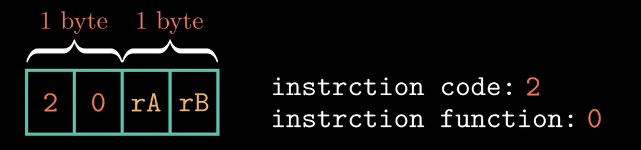 

在Y86-64的指令系统中，我们定义了15个寄存器，虽然每个寄存器定义了不同的名字，但是还需要为每个寄存器指定一个编号，寄存器的编号可以用十六进制数0~0xE来表示，具体如图所示。

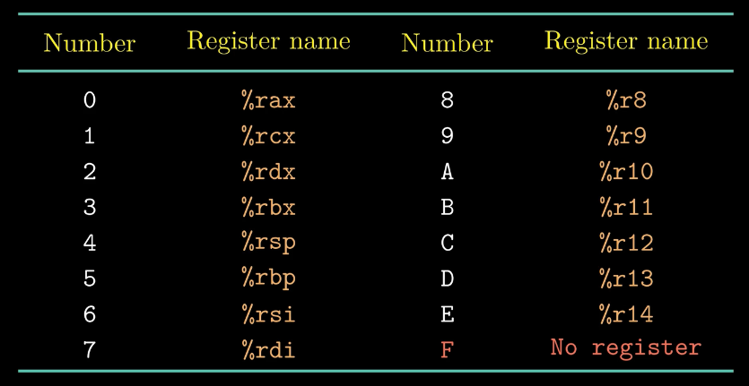 

注意，如果指令中某个寄存器字段的值为0xF，表示此处没有寄存器操作数，例如`irmovq`指令中第一个操作数是立即数，所以此处用0xF来填充。

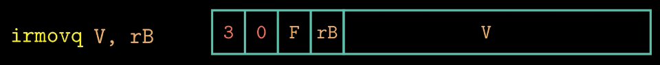 

在Y86-64指令系统中，我们定义了四条整数操作指令，它们只能对寄存器数据进行操作，而x86-64还允许对内存数据进行操作，由于这四条指令属于同一类型，所以指令代码是一样的，不同的是功能部分，具体如图所示。

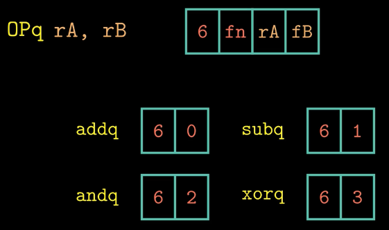 

跳转指令一共有7条，跳转的条件与x86-64中的跳转指令是一样的，都是根据条件码的某种组合来判断是否进行跳转。

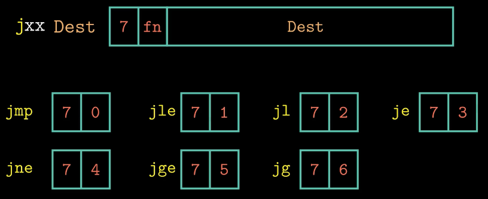 

条件传送指令有6条，它与数据传送指令`rrmovq`有相同的指令格式，但是只有条件码满足条件时，才会更新目的寄存器的值。

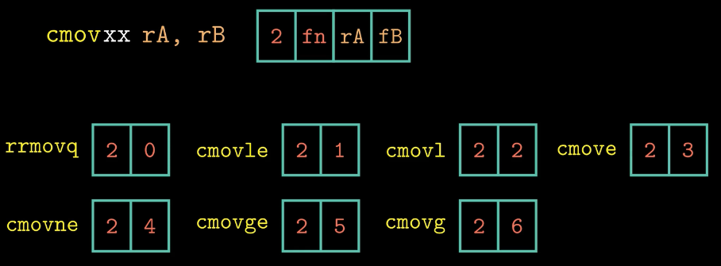 

停止指令(`halt`)可以使整个系统暂停运行；`nop`指令表示一个空操作，它们的指令编码只有一个字节，比较简单；`call`指令与`ret`指令分别实现函数调用和返回；`push`指令和`pop`指令分别实现入栈和出栈的操作。这四条指令与x86-64种的指令定义类似。

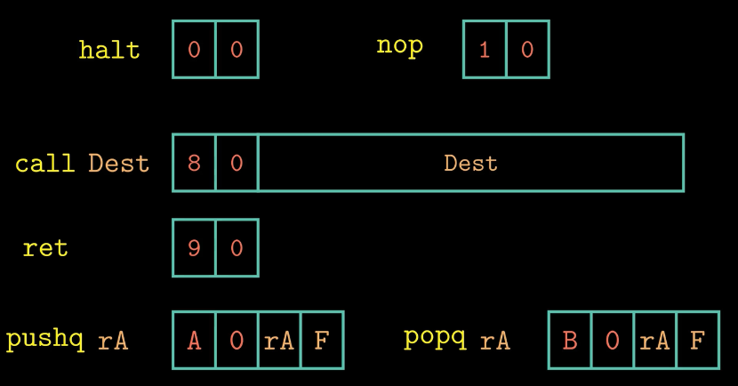 

综上所述，Y86-64的指令集以及编码规则的定义就完成了。

通过上述定义的指令编码规则，我们可以将Y86-64的汇编代码翻译成二进制表示，例如图中这条指令。

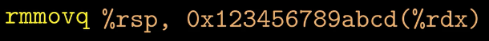 

根据`rmmovq`指令的编码定义，指令二进制表示的第一个字节为0x40。

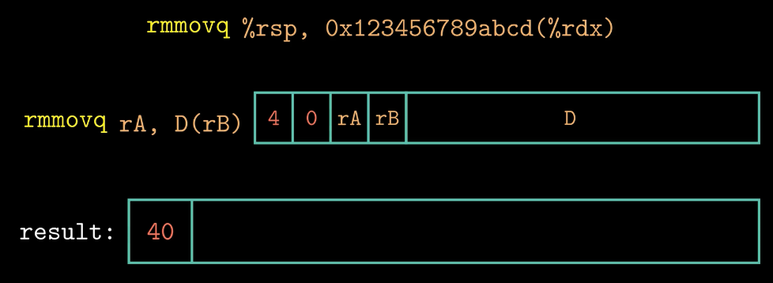 

接下来，我们再看指令的操作数部分。根据寄存器的编号规则，寄存器`%rsp`对应十六进制数0x4，基址寄存器`rdx`对应0x2，因此，我们可以得到第二个字节的编码为0x42。

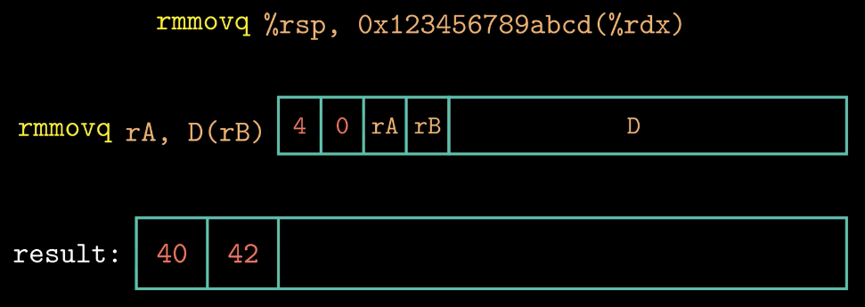 

指令编码中偏移量占8个字节，我们需要在该偏移量的前面通过填0来补齐8个字节，由于x86-64采用小端法存储，所以需要对偏移量进行字节反序操作，最终我们得到了长度为10个字节的二进制指令，具体如图所示。

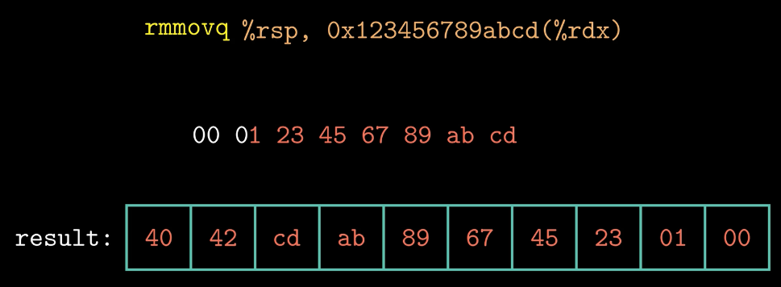 

## 2.4Y86-64异常

最后，我们看一下程序的状态码，它描述了程序执行的总体状态。当代码值为1时，表示程序正常执行，而其他三个代码表示程序发生了某种类型的异常。

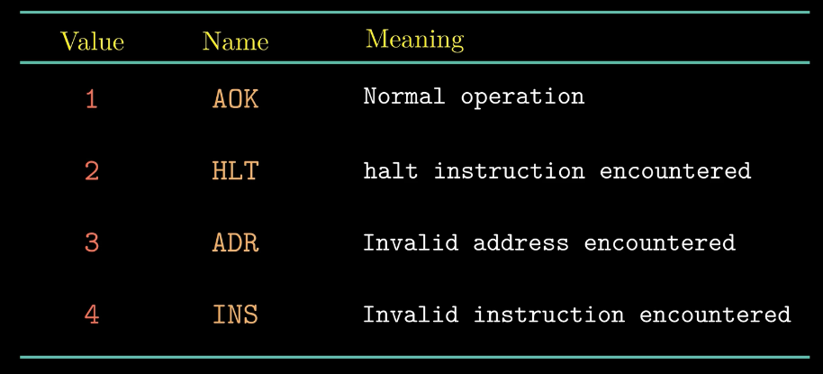 

-   代码值2：表示处理器执行了一条停止指令(halt)；
-   代码值3：表示程序正试图从非法地址读取数据或者向非法地址写入数据；
-   代码值4：表示程序遇到了非法指令。

对于Y86-64，当遇到异常情况时，我们就简单的让处理器停止执行指令。然而在成熟完整的设计中，处理器遇到异常会调用异常处理程序。

# 3数字电路与处理器设计

在处理器内部，寄存器文件和算术逻辑单元(ALU)是串联的，寄存器文件的输出端口与ALU的输入端口相连。例如执行图中这条减法指令，ALU从寄存器文件中读取操作数，然后执行减法操作，最后将计算结果写入到寄存器文件中。

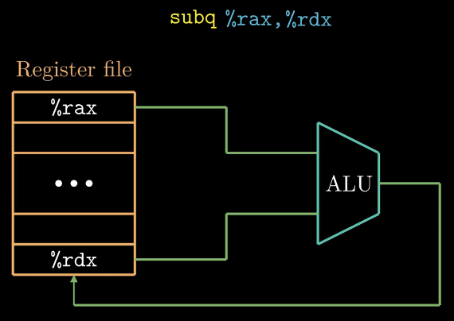 

下图中展示了一个寄存器文件的功能表述。

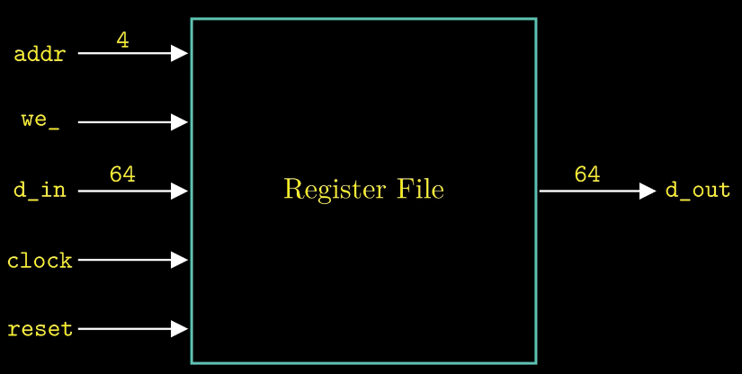 

它有一个读端口和一个写端口，端口的数据位宽是64位，我们规定读写操作共用地址线，由于我们定义了15个程序寄存器，因此地址线的宽度设计成4位即可满足寻址的要求，此外还有时钟信号、复位信号以及写使能信号。

根据上述功能定义，我们可以使用硬件描述语言(HDL)对寄存器文件进行行为级建模。常用的硬件描述语言有两种，最常用的是Verilog，另外一种是VHDL。

图中这段Verilog程序就是对寄存器文件的描述。

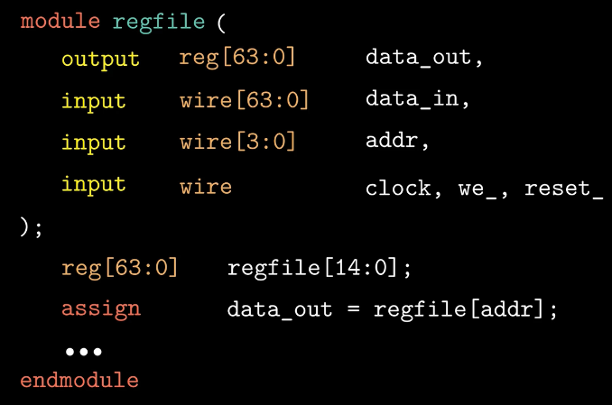 

采用电子设计自动化(EDA)工具对这段程序进行逻辑综合，得到的电路就能可以实现预期的功能，逻辑综合的过程与编译有点类似。

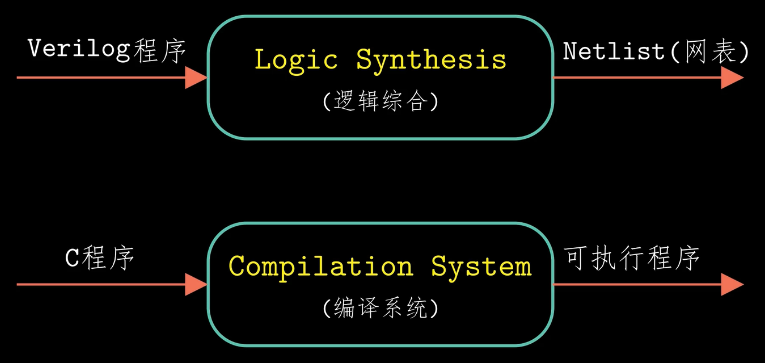 

看一下这个寄存器文件的内部结构，当执行读取操作时，使用地址线来传输寄存器的编号，多路选择器根据地址信号筛选出寄存器的值，最终数值会通过输出信号输出。

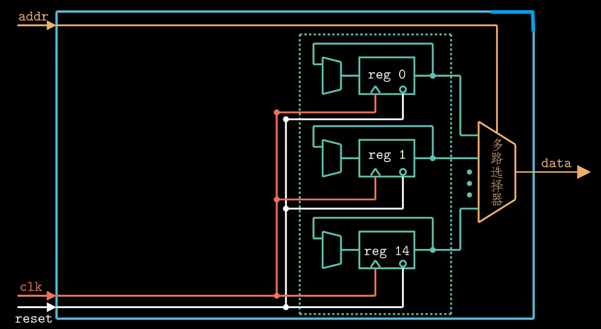 

为了方便描述，下面开始暂时将时钟信号和复位信号省掉。

执行写操作需要确定三个参数：目的寄存器的ID、写入的数据以及是否能够写入。说白了就是能不能写，往哪儿写，写什么。输入数据信号线与每一个寄存器单元都相连（为了方便表述，这里我们忽略了数据的位宽）；能不能执行写入操作由we信号线来确定，we是write enable的缩写。这个例子中地址信号线是读操作和写操作共用的，经过地址解析后的信号与we信号共同来确定对哪个寄存器执行写操作。

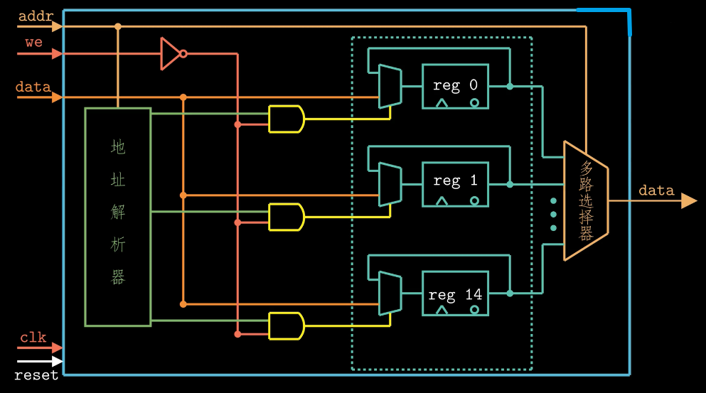 

虽然这张图对寄存器文件内部的描述已经比较详尽了，但多路选择器是怎么实现的？虚线框里面的这个寄存器又是如何存储数据的？为了进一步搞清楚这些模块的底层实现，接下来我们看一些数字电路的相关知识。

## 3.1逻辑门

逻辑门是数字电路的基本计算单元，例如图中与门、或门、非门等。

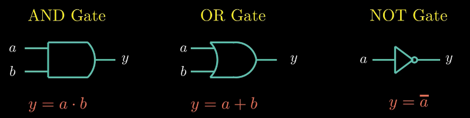 

它们的输出等于输入值按位进行相应的布尔运算。

逻辑门实际上是由晶体管级电路实现的，在现代计算机中，晶体管通常是指基于CMOS工艺的，CMOS有两种晶体管，一种叫N沟道MOS晶体管，简称N管；另外一种叫P沟道MOS晶体管，简称Р管。

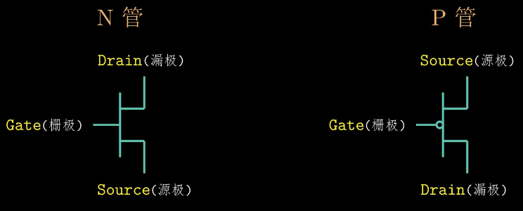 

N管和P管都有3个信号端口，分别为栅极、源极、漏极，我们可以将一个P管和一个N管串联起来实现非门，具体实现是将二者的漏极连在一起作为输出，栅极连在一起作为输入，然后将P管的源极接电源，N管的源极接地，具体如图所示。

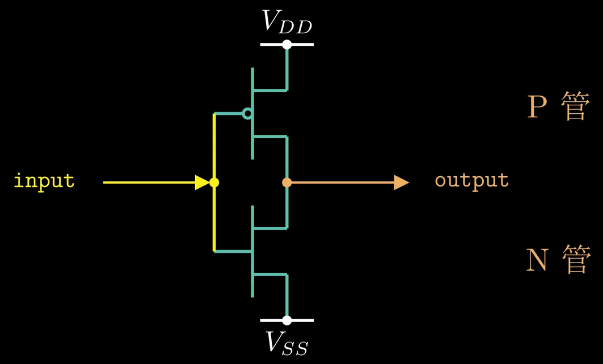 

当输入为高电平时，N管导通，P管不导通，输出为0。

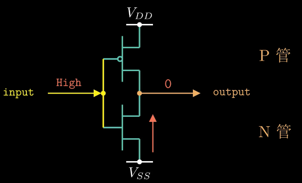 

当输入为低电平，P管导通，N管不导通，输出为1。

综上所述就是非门的基本组成以及工作原理。

## 3.2组合电路和HCL布尔表达式

在CMOS工艺中，与门和或门实现起来不如与非门和或非门高效，所以在设计CMOS电路的时候最好使用与非门、或非门以及非门来实现，这些基本的门结构都可以P管和N管组合来实现。

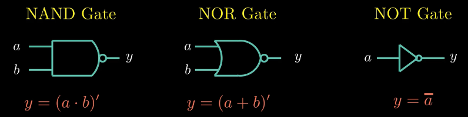 

接下来，我们看一下如何用基本的门电路实现一个多路选择器。

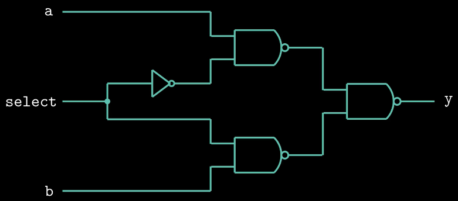 

图中是一个双通道多路选择器的门级表示，当select等于0时，输入端a的数据可以通过该电路到达输出端

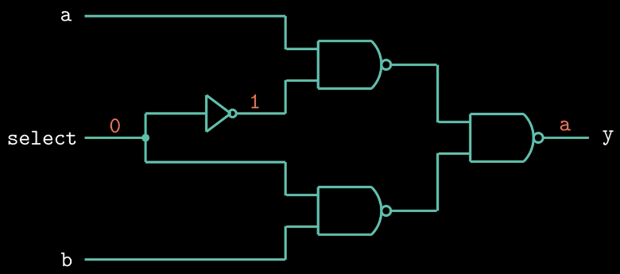 

当select等于1时，输入端b的数据会到达输出端。

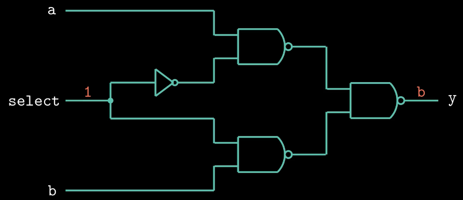 

通常，多路选择器有多条输入通道和一条输出通道。

刚才我们看了寄存器文件的内部实现，多路选择器可以实现控制某个特定寄存器的内容传输到ALU的输入端，它可以使用基本的门电路来实现，只不过比双通道要复杂一点。

通常情况下，寄存器文件内的存储部件是由D触发器来实现的，其电路符号如图所示。

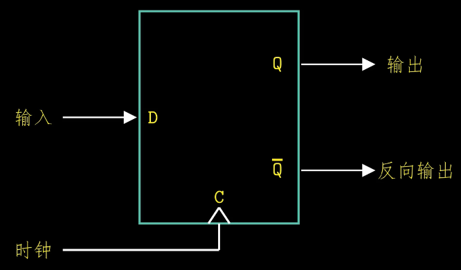 

这里我们给出一种D触发器的门级实现，具体如图所示。

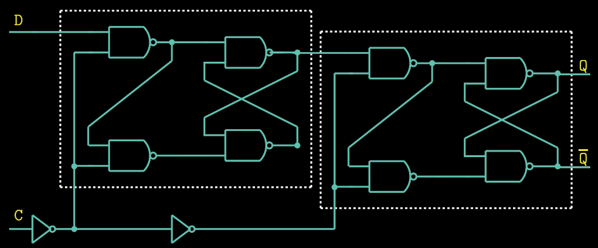 

图中虚线框内的部分被称为D锁存器，关于D触发器的工作原理，这里就不展开描述了。

通过上述的两个示例，可以发现逻辑电路可以使用基本的门电路来搭建，很早以前，电路设计是将一个个门电路绘制在图纸上，但是随着半导体技术的发展，这种方式很难高效的实现大规模的复杂电路。目前，电路的逻辑设计通常采用硬件描述语言来实现，然后采用电子设计自动化(EDA)工具进行综合和后端设计。

硬件描述语言和综合工具的应用使得工程师们更多关注硬件功能的设计，而不是单个晶体管或者逻辑门的设计，接下来，我们看一下D触发器的Verilog实现。

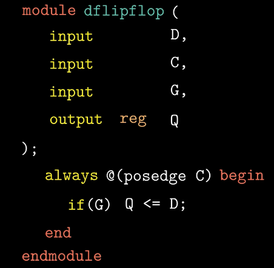 

其中dfilpflop表示模块的名称，D、C、G表示输入，Q表示输出。图中这条always语句表示当时钟C上升沿的时候，如果G为1，就把输入D的值赋给触发器的输出Q，否则Q保持不变。

通过这个例子可以发现用Verilog来描述电路比逻辑门要简单的多，Verilog语言的语法跟C语言有许多类似的地方，但表达的含义与C语言有着本质的区别，Verilog程序是并行执行的，而C程序是串行执行的，所以硬件设计人员需要从电路的角度来理解Verilog语言，而不是软件的思维。

学习Verilog语言，首先需要搞清楚**组合逻辑电路**与**时序逻辑电路**的区别，这两种电路的主要差异在于是否含有存储单元，其中组合逻辑电路的输出值仅由当前的输入状态来决定，而时序逻辑电路的输出值不仅与当前输入的状态有关，而且与原来的状态也有关。

up主的体系结构老师曾说过，他用Verilog做设计只用三种语句：第一个是assign语句，用于描述组合逻辑；第二个是always语句，用于描述时序逻辑，其中posedge clock表示在时钟上升汾的时候变化；最后一个是模块调用语句。

学会这三种语句，所有的设计都够了。

# 4、Y86-64的顺序实现

由于x86-64指令系统较为复杂，为了方便学习和理解，Y86-64指令系统做了相应的简化处理，其中指令编码的长度从1个字节到10个字节不等，每条指令都含有一个长度为8个比特位的指令指示符，有的指令含有一个单字节的寄存器指示符，还有的含有一个8字节的常数。

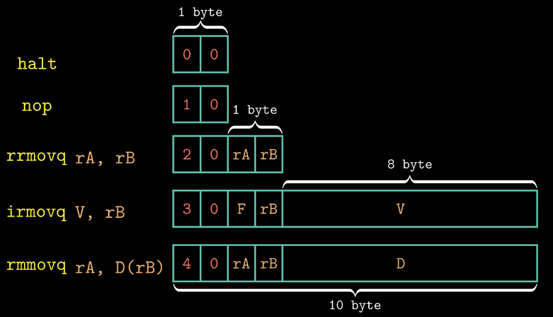 

根据图中定义的指令，通过一个例子看一下C程序翻译成的Y86-64汇编代码。

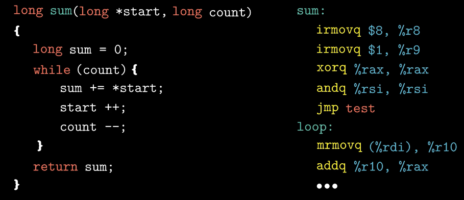 

图中这段C代码用来计算一个数组的元素之和，指针start指向数组的起始位置，count用来表示数组的长度。

仅从指令的格式来看，除了数据传送指令，其他的指令与x86-64指令差异不大，使用Y86-64汇编器可以将图中的汇编代码翻译成二进制指令，具体如图所示。

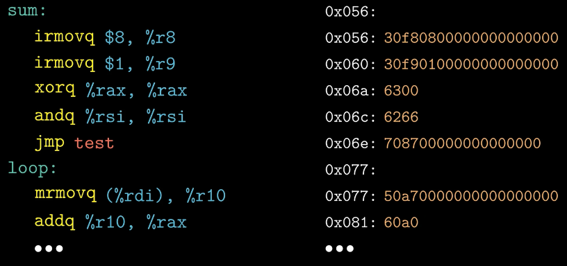 

Y86-64汇编器的翻译过程是基于Y86-64指令系统的，图中的二进制指令可以运行在Y86-64的处理器上，由于篇幅限制，我们这里只展示了其中的一部分。

第四章的主要内容是设计一个Y86-64的处理器，用它来执行这些二进制指令。

## 4.1将处理组织成阶段

通常，处理器执行一条指令包含很多操作，实现所有Y86-64指令所需要的计算可以被组织成6个基本阶段，分别为取指、译码、执行、访存、写回以及更新PC。

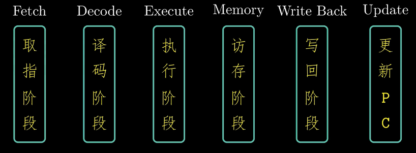 

1、首先是取指阶段，这个阶段对于所有的指令都是需要的，在我们定义的Y86-64指令系统中，指令的长度并不是固定的。

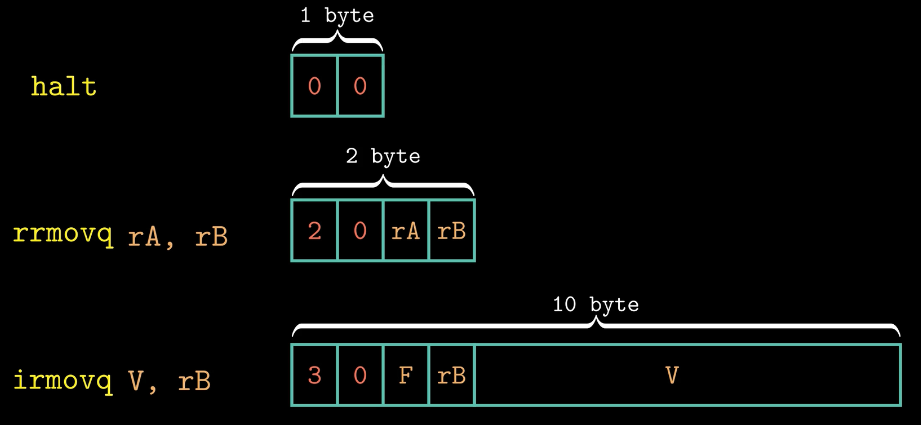 

取指阶段还会根据指令代码判断指令是否含有寄存器指示符，是否含有常数，从而计算出当前指令的指令长度。

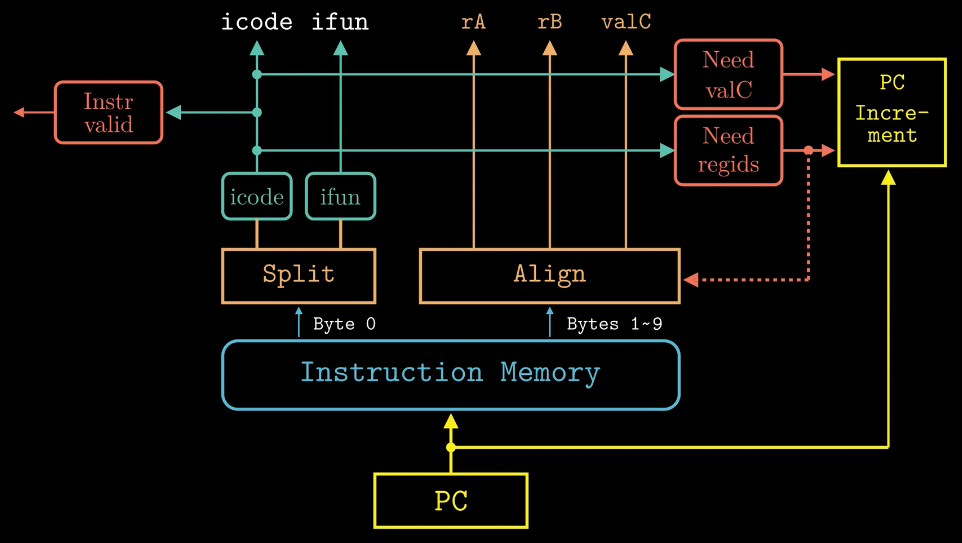 

2、译码阶段比较简单，就是从寄存器文件中读取数据，寄存器文件有两个读端口，可以支持同时进行两个读操作。

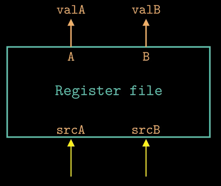 

3、执行阶段，算术逻辑单元(ALU)主要执行三类操作：第一类操作是执行算术逻辑运算；第二类操作是计算内存引用的有效地址；第三类操作是针对`push`指令和`pop`指令。

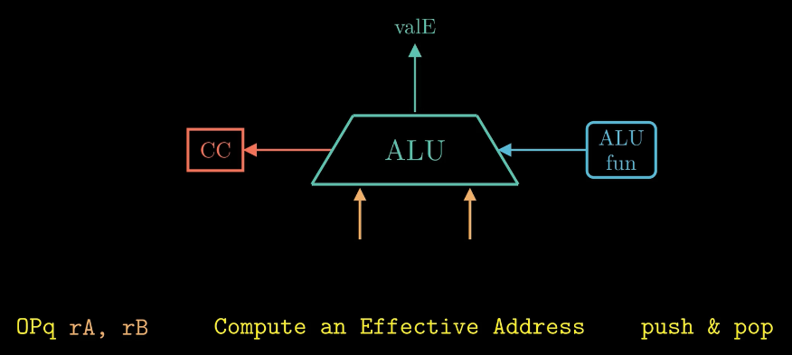 

4、访存阶段主要是针对内存的读写操作，既可以从内存读出数据，也可以将数据写入内存。

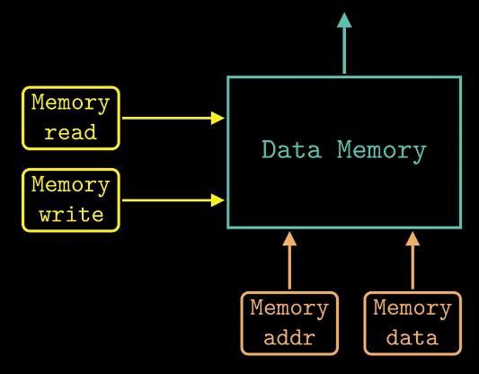 

5、写回阶段与译码阶段类似，都是针对寄存器文件的操作，不同的是译码阶段是读寄存器文件，写回阶段是写寄存器文件。

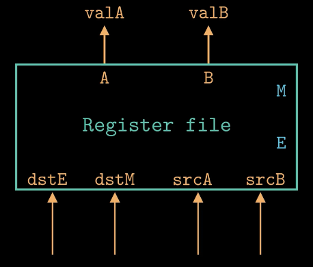 

6、更新PC是将PC的内容设置成下一条指令的地址。

以上我们大致介绍了指令执行的不同阶段，但是并不是所有的指令执行都要经历这6个阶段，接下来，通过几个例子来看一下不同的指令在各个阶段执行的操作。

## 4.2 subq 的各个阶段

例如图中这条减法指令：

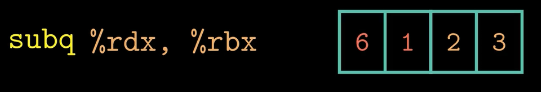 

取指阶段会根据指令代码来判断该指令是否包含寄存器指示符，是否包含常数，根据判断结果可以得出该指令的长度。

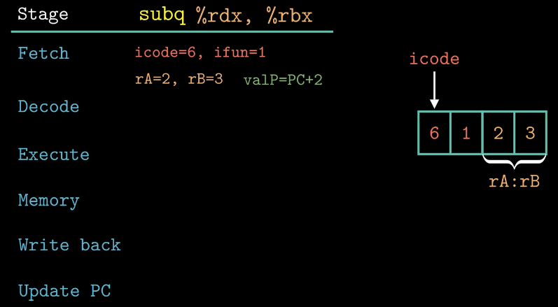 

由于减法指令的源操作数和目的操作数都是寄存器类型的，在译码阶段会根据寄存器指示符来读取寄存器的值。

 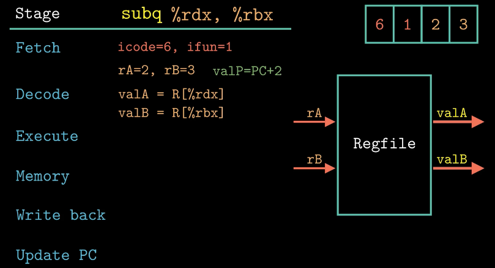 

执行阶段，ALU根据译码阶段读取到的操作数以及指令功能来执行具体的运算，除了输出运算结果，还会根据结果来设置条件码寄存器。

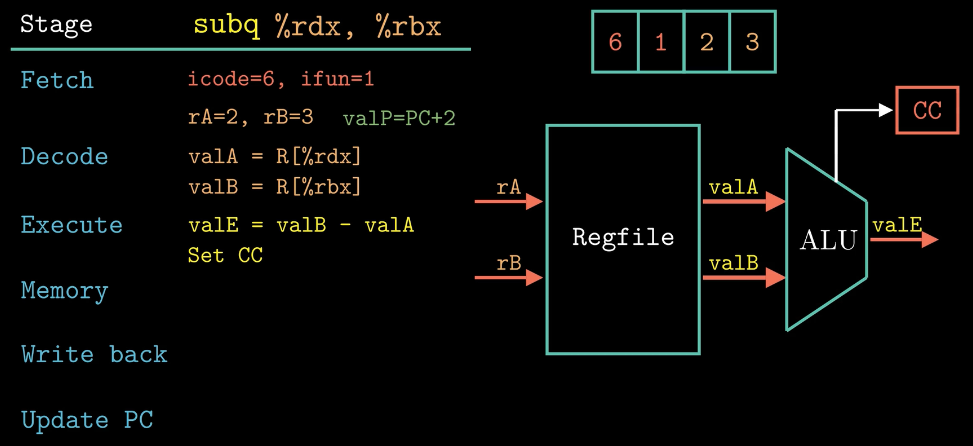 

由于减法指令不需要读写内存，因此访存阶段不需要任何操作。

写回阶段将ALU的运算结果写回到寄存器`rbx`。

 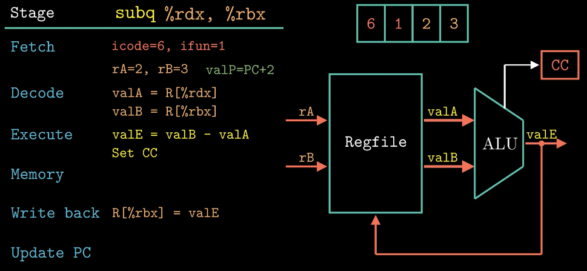 

最后对程序计数器PC进行更新。

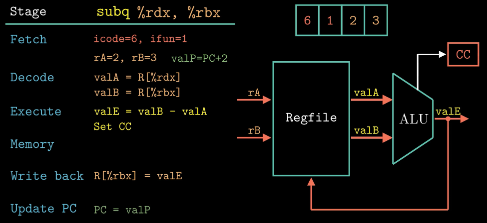 

以上就是减法指令相关的操作。

## 4.3 irmovq 的各个阶段

接下来，看一下数据传送指令`irmovq`。

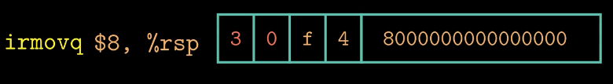                

这条指令执行的操作是将一个立即数传送给寄存器。

取指阶段根据指令代码可以判断该指令既含有寄存器指示符字节，也含有常数字段。

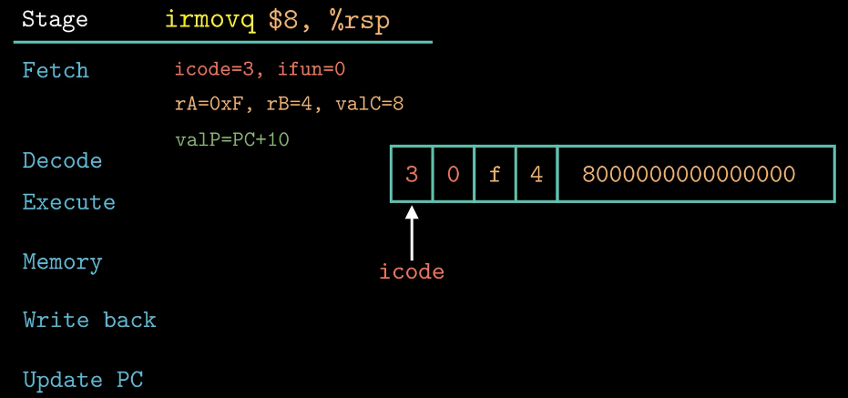 

由于这条指令不需要从寄存器文件中读取数据，所以译码阶段不需要执行任何操作。

从表面上看，数据传送指令只是数据搬运，并不需要ALU部件，在实际的硬件中，ALU的输出端口与寄存器文件的写入端口相连，该指令在执行阶段使用ALU对立即数执行加0的操作。

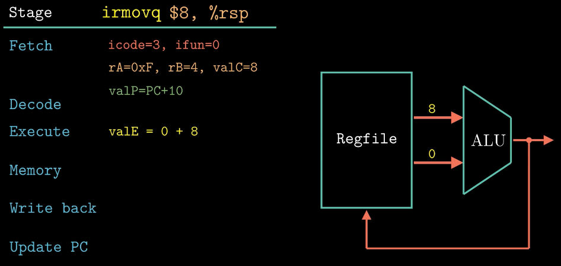 

在写回阶段将运算结果写入寄存器文件就完成了数据传送的操作。

由于该指令不涉及内存的读写，所以访存阶段不执行任何操作，执行阶段使用ALU对常数进行加0的操作需要注意一下。

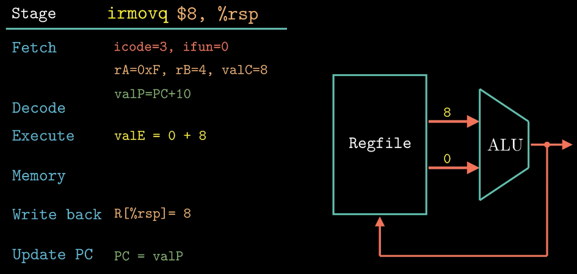 

## 4.4 rmmovq 的各个阶段

接下来，再来看另外一条数据传送指令`rmmovq`。

 

取指阶段和译码阶段跟前面讲的类似。

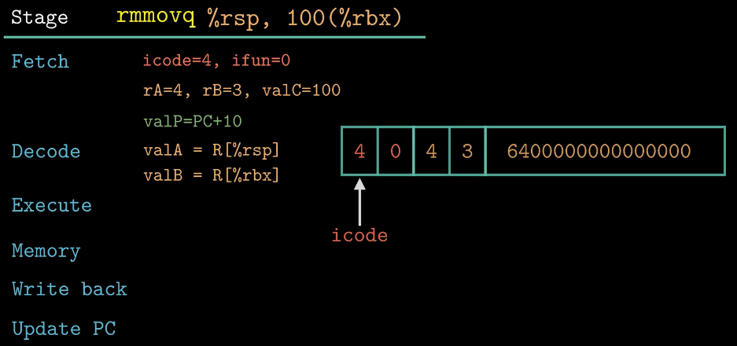 

重点看一下执行阶段，ALU根据偏移量和基址寄存器来计算访存地址，访存阶段将寄存器`rsp`的数值写入内存中，内存地址由执行阶段得出，由于需要写寄存器，所以写回阶段不进行任何操作。

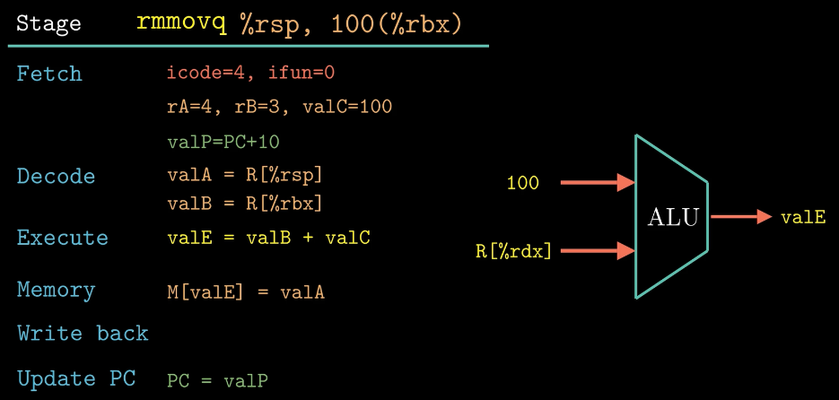 

通过上面的描述，ALU还可以用来计算内存引用地址。

## 4.5 pushq 的各个阶段

接下来看一下指令`pushq`的操作流程。

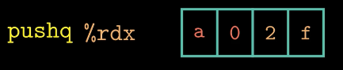 

取指阶段根据指令代码来判断该指令含有寄存器指示符，不含常数，因此，指令长度为2个字节。

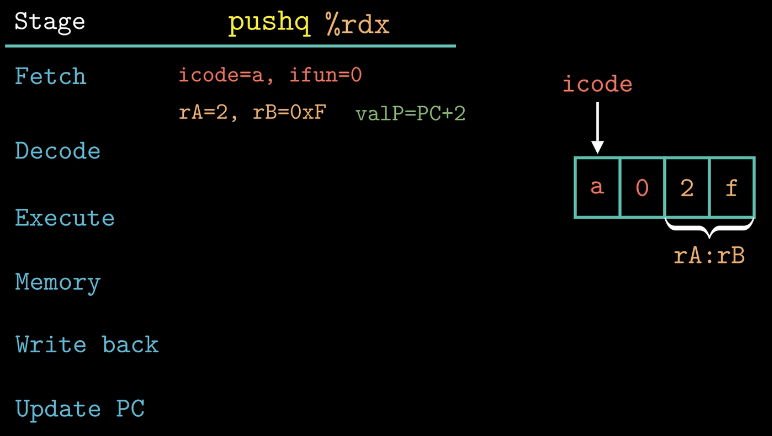 

需要特别注意的是∶译码阶段不仅需要读寄存器`rdx`的值，还需要读寄存器`rsp`的值，这是因为指令`pushq`要将寄存器`rdx`的值保存到栈（内存)上。

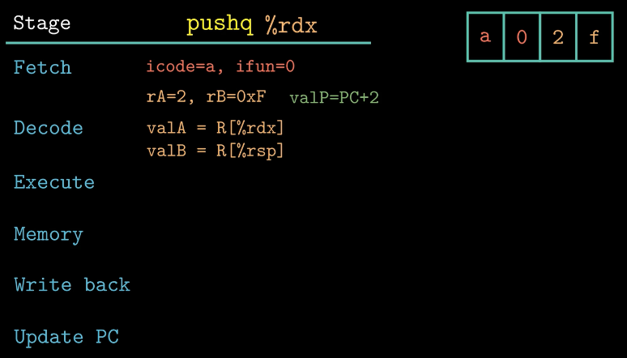 

执行阶段会计算内存地址，具体方法是：将寄存器`rsp`指向的内存地址进行减8的操作，阶段还需要读寄存器`rsp`的值。

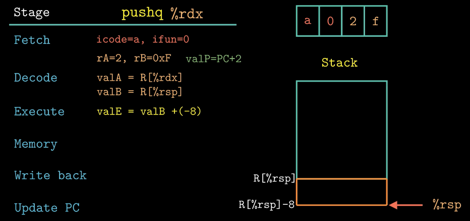 

访存阶段会将寄存器`rdx`的值写到栈上，具体如图所示。

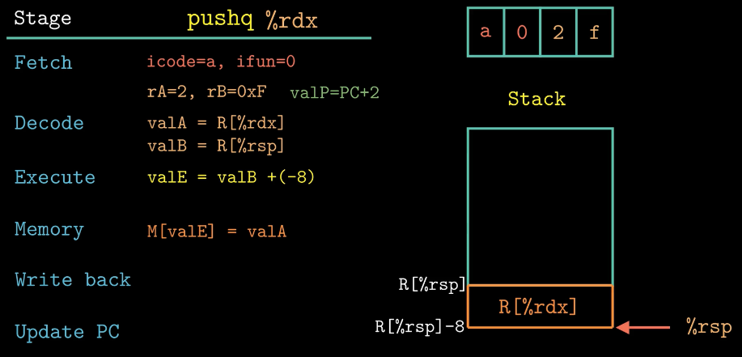 

由于寄存器`rsp`指向的内存地址发生了变化，因此写回阶段需要更新寄存器`rsp`的值，最后更新PC的值。

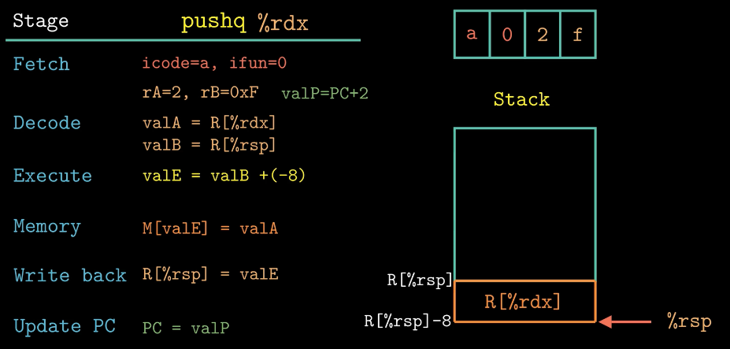 

以上就是`push`指令各个介段所进行的操作。

## 4.6 je 的各个阶段

最后看一下跳转类指令。

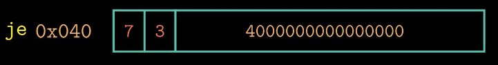 

取指阶段根据指令代码来判断该指令含有常数字段，不含寄存器指示符字节，因此，指令的长度为9个字节。

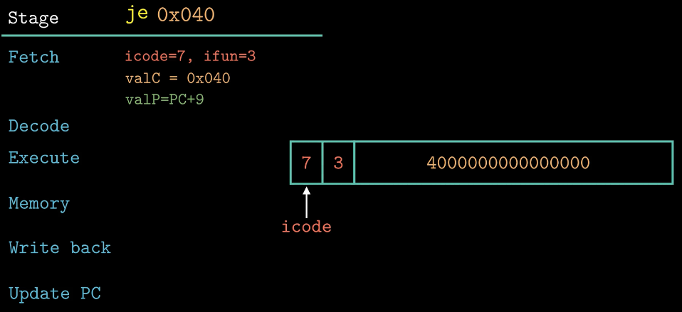 

由于不需要读取寄存器文件，所以译码阶段不进行任何操作。

执行阶段，标号为Cond的硬件单元根据条件码和指令功能来判断是否执行跳转，这个模块产生一个信号Cnd，如果Cnd等于1，执行跳转；Cnd=0，不执行跳转。

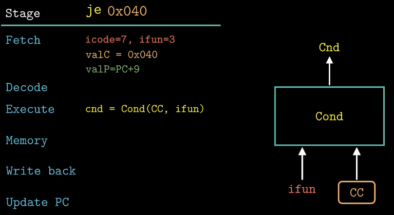 

注意在更新PC的阶段，如果Cnd等于1，就将PC的值设为0x040；如果Cnd等于0，PC的值就等于当前值加上9。

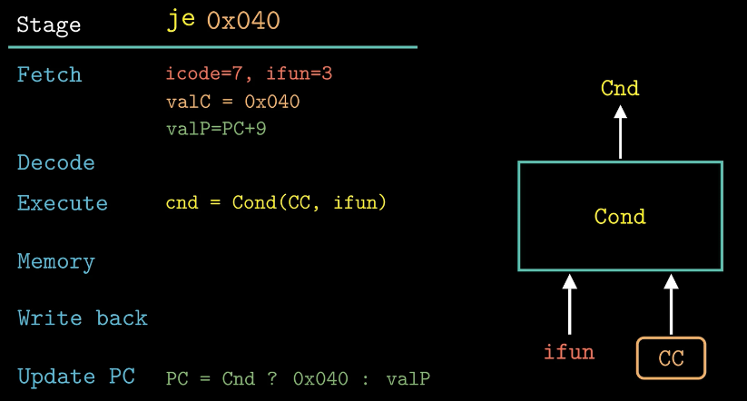 

以上就是跳转指令的执行流程。

通过这个统一的框架，能够处理不同类型的Y86-64指令。

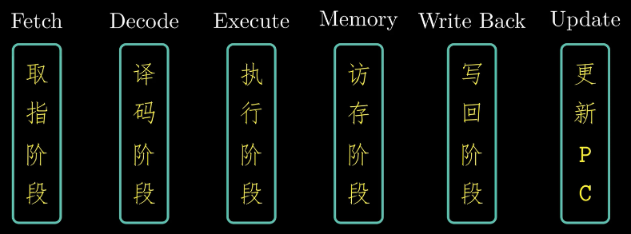 

虽然指令的行为大不相同，但是我们可以将指令的处理组织成6个阶段。

# 5、Y86-64处理器硬件结构

## 5.1取值阶段的硬件设计

取指阶段以程序计数器(PC)的值作为起始地址，取指操作每次从指令内存中读取10个字节，取10个字节是由于在取指操作之前，无法判断当前指令的长度，Y86-64指令系统中最长的指令占10个字节，一次性从内存中取出10个字节可以保证一次取指操作至少可以获取一条完整的Y86-64指令。

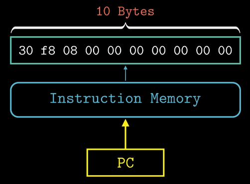 

接下来，将这10个字节分成两部分，一部分占1个字节，另外一部分占9个字节。

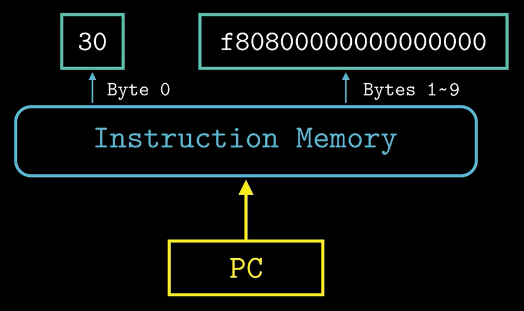 

下图中标号为split的硬件单元处理第一部分，它将第一个字节分成两部分，每一部分占4个比特位。根据Y86-64指令系统的定义，这两个字段分别为指令代码和指令功能，这里用icode和ifun表示。

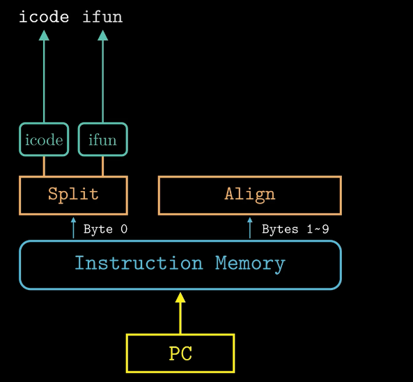 

根据icode可以确定当前指令的状态信息。首先可以判断这条指令是否是一条合法的指令，如果icode在0x0到xB之间，那么这条指令就是一条合法指令；如果不是，则表示当前指令属于非法指令。此外，根据icode还可以判断当前指令是否包含寄存器指示符字节，以及是否包含常数字节。

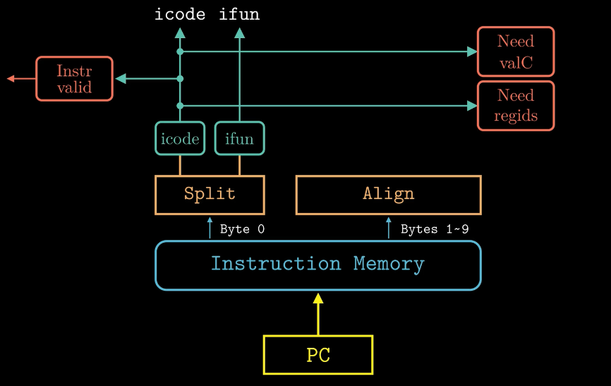 

根据上述的判断结果，就可以算出当前指令的长度。

例如︰既含有寄存器指示符字节，又含有常数字节，那么当前指令长度就是10个字节；如果既不含寄存器指示符字节，也不含常数字节，那么当前指令长度就是1个字节。

既然通过icode可以获得当前指令的长度，那么指令内存中下一条指令的地址，就可以通过当前PC值加上当前指令的长度计算出来。

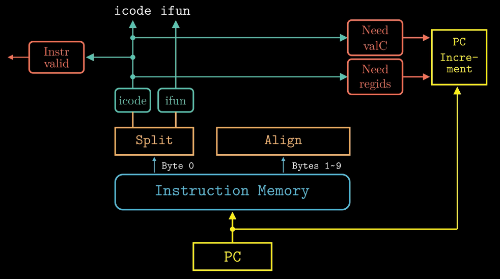 

我们继续看一下剩余9个字节是如何处理的，标号为Align的硬件单元可以产生寄存器字段和常数字段。当need_regids等于1时，表示该指令包含**寄存器指示符字节**，那么第一个字节将被分成两部分，每一部分占4个比特位，然后分别装人寄存器指示符rA和rB中；当need regids等于0时，表示这条指令没有寄存器指示符字节，此时rA、rB这两个字段会被置为0xF；当指令中只含有一个寄存器操作数时，同样另外一个字段也会被置为0xF。

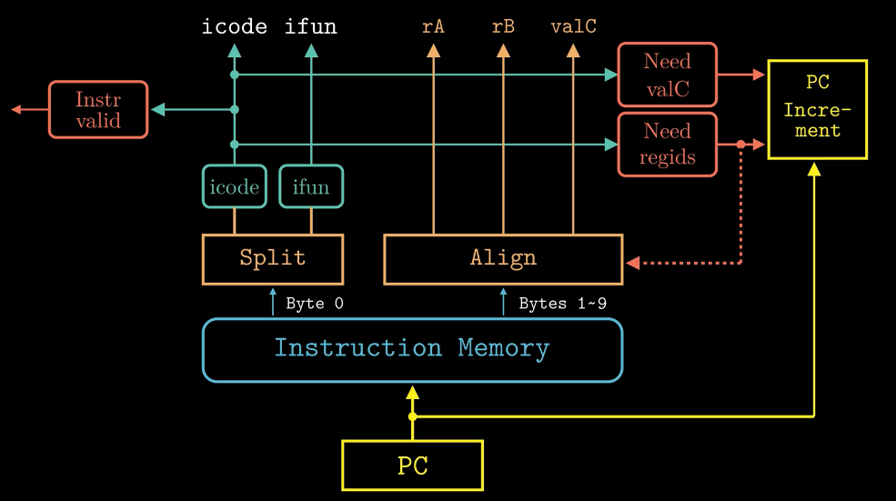 

如果该指令含有常数, Align单元还产生常数字段valC，同样需要根据信号need_regids的值来判断。当need_regids等于1时，第2字节到第9个自己表示常数字段valC；当need_regids等于0时，第1个字节到第8个字节表示常数字段valC。

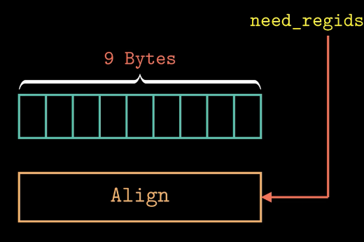 

## 5.2译码阶段的硬件设计

译码阶段是从寄存器文件中读取数据，在Y86-64处理器中寄存器文件有两个读端口，它支持同时进行两个读操作，两个读端口的地址输人为srcA和srcB，从寄存器文件中读出的数值通过valA和valB输出。

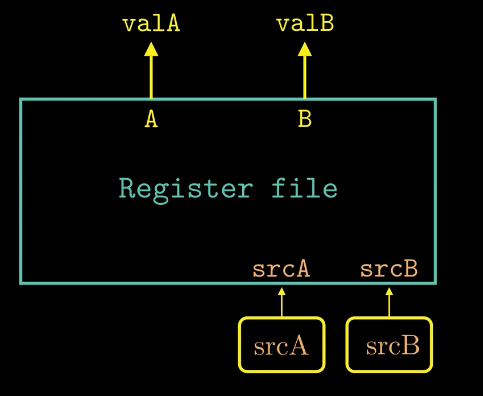 

图中标号为srcA和srcB的圆角矩形块可以产生寄存器的ID值，产生寄存器的ID值需要指令代码icode以及寄存器指示值rA和rB。

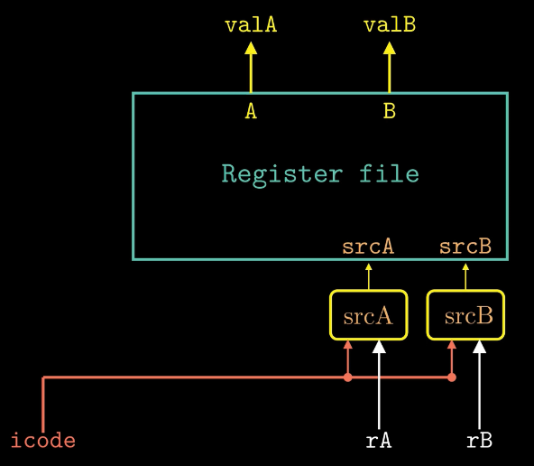 

读取寄存器的数据，需要rA和rB比较容易理解，那么为什么还需要指令代码icode呢？

例如`push`指令，该指令的寄存器指示符中只含有目的寄存器的ID值，当执行压栈操作时，还需要获得栈顶指针`rsp`的值。

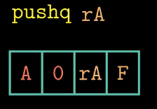 

不仅仅是`push`指令，实际上对于图中这四条指令，在译码阶段都是需要读寄存器rsp的内容，所以译码阶段不仅需要rA和rB信号，还需要icode信号。

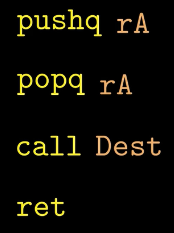 

## 5.3执行阶段的硬件设计

 执行阶段的核心部件是算术逻辑单元，简称ALU。ALU根据指令功能(ifun)来判断对输人的操作数进行何种运算，每次运行时，ALU都会产生三个与条件码相关的信号——零、符号、溢出。

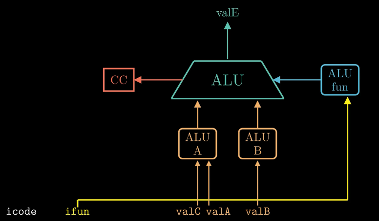 

不过，我们只希望ALU在执行算术逻辑指令时才会设置条件码，当ALU计算内存引用地址以及对栈进行操作时，并不会设置条件码。因此，图中Set_CC会根据指令代码icode来控制是否要更新条件码寄存器。

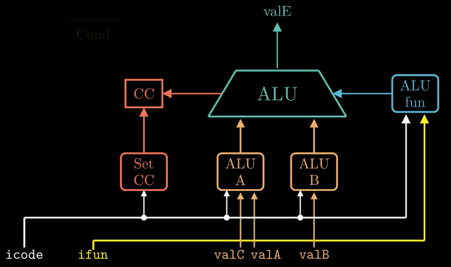 

标号为Cond的硬件单元会根据指令功能和条件码寄存器产生一个Cnd信号，对于跳转指令，如果cnd等于1，执行跳转；如果cnd等于0，则不执行跳转。

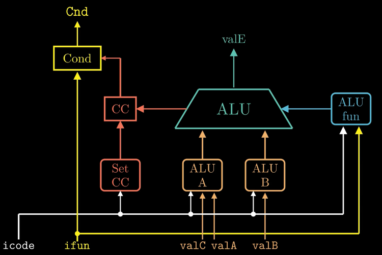 

对于ALU，不仅可以执行算术逻辑指令，还要涉及内存地址的计算以及栈指针的增加或减少的操作。

## 5.4访存阶段的硬件设计

访存阶段的任务就是从内存中读数据或者将数据写入内存中。

图中的读控制块表明应该进行读操作，写控制块表明应该进行写操作。

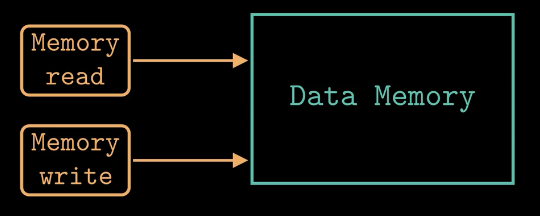 

此外还有产生内存地址和输人数据的控制块，具体如图所示。

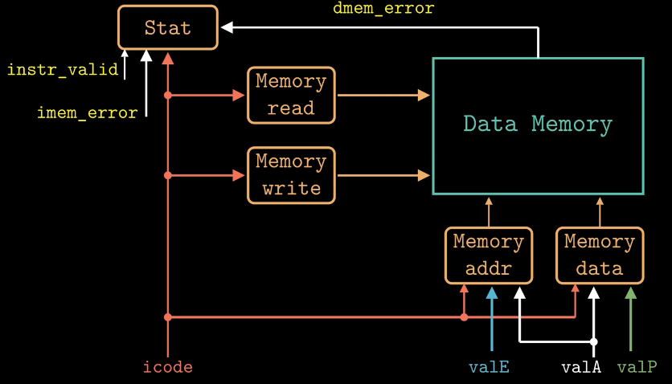 

需要注意的是访存阶段的最后操作，会根据图中的信号来计算状态码Stat。

## 5.5写回阶段的硬件设计

写回阶段是将数据写入到寄存器文件。

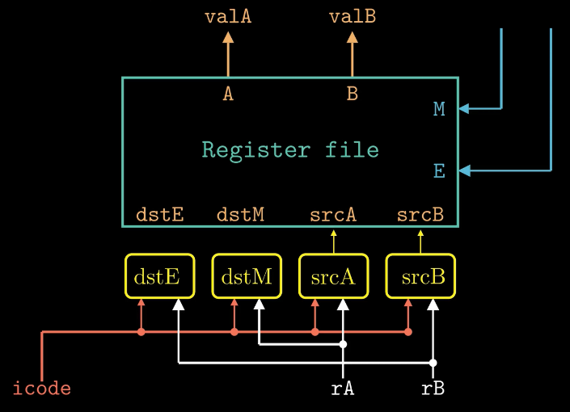 

两个写端口分别为M和E，对应的地址输人为dstE和dstM。这里需要注意的是，当执行条件传送指令(cmov)时，写入操作还要根据执行阶段计算出的cnd信号，当条件不满足条件时，以将目的寄存器设置为0xF来禁止写入寄存器文件。

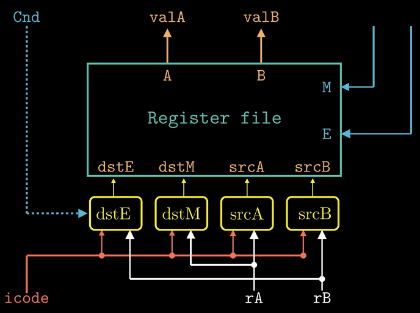 

## 5.6更新PC阶段的硬件设计

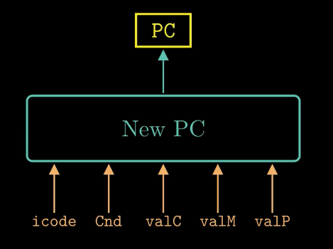 

PC的值可能有三种情况：

第一种情况，如果当前正在执行的指令是函数调用指令Call，那么新的PC就等于call指令的常数字段；

第二种情况，如果当前正在执行的指令是函数返回指令ret，指令ret在访存阶段会从内存(栈)中读出返回地址，这个返回地址就是新的PC值；

第三种情况，如果当前正在执行的指令是跳转指令(jxx)，当cnd信号等于1时，也就是满足跳转条件时，此时新的PC等于跳转指令的常数字段，当不满足跳转条件时，跳转指令与其他指令一样，新的PC等于当前PC的值加上当前指令的长度。

以上就是一个Y86-64处理器的完整设计，不过这种顺序结构存在一个问题︰就是指令的执行速度太慢了，时钟必须非常慢，这样才能使得所有的操作在一个时钟周期内完成。

# 6流水线的通用原理

流水化的硬件设计

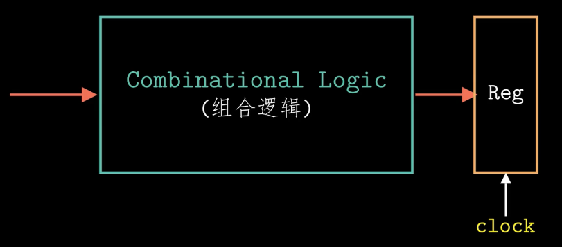 

## 6.1计算流水线

在现代逻辑电路的设计中，电路的延迟用皮秒来表示。1皮秒等于10-12秒。信号从输入端经过组合逻辑电路到达输出端，中间会经过一系列的逻辑门，经过一段时间的延迟后，得到输出结果，

假设信号经过图中的这个组合逻辑电路的时间是300皮秒，输出信号加载到时钟寄存器保存需要20皮秒，那么整个过程的延迟为320皮秒。

我们可以将图中的整个过程抽象为指令的执行，延迟也就是一条指令从开始执行到结束所需要的时间。

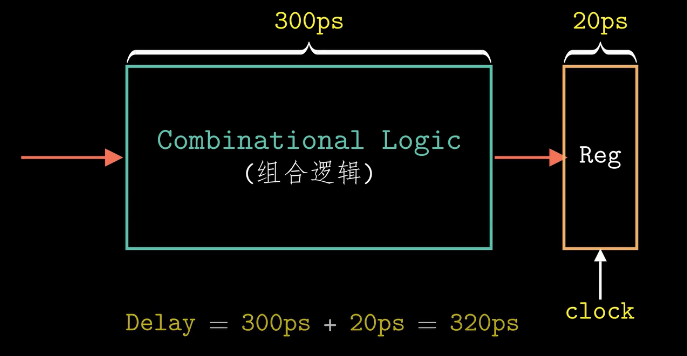 

假设三条指令顺序通过上述组合逻辑单元，可以得到一个流水图。时间从左向右流动，在这个非流水化的实现中，开始下一条指令之前，必须完成上一条指令的执行。因此指令的执行不存在相互重叠的情况。

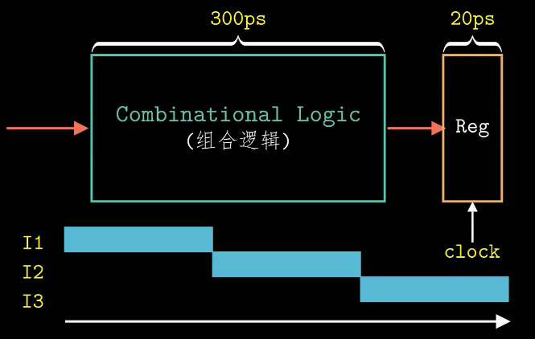 

为了评估上述系统的执行效率，我们引入吞吐量的概念。

假如一条指令执行需要320皮秒，那么这个系统一秒钟的时间大约可以执行3.12×109条指令。

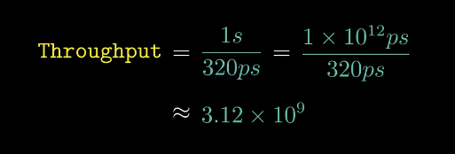 

我们将吞吐量的单位定义为每秒千兆条指令，也就是每秒10亿条指令。因此，该系统的最大吞吐量约为3.12GIPS。

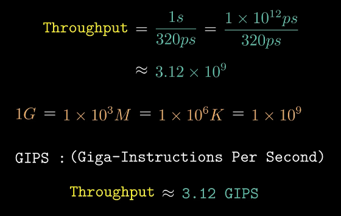 

## 6.2流水线的详细操作

在之前讲述汇编代码时，我们多次提到寄存器相关的操作，这里我们在讲述电路设计时也用到了寄存器，这两种不同的情景下，寄存器一词表述的含义还是有着细微的差别。

在电路设计中，时钟寄存器直接将它的输入和输出连接到电路中，大多数情况下，寄存器都保持在稳定的状态。

假设图中寄存器当前的状态为x，那么产生的输出也等于x。当寄存器的输入端产生了一个新的输入y时，如果时钟是低电平，那么寄存器的状态不会立即发生改变，当时钟信号由低电平变成高电平时，输入信号y才会加载到寄存器。直到下一个时钟上升沿之前，寄存器的输出一直就是y。

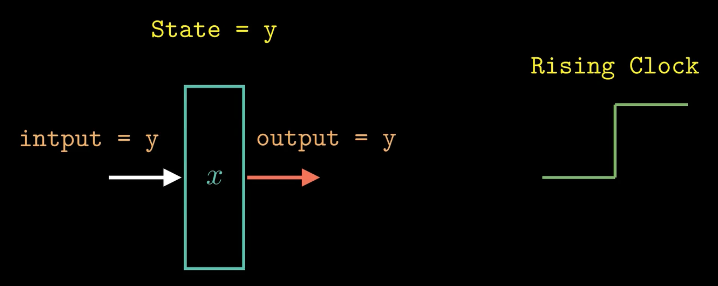 

这里需要特别注意一下:

假设我们将图中的组合逻辑单元所执行的操作分成三个阶段。信号经过每个阶段的延迟为100皮秒，然后在各个阶段之间放上流水线寄存器。寄存器的延迟是20皮秒。每条指令的执行都会经过A B C 3个阶段处理。我们将时钟周期设置为120秒，那么指令从开始到结束需要三个完整的时钟周期。

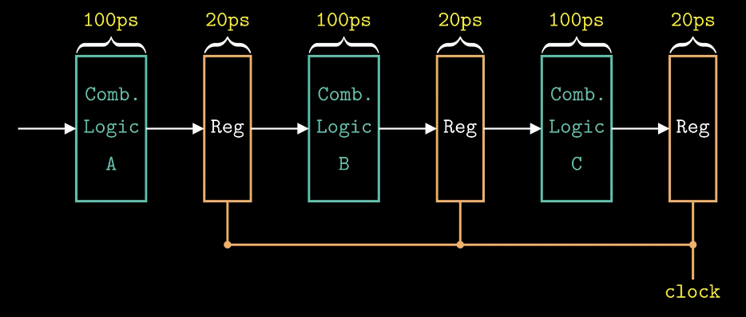 

指令的流水线图：

只要指令一从A阶段进入B阶段之后，就可以让指令2进入A阶段，以此类推，在稳定的情况下，三个阶段都是处于运行状态。之后，系统每隔120皮秒就有一条指令离开系统，一条新的指令进入。

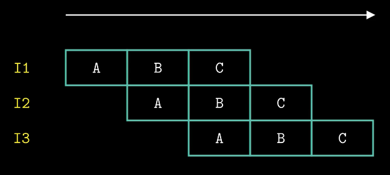 

因此，对于该流水化系统的吞吐量大约为8.33GIPS。与非流水化的设计相比系统的吞吐量提高了2.67倍。

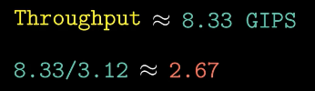 

## 6.3理想的流水线系统

通过一个例子来看一下流水线计算的时序和操作：

指令在流水线各个阶段的转移是由时钟信号来控制的。每隔120皮秒，信号从0上升至1，流水线开始下一个阶段的计算。

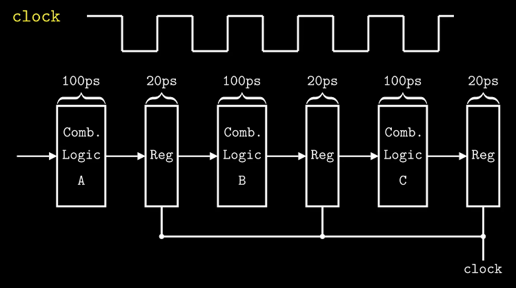 

重点看一下240平秒至360皮秒之间的电路活动：

当时刻0时，此时流水线所有的部件处于空闲状态，具体如图所示：

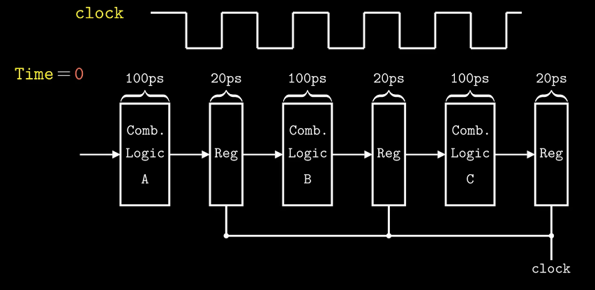 

首先，我们看一下时钟上升之前，时刻239皮秒处的流水线状态。此时，指令1经过阶段B的计算结果已经到达第二个寄存器的输入，指令2经过阶段A的计算结果已经到达第一个计算器的输入。

指令1用青色表示，指令2用金色来表示。

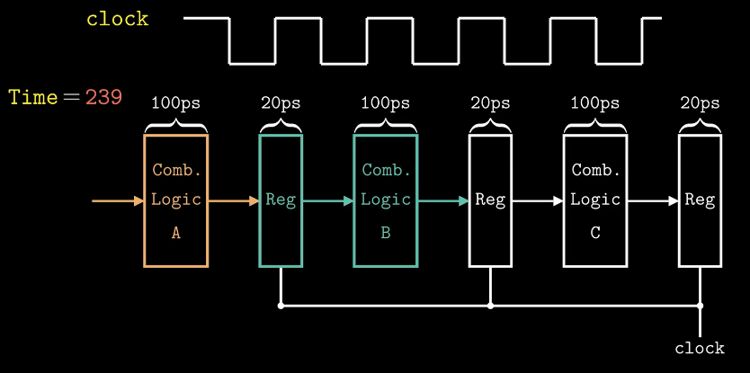 

流水线相应的部分由白色变成了青色和金色。此时，第一个寄存器还保存着指令1在阶段A的计算结果。

随着时间的推移，当时钟上升时，一个寄存器的状态由指令1的结果变成了指令2的结果。在流水线图中，我们用金色代替青色来表示这种情况。

第二个寄存器的状态用来保存指令2在阶段B的执行结果。同样我们用青色代替白色来表示。同时，阶段A的输入被设置成发起指令3的计算。

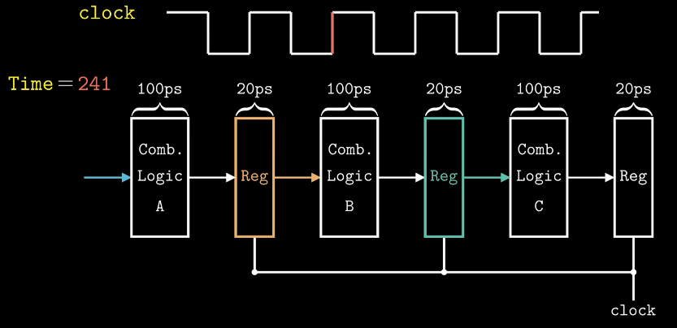 

在经过一段时间的运行，我们看一下时刻359皮秒处的流水线状态。

指令1经过阶段C的计算结果已经到达第三个寄存器的输入。指令2经过阶段B到达第二个寄存器的输入。指令3经过阶段A到达第一个寄存器的输入。青色表示指令1，金色表示指令2，蓝色表示指令3。

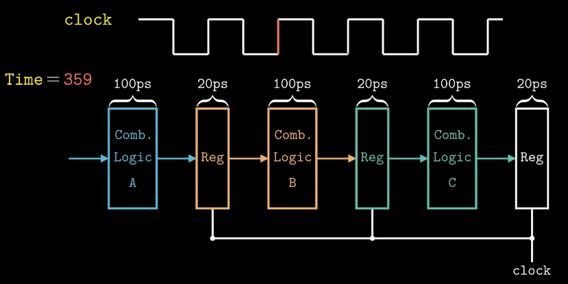 

注意，接下来当时钟上升，13个寄存器的值都会发生改变。

随着时钟周而复始的上升和下降。不同的指令经过流水线的三个阶段。

我们可以把寄存器看做各个阶段之间的屏障。因此，执行之间并不会相互干扰。

上述事例是一个理想状态的流水化系统。

## 6.4流水线的局限

实际上会有一些其他的因素影响流水线的效率。

### 6.4.1不一致的划分

对硬件设计者来讲，将一个整体的设计划分成多个延迟都相等的子阶段是一个严峻的挑战。现实情况中，各个阶段的延迟可能都是不等的，

虽然三个阶段的延迟加起来仍旧是300皮秒，但是时钟的速率是受最慢阶段的限制。

时钟周期需要设置成170皮秒，此时阶段A会有100皮秒的空闲。阶段C会有50皮秒的空闲。相对于理想情况下，系统的吞吐量从8.33GIPS下降到5.88GIPS。

### 6.4.2流水线过深，收益反而下降

此外，流水线还有另外一个局限性。

当我们把计算过程分成更多的阶段时。系统的吞吐量也提升了。与三级流水相比，六级流水的吞吐量提升了1.71倍。

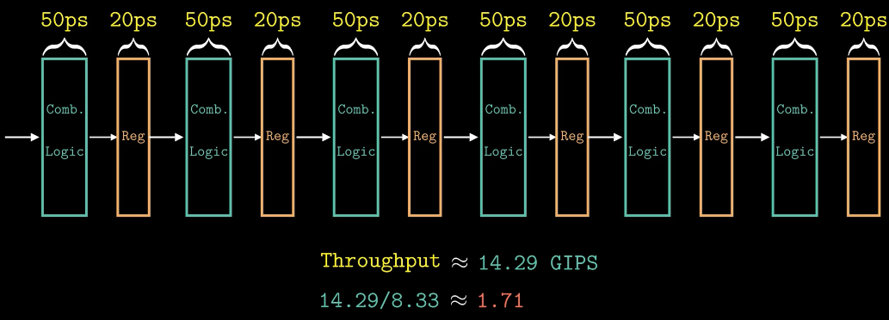 

虽然增加流水线的阶段数，可以提升系统的吞吐量，但是过深的流水线同样会导致系统性能的下降。因为通过流水线寄存器有延迟，这个延迟成了流水线吞吐量的一个制约因素。在这个新设计中，这个延迟占到了整个时钟周期的28.6%。

## 6.5带反馈的流水线系统

在之前的例子中，我们假设指令之间都是相互独立的。而实际的程序中，指令之间是有相互依赖关系的。例如图中的这个代码示例：

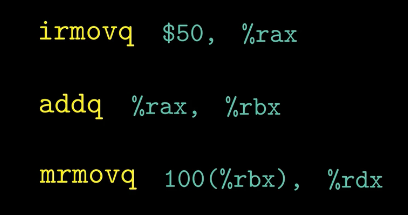 

第二条指令addq的执行需要依赖第一条指令的执行结果。

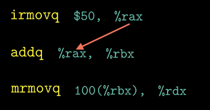 

我们将这种情况称为数据依赖，也叫数据相关。

同样，第三条指令也需要依赖第二条指令的计算结果。具体如图所示：

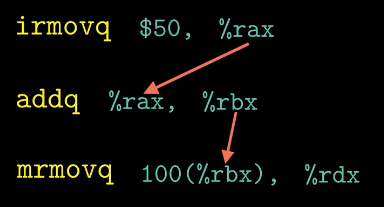 

除了上述提到的数据依赖，还有一种依赖是由于指令控制流造成的控制依赖。

例如图中的这一段汇编代码：

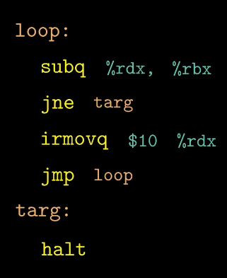 

跳转指令会产生一个控制依赖。因为条件测试的结果会决定要顺序执行irmovq指令还是执行halt指令。

在顺序结构的设计中，这些相关是通过反馈来解决的。不过在流水线的系统中引入反馈路径是非常危险的。

例如，指令4的输入需要依赖指令1的执行结果。

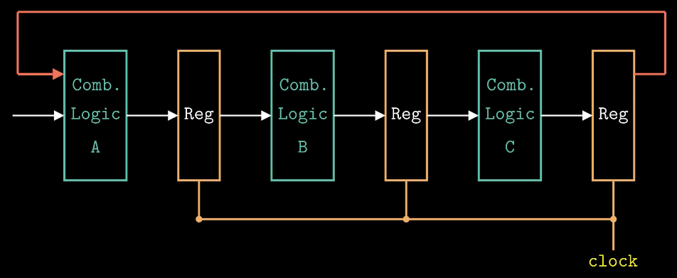 

为了通过流水线技术加速系统，我们改变了系统的行为。显然，这种行为是不可接受的，

我们必须以某种方式来处理指令间的数据依赖和控制依赖。

# 7流水线的硬件结构

Y86顺序实现的概述：

首先是取指阶段。将程序计数器PC的值作为地址。从指令内存中读取指令字节。其中第一个字节被分成两部分，分别为指令代码和指令功能，取出的指令字节中可能还有一个寄存器指示符字节，指明一个或者两个寄存器指示符，还可能还有一个四字节的常数。PC增加器用来计算下一条指令的地址vaIP。valP的值等于PC加上当前已经取出指令的长度。

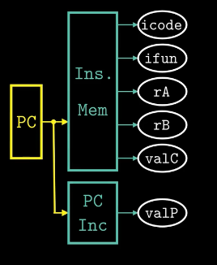 

接下来是译码阶段。寄存器文件有两个读端口A和B。一次译码操作可以同时读出两个寄存器的值。寄存器文件的读出端口与算术逻辑单元的输入相连。在执行阶段，ALU会根据指令功能来执行指定的运算，从而得到运算结果valE。同时还会设置条件码寄存器（CC）。对于跳转指令，在执行阶段会根据条件码和跳转条件来产生信号Cnd。再次强调一下，ALU除了执行算术逻辑指令。还要计算访存的有效地址，以及针对栈指针的运算（加8和减8操作）。因此，ALU的输出端口会与数据内存的逻辑地址单元相连。

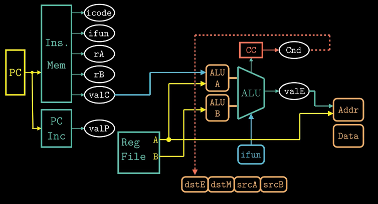 

对于访存阶段，可以将数据写入内存，或者从内存中读出数据。写入的数据可以由寄存器文件提供，也可以是指令中的常数字段。

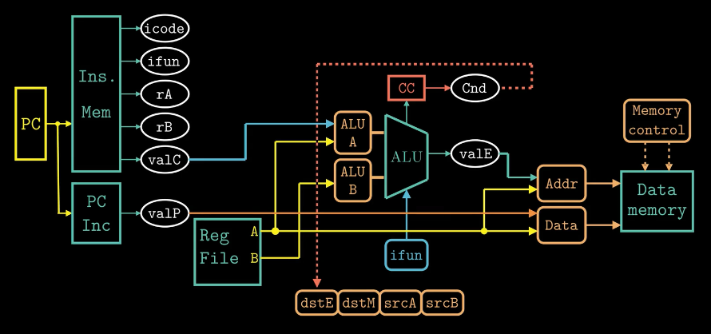 

接下来是写回阶段。寄存器文件有两个写入端口，M和E。端口E与ALU的输出端相连。ALU的计算结果可以通过端口E写回到寄存器文件。端口M与数据内存的输出端口相连。从内存中读出的数据可以通过端口M写回到寄存器文件。

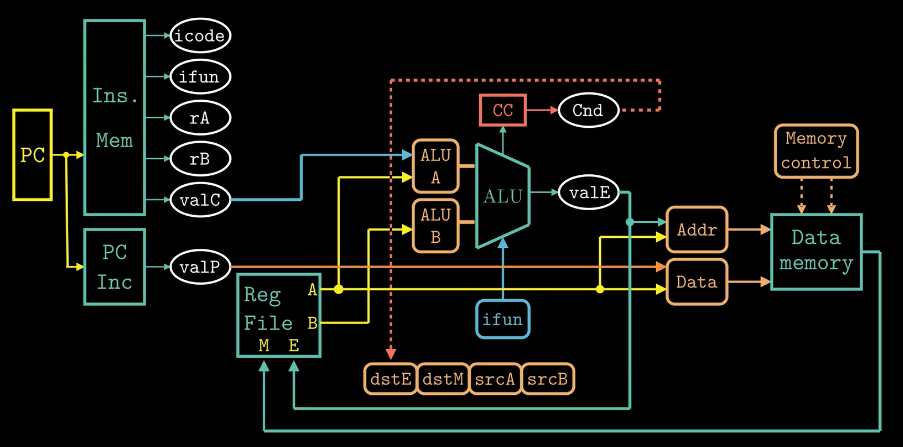 

最后一个阶段是更新PC的值。具体PC的值如何更新，需要根据当前执行的指令以及执行的状态来进行判断。例如，当前正在执行的指令是跳转指令。那么接下来究竟是顺序执行，还是执行跳转，需要根据信号Cnd来判断。例如，当前正在执行函数返回指令。那么返回地址就要从内存中得到。此外，指令在执行的过程中可能会发生异常。产生异常的原因可能是取到了无效的指令。或者是读取内存出现了错误。这些异常信号由stat模块来处理。

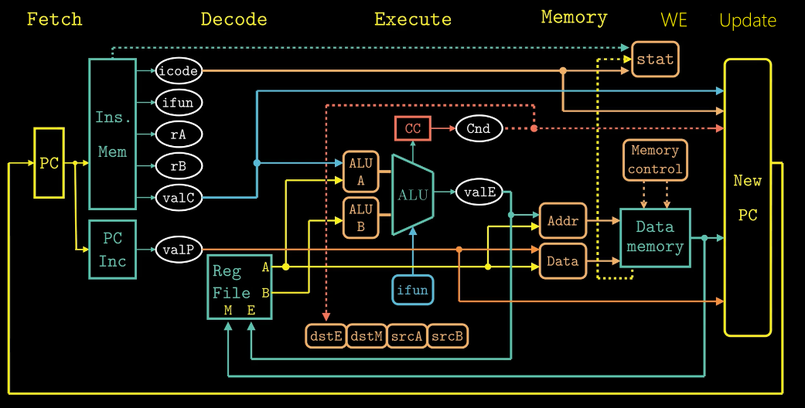 

以上就是一个Y86顺序实现的概述。

## 7.1重新安排计算截断

对于当前的顺序结构，所有阶段的操作都要在一个时钟周期内完成。例如，取指阶段发生在时钟周期刚开始的时候。那么更新PC发生在时钟周期快要结束的时候。

接下来我们稍微调整一下当前的结构设计。使更新PC在时钟周期开始的时候执行，而不是结束的时候才执行。

具体的实现方法是：创建一个寄存器来保存指令在执行过程中产生的信号。

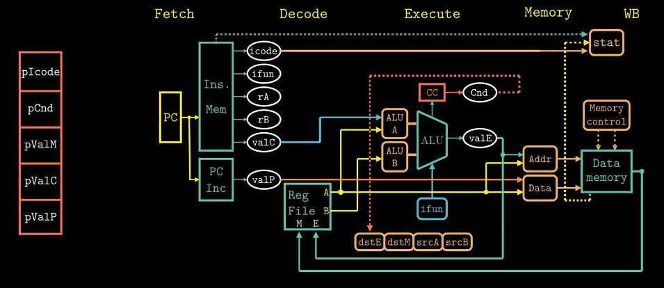 

当一个新的时钟周期开始时，根据寄存器中保存的信号值来计算当前指令的PC值。通过引入寄存器的方式。我们将更新PC的操作从时钟周期快要结束时运行，移到了时钟刚开始时运行。

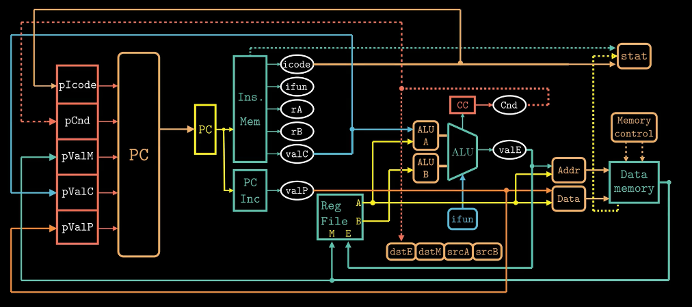 

从改造后的整体结构图来看，其他的硬件单元和控制模块都没有发生改变。我们将这种改进方法称为**电路重定时**。

重定时只是改变了系统的状态表示，但是并没有改变他的逻辑行为。

## 7.2插入流水线寄存器

如何把一个顺序结构改造成流水结构。

从宏观的角度来看，改造的原理其实比较简单。我们只需要在顺序结构的各个阶段之间插入流水线寄存器。然后对信号进行重新排列，就可以得到流水结构。

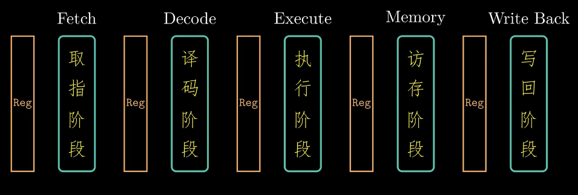 

接下来我们看一下五级流水的整体设计。

流水线寄存器用蓝色的矩形框来表示。每个寄存器包含不同的字段。

第一个寄存器F。用来保存PC的预测值，至于如何预测地址，之后的课程会有详细的讲解。取指阶段的逻辑单元与顺序结构类似。

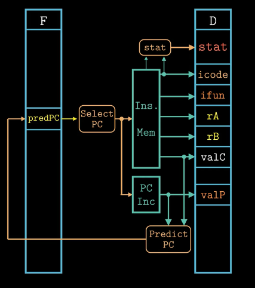 

第二个寄存器D位于取指阶段和译码阶段之间。用于保存刚刚取出指令的信息。

例如指令代码、指令功能、寄存器指示符等等。这些信息即将经由译码阶段来处理。

第三个寄存器E，位于译码阶段和执行阶段之间。它保存了最新译码指令的状态，以及从寄存器文件中读出的数值。

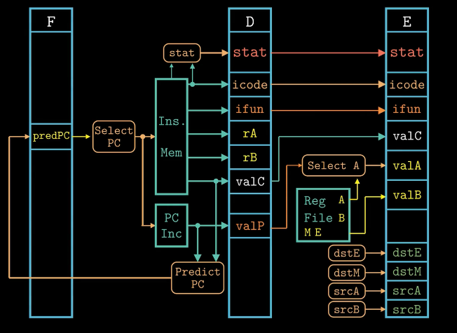 

上述信息都保存到了寄存器E中。即将由执行阶段进行处理。

第四个寄存器M，位于执行阶段和访存阶段之间。它保存了最新执行指令的结果。再次强调一下，这里的结果不仅仅是执行算术逻辑单元指令的结果。还有处理跳转指令的分支条件信息。

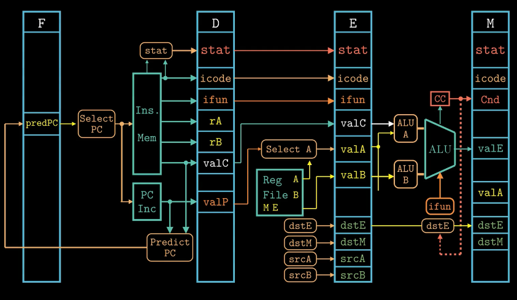 

最后一个寄存器W位于访存阶段和反馈路径之间。

访存执行的结果保存到寄存器W中。反馈路径将结果写回到寄存器文件。如果当前执行的是函数返回指令ret，那么访存读出的数值就是下一条即将执行的指令地址。所以还需要将该数值提供给PC的选择逻辑。

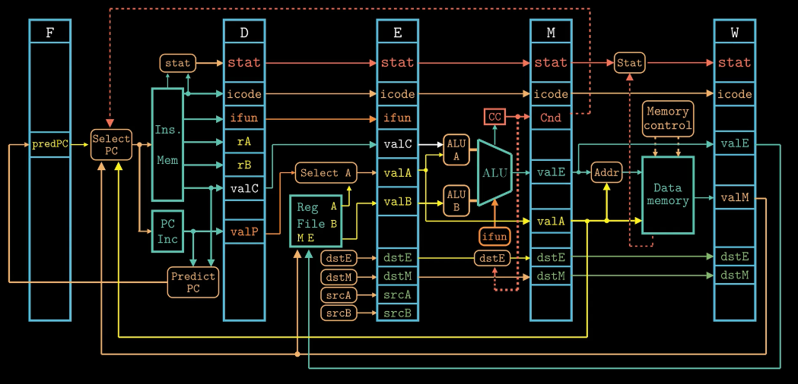 

 以上就是一个五级流水线的硬件结构。

这里为了方便理解，我们对流水结构做了一定的简化。这个版本的流水线结构会有一些缺陷。在后续的课程中会解决这些问题。

## 7.3数据冒险

通过一个代码示例，来看一下指令在流水线中的执行情况

图中这段代码序列包含5条指令 

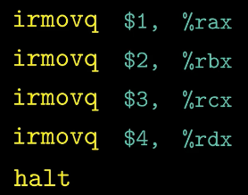 

为了方便表述，我们用简化的蓝色矩形框表示指令执行的不同阶段
例如 F表示取指阶段（Fetch），D表示译码阶段（Decode）
第一个时钟周期执行指令1的取指操作，第二个时钟周期进行译码操作
指令1的不同阶段将在不同的时钟周期内完成，经过5个时钟周期执行完毕，具体如图所示：

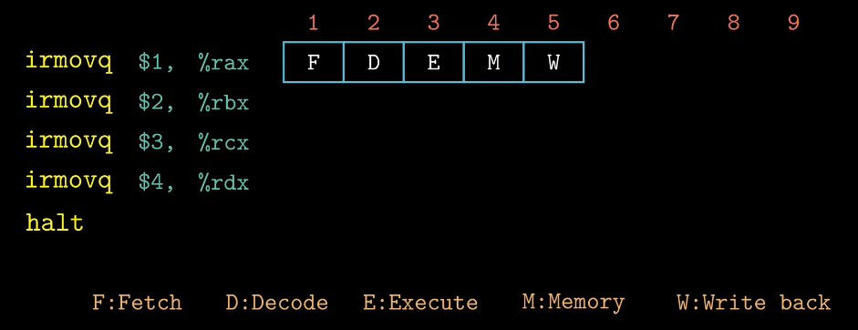 

根据流水结构的特性，第二个时钟周期进行指令2的取指操作，此时指令1已经完成了取指操作，释放了取指操作使用的硬件单元，因此可以对指令2进行取指操作。同样，经过5个时钟周期后指令2执行完毕

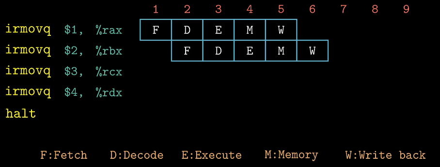 

以此类推，剩下的3条指令按照顺序依次进入流水线执行

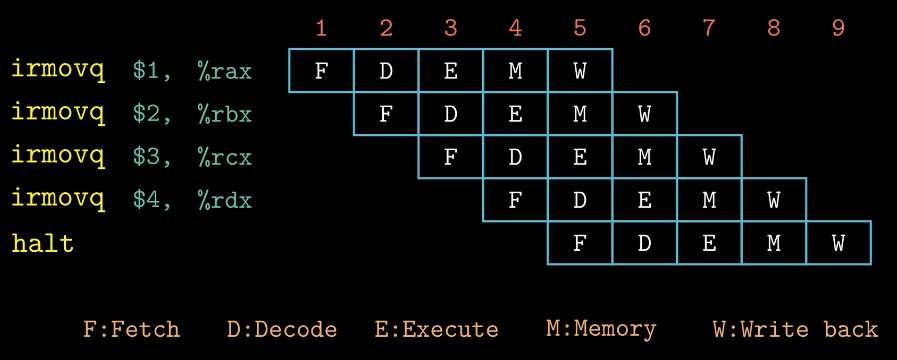 

最终经过9个时钟周期后，五条指令全部执行完毕

这个图描述了不同指令通过流水线各个阶段的过程，时间从左向右再增大，例如在第5个时钟周期时，整个流水线中同时在执行5条指令，不过五条指令都处于不同的执行阶段，具体如图所示：

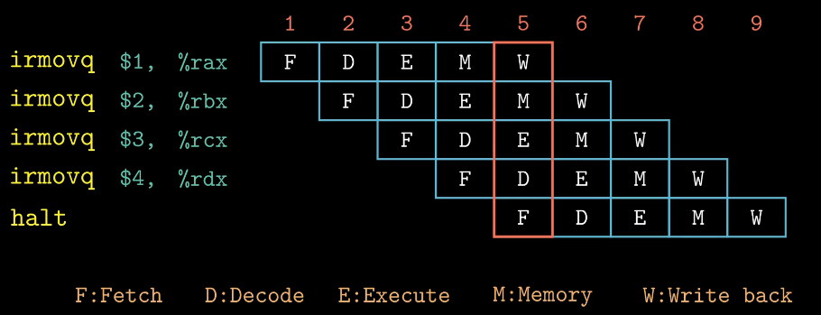 

通常会使用指令的流水图来表示流水线的状态，因此，需要大家理解这张图所表示的含义。

在之前的课程中，我们提到过数据相关和控制相关，例如图中的这段汇编代码

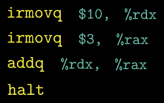 

第三条指令addq的执行需要依赖前两条指令的执行结果，接下来我们通过流水图来看一下，这段指令在执行的过程中会出现什么样的问题，这里我们假设所有的程序计算器的初始值都为0

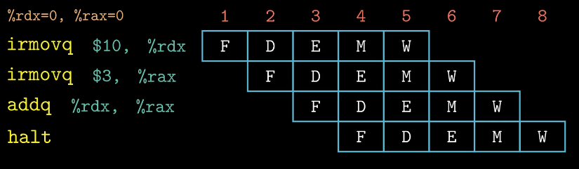 

图中这段指令将立即数10和3分别放到寄存器rdx和rax中，然后将二者相加，最终结果存放到计算器rax中。

我们重点看一下第四个时钟周期，此时指令addq处于异码阶段，需要从计算器文件中读取计算器rax和rdx的值。我们期望从计算器rdx 中读到数值10，从寄存器rax中读到数值3

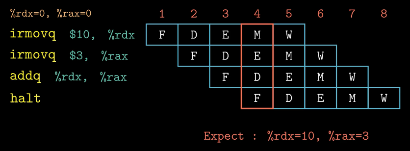 

然而实际上从寄存器中读到的值却都是0

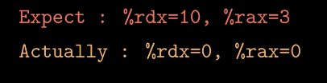 

之所以出现这种情况，是因为此时指令1正处于访存阶段，立即数10还未写回到计算器rdx，同样指令2处于执行阶段，立即数3也没有写回到计算器rax，所以在第四个时钟周期时，寄存器rdx和rax值还都是默认值0。

在这个示例中，由于指令irmovq和指令addq之间存在数据相关，导致了流水线产生了错误的计算结果，我们将这种情况称之为冒险，或者冲突

与相关一样，冒险也分为两类，一类是数据冒险，另一类是控制冒险

## 7.4避免数据冒险

### 7.4.1用暂停来避免数据冒险

避免数据冒险，我们首先想到的是让指令addq暂停一下，等到指令1和指令2完成写回操作时，我们再继续指令addq的执行。这样一来就能避免数据冒险。

这种解决冒险的方法看起来比较简单，非常容易想到，不过需要判断什么时候执行暂停操作，如何实现暂停操作以及暂停多久。

打个比方，你开车在路上正常行驶，需要判断何时要停车（遇到红灯），怎么停以及停多久。判断暂停的方法是指令在译码阶段读取寄存器时，通过读取寄存器的ID值分别与执行阶段、访存阶段以及写回阶段所执行指令的目的寄存器进行对比，如果存在寄存器ID值相等的情况，就说明指令之间存在数据相关，那么该指令就要在译码阶段等待，对于流水线的执行阶段，原本是要正常执行的指令，暂停之后，通过插入气泡来代替暂停的指令，气泡不会改变寄存器、内存、条件码以及程序的状态

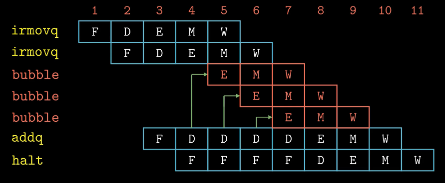 

图中红色的矩形框表示的就是气泡，箭头表明执行阶段插入气泡是为了代替指令 addq

虽然使用暂停技术可以解决数据冒险，但是基于这种机制实现的流水线性能并不高，这是因为程序中数据相关的情况非常多，频繁暂停指令的执行会严重降低流水线的吞吐量

在这个例子中，指令addq需要等待指令irmovq将结果写回到寄存器文件之后，再从寄存器文件中读取相应寄存器的数据

### 7.4.2用转发来避免数据冒险

在4.3中讲过指令irmovq执行细节，指令irmovq在访存阶段并没有执行任何操作
那么有没有可能直接把运算结果传给addq，这样一来，指令addq就不用通过暂停来等待数据写回了

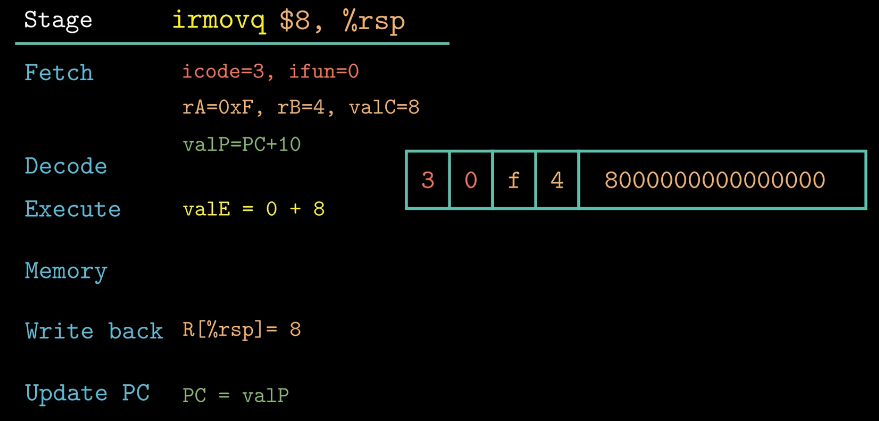 

具体实现的方法是可以添加一条信号线，将指令irmovq经过ALU执行的结果直接传送到指令addq的译码阶段，我们将这种实现技术称之为数据转发，也称旁路。

数据转发的实现需要在基本的硬件结构中增加一些额外的数据连接和控制逻辑

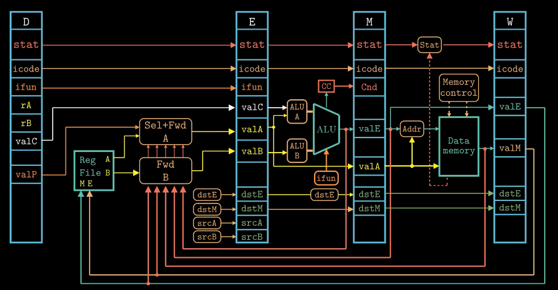 

由于篇幅限制，我们将图中的取指阶段略去

与之前的硬件结构相比，带有转发功能的流水线结构增加了两个逻辑块，具体如图所示：

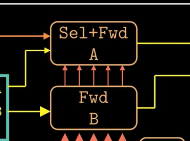 

通过添加旁路路径能够转发前面指令的结果，这使得流水线可以不用暂停就能处理大多数情况的数据冒险

### 7.4.3加载/使用数据冒险

但是，还有一类数据冒险不能单纯的使用转发来解决，具体我们通过一个代码示例来看一下。
指令mrmovq需要从内存中读取数据，由于读内存的操作发生在流水线的后期，即使采用转发逻辑也无法将值送回到过去的时间

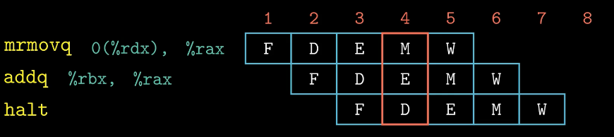 

为了解决这一类数据冒险，我们需要将暂停和转发结合使用，指令addq在译码阶段暂停一个周期，等到指令mrmovq访存结束后，使用旁路路径将访存结果转发到译码阶段，指令addq继续执行，具体如图所示：

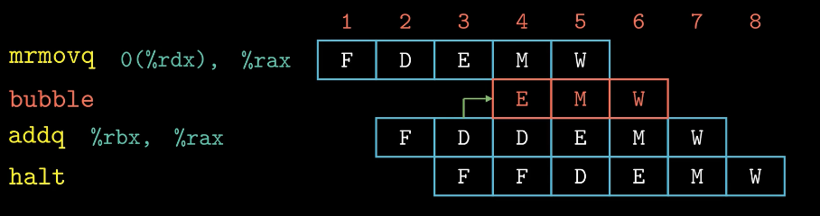 

以上就是通过流水线硬件设计来解决指令间的数据相关问题，在保证指令正确执行的前提下，还能使得流水线保持较高的吞吐量

## 7.5控制冒险

### 7.5.1控制冒险出现的原因

在流水线的设计中，我们期望每个时钟周期都能完成一条指令的执行，想要达到这个目的，流水线在每个时钟周期都要取到一条指令，因此，每一次取指操作后
必须马上确定下一条指令的地址。对于Y86指令系统，大多数情况下都能满足上述要求

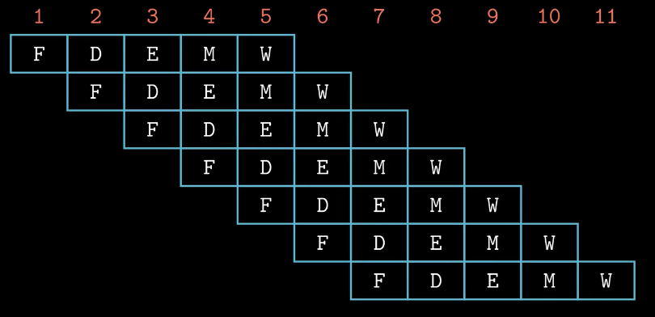 

不幸的是，当取出的指令是返回指令ret时，下一条指令的地址需要从栈中读出，因此必须等到访存操作结束后才能确定下一条指令的地址。当遇到这种情况时，流水线需要进行特殊的处理来避免控制冒险

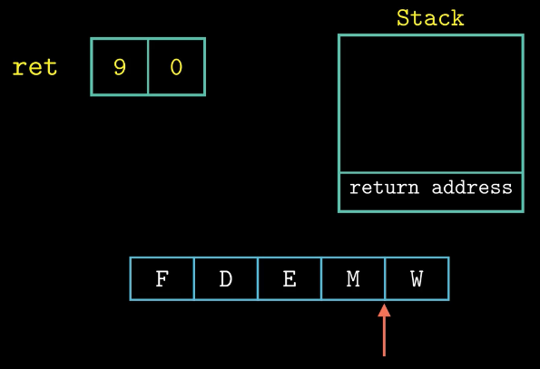 

除此之外，还有一种情况，当取到的指令是分支条件指令时，流水线无法立即判断是否要进行跳转操作，需要经过执行阶段后，才能确定是否进行跳转，同样流水线也需要特殊的处理来避免控制冒险

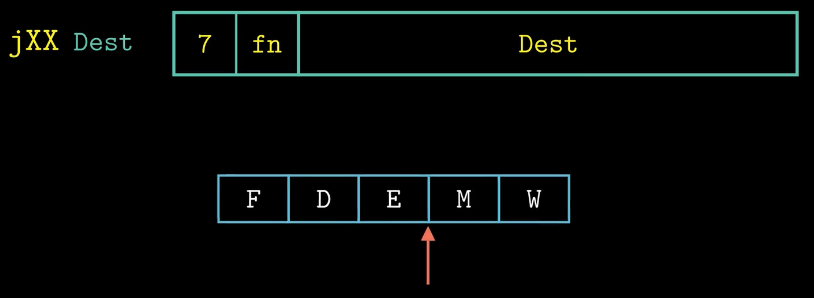 

综上所述，在关于Y86-64的流水线设计中，当取指阶段取到了返回指令和条件分支指令时，由于无法根据当前指令立即确定下条指令的地址，从而引发控制冒险

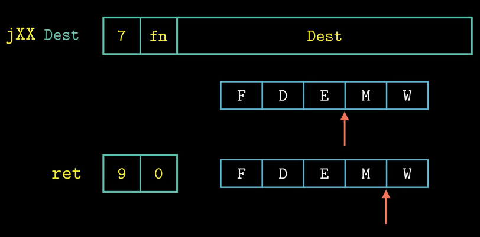  

### 7.5.2返回指令引发的控制冒险

为了方便表述，我们来看一个关于返回指令ret的示例程序

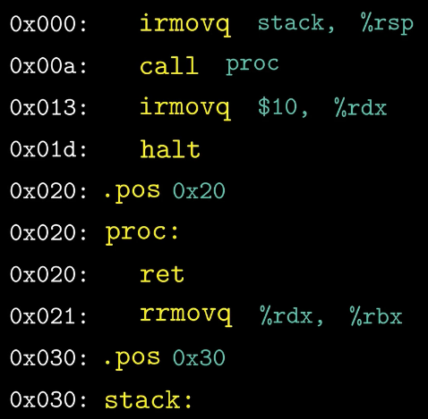 

图中白色的16进制数表示指令地址
第一条指令irmovq 表示初始化栈指针，第二条指令call表示函数调用
函数 proc包含两条指令，一条返回指令ret，另外一条是指令irmovq，不过这条指令并不会执行

为了方便使用流水图来表示返回指令ret的执行情况，我们根据指令的执行顺序来调整一下这段指令的顺序

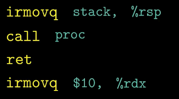 

接下来，我们看一下这段指令在流水线中的执行情况

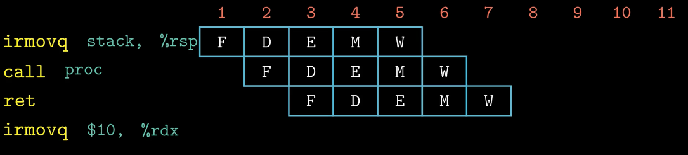 

第3个时钟周期时，返回指令ret开始进入流水线执行，由于返回指令ret在完成访存阶段后才能得到下一条指令的地址，所以当返回指令ret处于译码、执行、访存这三个阶段时，流水线不能进行其他有用的操作，只能在流水线中插入三个气泡，具体如图所示：

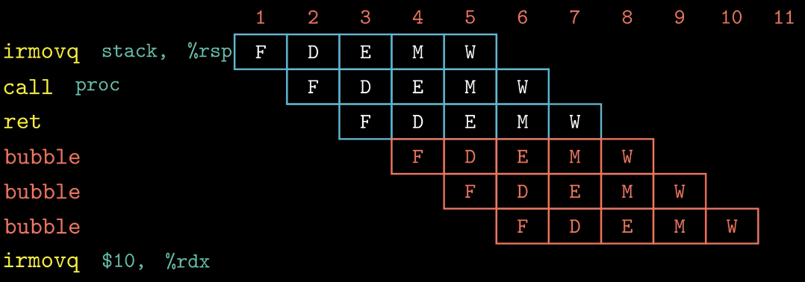 

直到第7个时钟周期时，返回指令ret到达写回阶段，此时PC的选择逻辑将读出的地址作为下一条指令的取指地址，之后流水线继续执行

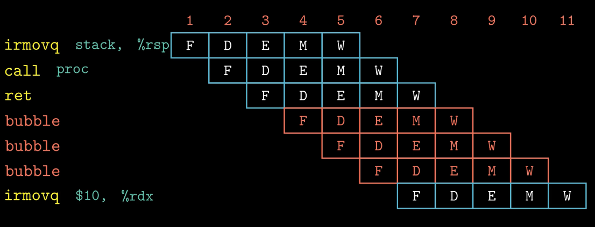 

关于返回指令ret所引发的控制冒险，可以通过暂停处理新指令的方式来避免

### 7.5.3跳转指令引发的控制冒险

接下来，我们看另外一种情况

实际上对于条件分支的结果，无非是跳转和不跳转两种情况。我们可以假定一个策略，预设分支的结果总是跳转或者总是不跳转，这种猜测分支结果的方法被称为分支预测。

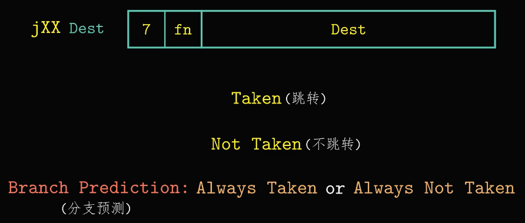 

分支预测的准确性对程序的性能有非常大的影响，这是因为当出现预测错误后，需要采取相应的方法来处理。

我们还是通过一个代码示例来看一下针对分支指令的操作

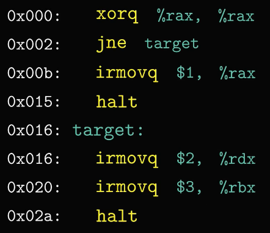 

例如图中的第二条指令jne，需要根据条件码来判断是否执行跳转，如果执行跳转，流水线需要执行target代码段，如果不执行跳转，程序顺序执行。

这里我们采用一个简单而又粗暴的分支预测策略，就是当遇到分支指令时，总是选择执行跳转。实际中分支预测的策略要比我们假设的复杂的多，这里主要是为了讲述控制冒险而做一个简单的假设

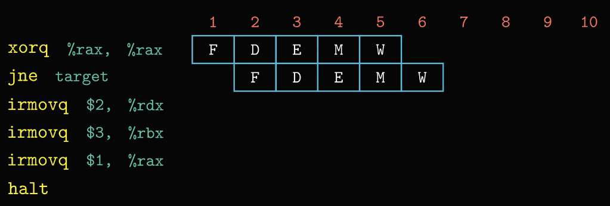 

基于上述假设的分支预测策略，在第三个时钟周期时，流水线会取出位于跳转目标处的指令，具体如图所示：

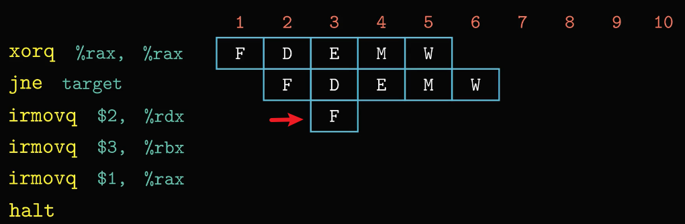 

在第四个时钟周期时，根据跳转后的顺序继续进行取指操作，不过在第四个时钟周期时，指令jne到达了执行阶段，此时，根据执行结果发现不应该执行跳转，显然，我们之前的分支预测发生了错误。

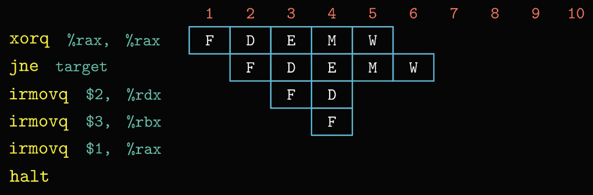 

根据程序的正常逻辑，这两条指令不应该出现在流水线中，因此应该立即终止他们继续执行

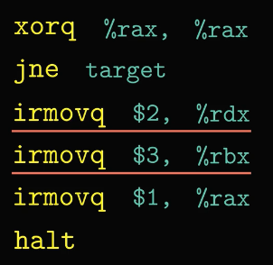 

不过幸运的是，这两条指令还没有进入执行阶段，因此并不会影响程序的正确性，所以我们只需要将这两条指令从流水线中简单的剔除即可

具体的解决方法是：在第5个时钟周期时，对于第一条指令，需要在执行阶段插入气泡

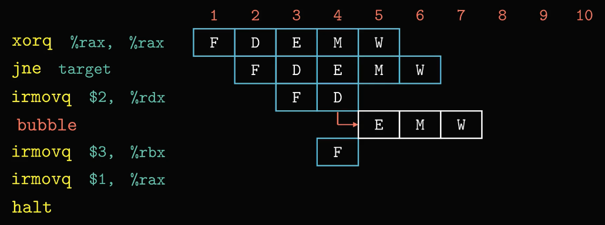 

对于第二条指令，在译码阶段插入气泡即可，同时还要取出跳转指令后面的指令

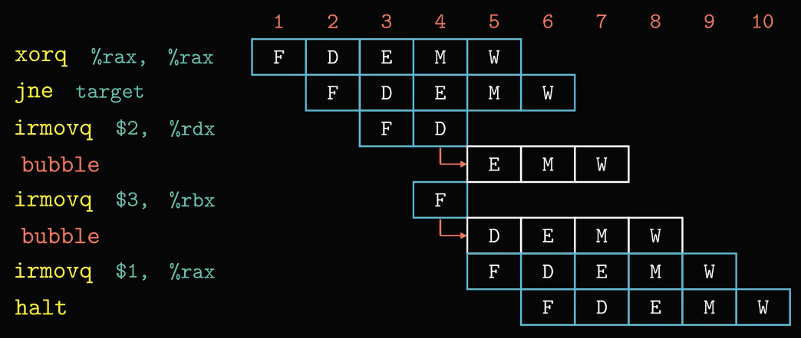 

这样一来，两条预测错误的指令就从流水线中剔除了

虽然没有引发程序的错误，但是分支预测错误导致了两个时钟周期的浪费

综上所述，对于控制冒险的处理方法，主要通过往流水线中插入气泡来解决，因此，我们可以通过暂停和插入气泡来动态的调整流水线的状态，从而解决由于指令间的相关问题而导致的冒险

### 7.5.4暂停和插入气泡的实现

接下来，我们看一下暂停和插入气泡是如何实现的，在之前介绍流水线的原理时，我们曾提到过流水线寄存器，流水线寄存器是通过时钟的上升沿来改变输出的值，为了实现暂停和插入气泡

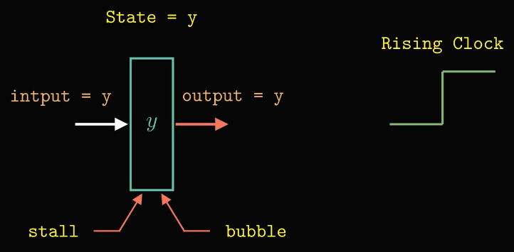 

我们为每个流水线寄存器引入两个控制信号，分别为暂停信号和气泡信号，在流水线正常执行时，暂停信号和气泡信号都设置为0，当遇到时钟上升沿时，寄存器会加载他的输入来作为新的输出

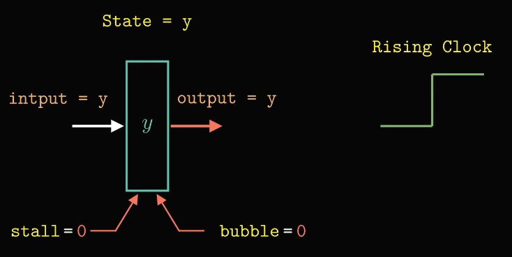 

当需要暂停流水线时，需要将暂停信号设为1，此时计算器会保持他以前的状态，即使遇到时钟的上升沿，寄存器的输出也不会发生改变

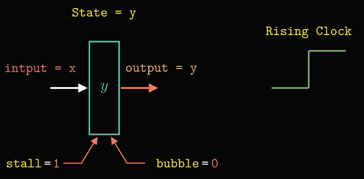 

这样一来，就可以实现指令阻塞在流水线的某个阶段中，当需要向流水线中插入气泡时，可以将气泡信号设置为1，此时寄存器的状态会设置成某个固定的复位配置，这个复位配置需要等于指令nop的状态

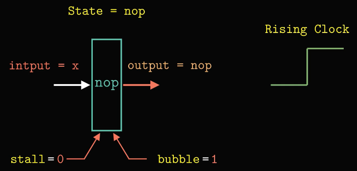 

具体如何配置流水线寄存器，可以通过一个例子来说明一下

假如要往寄存器E中插入气泡，我们要将icode字段设置为INOP，并将dstE、dstM、srcA以及srcB设置为RNONE，这样就可以达到与指令nop一样的效果

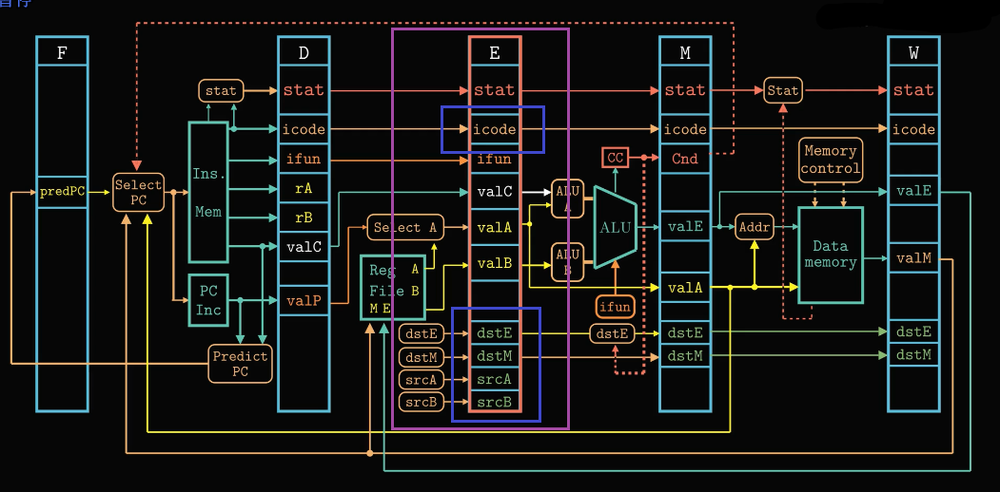 

以上就是暂停和气泡的具体实现方式

# 8、Y86-64的流水实现

重点看一下流水线的各个阶段是如何实现的

## 8.1取指阶段

首先是流水线的第一阶段---取指阶段，这个阶段最复杂的地方就是如何预测下一条指令的地址，实际上指令在具体执行时，无非就是两种情况：一种是顺序执行，另外一种是跳转执行。因此，我们可以将Y86指令级所定义的指令分为两大类。

假如取指阶段取出的指令属于顺序执行的情况，那么，下一条指令的地址可以通过当前指令的地址加上当前指令的长度计算得出

例如，取指阶段从地址0x100处取出了指令addq，根据指令级的定义，指令addq长度为2个字节，那么下一条指令的地址就是0x102

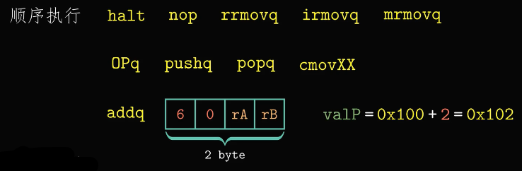 

为了方便表述，后面的讲述中用`vaIP`来代指顺序执行时下一条指令的地址

接下来，我们再来看一下跳转执行的情况

当取出的指令为函数调用指令或者跳转指令时，PC预测逻辑单元会直接将这两条指令中的常数字段（vaLC）作为下一条指令的地址

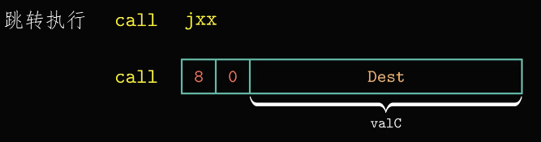 

对于函数调用指令来说，这种处理方法非常容易理解。至于跳转指令，会有跳转和不跳转两种情况。这里我们假定的分支预测策略是总是执行跳转，所以下一条指令的地址就是指令中的常数字段。

采用这个策略主要是为了简化流水线的硬件设计，方便初学者理解。实际中分支预测的策略要复杂的多，在之后的表述中，我们用vaLC来表示跳转执行时下一条指令的地址。如果取指阶段取出的指令是返回指令，下一条指令的地址需要从栈中读出，由于返回地址的范围太大，所以在我们的设计中，不会尝试对返回地址做预测。既然无法预测，PC预测逻辑单元在预测返回指令的下一条指令时，采用与顺序执行的指令一样的方法来简单处理

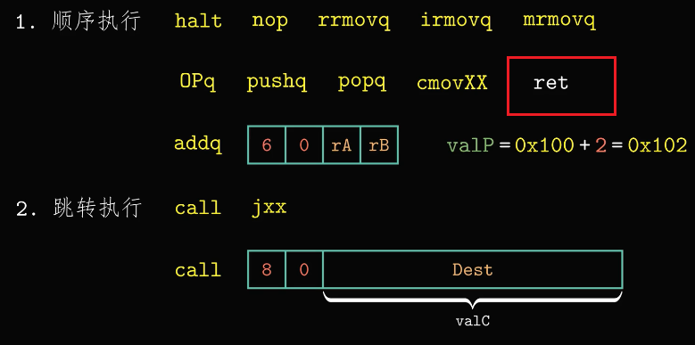 

综上所述，PC预测逻辑单元会根据指令类型（icode）来预测下一条指令的地址究竟是vaIP还是vaLC。既然是预测下一条指令的地址，那么肯定会有出错的情况

对于图中的PC选择逻辑单元可以理解为纠错部件

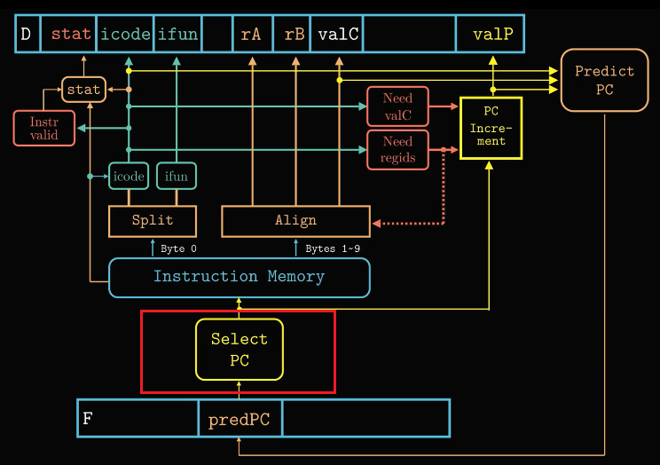 

通俗点讲，就是PC预测逻辑单元出错了，之后的PC选择逻辑单元会根据实际的执行情况来改正预测错误

例如，当前取指阶段取到了返回指令ret，下一条指令的地址还需要等待指令ret经过译码、执行、访存之后，才能从内存中读到正确的返回地址，也就是下一条指令的地址。改正的方法也比较简单：通过判断指令类型（icode），如果是返回指令ret，就把流水线寄存器W中的访存结果（W_valM）作为下一条指令的地址

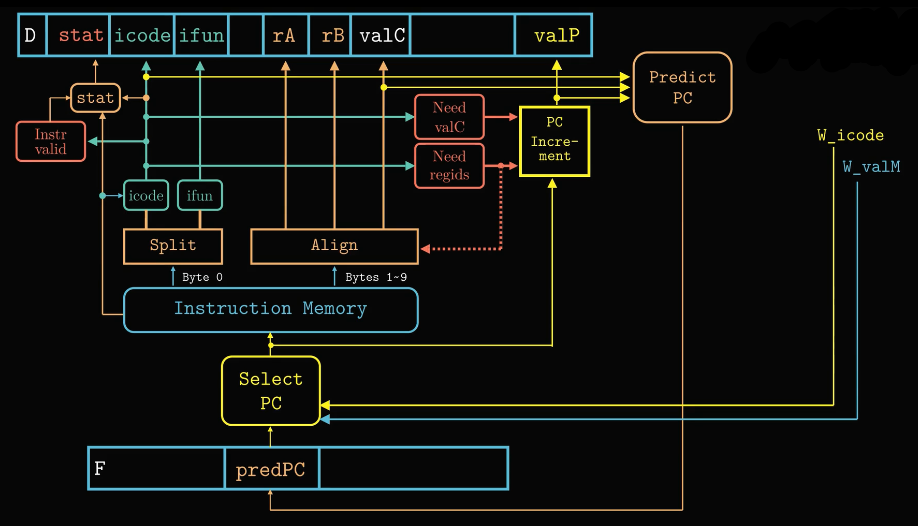 

假如当前取指阶段取到了条件分支指令，那么究竟是否执行跳转，需要等待指令经过译码和执行之后才能判断。

PC选择逻辑是通过信号Cnd来判断是否进行跳转，如果不跳转，证明我们的分支预测错了，需要改正

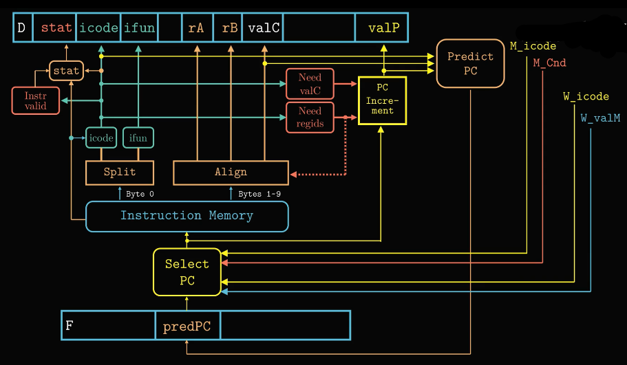 

具体改正的方法是：从流水线寄存器M中读取下一条指令的地址

以上就是取指阶段的硬件设计

## 8.2译码阶段

接下来，我们看一下流水线寄存器的第二阶段---译码阶段

译码阶段主要是根据寄存器的ID从寄存器文件中读取数据，寄存器的ID由字段rA和rB提供,经过srcA和srcB逻辑单元输入到寄存器文件，最终译码的结果用valA和valB来表示

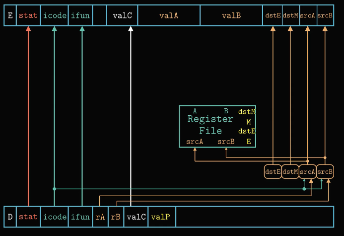 

为了提高流水线的执行效率，我们引入了数据转发的机制。通俗点讲，数据转发可以直接使用相关寄存器的数据，而不是等写回阶段更新完寄存器的值后，再从寄存器文件中读取，所以，译码阶段我们需要判断究竟是直接采用转发的数据还是需要从寄存器文件中读取数据，判断的依据是根据当前需要读取寄存器的ID值与转发的目的寄存器的ID值是否相等

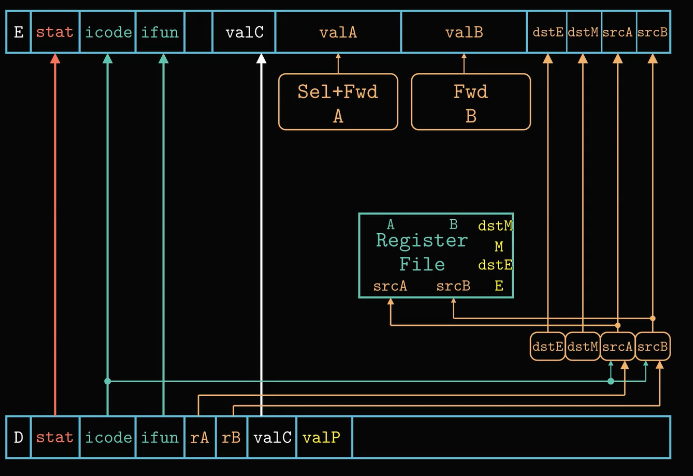 

对于流水线的设计，译码阶段由于加入转发功能，从而导致了硬件设计变得相对复杂

### 8.2.1数据转发源

首先，我们看一下究竟是哪些数据需要转发
第一个转发源是ALU产生的输出结果，如果按照正常指令的流程，这个ALU的输出结果还需要经过访存和写回阶段后，才能完成寄存器的数值更新

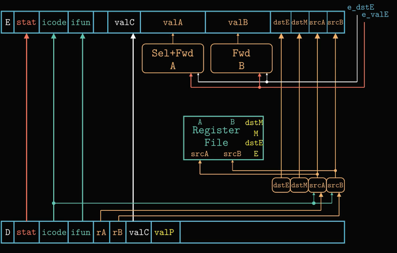 

采用数据转发的设计，ALU的输出结果可以马上作为译码阶段的结果，从而避免了等待数据写回寄存器文件后再去读的问题

第二个转发源是内存的输出数据，与ALU的输出结果类似，通过转发内存的输出数据也可以避免等待的问题

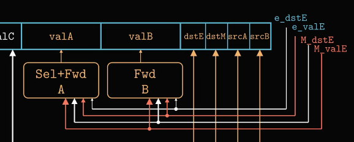 

第三个转发源是访存阶段时，对寄存器写入端口E还没有进行写入的数据

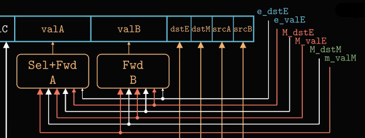 

由于篇幅限制，这里只画出前三个转发源的信号

第四个转发源是写回阶段时，对寄存器写入端口M还没有进行写入的数据

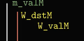 

第五个转发源是写回阶段时，对寄存器写入端口E还没有进行写入的数据

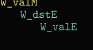 

其中每一个转发源包括两部分，一部分是计算机的ID值，用白色的信号线表示；另外一部分是转发数据，用红色的信号线表示

其中这五个转发源是存在优先级的，转发逻辑单元首先会检测执行阶段的转发源，然后是访存阶段，最后才是写回阶段。如果选择了其他的优先级顺序，对于某些程序来说会出现错误

为了方便观看，这里我们将转发信号略去

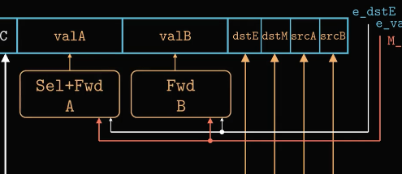 

如果不满足上述所有的转发条件，图中的这个逻辑单元就选择从寄存器文件的A端口读出的数据作为输出

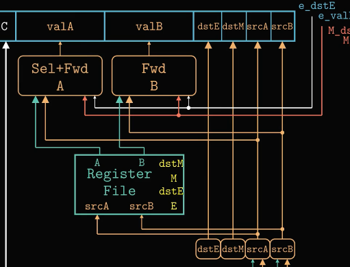 

对于图中标号为Sel+FwdA的逻辑单元扮演了两个角色，与逻辑单元FwdB相比，逻辑单元FwdA多了一个valP的输入，他实现了将valP信号和valA信号的合并功能，减少了流水线计算器中状态的数量

至于为什么这两个信号可以合并呢

valP表示的是顺序执行时，下一条指令的地址，而valA表示从寄存器文件中读到的数据。看起来这两个信号之间并没有什么关系，事实上只有函数调用指令和跳转指令在后面的阶段才需要用到valP，而这两类指令并不需要从计算器的A端口读取数据，所以可以根据指令代码（icode）来判断当前指令是否属于这两类，如果是就可以进行合并。

以上就是流水线译码阶段的全部设计，对于流水线的其他阶段，硬件设计与顺序实现相差不大

# 9流水线的控制逻辑

为了处理流水线的冒险以及异常情况，我们需要在设计中添加控制逻辑单元。

## 9.1控制情况

首先我们来看一下指令执行时出现的特殊情况以及期望得到的处理

### 9.1.1加载/使用冒险

第一种特殊情况是加载使用冒险

例如当前这两条指令顺序出现时，二者之间存在数据相关，因此会产生加载/使用冒险

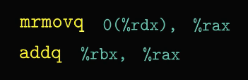 

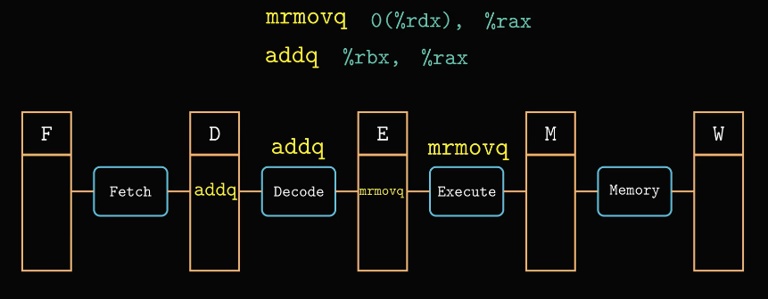 

当指令mrmovq处于执行阶段时，紧随其后的addq指令处于译码阶段，此时，我们期望指令addq可以阻塞在译码阶段，等待指令mrmovq完成访存操作后，通过数据转发逻辑来解决这个数据冒险，然后指令addq继续执行

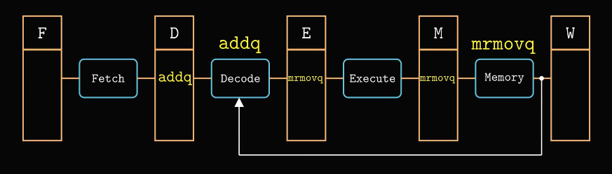 

流水线的控制逻辑不仅需要监测这种冒险的发生，还要使得指令按照期望的方向去执行，具体的解决方法是：保持流水线寄存器F和D的状态不变，同时向寄存器E中插入一个气泡

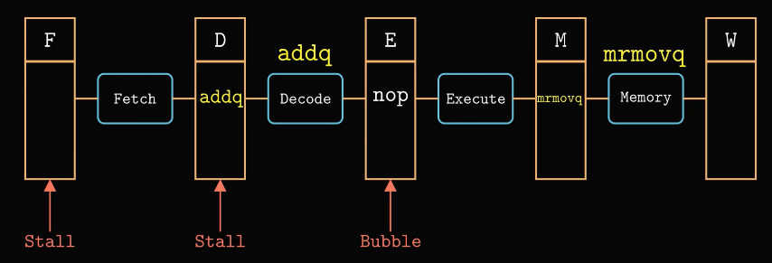 

这样一来二者之间的冒险就解决了

除了指令mrmovq之外，指令popq同样可能产生加载/使用的冒险情况

### 9.1.2预测错误的分支

第二种特殊情况是分支预测发生错误时

当跳转指令达到执行阶段时可以检测到预测错误

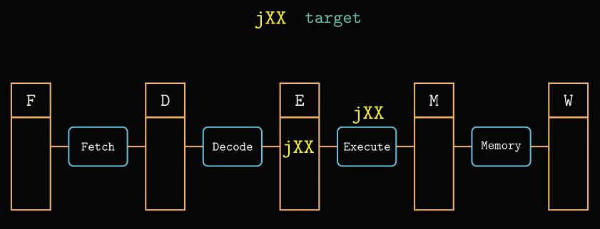 

那么下一个时钟周期，需要取消两条已经取到的指令

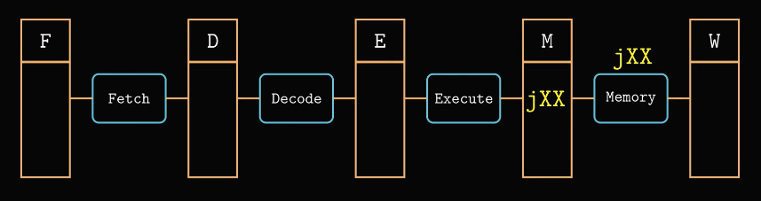 

具体的解决方法是：向流水线寄存器D和E中插入气泡

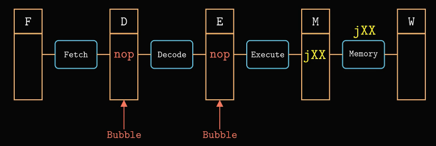 

这样一来就可以纠正预测导致的错误

### 9.1.3处理ret

第三种情况是返回指令的处理

当取指阶段取到返回指令ret时，指令ret需要经过译码、执行以及访存阶段之后才能读到下一条指令的地址

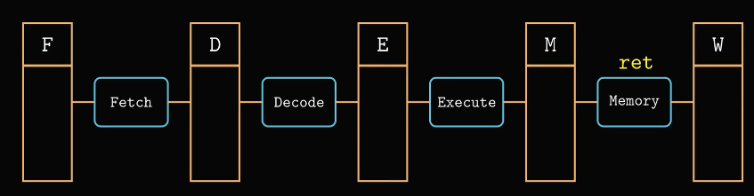 

虽然取指阶段会不断的读取错误的指令，但是在译码阶段就被替换成了气泡，气泡会经过剩下的流水阶段

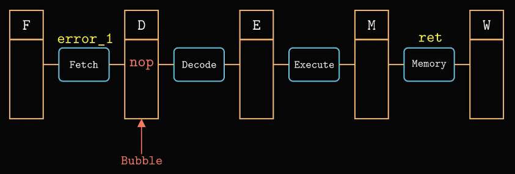 

因此通过插入三个气泡，就可以达到期望的效果

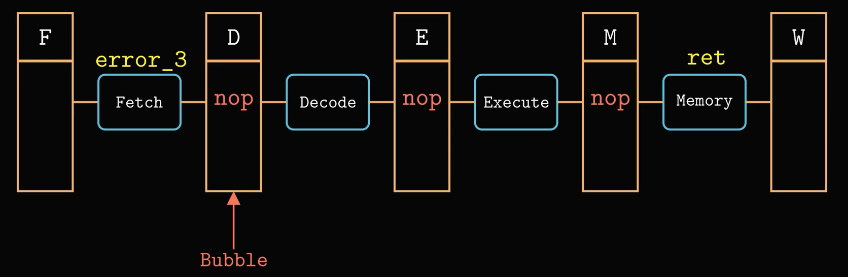 

只不过流水线连续的三个周期都取出了不正确的指令

### 9.1.4异常的处理

还有一种特殊的情况是对异常的处理，这里就不展开讲述了

对于以上四种特殊情况的处理，可以通过流水线的控制逻辑来实现。控制逻辑执行的操作，就是在出现特殊情况时，通过暂停和插入气泡来保证程序正确执行。通俗点讲，暂停就是保持流水线寄存器的状态不改变，插入气泡就是将寄存器的状态做一个类似“清零”的操作

## 9.2控制条件的组合

我们假设任意一个时钟周期内最多只能出现一种特殊情况，然而实际情况中，会有两种情况的组合出现

## 9.2.1分支+返回

例如图中这段汇编代码，包含了一个分支指令和一个返回指令

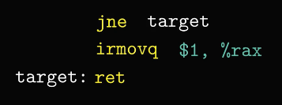 

当分支指令处于执行阶段，返回指令处于译码阶段时

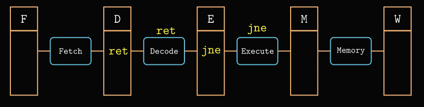 

由于分支指令并不会执行跳转，因此我们期望执行的指令是irmovq指令，而不是返回指令。

因此，针对这种组合的具体解决方法是：暂停寄存器F，同时向寄存器D和E中插入气泡

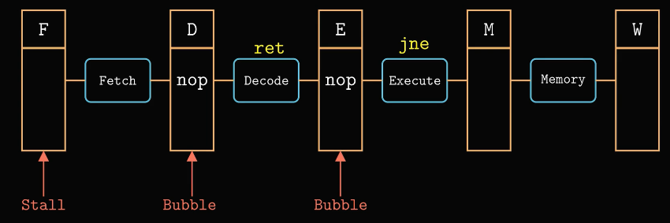 

幸运的是，下一个时钟周期，PC的选择逻辑会选择跳转之后的指令，而不是从PC的预测单元读出的地址，所以，无论寄存器F发生了什么，都没有关系

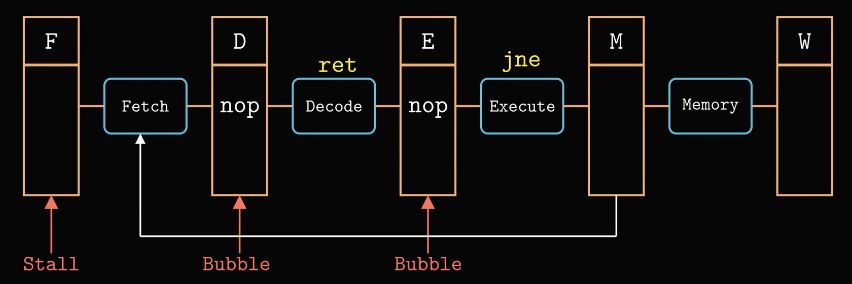 

 这样一来，跳转指令与返回指令的组合冒险就解决了

## 9.2.2加载/使用冒险+返回

接下来，我们再来看另外一种组合的情况

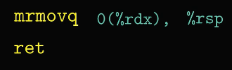 

这种组合包含一个加载/使用冒险和一个返回指令。其中加载指令的目的寄存器是 `%rsp`，返回指令ret默认使用的寄存器也是`%rsp`

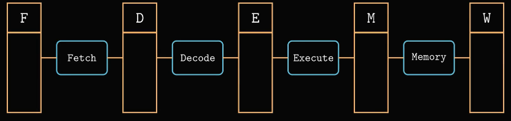 

此时指令mrmovq处于执行阶段，返回指令处于译码阶段

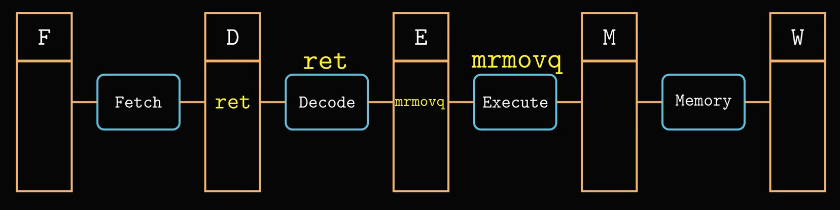 

针对加载/使用冒险，流水线的控制逻辑会对寄存器F和D执行暂停操作，同时向寄存器E中插入气泡

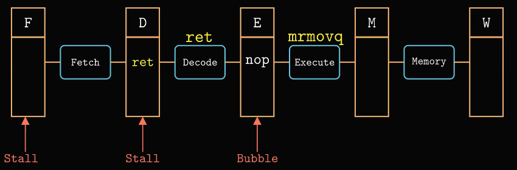 

针对返回指令，流水线的控制逻辑会对寄存器F执行暂停操作，同时向寄存器D中插入气泡

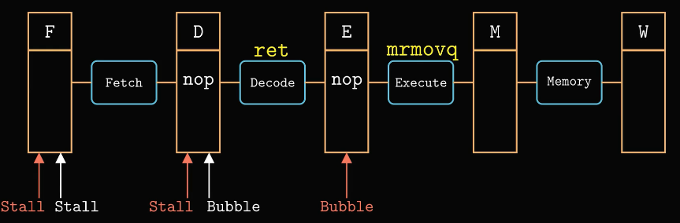 

从图中可以看出，控制逻辑同时对寄存器D执行了暂停和插入气泡的两种操作，这显然是不合理的

实际上针对寄存器D仅执行暂停操作即可保证程序的正确性，因此，我们需要对这种组合进行特殊的处理

综上所述，在设计Y86的控制逻辑时，需要保证在出现上述特殊情况时，程序仍然可以正确运行

至此，整个Y86的流水设计就完了

# 10性能分析

为了定量分析我们设计的处理器的性，能我们引入一个CPI的概念，他表示一条指令执行所需要的时钟周期数

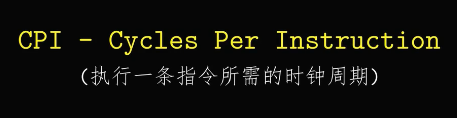 

假设处理器在某个时间段内一共处理了Ci条指令和Cb个气泡，那么大约一共需要 Ci+Cb个时钟周期

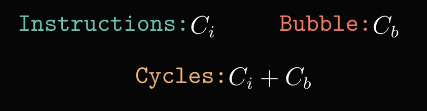 

大约的意思是：这里忽略了启动指令通过流水线时的时钟周期数

那么CPI的计算公式如图所示

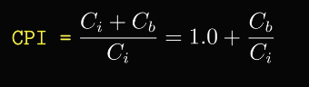 

通过化简可以看出，CPI等于1加上Cb/Ci，这里的Cb/Ci可以理解为惩罚项，他表示执行一条指令平均要插入多少个气泡

根据视9.1的特殊处理情况，我们可以将这个惩罚分解成三部分

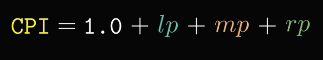 

其中lp表示由于加载/使用冒险暂停时插入气泡的平均数
mp表示由于分支预测错误取消指令时插入气泡的平均数
rp表示返回指令造成暂停时插入气泡的平均数

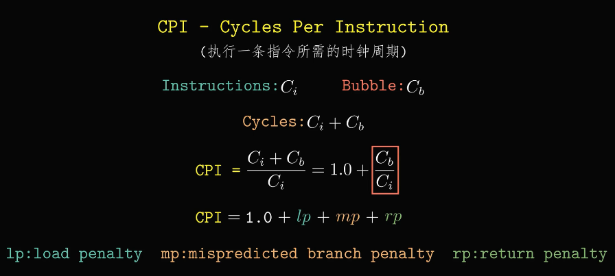 

接下来我们通过一个例子，来看一下如何计算CPI

例如，在一个程序中，加载指令占所有执行指令的25%，其中20%会导致加载/使用冒险；跳转指令占所有指令的20%，其中60%会执行跳转，40%不执行跳转；返回指令占所有指令的2%。根据上述的数据，我们可以计算出三种处罚的总和是0.27。

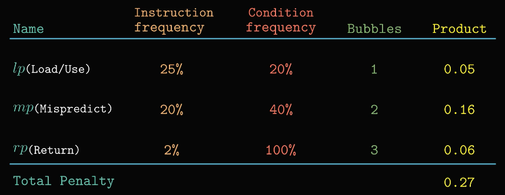 

因此得到的CPI为1.27。也就是平均执行一条指令需要1.27个时钟周期。这与我们期望每个时钟周期都能执行一条指令相比，虽然有一些差距，但是整体的性能已经不错了。如果想要进一步降低CPI，提高处理器的性能，需要降低分支预测的错误
